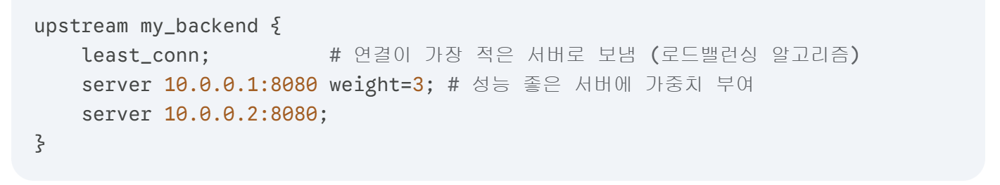
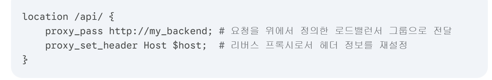

# 로드 밸런서 vs 리버스 프록시

## 로드밸런서

1. 로드 밸런서의 핵심 역할

| 기능                | 설명                                                                 |
|---------------------|----------------------------------------------------------------------|
| 부하 분산           | 한 서버에만 사용자가 몰려 터지는 것을 방지                           |
| 상태 확인(Health Check) | 죽은 서버가 있는지 감시하고, 문제 있는 서버로는 클라이언트를 보내지 않음 |
| 보안 및 편의(SSL Termination) | 복잡한 암호화 해제 작업을 로드 밸런서가 도맡아 처리하여 뒷단 서버들의 부담을 덜어줌 |
 
 
2. L4 vs L7 로드 밸런싱

| 구분     | L4 (전송 계층)                 | L7 (응용 계층)                               |
|----------|--------------------------------|----------------------------------------------|
| 판단 기준 | IP 주소, 포트 번호              | URL, 쿠키, HTTP 헤더, 메시지 내용             |
| 특징     | 데이터 내용을 안 봄 (빠르고 단순) | 데이터 내용을 다 뜯어봄 (정교하고 똑똑)       |
| 비유     | 주소지만 보고 편지를 분류함       | 편지 내용을 읽어보고 부서별로 전달함          |
| 장점     | 처리 속도가 매우 빠름             | 콘텐츠별 라우팅 가능 (예: 이미지 서버/결제 서버 분리) |

 
 
3. 수평 확장(Scale-out)과 무상태(Stateless)

- 로드 밸런서를 제대로 쓰려면 서버가 무상태(Stateless)여야 함

- 문제 상황: 무상태가 아닌 경우 사용자의 로그인 정보(세션)가 A 서버에만 저장되어 있는데, 로드 밸런서가 다음 요청을 B 서버로 보내버리면 로그인이 풀림

- 해결책: 서버 내부가 아닌 Redis 같은 공용 캐시나 DB에 세션 정보를 따로 저장 -> 어떤 서버로 접속해도 문제가 발생하지 않음
 
 

4. 단점 및 고려사항

| 단점                     | 설명                                                                 |
|--------------------------|----------------------------------------------------------------------|
| 단일 장애 지점(SPOF)     | 서버가 아무리 많아도 로드 밸런서가 한 대라면, 그 로드 밸런서가 고장 났을 때 전체 서비스가 멈춤 → 로드 밸런서 자체도 Active-Passive나 Active-Active로 이중화 필요 |
| 병목 현상                | 엄청난 트래픽이 몰릴 때 로드 밸런서의 처리 능력이 낮으면 오히려 여기서 속도가 느려질 수 있음 |
| 복잡성 증가              | 단일 장애 지점을 제거하기 위해 로드 밸런서를 도입하면 시스템 구조가 복잡해짐 |

## 리버스 프록시

1. 리버스 프록시의 핵심 기능
- 보안의 첫 번째 방어선 (Security)
   - 서버 은닉: 외부 사용자는 실제 비즈니스 로직이 돌아가는 내부 서버(WAS)의 IP를 알 수 없음. 오직 프록시 서버의 IP만 노출되므로 직접적인 공격으로부터 안전.
   - 접근 제어: 특정 IP를 차단하거나, 한 명의 사용자가 너무 많은 연결을 시도할 때 제한을 거는 작업을 서버단이 아닌 프록시단에서 처리.

- 성능 가속 (Performance)
   - SSL 종료 (SSL Termination): 암호화/복호화 작업은 CPU 자원을 많이 소모 -> 리버스 프록시가 이 작업을 대신 처리.
   - 캐싱 및 압축: 자주 요청되는 정적 데이터(이미지, JS 등)를 프록시가 직접 들고 있다가 바로 내어주거나, 데이터를 압축해서 보내 통신 시간을 단축.

2. 단점 및 고려사항

| 단점                  | 설명                                                                           |
|-----------------------|------------------------------------------------------------------------------|
| 단일 장애 지점(SPOF)  | 리버스 프록시 자체가 죽어버리면 뒤에 있는 서버들이 아무리 멀쩡해도 서비스가 중단 -> 프록시 서버 이중화(Fail-over) 구성이 필요 |
| 복잡성 증가           | 프록시 서버를 이중화(Fail-over)로 구성하면 인프라의 복잡성이 높아짐                                   |

## 로드 밸런서 vs 리버스 프록시

| 구분        | 로드 밸런서 (Load Balancer)                                      | 리버스 프록시 (Reverse Proxy)               |
|-------------|-------------------------------------------------------------------|---------------------------------------------|
| 핵심 역할   | 트래픽 분산: 여러 서버의 가용성 극대화 및 부하 최적화             | 통제 및 대행: 보안, 가속, 추상화 계층 제공 |
| 배포 시점   | 서버가 여러 대일 때 필수적                                        | 서버가 한 대라도 보안/가속을 위해 도입 권장  |
| 주요 기능   | - 서버 부하 상태에 따른 요청 분배 - 단일 장애 지점(SPOF) 제거   | - 보안: IP 차단, DDoS 방어, 서버 정보 은닉 - 가속: SSL 종단, 압축, 캐싱 - 유연성: 내부 인프라 변경의 자유 |
| 전략적 가치 | 서비스 안정성 및 처리량(Throughput) 향상                          | 네트워크 경계에서의 보안 강화 및 사용자 경험 최적화 |
| 동작 방식   | 주로 트래픽 전달(Forwarding)에 집중                               | 풀 프록시(Full Proxy): 양단 연결을 완전히 분리/제어 가능 |
| 솔루션 예시 | NGINX Plus, AWS ELB, F5 BIG-IP                                    | NGINX, Apache, Cloudflare, F5 BIG-IP        |

### 리버스 프록시는 로드밸런싱 기능을 '도구' 중 하나로 가지고 있는 상위 개념에 가깝다

## Nginx
비동기 이벤트 기반(Event-Driven) 구조를 가지고 있어, 적은 자원으로도 수만 개의 동시 접속을 처리할 수 있는 매우 강력한 리버스 프록시이자 로드밸런서
 

1. Nginx 내부 프로세스 모델
- Nginx는 하나의 Master Process와 여러 개의 Worker Process로 구성

  - Master Process: 설정 파일을 읽고, Worker 프로세스들을 관리

  - Worker Process: 실제로 클라이언트의 요청을 받고, 이를 배후의 서버(Upstream)로 전달하는 리버스 프록시 실무를 담당

2. 핵심 설정 블록

- upstream 블록 (로드밸런서의 핵심)
  - 여러 대의 백엔드 서버를 하나의 그룹으로 묶어줌 -> 로드밸런싱 알고리즘을 결정

- location 블록과 proxy_pass (리버스 프록시의 핵심)
  - 클라이언트의 요청을 어느 upstream으로 보낼지 결정하는 중계 지점

3. Nginx 아키텍처적 장점
- 충격 완화 -> Nginx 아키텍처가 백엔드 서버(Java/Spring Boot 등)를 보호

    - 버퍼링(Buffering): 클라이언트가 아주 느린 네트워크로 데이터를 보낼 때, Nginx가 이를 다 받아낸 뒤 백엔드 서버에는 한 번에 쏴줌 -> 백엔드 서버는 응답을 기다리는 시간 x

    - SSL Termination: Worker 프로세스가 암호화를 해제하여 백엔드 서버에 전달하므로, 서버의 CPU 부하를 획기적으로 낮춤

