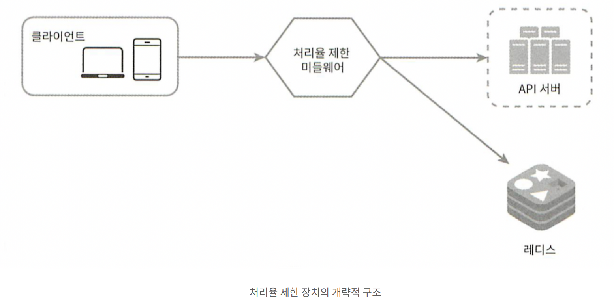
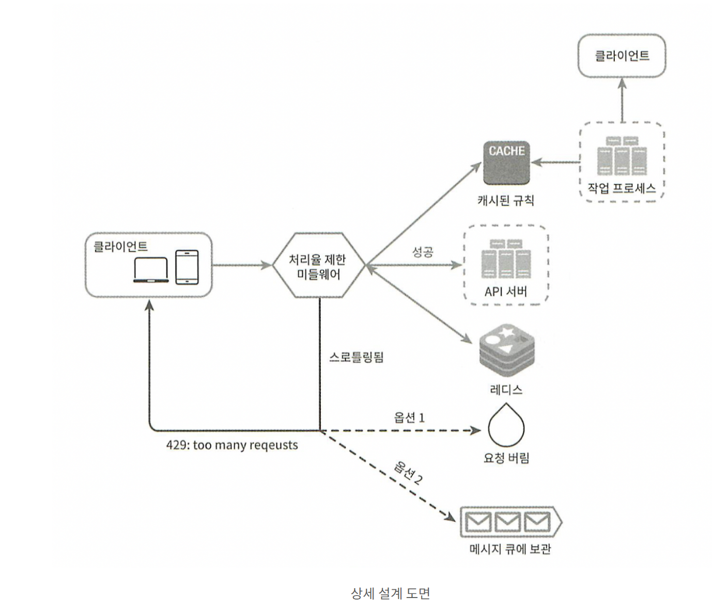
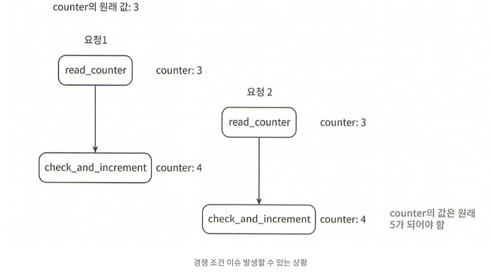
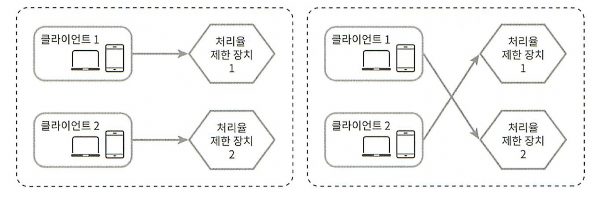

# Chapter 04
## 처리율 제한 장치의 설계

### 클라이언트 또는 서비스가 보내는 트래픽의 처리율을 제어
- 사용자는 초당 2회 이상 새 글을 올릴 수 없다
- 같은 ip 주소로는 하루에 10개 이상의 계정을 생성할 수 없다
---
### 처리율 제한 장치의 장점
- dos 공격에 의한 자원 고갈 방지
- 비용 절감
- 서버 과부하 방지
---
### 처리율 제한 장치의 위치
- 클라이언트 측
  - 쉽게 위변조 가능 -> 좋은 장소 x
- 서버 측
- 미들웨어
  - api 게이트웨이
### 위치 정할 때 고려사항
- 현재 사용하는 언어가 서버 측 구현을 지원하기에 충분한지
- 사업 필요에 맞는 처리율 제한 알고리즘 찾기
  - 서버 측 구현 -> 알고리즘 자유롭게 선택
  - 게이트웨이 사용 -> 선택지 제한
- 마이크로 서비스 기반 or 사용자 인증 등을 위해 게이트웨이 이미 사용
  - 처리율 제한 기능도 게이트웨이 고려
- 직접 만드는데 시간 소요
  - 사용 api 게이트웨이 사용
---
### 처리율 제한 알고리즘
- 토큰 버킷
- 누출 버킷
- 고정 윈도 카운터
- 이동 윈도 로그
- 이동 윈도 카운터

#### 토큰 버킷 알고리즘
##### 동작 원리
  - 토큰 버킷은 지정된 용량을 갖는 컨테이너 
    - 사전 설정된 양의 토큰이 주기적으로 채워짐
    - 꽉 찬 경우 더 채워지지 않고 버려짐
  - 각 요청이 처리될 때 토큰 하나 사용
    - 토큰이 없는 경우 요청은 버려짐
##### 인자
- 버킷 크기 -> 토큰 최대 개수
- 토큰 공급률 -> 초당 몇 개의 토큰이 버킷에 공급되는가
##### 사용되는 버킷의 수 -> 공급 제한 규칙에 따라 다름
  - 통상적으로 api 엔드포인트마다 별도의 버킷
    - ex) 사용자 하루에 한 번만 포스팅 가능, 친구 150명 추가 가능 -> 2개의 버킷
  - IP 주소별로 처리율 제한 -> IP 주소마다 1개의 버킷
  - 시스템 처리율 초당 1000개 제한 -> 모든 요청이 1개의 버킷 공유 
##### 장점
  - 구현 쉬움
  - 메모리 사용 효율적
  - 짧은 시간에 집중되는 트래픽 처리 가능
##### 단점
  - 두 개의 인자를 적절히 튜닝해야 함

#### 누출 버킷 알고리즘
##### 동작 원리
  - 요청이 오면 큐가 가득 차 있는지 확인
    - 빈자리 o -> 큐에 요청 추가
    - 빈자리 x -> 새 요청 버림
  - 지정된 시간마다 큐에서 요청을 꺼내 처리
##### 인자
- 버킷 크기 -> 큐 사이즈
- 처리율 -> 지정된 시간 당 몇 개의 항목을 처리할지
##### 장점
- 큐의 크기 제한 -> 메모리 사용 효율적
- 고정된 처리율 -> 안정적 출력이 필요한 경우 적합
##### 단점
- 단시간에 많으 트래픽이 몰리는 경우 큐에 오래된 요청 쌓임 -> 제때 처리가 안되면 최신 요청 버려짐
- 두 개의 인자를 적절히 튜닝해야 함

#### 고정 윈도 카운터 알고리즘
##### 동작 원리
- 타임 라인을 고정된 간격의 윈도로 나누고, 각 윈도마다 카운터를 붙임
- 요청이 접수될 때마다 카운터 값 1증가
- 카운터 값이 사전에 설정된 임계값에 도달 시 새로운 요청은 버려짐
##### 장점
- 메모리 효율 좋음
- 이해하기 쉬움
- 윈도가 닫히는 시점에 카운터를 초기화하는 방식은 특정한 트래픽 패턴을 처리하기 적합
##### 단점
- 윈도 경계 부분에서 일시적으로 많은 트래픽이 몰려드는 경우, 처리 한도보다 많은 양의 요청을 처리

#### 이동 윈도 로깅 알고리즘
##### 동작 원리
- 요청의 타임스탬프를 추적 -> 보통 캐시에 보관
- 새 요청이 오면 만료된 타임스탬프(현재 윈도의 시작 지점보다 오래된 타임스탬프) 제거
- 새 요청의 타임스탬프를 로그에 추가
- 로그의 크기가 허용치보다 같거나 작으면 요청을 시스템에 전달
  - 그렇지 않은 경우 처리 거부(로그에는 남음)
##### 장점
- 처리율 제한 알고리즘이 정교함 -> 어느 순간도 한도를 넘지 않음
##### 단점
- 다량의 메모를 사용 (거부된 요청도 보관)

#### 이동 윈도 카운터 알고리즘
##### 동작 원리
- 현재 1분간 요청 수 + 직전 1분간 요청 수 x 이동 윈도와 직전 1분이 겹치는 비율
##### 장점
- 메모리 효율
- 이전 시간대의 평균 처리율에 따라 현재 윈도의 상태를 계산 -> 짧은 시간에 몰리는 트래픽 잘 처리
##### 단점
- 직전 시간대에 도착한 요청이 균등하게 분포되어 있다고 가정한 상태에서 계산 -> 느슨함 but 사소함

### 개략적인 아케텍처
- 요청을 추적하는 카운터를 추적 대상 별로 할당
- 접근이 빠른 메모리상에서 동작하는 캐시에 보관
    - INCR : 메모리에 저장된 카운터 값을 1 증가시킴
    - EXPIRE : 카운터에 타임아웃 값을 설정 -> 시간 만료 시 삭제
   

#### 동작 원리
- 클라이언트가 미들웨어에 요청 전송
- 미들웨어는 레디스의 지정 버킷에서 카운터를 가져와 한도를 검사
  - 한도 도달 -> 요청 거부
  - 한도 유효 -> 요청 api 서버로 전달
    - 미들웨어는 카운터 값을 증가시키고 레디스에 다시 저장

### 상세 설계

#### 처리율 한도 초과 트래픽의 처리
- 한도 요청 제한
  - 429 응답을 보냄
  - 한도 제한에 걸린 요청을 나중에 처리하기 위해 큐에 보관하기도 함

#### 처리율 제한 장치가 사용하는 HTTP 헤더
- X-Ratelimit-Remaining : 윈도 내에 남은 처리 가능 요청의 수
- X-Ratelimit-Limit : 매 윈도마다 클라이언트가 전송할 수 있는 요청의 수
- X-Ratelimit-Retry-After : 한도 제한에 걸리지 않으려면 몇 초 뒤에 요청을 보내야 하는지
##### 사용저거 너무 많은 요청을 보내면 429 오류를 X-Ratelimit-Retry-After 와 함께 보냄

#### 설계 도면

- 처리율 제한 규칙은 디스크에 보관
  - 작업 프로세스는 수시로 디스크에서 규칙을 읽어 캐시에 저장
- 클라이언트가 요청을 보내면 미들웨어에 도달
- 미들웨어는 다음 내용들을 가져옴
  - 제한 규칙을 캐시에서 가져옴
  - 카운터 및 마지막 요청의 타임스탬프를 레디스 캐시에서 가져옴
  - 이 값들을 기반으로 다음을 결정
    - 해당 요청이 처리율 제한에 걸리지 않는 경우 api 서버로 보냄
    - 처리율 제한에 걸렸다면 429 에러를 보냄. 이후
      - 요청으 버리거나
      - 메세지 큐에 보관함

#### 분산 환경에서 처리율 제한 장치의 구현

##### 경쟁 조건과 동기화 문제를 해결해야 함

##### 경쟁 조건

변경된 값을 저장하지 않은 상태에서 값에 오류가 발생할 수 있음
##### 해결 방법
- 락
  - 시스템 성능을 떨어뜨림
- 루아 스크립트
- 정렬 집합

##### 동기화 이슈

웹 계층은 무상태이므로 동기화하지 않으면 문제 발생

##### 해결 방법
- 고정 세션
  - 확장 불가, 유연하지 못 함
- 레디스(중앙 집중형 데이터 저장소)

#### 성능 최적화
- 여러 데이터 센터를 지원
  - 사용자의 트래픽을 가장 가까운 에지 서버로 전달하여 지연시간을 줄임
- 데이터 동기화 시 최종 일관성 모델 사용

#### 모니터링
처리율 제한이 잘 이루어지고 있는지 확인

#### 추가적으로 생각해볼 부분
- 경성/연성 처리율 제한
  - 경성 : 요청의 개수가 임계치를 절대 넘어설 수 없음
  - 연성 : 잠시 동안은 임계치를 넘어설 수 있음
- 다양한 계층에서의 처리율 제한
  - 애플리케이션 계층뿐만 아니라 다양한 계층에 처리율 제한 가능
- 처리율 제한을 회피하는 법
  - 캐시를 사용하여 api 호출을 줄임
  - 임계치를 이해하고, 짧은 시간 동안 너무 많은 메세지를 보내지 않음
  - 예외나 에러를 처리하는 코드 도입
  - 재시도 로직 구현 시 백오프 시간을 둠

