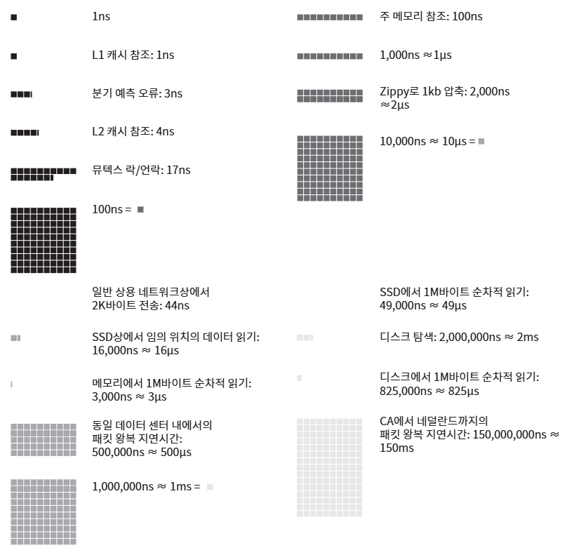

# 02장: 개략적인 규모 추정

## 1. 2의 제곱수
> 데이터의 양을 계산할 때 2의 제곱수를 활용
   
- 최소 단위 = 1바이트, 8비트로 구성
- ASCII 문자 하나가 차지하는 메모리 크기 = 1바이트

**[데이터 볼륨 단위 표]**
| 2의 x 제곱 | 근사치 | 이름 | 축약형 |
|:---|:---|:---|:---|
|10|1천(thsoumd)|1킬로바이트(Kilobyte)|1KB|
|20|1백만(million)|1메가바이트(Megabyte)|1MB|
|30|10억(billion)|1기가바이트(Gigabyte)|1GB|
|40|1조(trillion)|1테라바이트(Terabyte)|1TB|
|50|1000조(quadrillion)|1페타바이트(Petabyte)|1PB|

## 2. 모든 프로그래머가 알아야 하는 응답지연 값
> 컴퓨터 연산들의 처리 속도가 어느 정도인지 짐작 가능

**[응답 지연 시간 수치 표]**
| 연산명 | 시간 |
|:---|:---|
|L1 캐시 참조|0.5ns|
|분기 예측 오류(branch mispredict)|5ns|
|L2 캐시 참조|7ns|
|뮤텍스(mutex) 락/언락|100ns|
|주 메모리 참조|100ns|
|Zippy로 1KB 압축|10,000ns = 10μs|
|1 Gbps 네트워크로 2 KB 전송|20,000ns = 20μs|
|메모리에서 1 MB 순차적으로 read|250,000ns = 250μs|
|같은 데이터 센터 내에서의 메시지 왕복 지연시간|500,000ns = 500μs|
|디스크 탐색(seek)|10,000,000ns = 10ms|
|네트워크에서 1 MB 순차적으로 read|10,000,000ns = 10ms|
|디스크에서 1 MB 순차적으로 read|30,000,000ns = 30ms|
|한 패킷의 캘리포니아로부터 네덜란드까지의 왕복 지연시간|150,000,000ns = 150ms|

* **응답 지연 값**
    - ns = nanosecond(나노초)
    - μs = microsecond(마이크로초)
    - ms = millisecond(밀리초)
    - 1나노초 = $10^{-9}$초
    - 1마이크로초 = $10^{-6}$초 = 1,000나노초
    - 1밀리초 = $10^{-3}$초 = 1,000μs = 1,000,000ns

 

**<응답 지연 값의 시각화>**

- **분석 결과**
    - 메모리는 빠르지만 디스크는 아직 느림
    - 디스크 탐색(seek)은 가능한 회피
    - 단순한 압축 알고리즘은 빠름
    - 데이터를 인터넷으로 전송하기 전에 가능하면 압축
    - 데이터 센터는 보통 여러 지역(region)에서 분산되어 있고, 센터들 간에 데이터를 주고받는 데는 시간이 걸림

## 3. 가용성에 관계된 수치들
* **고가용성(high availability)**
    > 시스템이 오랜 시간 동안 지속적으로 중단 없이 운영될 수 있는 능력
    - 고가용성을 표현하는 값은 퍼센트(percent)로 표현
    - 100%는 "시스템이 단 한 번도 중단된 적이 없었음"을 의미
    - 대부분의 서비스는 99%에서 100%사이의 값

* **SLA(Service Level Agreement)**
    > 서비스 사업자(service provider)가 보편적으로 사용하는 용어로, 서비스 사업자와 고객 사이에 맺어진 합의
    - 이 합의에서는 서비스 사업자가 제공하는 서비스의 가용시간(uptime)이 공식적으로 기술
    - 아마존, 구글, 마이크로소프트 같은 사업자는 99% 이상의 SLA를 제공
    - 가용시간은 관습적으로 숫자 9를 사용해 표시하며, 9가 많을수록 좋음

**[시스템 장애 시간(downtime) 사이의 관계 표]**
| 가용률 | 하루당 장애시간 | 주당 장애시간 | 개월당 장애시간 | 연간 장애시간 |
|:---|:---|:---|:---|:---|
|99%|14.40분|1.68시간|7.31시간|3.65일|
|99.9%|1.44분|10.08분|43.83분|8.77시간|
|99.99%|8.64초|1.01분|4.38분|52.60분|
|99.999%|864.00밀리초|6.05초|26.30초|5.26분|
|99.9999%|86.40밀리초|604.80밀리초|2.63초|31.56초|

## 4. 예제: 트위터 QPS와 저장소 요구량 추정
**[가정]**
- 월간 능동 사용자(monthly active user)는 3억(300million)명이다.
- 50%의 사용자가 트위터를 매일 사용한다.
- 평균적으로 각 사용자는 매일 2건의 트윗을 올린다.
- 미디어를 포함하는 트윗은 10% 정도다.
- 데이터는 5년간 보관된다.

**[추정]**
QPS(Query Per Second) 추정치
- 일간 능동 사용자(Daily Active User, DAU) = 3억 X 50% = 1.5억(150million)
- QPS = 1.5억 X 2트윗 / 24시간 / 3600초 = 약 3500
- 최대 QPS(Peek QPS) = 2 X QPS = 약 7000 

미디어 저장을 위한 저장소 요구향
- 평균 트윗 크기
    - tweet_id에 64바이트
    - 텍스트에 140바이트
    - 미디어에 1MB
- 미디어 저장소 요구량: 1.5억 X 2 X 10% X 1MB = 30TB/일
- 5년간 미디어를 보관하기 위한 저장소 요구량: 30TB X 365 X 5 = 약 55PB

## 5. Tip
> 개략적인 규모 추정과 관계된 면접에서 가장 중요한 것은 문제를 풀어 나가는 절차

>올바른 절차를 밟느냐가 결과를 내는 것보다 중요 

- **근사치를 활용한 계산(rounding and approximation)**: 면접장에서 복잡한 계산을 하는 것은 어려운 일

    예를 들어, 면접장에서 "99987/0.1"의 계산 결과를 구할 때, 계산 결과의 정확함을 평가하는 것이 목적이 아니라 이런데 시간을 쓰는 것은 낭비.
    
    적절한 근사치를 활용하면, 위의 수식을 "100,000/10"로 간소화해서 시간 절약 가능

- **가정(assumption)** 들은 나중에 살펴볼 수 있도록 적어두기
- **단위(unit)** 붙이기: 단위를 붙이는 습관을 들여 모호함 방지

    예를 들어, 5라고만 적으면 5KB인지 5MB인지 알 수가 없어서 나중에는 스스로도 헷갈릴 수 있음
- 많이 출제되는 **개략적 규모 추정 문제** 는 QPS, 최대 QPS, 저장소 요구량, 캐시 요구량, 서버 등을 추정하는 것으로 계산하는 연습을 미리 하기

