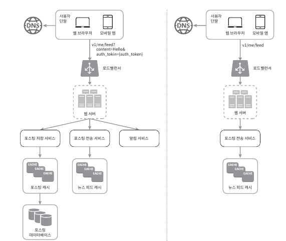

# 03장: 시스템 설계 면접 공략법
> 시스템 설계 면접은 두 명의 동료가 모호한 문제를 풀기 위해 협력하여 그 해결책을 찾아내는 과정에 대한 시물레이션이며, 정해진 결말과 정답이 없음
- **시스템 설계 면접의 핵심 평가 요소**
    - 지원자가 협력에 적합한 사람인지
    - 압박이 심한 상황도 잘 헤쳐 나갈 자질이 있는지
    - 모호한 문제를 건설적으로 해결할 능력이 있는지
    - 좋은 질문을 던질 능력이 있는지  

- **부정적 신호(red flag)**
    - 설계의 순수성(purity)에 집착한 나머지 타협적 결정(tradeoff)를 도외시하고 과도한 엔지니어링(over-enginerring)을 하게 되는 현상

## 효과적 면접을 위한 4단계 접근법
> 시스템 설계 면접은 전부 제각각으로, 정해진 결말도 없고 정답도 없지만 그 절차나 범위에는 공통적인 부분이 존재

### 1단계: 문제 이해 및 설계 범위 확정
> 성급하게 답부터 들이밀지 말고, 속도를 늦친 후 깊이 생각하고 요구사항과 가정들을 분명히 해야하는 단계

> 요구사항을 와전히 이해하지 않고 답을 내놓는 행위는 아주 엄청난 부정적 신호(red flag)

- **요구사항을 정확히 이해하는 데 필요한 질문 예시**
    - 구체적으로 어떤 기능들을 만들어야 하나?
    - 제품 사용자 수는 얼마나 되나?
    - 회사의 규모는 얼마나 빨리 커지리라 예쌍하나? 석 달, 여섯 달, 일년 뒤의 규모는 얼마나 되리라 예상하는가?
    - 회사가 주로 사용하는 기술 스택(technology stack)은 무엇인가? 설계를 단순화하기 위해 활용할 수 있는 기존 서비스로는 어떤 것들이 있는가?
    
     

**[예제: 지원자가 면접관에게 던질 수 있는 질문 사례]**
> "뉴스 피드(news feed) 시스템을 설계"하라는 요구

    [지원자]: 모바일 앱과 웹 앱 가운데 어느 쪽을 지원해야 하나요? 아니면 둘 다일까요?

    면접관: 둘 다 지원해야 합니다.

    [지원자]: 가장 중요한 기능은 무엇인가요?

    면접관: 새로운 포스트(post)를 올리고, 다른 친구의 뉴스 피드를 볼 수 있도록 하는 기능입니다.

    [지원자]: 이 뉴스 피드는 시간 역순으로 정렬되어야 하나요? 아니면 다른 특별한 정렬 기준이 있습니까? 제가 특별한 정렬 기준이 있느냐고 묻는 이유는, 피드에 올라갈 포스트마다 다른 가중치가 부여되어야 하는지 알고 싶어서 인데요. 가령 가까운 친구의 포스트가 사용자 그룹(user group)에 올라가는 포스트보다 더 중요하다거나.

    면접관: 문제를 단순하게 만들기 위해, 일단 시간 역순으로 정렬된다고 가정합시다. 

    [지원자]: 한 사용자는 최대 몇 명의 사용자와 친구를 맺을 수 있나요?

    면접관: 5000명입니다.

    [지원자]: 사이트로 오는 트래픽 규모는 어느 정도입니까?

    면접관: 일간 능동 사용자(daily active user, DAU)는 천만 명입니다.

    [지원자]: 피드에 이미지나 비디오도 올라올 수 있나요? 아니면 포스트는 그저 텍스트입니까?

    면접관: 이미지나 비디오 같은 미디어 파일도 포스트 할 수 있어야 합니다.

=> **요구사항을 이해하고 모호함을 없애는게 이 단계에서 가장 중요**
      
### 2단계: 개략적인 설계안 제시 및 동의 구하기
> 개략적인 설계안을 제시하고 면접관의 동의를 얻는 과정

- 설계안에 대한 최초 청사진을 제시하고 의견 구하고, 면접관을 마치 팀원인 것처럼 대하기
    
    훌륭한 면접관들은 지원자들과 대화하고 설계 과정에 개입하기를 즐김

- 화이트 보드나 종이에 핵심 컴포넌트를 포한하는 다이어그램 그리기
    
    클라이언트(모바일/웹), API, 웹 서버, 데이터 저장소, 캐시, CDN, 메시지 큐 같은 것들이 포함

- 이 최초 설계안이 시스템 규모와 관계된 제약사항들을 만족하는지를 개략적으로 계산
    
    계산 과정은 소리 내어 설명하고, 이런 개략적 추정이 필요한지는 면접관에게 미리 물어보기

**[예제: 개략적 설계를 만들어지는 과정]**
> "뉴스 피드(news feed) 시스템을 설계"하라는 요구를 그대로 활용

- **피드 발행**: 사용자가 포스트를 올리면 관련된 데이터가 캐시/데이터베이스에 기록되도, 해당 사용자의 친구(friend) 뉴스 피드에 나타남

- **피드 생성**: 어떤 사용자의 뉴스 피드는 해당 사용자 친구들의 포스트를 시간 역순으로(최신 포스트부터 오래된 포스트 순으로) 정렬하여 생성 

**<피드 발행과 피드 생성 플로>**

### 3단계: 상세 설계
> 이제 면접관과 해야 할 일은 설계 대상 컴포넌트 사이의 우선순위를 정하는 것

- **현재까지 달성한 목표**
    - 시스템에서 전반적으로 달성해야 할 목표와 기능 범위 확인
    - 전체 설계의 개략적 청사진 마련
    - 해당 청사진에 대한 면접관의 의견 청취
    - 상세 설계에서 집중해야 할 영역들 확인

**[예제: 상세 설계]**
> "뉴스 피드(news feed) 시스템"의 계략적 설계를 마친 상황이라 가정

- 깊이 탐구해야할 2가지
    - 피드 발행
    - 뉴스 피드 가져오기(news fedd retrieval)

### 4단계: 마무리
> 마지막 단계에서 면접관은 설계 결과물에 관련된 몇 가지 후속 질문을 던질 수도 있고(follow-up questions), 스스로 추가 논의를 진행하도록 할 수도 있음

**[활용 가능한 지침 사항]**
- 면접관이 시스템 병목구간, 혹은 좀 더 개선 가능한 지점을 찾아내라고 요청할 경우, 자신의 설계가 완벽하다거나 개선할 부분이 없다는 답은 지양

- 자신이 만든 설계를 한번 다시 요약해 주는 것이 도움 될 수 있는데, 여러 해결책을 제시한 경우 특히 중요

- 오류가 발생하면 무슨 일이 생기는지(서버 오류, 네트워크 장애 등) 따져보자

- 운영 이슈도 논의할 가치가 충분하므로 "메트릭은 어떻게 수집하고 모니터링 할 것인가? 로그는? 시스템은 어떻게 배포해(roll-out) 나갈 것인가"와 같은 사항에 논의 가능

- 미래에 닥칠 규모 확장 요구에 어떻게 대처할 것인지 생각 (예: 현재 설계로 백만 사용자는 능히 감당할 수 있다고 해보자. 천만 사용자를 감당하려면 어떻게 해야 하는가?)

- 시간이 좀 남았다면, 필요하지만 다루지 못했던 세부적 개선사항들 제안

**[면접 세션에서 해야할 것]**
- 질문을 통해 확인하기(clarification). 스스로 내린 가정이 올다 믿고 진행하지 말기
- 문제의 요구사항 이해하기
- 정답이나 최선의 답안 같은 것은 없다는 점을 명심. 스타트업을 위한 설계안과 수백만 사용자를 지원해야 하는 중견 기업을 위한 설계안이 같을 리 없으니 요구사항을 정확하게 이해했는지 다시 확인하기
- 면접관이 여러분의 사고 흐름을 이해할 수 있도록 하고, 면접관과 소통하기
- 가능하다면 여러 해법을 함께 제시하기
- 개략적 설계에 면접관이 동의하면, 각 컴포넌트의 세부사항을 설명하기 시작하기. 가장 중요한 컴포넌트부터 진행
- 면접관의 아이디어를 이끌어 내기. 좋은 면접관은 여러분과 같은 팀원처럼 협력
- 포기하지 말기

**[하지 말아야 할 것]**
- 전형적인 면접 문제들에도 대비하지 않은 상태에서 면접장에 가지 말기
- 요구사항이나 가정들을 분명히 하지 않은 상태에서 설계에서 설계를 제시하지 말기
- 처음부터 특정 컴포넌트의 세부사항을 너무 깊이 설명하지 말기. 개략적 설계를 마친 뒤에 세부사항으로 나아가기
- 진행 중에 막혔다면, 힌트를 청하기를 주저하지 말기
- 소통을 주저하지 말고, 침묵 속에 설계를 진행하지 말기
- 설계안을 내놓는 순간 면접이 끝난다고 생각하지 말기. 면접관이 끝났다고 말하기 전까지는 끝난 것이 아니고, 의견을 일찍 그리고 자주 구하기

### 시간 배분
> 시스템 설계 면접은 보통 매우 광범위한 영역을 다루며 45분 혹은 한 시간은 총분하지 않을 수 있으므로, 시간 관리를 잘 하는 것이 중요

**[45분의 시간이 주어진다고 가정]**
- 1단계 - 문제 이해 및 설계 범위 확정: **3분에서 10분**
- 2단계 - 개략적 설계안 제시 및 동의 구하기: **10분에서 15분**
- 3단계 - 상세 설계: **10분에서 25분**
- 4단계 - 마무리: **3분에서 5분**