# 05장. 안정 해시 설계

수평적 규모 확장성을 달성하기 위해서는 요청 또는 데이터를 서버에 균등하게 나누는 것이 중요

안정 해시는 이 목표를 달성하기 위해 보편적으로 사용하는 기술

## 해시 키 재배치(rehash) 문제
> N개의 캐시 서버가 있다고 가정할 때, 이 서버들에 부하를 균등하게 나누는 보편적인 방법은 아래의 해시 함수를 사용하는 것

### serverIndex = hash(key) % N (N은 서버의 개수)

 

**[예제]**
  총 4개의 서버를 사용한다고 가정

**<주어진 각각의 키에 대해서 해시 값과 서버 인덱스를 계산한 표>**
| 키 | 해시 | 해시 % 4 (서버 인덱스) |
|:---|:---|:---|
|key0|18358617|1|
|key1|26143584|0|
|key2|18131146|2|
|key3|35863496|0|
|key4|34085809|1|
|key5|27581703|3|
|key6|38164978|2|
|key7|22530351|3|

특정한 키가 보관된 서버를 알아내기 위해, 나머지(modular) 연산을 f(key) % 4 와같이 적용

예를 들어 hash(key0) % 4 = 1이면, 쿨라이언트는 캐시에 보관된 데이터를 가져오기 위해 서버 1에 접속

 

**<키 값이 서버에 분산되는 방법>**
 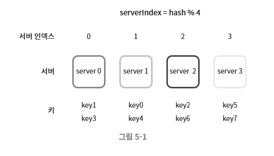

 - 이 방법은 서버 풀(server pool)의 크기가 고정되어 있을 떄, 그리고 데이터 분포가 균등할 때 잘 동작

 - 하지만 서버가 추가되거나 기존 서버가 삭제되면 문제 발생

 - 예를 들어 1번 서버가 장애를 일으켜 동작을 중단했다고 하면 서버 풀의 크기는 3으로 변화

 - 그 결과로, 키에 대한 해시 값은 변하지 않지만 나머지(%) 연산을 적용하여 계산한 서버 인덱스 값은 달라질 것 => 서버 수가 1만큼 줄어들었기 때문

 

**<해시 % 3의 결과 값>**
| 키 | 해시 | 해시 % 3 (서버 인덱스) |
|:---|:---|:---|
|key0|18358617|0|
|key1|26143584|0|
|key2|18131146|1|
|key3|35863496|2|
|key4|34085809|1|
|key5|27581703|0|
|key6|38164978|1|
|key7|22530351|0|

 

**<변화된 키 분포(distribution)>**
 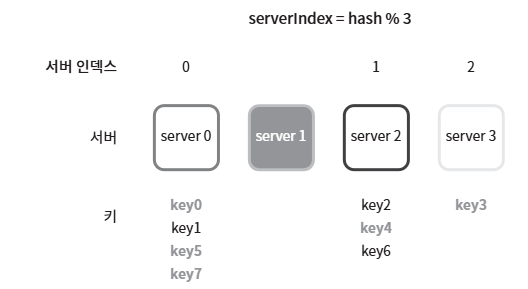

 - 장애가 발생한 1번 서버에 보관되어 있는 키 뿐만 아닌 대부분의 키가 재분배

 - 1번 서버가 죽으면 대부분 캐시 클라이언트가 데이터가 없는 엉뚱한 서버에 접속하게 된다는 뜻

 - 그 결과로 대규모 캐시미스(chche miss)가 발생하게 될 것

 - 안정 해시는 이 문제를 효과적으로 해결하는 기술

## 안정 해시(consistent hash)
> 해시 테이블 크기가 조정될 때 평균적으로 오직 k/n개의 키만 재배치하는 해시 기술

> k = 키의 개수, n = 슬롯(slot)의 개수

> 대부분의 전통적 해시 테이블은 슬롯의 수가 바뀌면 거의 대부분 키를 재배치

### 해시 공간과 해시 링

**[동작 원리]**

- 해시 함수 f로는 SHA-1을 사용한다고 하고, 그 함수의 출력 값 범위는 x0, x1, x2, x3, ... xn과 같다고 가정

- SHA-1의 해시 공간(hash space) 범위는 0부터 $2^{160}$-1 까지

- 따라서 x0는 0, xn는 $2^{160}$-1이며, 나머지 x1부터 xn-1까지는 그 사이의 값을 가짐

 

**<해시 공간을 표현한 그림>**
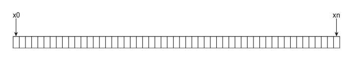

**<해시 링(hash ring)>** : 해시 공간의 양쪽을 구브려 접으면 해시 링

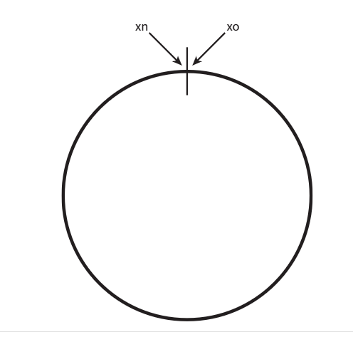

 

### 해시 서버

해시 함수 f를 사용하면 서버 IP나 이름을 이 링 위의 어떤 위치에 대응 시킬 수 있음

**<4개의 서버를 이 해시 링 위에 배치한 결과>**

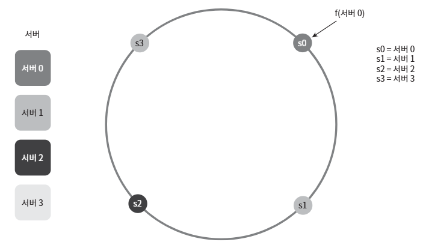

 

### 해시 키

여기 사용된 해시 함수는 "해시 키 재배치 문제"에 언급된 함수와는 다르며, 

나머지(modular) 연산 %는 사용하지 않고 있음에 유의

**<캐시할 키 key-, key1, key2, key3 또한 해시 링 위의 어느지점에 배치 가능>**

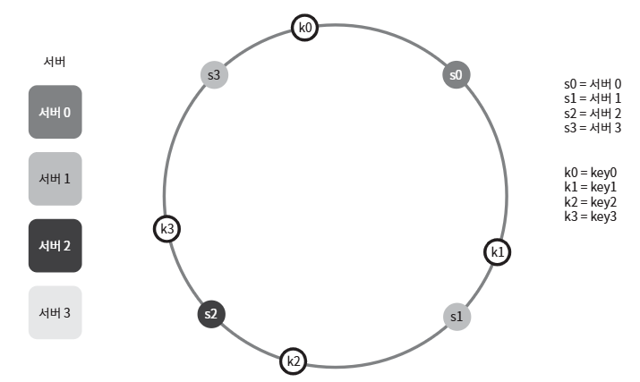

 

### 서버 조회

어떤 키가 저장되는 서버는, 해당 키의 위치로부터 시계 방향으로 링을 탐색해 나가면서 만나는 첫 번째 서버

따라서 아래 그림을 보면, key0은 서버 0에 저장되고, key1은 서버 1에 저장되며, key2는 서버 2, key3은 서버3에 저장

 

**<서버 조회 과정>**

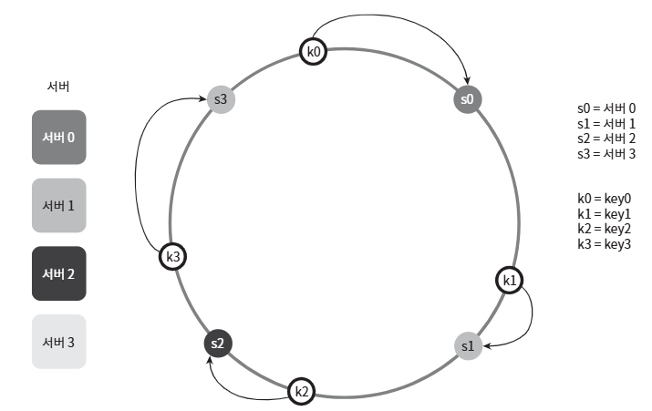

 

### 서버 추가

위의 내용에 따르면, 서버를 추가하더라도 키 가운데 일부만 재배치 하면 됨

아래 그림을 보면 새로운 서버 4가 추가된 뒤에 key0만 재배치됨을 알 수 있고, k1, k2, k3은 같은 서버에 존재

**[이유]**
- 서버 4가 추가되기 전, key0은 서버 0에 저장

- 하지만 서버 4가 추가된 뒤에 key0은 서버 4에 저장될 것인데 왜냐하면 key0의 위치에서 시계방향으로 순회했을 때 처음으로 만나게 되는 서버가 서버 4이기 때문

- 다른 키들은 재배치 X

**<서버 추가 과정>**

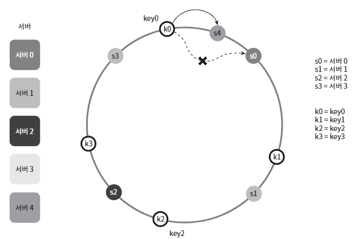

 

### 서버 제거

하나의 서버가 제거되면 키 가운데 일부만 재배치

아래 그림을 보면, 서버 1이 삭제되었을 떄 key1만이 서버 2로 재배치

나머지 키에는 영향 X

**<서버 제거 과정>**

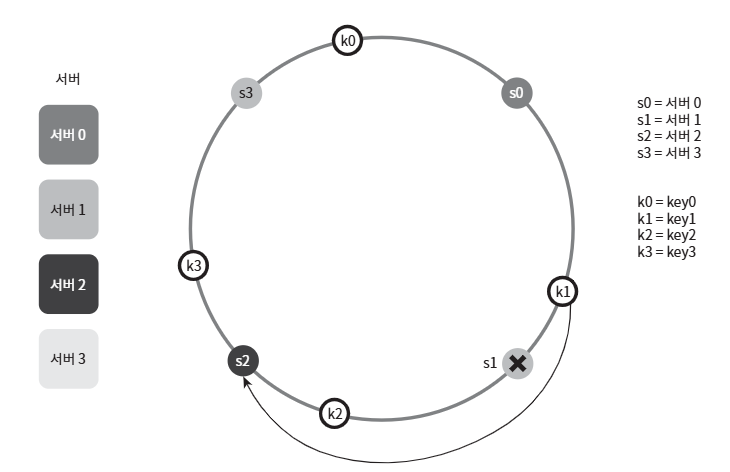

 

### 기본 구현법의 두 가지 문제

안정 해시 알고리즘은 MIT에서 처음 제안

**[안정 해시 알고리즘의 기본 절차]**

- 서버와 키를 균등 분포(uniform distribution) 해시 함수를 사용해 해시 링에 배치

- 키의 위치에서 링을 시계 방향으로 탐색하다 만나는 최초의 서버가 키가 저장될 서버

**[위의 접근법에서 발생하는 두 가지 문제]**

1. 서버가 추가되거나 삭제되는 상황을 감안하면 파티션(partition)의 크기를 균등하게 유지하는 것이 불가능

    - 여기서 파티션은 인접한 서버 사이의 해시 공간
    - 어떤 서버는 굉장히 작은 해시 공간을 할당 받고, 어떤 서버는 굉장히 큰 해시 공간을 할당 받는 상황이 가능하다는 것

    **<s1이 삭제되는 바람에 s2의 파티션이 다른 파티션의 두 배로 커지는 상황>**
    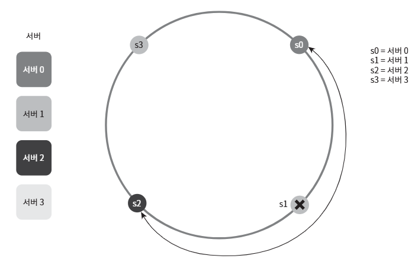

2. 키의 균등 분포(uniform distribution)을 달성하기 어렵다는 것

    - 예를 들어 서버가 아래와 같이 배치되어 있다고 가정
    - 서버 1과 서버 3은 아무 데이터도 갖지 않는 반면, 대부분의 키는 서버 2에 보관될 것
    - 이 문제를 해결하기 위해 제안된 기법이 **가상 노드(virtual node)** 또는 **복제(replica)** 라 불리는 기법

    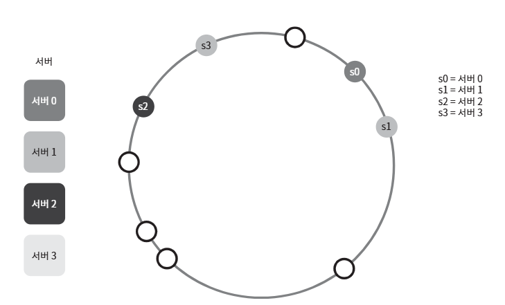

 

### 가상 노드(virtual node)
> 실제 노드 또는 서버를 가리키는 노드로서, 하나의 서버는 링 위에 여러 개의 가상 노드를 가질 수 있음

**<s0으로 표시된 파티션은 서버 0이, s1로 펴시된 파티션은 서버 1이 관리>**
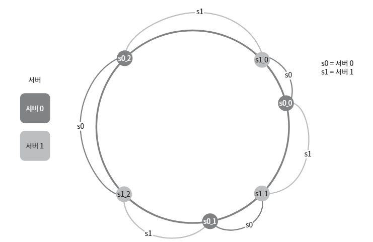

- 서버 0과 서버 1은 3개의 가상 노드를 가지고 있음

- 여기서 숫자 3은 임의로 정한 것이며, 실제 시스템에서는 그보다 훨씬 큰 값이 사용

- 서버 0을 링에 배치하기 위해 s0 하나면 쓰는 대신, s0_0, s0_1, s1_2의 세 개 가상 노드를 사용

- 서버 1을 링에 배치할 때는 s1_0, s1_1, s1_2의 세 개 가상 노드를 사용

- 따라서 각 서버는 하나가 아닌 여러 개 파티션을 관리해야 함

**<키의 위치로부터 시계방향으로 링을 탐색>**
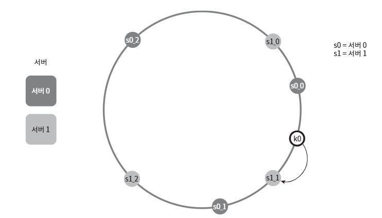

- 키의 위치로부터 시계방향으로 링을 탐색하다 만나는 최초의 가상 노드가 해당 키가 저장될 서버

- k0가 저장되는 서버는 k0의 위치로부터 링을 시계뱡향으로 탐색하다 만나는 최초의 가상 노드 s1_1가 나타내는 서버, 즉 서버 1

 

가상 노드의 개수를 늘리면 키의 분포는 점점 더 균등

표준 편차(standard deviation)가 작아져서 데이터가 고르게 분포되기 때문

표준 편차는 데이터가 어떻게 퍼져 나갔는지를 보이는 척도

- 100~200개의 가상 노드를 사용했을 경우 표준 편차 값은 평균의 5%(가상 노드가 200개인 경우)에서 10%(가상 노드가 100개인 경우) 사이

가상 노드의 개수를 더 늘리면 표준 편차의 값은 더 감소, 그러나 가상 노드 데이터를 저장할 공간은 더 많이 필요

=> 타협적 결정(tradeoff)가 필요하다는 의미 (그러니 시스템 요구사항에 맞도록 가상 노드 개수를 적절히 조정)

 

### 재배치할 키 결정

서버가 추가되거나 제거되면 데이터 일부는 재배치 필요

어느 범위의 키들이 재배치 되어야 할까?

**<서버 4 추가>**

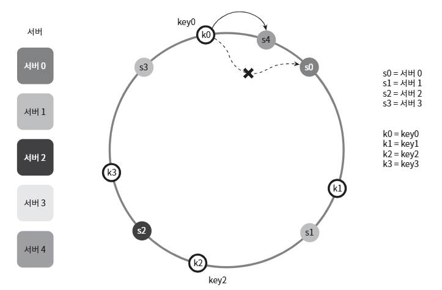

- 서버 4가 추가되었다고 했을 때, 이에 영향 받은 범위는 s4(새로 추가된 노드)부터 그 반시계 뱡향에 있는 첫 번째 서버 s3까지

- 즉 s3부터 s4 사이에 있는 키들을 s4로 재배치 필요

**<서버 s1 삭제>**

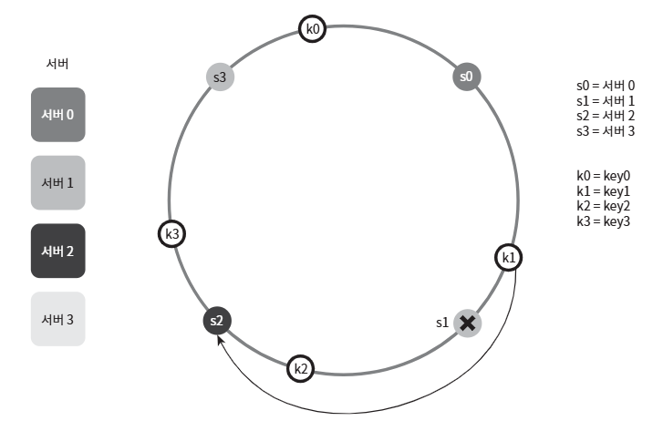

- s1부터(삭제된 노드) 그 반시계 방향에 있는 최초 서버 s0 사이에 있는 키들이 s2로 재배치 필요

### 마무리
이번 장에서는 안정 해시가 왜 필요하며 어떻게 동작하는지를 살펴봄

**[안정 해시의 이점]**
- 서버가 추가되거나 삭제될 때 재배치되는 키의 수가 최소화
- 데이터가 보다 균등하게 분포하게 되므로 수평적 규모 확장성을 달성하기 쉬움
- 핫스팟(hotspot) 키 문제 감소

    특정한 샤드(shard)에 대한 접근이 지나치게 빈번하면 서버 과부하 문제 발생 가능

    안정 해시는 데이터를 좀 더 균등하게 분배하므로 이런 문제가 생길 가능성 감소

**[안정 해시가 사용되는 예시]**

- 아마존 다이나모 데이터베이스(DynamoDB)의 파티셔닝 관련 컴포넌트

- 아파치 카산드라(Apache Cassandra) 클러스터에서의 데이터 파티셔닝

- 디스코드(Discord) 채팅 어플리케이션

- 아카마이(Akamai) CDN

- 매그레프(Meglev) 네트워크 부하 분산기

