# 06장. 키-값 저장소 설계

> 키-값 저장소(key-value store) : 키-값 데이터베이스라고도 불리는 비 관계형(non-relational) 데이터베이스

이 저장소에 저장되는 값은 고유한 식별자(identifier)를 키로 가져야 함

키와 값 사이의 이런 연결 관계를 "키-값" 쌍(pair)이라고 지칭

키-값 쌍에서의 키는 유일해야 하며 해당 키에 매달린 값은 키를 통해서만 접근 가능

키는 일반 텍스트일 수도 있고 해시 값일 수도 있으며, 성능상의 이유로, 키는 짧을수록 좋음

**[키의 사례]**

- 일반 텍스트 키:"last_logged_in_at"

- 해키 키: 253DDEC4

키-값 쌍에서의 값은 문자열일 수도 있고 리스트(list)일 수도 있고 객체(object)일 수도 있음

키-값 저장소는 보통 값으로 무엇이 오든 상관 X

키-값 저장소로 널리 알려진 것으로는 아마존 다이나모, memcached, 레디스 

**[키 값 저장소에 보관된 데이터의 사례]**

| 키 | 값 |
|:---|:---|
|145|john|
|147|bob|
|160|julia|

**[다음 연산을 지원하는 키-값 저장소 설계 예정]**

- put(key, value): 키-값 쌍을 저장소에 저장한다.

- get(key): 인자로 주어진 키에 매달린 값을 꺼낸다.

## 문제 이해 및 설계 범위 확정
> 완벽한 설계란 없으며 읽기, 쓰기, 메모리 사용량 사이에 어떤 균형을 찾고, 데이터의 일관성과 가용성 사이에서 타협적 결정을 내린 설계를 만들었다면 훌륭한 설계

**[다음 특성을 갖는 키-값 저장소 설계 예정]**

- 키-값 쌍의 크기는 10KB 이하이다.

- 큰 데이터를 저장할 수 있어야 한다.

- 높은 가용성을 제공해야 한다. 따라서 시스템은 설사 장애가 있더라도 빨리 응답해야 한다.

- 높은 규모 확장성을 제공해야 한다. 따라서 트래픽 양에 따라 자동적으로 서버 증설/삭제가 이루어져야 한다.

- 데이터 일관성 수준은 조정이 가능해야 한다.

- 응답 지연시간(latency)이 짧아야 한다.

## 단일 서버 키-값 저장소
> 한 대 서버만 사용하는 키-값 저장소를 설계하는 것은 쉬우며, 가장 직관적인 방법은 키-값 쌍 전부를 메모리에 해시 테이블로 저장하는 것

하지만, 이 접근법은 빠른 속도를 보장하긴 하지만 모든 데이터를 메모리 안에 두는 것이 불가능할 수도 있다는 약점이 존재

**[이 문제를 해결하기 위한 개선책]**

- 데이터 압축(compression)

- 자주 쓰이는 데이터만 메모리에 두고 나머지는 디스크에 저장

이렇게 개선한다고 해도, 한 대 서버로 부족한 떄가 찾아옴 

=> 많은 데이터를 저장하려면 분산 키-값 저장소(distributed key-value store)를 만들어야 함

## 분산 키-값 저장소
> 분산 키-값 저장소는 키-값 쌍을 여러 서버에 분산시키므로, 분산 해시 테이블이라고도 불림

분산 시스템을 설계할 때는 CAP 정리(Consistency, Availability, Partition Tolerance theorem) 이해 필요

### CAP 정리
> CAP 정리는 데이터 일관성(consistency), 가용성(availability), 파티션 감내(partition tolerance)라는 세 가지 요구사항을 동시에 만족하는 분산 시스템을 설계하는 것을 불가능하다는 정리

**[세 가지 요구사항의 의미]**

- **데이터 일관성**: 분산 시스템에 접속하는 모든 클라이어트는 어떤 노드에 접속했느냐에 관계없이 언제나 같은 데이터를 보게 되어야 한다.

- **가용성**: 분산 시스템에 접속하는 클라이언트는 일부 노드에 장애가 발생하더라도 항상 응답을 받을 수 있어야 한다.

- **파티션 감내**: 파티션은 두 노드 사이에 통신 장애가 발생하였음을 의미한다. 파티션 감내는 네트워크에 파티션이 생기더라도 시스템은 곘고 동작하여야 한다는 것을 뜻한다.

**[CAP 정리]**

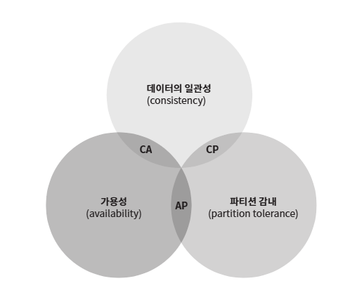

 CAP 정리를 위의 그림과 같이 이들 가운데 어떤 두 가지를 충족하려면 나머지 하나는 반드시 희생되어야 한다는 것을 의미

 **[키-값 저장소는 세 가지 요구사항 가운데 어느 두 가지를 만족하느냐에 따라 다음과 같이 분류]**

 - **CP 시스템**: 일관성과 파티션 감내를 지원하는 키-값 저장소. 가용성을 희생한다.

 - **AP 시스템**: 일관성과 가용성을 지원하는 키-값 저장소. 데이터 일관성을 희생한다.

 - **CA 시스템**: 일관성과 가용성을 지원하는 키-값 저장소. 파티션 감내는 지원하지 않는다. 그러나 통상 네트워크 장애는 피할 수 없는 일로 여겨지므로, 분산 시스템은 반드시 파티션 문제를 감내할 수 있도록 설계되어야 한다. 그러므로 실세계에 CA 시스템은 존재하지 않는다. 

#### 이상적 상태
> 이상적 환경이라면 네트워크가 파티션되는 상황은 절대로 일어나지 않을 것

**[세 대의 복제(replica) 노드 n1, n2, n3에 데이터를 복제하여 보관하는 상황]**

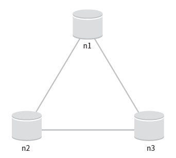

 - 분산 시스템에서 데이터는 보통 여러 노드에 복제되어 보관
 
 - n1에 기록된 데이터는 자동적으로 n2와 n3에 복제

 - 데이터 일관성과 가용성도 만족

#### 실세계의 분산 시스템
> 분산 시스템은 파티션 문제를 피할 수 없으며, 파티션 문제가 발생하면 일관성과 가용성 중 하나를 선택

**[n3에 장애가 발생하여 n1 및 n2와 통신할 수 없는 상황]**

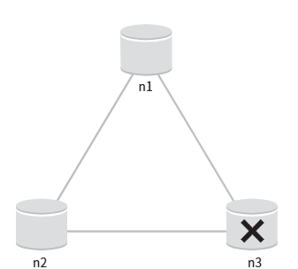

 - 클라이언트가 n1 또는 n2에 기록한 데이터는 n3에 전달 X
 - n3에 기록되었으나 아직 n1 및 n2로 전달되지 않은 데이터가 있다면 n1과 n2는 오래된 사본을 갖고 있을 것

 **가용성 대신 일관성 선택(CP 시스템)**: 세 서버 사이에 생길 수 있는 데이터 불일치 문제를 피하기 위해 n1과 n2에 대해 쓰기 연산을 중단시켜야 하는데, 그렇게 하면 가용성이 꺠짐

 **일관성 대신 사용성 서택(AP 시스템)**: 낡은 데이터를 반환할 위험이 있더라도 계속 읽기 연산을 허용해야 함. n1과 n2는 계속 쓰기 연산을 허용할 것이고, 파티션 문제가 해결된 뒤에 새 데이터를 n3에 전송할 것

### 시스템 컴포넌트

**[키-값 저장소 구현에 사용될 핵심 컴포넌트들 및 기술들]**
- 데이터 파티션

- 데이터 다중화(replication)

- 일관성(consistency)

- 일관성 불일치 해소(inconsistency resolution)

- 장애 처리

- 시스템 아키텍처 다이어그램

- 쓰기 경로(write path)

- 읽기 경로(read path)

=> 세 가지 키-값 저장소, 즉 다이나모(Dynamo), 카산드라(Cassandra), 빅테이블(BigTable)의 사례를 참고한 것

#### 데이터 파티션
> 대규모 애플리케이션의 경우 전체 데이터를 한 대 서버에 욱여넣는 것은 불가능하며, 가장 단순한 해결책은 데이터를 작은 파티션들로 분할한 다음 여러 대 서버에 저장하는 것

**[데이터를 파티션 단위로 나눌 떄 고려해야 한 문제]**

- 데이터를 여러 서버에 고르게 분산할 수 있는가

- 노드가 추가되거나 삭제될 때 데이터의 이동을 최소화할 수 있는가

=> 안정 해시(consistent hash)는 이런 문제를 푸는 데 적합한 기술

**[안정 해시의 동작 원리]**

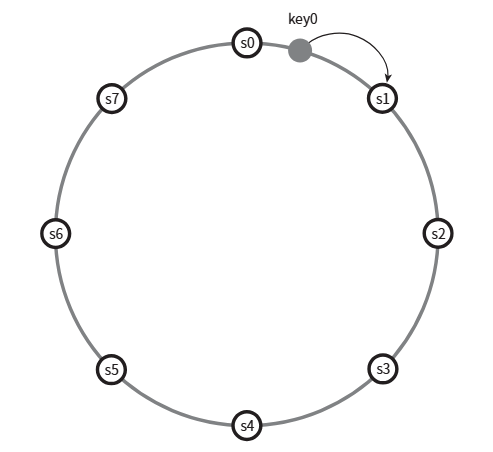

- 우선 서버를 해시 링(hash ring)에 배치한다. 그림의 해시 링에는 s0, s1, ..., s7의 여덟 개 서버가 배치되어 있다.

- 어떤 키-값 상을 어떤 서버에 저장할지 결정하려면 우선 해당 키를 같은 링 위에 배치한다. 그 지점으로부터 링을 시계 방향으로 순회하다 만나는 첫번째 서버가 바로 해당 키-값을 저장할 서버다. 따라서 key0은 s1에 저장된다.

**[안정 해시를 사용하여 데이터를 파티션 하면 좋은 점]**

- 규모 확장 자동화(automatic scaling): 시스템 부하에 따라 서버가 자동으로 추가되거나 삭제되도록 만들 수 있다.

- 다양성(heterogeneity): 각 서버의 용량에 맞게 가상 노드(virtual node)의 수를 조정할 수 있다. 다시 말해, 고성능 서버는 더 많은 가상 노드를 갖도록 설정할 수 있다.

#### 데이터 다중화
> 높은 가용성과 안정성을 확보하기 위해서는 데이터를 N개 서버에 비동기적으로 다중화(replication)할 필요가 있으며, 여기서 N은 튜닝 가능한 값

**[N개 서버를 선정하는 방법]**

어떤 키를 링 위에 배치한 후, 그 지점으로부터 시계 방향으로 링을 순회하면서 만나는 첫 N개 서버에 데이터 사본을 보관하는 것

따라서 N=3으로 설정한 아래 그림의 예제에서 key0은 s1, s2, s3에 저장

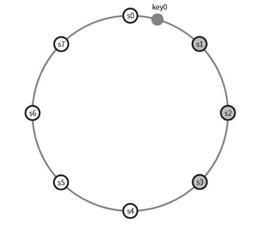

- 가상 노드를 사용한다면 위와 같이 선택한 N개의 노드가 대응될 실제 물리 서버의 개수가 N보다 작아질 수 있음

- 이 문제를 피하려면 노드를 선택할 때 같은 물리 서벌르 중복 선택 X

같은 데이터 센터에 속한 노드는 정전, 네트워크 이슈, 자연재해 등의 문제를 동시에 겪을 가능성이 있음

안정성을 담보하기 위해 데이터의 사본은 다른 센터의 서버에 보관, 센터들은 고속 네트워크로 연결

#### 데이터 일관성
> 여러 노드에 다중화된 데이터는 적절히 동기화 되어야 하며, 정족수 합의(Quorum Consensus) 프로토콜을 사용하면 읽기/쓰기 연산 모두에 일관성 보장 가능

**[관계된 정의]**

- N=사본 개수.

- W=쓰기 연산에 대한 정족수. 쓰기 연산이 성공한 것으로 간주되려면 적어도 W개의 서버로부터 쓰기 연산이 성공했다는 응답을 받아야 한다.

- R=읽기 연산에 대한 정족수. 읽기 연산이 성공한 것으로 간주되려면 적어도 R개의 서버로부터 응답을 받아야 한다.

**[N=3인 경우(데이터가 s0,s1,s2에 다중화되는 상황)]**

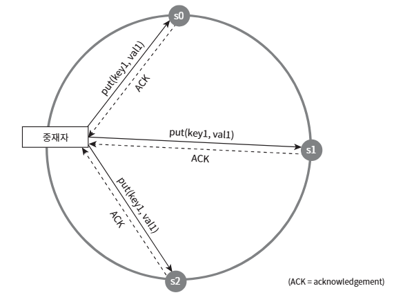

W=1은 데이터가 한 대 서버에만 기록된다는 뜻 X

- W=1의 의미는, 쓰기 연산이 성공했다고 판단하기 위해 중재자(coordinator)는 최소 한 대 서버로부터 쓰기 성공 응답을 받아야 한다는 뜻

- 따라서 s1으로부터 성공 응답을 받았다면 s0, s2로부터의 응답은 기다릴 필요 X

- 중재자는 클라이언트와 노드 사이에서 프락시(proxy) 역할

 

> W, R, N의 값을 정하는 것은 응답 지연과 데이터 일관성 사이의 타협점을 찾는 전형적인 과정

- **W=1 또는 R=1인 구성의 경우**: 중재자는 한 대 서버로부터의 응답만 받으면 되는 응답 속도는 빠를 것

- **W나 R의 값이 1보다 큰 경우**: 시스템이 보여주는 데이터 일관성의 수준은 향상될 테지만 중재자의 응답 속도는 가장 느린 서버로부터의 응답을 기다려야 하므로 느려질 것

- **W+R > N인 경우**: 강한 일관성(strong consistency)이 보장. 일관성을 보증할 최신 데이터를 가진 노드가 최소 하나는 겹쳐질 것이기 때문

**[가능한 몇 가지 구성]**

- R=1, W=N: 빠른 읽기 연산에 최적화된 시스템

- W=1, R=N:빠른 쓰기 연산에 최적화된 시스템

- W+R > N: 강한 일관성이 보장됨(보통 N=3, W=R=2)

- W+R <= N: 강한 일관성이 보장되지 않음

    => 요구되는 일관성 수준에 따라 W, R, N의 값을 조정

#### 일관성 모델
> 일관성 모델(consistency model)은 키-값 저장소를 설계할 때 고려해야 할 하나의 중요한 요소로, 데이터 일관성의 수준을 결정하는데 종류가 다양

**[일관성 모델 종류]**

- **강한 일관성(strong consistency)**: 모든 읽기 연산은 가장 최근에 갱신된 결과를 반환한다. 다시 말해서 클라이언트는 절대로 낡은(out-of-date) 데이터를 보지 못한다.

- **약한 일관성(weak consistency)**: 읽기 연산은 가장 최근에 갱신된 결과를 반환하지 못할 수 있다.

- **최종 일관성(eventual consistency)**: 약한 일관성의 한 형태로, 갱신 결과가 결국에는 모든 사본에 반영(동기화)되는 모델이다.

**[강한 일관성을 달성하는 일반적인 방법]**

- 모든 사본에 현재 쓰기 연산의 결과가 반영될 떄까지 해당 데이터에 대한 읽기/쓰기를 금지하는 것

- 이 방법은 새로운 요청의 처리가 중단되기 때문에 고가용성 시스템에 적합 X

**[최종 일관성 모델을 따른 경우]**

- 쓰기 연산이 병렬적으로 발생하면 시스템에 저장된 값의 일관성이 꺠어질 수 있는데, 이 문제는 클라이언트가 해결해야 함

#### 비 일관성 해소 기법: 데이터 버저닝
> 데이터를 다중화하면 가용성은 높아지지만 사본 간 일관성이 꺠질 가능성은 높아짐

> 버저닝(versioning)과 벡터 시계(vector clock)는 그 문제를 해소하기 위해 등장한 기술

> 버저닝은 데이터를 변경할 때마다 해당 데이터의 새로운 버전을 만드는 것을 의미하므로 각 버전의 데이터는 변경 불가능(immutable)

**[데이터 일관성이 깨지는 과정]**

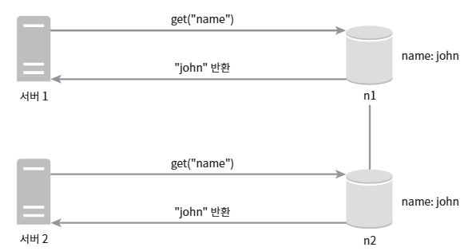

- 어떤 데이터의 사본이 노드n1과 n2에 보관 되있다고 가정

- 이 데이터를 가져오려는 서버 1과 서버 2는 get("name") 연산의 결과로 같은 값을 얻음

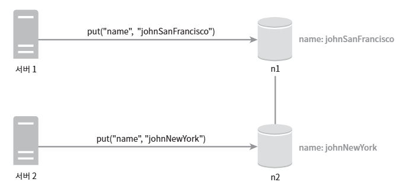

- 서버 1은 "name"에 매달린 값은 "johnSanFrancisco"로 바꾸고, 서버 2는 "johnNewYork"으로 바꾼다고 가정하고, 이 두연산은 동시에 이뤄짐

- 이제 충돌(conflict)하는 두 값을 갖게 되었으며 각각 버전은 v1, v2

변경이 끝난 옛날 값이어서 이 변경이 이루어진 이후에, 원래 값은 무시 간으

하지만 마지막 두 버전 v2과 v2사이의 충돌은 해소하기 어렵

이 문제를 해결하려면, 충돌을 발견하고 자동으로 해결해 낼 버저닝 시스템이 필요

=> 벡터 시계(vector clock)는 이런 문제를 푸는데 보편적으로 사용되는 기술

**[백터 시계 동작 원리]**
> 벡터 시계는 [서버, 버전]의 순서쌍을 데이터에 매단 것

> 어떤 버전이 선행 버전인지, 후행 버전인지, 아니면 다른 버전과 충돌이 있는지 판별하는데 사용

벡터 시계는 D([S1, v1], [S2, v2], ..., [Sn, vn])와 같이 표현한다고 가정

여기서 D는 데이터, vi는 버전 카운터, Si는 서버 번호

만들 데이터 D를 서버 Si에 기록하면, 시스템은 아래 작업 가운데 하나를 수행

- [Si, vi]가 있으면 vi를 증가시킨다.

- 그렇지 않으면 새 항목 [Si, 1]를 만든다.

**[벡터 시계 로직 수행 과정]**

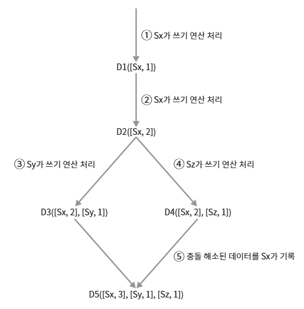

1. 클라이언트가 데이터 D1을 시스템에 기록한다. 이 쓰기 연산을 처리한 서버는 Sx이다. 따라서 벡터 시계는 D1([Sx, 1])으로 변한다.

2. 다른 클라이언트가 데이터 D1을 읽고 D2로 업데이트한 다음 기록한다. D2는 D1에 대한 변경이므로 D1을 덮어쓴다. 이떄 쓰기 연산은 같은 서버 Sx가 처리한다고 가정하자. 벡터 시계는 D2([Sx, 2])로 바뀔 것이다.

3. 다른 클라이언트가 D2를 읽어 D3로 갱신한 다음 기록한다. 이 쓰기 연산은 Sy가 처리한다고 가정하자. 벡터 시계 상태는 D3([Sx, 2], [Sy, 1])로 바뀐다.

4. 또 다른 클라이언트가 D2를 읽고 D4로 갱신한 다음 기록한다. 이때 쓰기 연산은 서버 Sz가 처리한다고 가정하자. 벡터 시계는 D4([Sx, 2], [Sz, 1])일 것이다.

5. 어떤 클라이언트가 D3과 D4를 읽으면 데이터 간 충돌이 있다는 것을 알게된다. D2를 Sy와 Sz가 각기 다른 값으로 바꾸었기 때문이다. 이 충돌은 클라이언트가 해소한 후에 서버에 기록한다. 이 쓰기 연산을 처리한 서버는 Sx였다고 하자. 벡터 시계는 D5([Sx, 3], [Sy, 1], [Sz, 1])로 바뀐다. 

 

벡터 시계를 사용하면 어떤 버전 X가 버전 Y의 이전 버전인지 쉽게 판단 가능

버전 Y에 포함된 모든 구성요소의 값이 X에 포함된 모든 구성요소 값보다 같거나 큰지만 확인

- 예: 벡터 시계 D([s0, 1], [s1, 1]은 D([s0, 1], [s1, 2])의 이전 버전. 따라서 두 데이터 사이에 충돌 X

어떤 버전 X와 Y사이에 충돌이 있는지 보려면, Y의 벡터 시계 구성요소 가운데 X의 벡터 시계 동일 서버 구성요소보다 작은 값을 갖는 것이 있는지 확인

 -예: D([s0, 1], [s1, 2]와 D([s0, 2], [s1, 1])는 서로 충돌

 **[벡터 시계를 사용해 충돌을 감지하고 해소하는 방법에는 두 가지 단점 존재]**
 1. 충돌 감지 및 해소 로직이 클라이언트에 들어가야 하므로, 클라이언트 구현이 복잡해진다.

 2. [서버: 버전]의 순서쌍 개수가 굉장히 빨리 늘어난다.
 
    이 문제를 해결하려면 그 길이에 어떤 임계치(threshold)를 설정하고, 임계치 이상으로 길이가 길어지면 오래된 순서쌍을 벡터 시계에서 제거하도록 해야함

    그러나 이렇게 하면 버전 간 선후 관계가 정확하게 결정될 수 없기 떄문에 충돌 해고 과정의 효율성이 낮아지게 됨

#### 장애 처리
> 대다수 대규모 시스템에서 장애는 그저 불가치하기만 한 것이 아니라 아주 흔하게 벌어지는 사건

#### 장애 감지
> 분산 시스템에서는 그저 한 대 서버가 "지금 서버 A가 죽었습니다."라고 한다해서 바로 서버 A를 장애처리 하지 X

> 보통 두 대 이상의 서버가 똑같이 서버 A의 장애를 보고해야 해당 서버에 실제로 장애가 발생했다고 간주

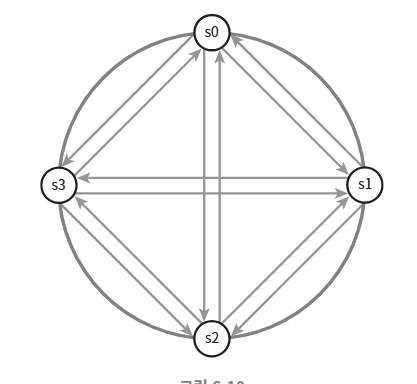

- 그림과 같이 모든 노드 사이에 멀티캐스팅(multicasting) 채널을 구축하는 것이 서버 장애를 감지하는 가장 손쉬운 방법

- 하지만 이 방법은 서버가 많을 때는 비효율적

- 가십 프로토콜(goship protocol)같은 분산형 장애 감지(decentralized failure detection) 솔루션을 채택하는 펴이 보다 효율적

**[가십 프로토콜의 동작 원리]**

- 각 노드는 멤버십 목록(membership list)를 유지한다. 멤버십 목록은 각 멤버 ID와 그 박동 카운터(hearbeat counter) 쌍의 목록이다.

- 각 노드는 주기적으로 자신의 박동 카운터를 증가시킨다.

- 각 노드는 무작위로 선정된 노드들에게 주기적으로 자기 박동 카운터 목록을 보낸다.

- 박동 카운터 목록을 받은 노드는 멤버십 목록을 최신 값으로 갱신한다.

- 어떤 멤보의 박동 카운터 값이 지정된 시간 동안 갱신되지 않으면 해당 멤버는 장애(offline) 상태인 것으로 간주한다.

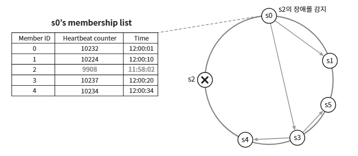

- 노드 s0은 그림 좌흑의 테이블과 같은 멤버십 목록을 가진 상태다.

- 노드 s0은 노드 s2(멤버 ID=2)의 박동 카운터가 오랫동안 증가되지 않았다는 것을 발견하다.

- 노드 s0은 노드 s2를 포함하는 박동 카운터 목록을 무작위로 선택된 다른 노드에게 전달한다.

- 노드 s2의 박동 카운터가 오랫동안 증가되지 않았음을 발견한 모든 노드는 해당 노드를 장애 노드로 표시한다.

#### 일시적 장애 처리
> 가십 프로토콜로 장애를 감지한 시스템은 가용성을 보장하기 위해 필요한 조치를 해야함

- **엄격한 정족수(strict quorum) 접근법**: 읽기와 쓰기 연산을 금지

- **느슨한 정족수(sloppy quorum) 접근법**: 이 조건을 완화하여 가용성을 높임.
 
    정족수 요구사항을 강제하는 대신, 쓰기 연산을 수행할 W개의 건강한 서버와 읽기 연산을 수행할 R개의 건강한 서버를 해시 링에서 고름. 이떄 장애 상태인 서버는 무시

 네트워크가 서버 문제로 장애 상태인 서버로 가는 요청은 다른 서버가 잠시 맡이 처리

 그동한 발생한 변경사항은 해당 서버가 복구되었을 때 일괄 반영하여 데이터 일관성을 보존

 이를 위해 임시로 쓰기 연산을 처리한 서버에는 그에 관한 단서(hint)를 남겨둔

 따라서 이런 장애 처리 방안을 단서 후 임시 위탁(hinted handoff) 기법이라 부름

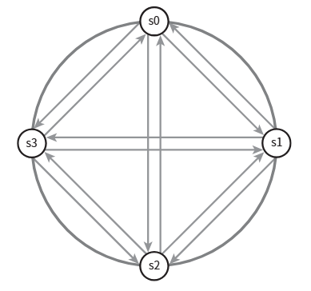

- 장애 상태인 노드 s2에 대한 읽기 및 쓰기 연산은 일시적으로 노드 s3가 처리

- s2가 복구되면, s3은 갱신된 데이터를 s2로 인계할 것

#### 영구 장애 처리
> 단서 후 임시 위탁 기법은 일시적 장애를 처리하기 위한 것

> 영구적인 노드의 장애 상태를 처리하기 위해 반-엔트로피(anti-entropy) 프로토콜을 구현하여 사본들을 동기화

반-엔트로피 프로토콜은 사본들을 비교하여 최신 버전으로 갱신하느나 과정을 포함

사본 간의 일관성이 망가진 상태를 탐지하고 전송 데이터의 양을 줄이기 위해서는 머클(Merkle) 트리를 사용

머클 트리 : 해시 트리(hash tree)라고도 불리며, 각 노드에 그 자식 노드들에 보관된 값의 해시, 또는 자식 노드들의 레이블로부터 계산된 해시값을 레이블로 붙여두는 트리

**[키 공간(key space)이 1부터 12까지일 때 머클 트리를 만드는 예제]**

일관성이 망가진 데이터가 위티한 상자는 다른 색으로 표시

1. 키 공간을 버킷(bucket)으로 나눈다(본 예제의 경우에는 네 개 버킷으로 나누었다).

2. 버킷에 포함된 각각의 키에 균등 분포 해시(uniform hash) 함수를 적용햐여 해시 값을 계산한다.

3. 버킷별로 해시값을 계산한 후, 해당 해시 값을 레이블로 갖는 노드를 만든다.

4. 자식 노드의 레이블로부터 새로운 해시 값을 계산하여, 이진 트리를 상향식으로 구성해 나간다.

이 두 머클 트리의 비교는 루트(root) 노드의 해시값을 비교하는 것으로 시작

루트 노드의 해시 값이 일치한다면 두 서버는 같은 데이터를 갖는 것

그 값이 다른 경우에는 왼쪽 자식 노드의 해시 값을 비교하고, 그 다음으로 오른쪽 자식 노드의 해시 값을 비교

아래쪽으로 탐색해 나가다 보면 다른 데이터를 갖는 버킷을 찾을 수 있으므로, 그 버킷들만 동기화하면 됨

#### 데이터 센터 장애 처리
> 데이터 센터 장애는 정전, 네트워크 장애, 자연재해 등 다양한 이유로 발생 가능

데이터 센터 장애에 대응할 수 있는 시스템을 만들려면 데이터를 여러 데이터 센터에 다중화하는 것이 중요

한 데이터센터가 완전히 망가져도 사용자는 다른 데이터 센터에 보관된 데이터를 이용할 수 있을 것

#### 시스템 아키텍처 다이어그램

**[아키텍처의 주된 기능]**

- 클라이언트는 키-값 저장소가 제공하는 두 가지 단순한 API, 즉 get(key) 및 put(key, value)와 통신한다.

- 중재자(coordinator)는 클라이언트에게 키-값 저장소에 대한 프락시(proxy) 역할을 하는 노드나.

- 노드는 안정 해시(consistent hash)의 해시 링(hash ring) 위에 분포한다.

- 노드를 자동으로 추가 또는 삭제할 수 있도록, 시스템은 완전히 분산된다(decentralized).

- 데이터는 여러 노드에 다중화된다.

- 모든 노드가 같은 책임을 지므로, SPOF(Single Point of Failure)는 존재하지 않는다.

#### 쓰기 경로

**[쓰기 요청이 특정 노드에 전달되면 일어나는 과정]**

기본적으로 카산드라(Cassandra)의 사례를 참고

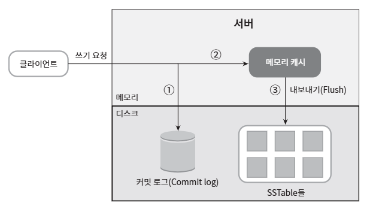

1. 쓰기 요청이 커밋 로그(commit log) 파일에 기록된다.

2. 데이터가 메모리 캐시에 기록된다.

3. 메모리 캐시가 가득차거나 사전에 정의된 어떤 임계치에 도달하면 데이터에는 디스크에 있는 SSTable에 기록된다. SSTable은 Sorted-String Table의 약어로, <키, 값>의 순서쌍을 정렬된 리스트 형태로 관리하는 테이블이다.

#### 읽기 경로
> 읽기 요청을 받은 노드는 데이터가 메모리 캐시에 있는지부터 확인

있는 경우에는 해당 데이터를 클라이언트에게 반환

데이터가 메모리에 없는 경우에는 디스크에서 가져와야 하는데, 어느 SSTable에 찾는 키가 있는지 알아낼 효율적인 방법이 필요

이런 문제를 푸는 데는 블룸 필터(Bloom filter)가 흔히 사용

**[데이터가 메모리에 없을 때 읽기 연산이 처리되는 경로]**

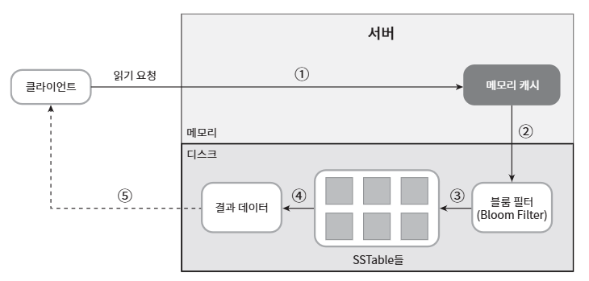

1. 데이터가 메모리에 있는지 검사한다. 없으면 2로 간다.
2. 데이터가 메모리에 없으므로 블룸 필터를 검사한다.
3. 블룸 필터를 통해 어떤 SSTable에 키가 보관되어 있는지 알아낸다.
4. SSTable에서 데이터를 가져온다.
4. 해당 데이터를 클라이언트에게 반환한다.

## 요약

**[분산 키-값 저장소가 가져야 하는 기능과 이용되는 기술]**

| 목표/문제 | 기술 |
|:---|:---|
|대규모 데이터 저장|안정 해시를 사용해 서버들에 부하 분산|
|읽기 연산에 대한 높은 가용성 보장|데이터를 여러 데이터센터에 다중화|
|쓰기 연산에 대한 높은 가용성 보장|버저닝 및 벡터 시계를 사용한 충돌 해소|
|데이터 파티션|안정 해시|
|점진적 규모 확장성|안정 해시|
|다양성(heterogeneity)|안정 해시|
|조절 가능한 데이터 일관성|정족수 합의(quorum consensus)|
|일시적 장애 처리|느슨한 정족수 프로토콜(sloppy quorum)과 단서 후 임시 위탁(hinted handoff)|
|영구적 장애 처리|머클 트리(Merkle tree)|
|데이터 센터 장애 대응|여러 데이터 센터에 걸친 데이터 다중화|