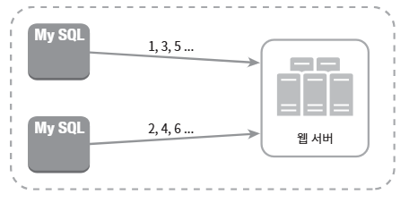
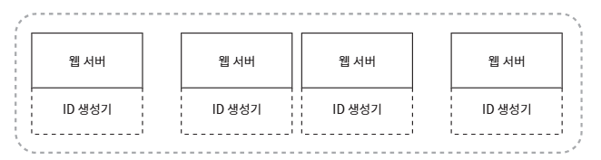
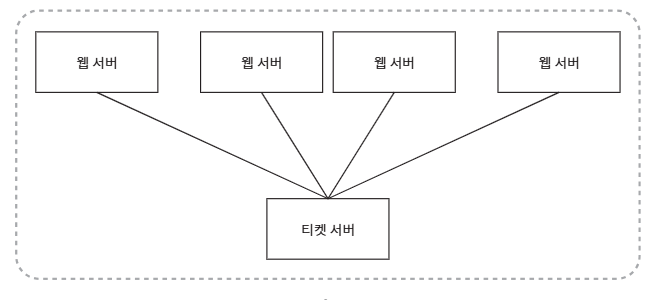
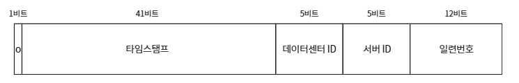
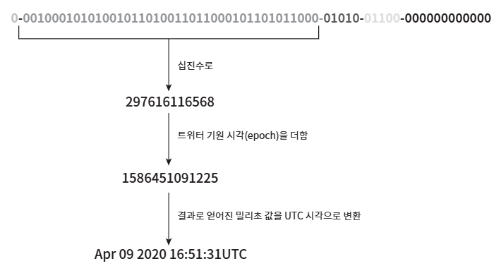

# 분산 시스템을 위한 유일 ID 생성기 설계
> 이번 장에서는 분산 시스템에서 사용될 유일 ID 생성기를 설계해 볼 것

분산 환경에서는 'auto_increment 속성이 설정된 관계형 데이터베이스의 기본 키' 사용이 부적절 

=> 데이터베이스 서버 한 대로는 그 요구를 감당할 수 없을뿐더러, 여러 데이터베이스 서버를 쓰는 경우에는 지연 시간(delay)을 낮추기가 무척 힘들 것이기 때문

## 1단계: 문제 이해 및 설계 범위 확정
> 시스템 설계 면접 문제를 푸는 첫 단계는 적절한 질문을 통해 모호함을 없애고 설계 방향을 정하는 것

**[면접관과 지원자 사이에 오갈 수 있는 질문과 답변]**

    지원자: ID는 어떤 특성을 갖나요?
    면접관: ID는 유일해야 하고, 정렬 가능해야 합니다.
    지원자: 새로운 레코드에 붙일 ID는 항상 1만큼 큰 값이어야 하나요?
    면접관: ID의 값은 시간이 흐름에 따라 커질 테지만 언제나 1씩 증가한다고 할 수는 없습니다. 다만 확실한 것은, 아침에 만든 ID보다는 저녁에 만든 ID가 큰 값을 갖는다는 점입니다.
    지원자: ID는 숫자로만 구성되나요?
    면접관: 그렇습니다.
    지원자: 시스템 규모는 어느 정도입니까?
    면접관: 초당 10,000 ID를 생성할 수 있어야 합니다.

=> 질문을 할 때는 요구사항을 이해하고 모호함을 해소하는 데 초점을 두어야 함

**[위의 문제에 대한 답안이 만족해야 할 요구사항]**

- ID는 유일해야 한다.

- ID는 숫자로만 구성되어야 한다.

- ID는 64비트로 표현될 수 있는 값이어야 한다.

- ID는 발급 날짜에 따라 정렬 가능해야 한다.

- 초당 10,000개의 ID를 만들 수 있어야 한다.

## 2단계: 개략적 설계안 제시 및 동의 구하기
> 분산 시스템에서 유일성이 보장되는 ID를 만드는 방법은 여러 가지

**[살펴볼 선택지]**

- 다중 마스터 복제(multi-master replication)

- UUID(University Unique Identifier)

- 티켓 서버(ticket server)

- 트위터 스노플레이크(twitter snowflake) 접근법

### 다중 마스터 복제
> 데이터베이스의 auto_increment 기능을 활용

**[다중 마스터 복제 구성]**

다음 ID의 값을 구할 때 1만큼 증가시켜 얻는 것이 아니라, k만큼 증가

위의 k는 현재 사용 중인 데이터베이스 서버의 수이고, 

어떤 서버가 만들어낼 다음 아이디는 해당 서버가 생성한 이전 DI 값에 전체 서버의 수 2를 더한 값

=> 이렇게 하면 규모 확장성 문제를 어느 정도 해결할 수 있는데, 데이터베이스 수를 늘리면 초당 생산 가능 ID 수도 늘릴 수 있기 때문. 하지만 단점 발생

**[다중 마스터 복제의 단점]**

- 여러 데이터 센터에 걸쳐 규모를 늘리기 어렵다.

- ID의 유일성은 보장되겠지만 그 값이 시간 흐므에 맞추어 커지도록 보장할 수는 없다.

- 서버를 추가하거나 삭제할 때도 잘 동작하도록 만들기 어렵다.

### UUID
> UUID는 유일성이 보장되는 ID를 만드는 또 하나의 간단한 방법

UUID는 컴퓨터 시스템에 저장되는 정보를 유일하게 식별하기 위한 128비트짜리 수

UUID 값은 충돌 가능성이 낮음

UUID 값은 09c93e62-50b4-46d-bf8a-c07e1040bfb2와 같은 형태

UUID는 서버 간 조율 없이 독립적으로 생성 가능

"중복 UUID가 1개 생길 확률을 50%로 끌어 올리려면 초당 10억 개의 UUID를 100년 동안 계속해서 만들어야 한다." - 위키피디아 인용

**[UUID 시스템 구조]**

=> 이 구조에서 각 웹 서버는 별도의 ID 생성기를 사용해 독립적으로 ID를 만들어 냄

**[장점]**

- UUID를 만드는 것은 단순하다. 서버 사이의 조율이 필요 없으므로 동기화 이슈도 없다.

- 각 서버가 자기가 쓸 ID를 알아서 만드는 구조이므로 규모 확장도 쉽다.

**[단점]**

- ID가 128비트로 길다. 이번 장에서 다루는 무제의 요구사항은 64비트다.

- ID를 시간순으로 정렬할 수 없다.

- ID에 숫자(numeric) 아닌 값이 포함될 수 있다.

### 티켓 서버
> 티켓 서버(ticket server)는 유일성이 보장되는 ID를 만들어 내는 데 쓰일 수 있는 방법

플리커(Flicker)는 분산 기본 키(distributed primary key)를 만들어 내기 위해 이 기술을 이용

**[티켓 서버의 동작]**

=> 핵심은 auto_increment 기능을 갖춘 데이터베이스 서버, 즉 티켓 서버를 중앙 집중형으로 하나만 사용하는 것

**[장점]**

- 유일성이 보장되는 오직 숫자로만 구성된 ID를 쉽게 만들 수 있다.

- 구현하기 쉽고, 중소 규모 애플리케이션에 적합하다.

**[단점]**

- 티켓 서버가 SPOF(Single-Point-of-Failure)가 된다. 이 서버에 장애가 발생하면, 해당 서버를 이용하는 모든 시스템이 영향을 받는다. 이 이슈를 피하려면 티켓 서버를 여러 대 준비해야 한다. 하지만 그렇게 하면 데이터 동기화 같은 새로운 문제가 발생할 것이다.

### 트위터 스노플레이크 접근법  
> 트위터는 스노플레이크(snowflake)라는 독창적인 ID 생성 기법을 사용

ID를 바로 생성하는 대신, 생성해야 하는 ID의 구조를 여러 절로 분할하는 격파 전략(divide and conquer)을 먼저 적용

**[64비트의 구조]**

 

**[각 적의 쓰임새]**

- 사인(sing) 비트: 1비트를 할당한다. 지금으로서는 쓰임새가 없지만 나중을 위해 유보해 둔다. 음수와 양수를 구별하는 데 사용할 수 있을 것이다.

- 타임스탬프(timestamp): 41비트를 할당한다. 기원 시각(epoch) 이후로 몇 밀리초(millisecond)가 경과했는지를 나타내는 값이다. 본 설계안의 경우에는 기원 시각으로 트위터 스노플레이트 구현에서 사용하는 값 1288834974657(Nov 04, 2010, 01:42:54 UTC에 해당)을 이용할 것이다.

- 데이터센터 ID: 5비트를 할당한다. 따라서 25 = 32개 데이터센터를 지원할 수 있다.

- 서버 ID: 5비트를 할당한다. 따라서 데이터센터당 32개 서버를 사용할 수 있다.

- 일련번호: 12비트를 할당한다. 각 서버에서는 ID를 생성할 때마다 이 일련번호를 1만큼 증가시킨다. 이 값은 1밀리초가 경과할 때마다 0으로 초기화(reset) 된다.

## 3단계: 상세 설계

### 타임스탬프
> 타임스탬프는 앞서 살펴본 ID 구조에서 가장 중요한 41비트를 차지하고 있다.

시간이 흐름에 따라 점점 큰 값을 갖게 되므로, ID는 시간 순으로 정렬 가능하게 될 것

**[ID구조를 따르는 값의 이진 표형 형태로부터 UTC 시각을 추출하는 예제]**

이 방법을 역으로 적용하면 어떤 UTC 시각도 상술한 타임스탬프 값으로 변환 가능

41비트로 표현할 수 있는 타임스탬프의 최댓값은 241-1 = 2199023255551 밀리초 (대략 69년)

따라서 이 ID 생성기는 69년동안만 정상 동작하는데, 기원 시각을 현재에 가깝게 맞춰서 오버플로(overflow)가 발생하는 시점을 늦춰 놓은 것

69년이 지나면 기원 시각을 바꾸거나 ID 체계를 다른 곳으로 이전(migration)

### 일련번호
> 일련번호는 12비트이므로, 212 = 4096개의 값을 가질 수 있음

## 4단계: 마무리
유일성이 보장되는 ID 생성기 구현에 씅리 수 있는 다양한 전략(다중 마스터 복제, UUID, 티켓 서버, 트위터 스노플레이크) 방식을 살펴봄

우리가 선택한 방식은 **스노플레이크**인데, 모든 요구사항을 만족하면서도 분산 환경에서 규모 확장이 가능했기 때문

**[설계 진행 후 시간이 남는다면 면접관과 추가로 논의할 사항]**
- **시계 동기화(clock synchronization)**: 이번 설계를 진행하면서 우리는 ID 생성 서버들이 전부 같은 시계를 사용한다고 가정하여싿. 하지만 이런 가정은 하나의 서버가 여러 코어에서 실행될 경우 유요하지 않을 수 있다. 여러 서버가 물리적으로 독립된 여러 장비에서 실행되는 경우에도 마찬가지. NTP(Network Time Protocol)은 이 문제를 해결하는 가장 보편적인 수단이다. 

- **각 절(selection)의 길이 최적화**: 예를 들어 동시성(concurrency)이 낙고 수명이 긴 애플리케이션이라면 일련번호 절의 길이를 줄이고 타임스탬프 절의 길이를 늘리는 것이 효과적일 수도 있을 것이다.

- **고가용성(high availability)**: ID 생성기는 필수 불가결(mission critical) 컴포넌트이므로 아주 높은 가용성을 제공해야 할 것이다.