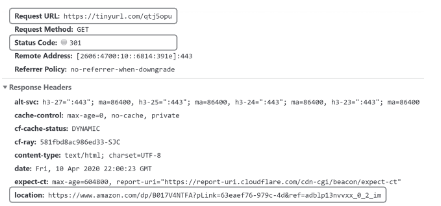
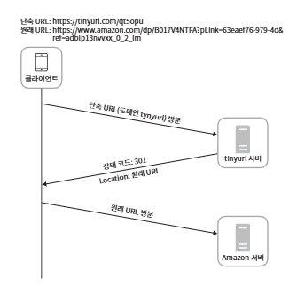
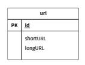
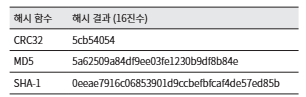
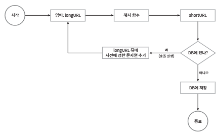
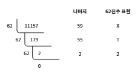
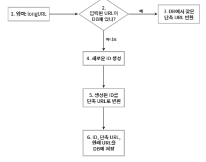
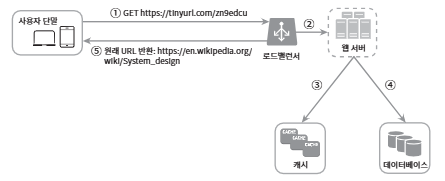

# 08장. URL 단축키 설계

## 1단계: 문제 이해 및 설계 범위 확정

> 시스템 설계 면접 문제는 의도적으로 어떤 정해진 결말을 갖이 않도록 만들어짐

> 면접장에서 시스템을 성공적으로 설계해 내려면 질문을 통해 모호함을 줄이고 요구사항을 알아내야 한다.

    지원자: URL 단축기가 어떻게 동작해야 하는지 예제를 보여주실 수 있을까요?
    
    면접관: https://www.systeminterview.com/q=charsystem&c=loggedin&v=v3&l=long이 입력으로 주여졌다고 해 봅시다. 이 서비스는 https://tinyurl.com/y7ke-ocwj와 같은 간축 URL을 결과로 제공해야 합니다. 이 URL에 접속하면 원래 URL로 갈 수도 있어야 하죠.

    지원자: 트래픽 규모는 어느 정도일까요?
    
    면접관: 매일 1억(100million) 개의 단축 URL을 만들어 낼 수 있어야 합니다.

    지원자: 단축 URL의 길이는 어느 정도여야 하나요?
    
    면접관: 짧으면 짧을수록 좋습니다.
 
    지원자: 단축 URL에 포함될 문자에 제한이 있습니까?
    
    면접관: 단축 URL에는 숫자(0부터 9까지)와 영문자(a부터 z, A부터 Z까지)만 사용할 수 있습니다.

    지원지: 단축된 URL을 시스템에서 지우거나 갱신할 수 있습니까?

    면접관: 시스템을 단순화하기 위해 삭제나 갱신은 할 수 없다고 가정합시다.

 **<시스템의 기본적인 기능>**

 1. URL 단축: 주어진 긴 URL을 훨씬 짧게 줄인다.

 2. URL 리디렉션(redirection): 축약된 URL로 HTTP 요청이 오면 원래 URL로 안내

 3. 높은 가용성과 규모 확장성, 그리고 장애 감내가 요구됨

### 개략적 추정

- 쓰기 연산: 매일 1억 개의 단축 URL 생성

- 초당 쓰기 연산: 1억(100 million) / 24 / 36000 = 1160

- 읽기 연산: 읽기 연산과 쓰기 연산 비율은 10:1 이라고 하면, 읽기 연산은 초당 11,6000회 발생한다. (1160 X 10 = 11,600).

- URL 단축 서버스를 10년간 운영한다고 가정하면 1억(millioin)x365x10 = 3650(365billion)개의 레코드를 보관

- 축약 전 URL의 평균 길이는 100이

- 따라서 10년 동안 필요한 저장 용량은 3650억(365million) x 100바이트 = 36.5TB

## 2단계: 개략적 설계안 제시 및 동의 구하기

### API 엔드포인트

> 클라이언트는 서버가 제공하는 API 엔드포인트를 통해 서버와 통신

**<REST 엔드포인트 설계>**

URL 단축기는 기본적으로 두 개의 엔드포인트 필요

1. URL 단축용 엔드포인트: 새 단축 URL을 생성하고자 하는 클라이언트는 이 엔드포인트에 단축할 URL을 인자로 실어서 POST 요청을 보내야 한다. 이 엔드포인트는 다음과 같은 형태를 띤다.

    POST/api/v1/data/shorten
    
    - 인자: {longUrl: longURLstring}
    - 반환: 단축 URL

2. URL 리디렉션용 엔드포인트: 단축 URL에 대해서 HTTP 요청이 오면 원래 URL로 보내주기 위한 용도의 엔드포인트, 다음과 같은 형태를 띤다.

    GET/api/v1/shortUrl

    - 반호나: HTTP 리디렉션 목적지가 될 원래 URL

**URL 리디렉션**

**<브라우저에 단축 URL을 입력하면 발생하는 일>**

- 단축 URL을 받은 서버는 그 URL을 원래 URL로 바꾸어서 301 응답의 Location 해더에 넣어 반환

**<더 자세한 클라이언트와 서버 사이의 통신 절차>**

**<리디렉션 응답의 차이>**
- 301 Permanently Moved: 이 응답은 해당 URL에 대한 HTTP 요청의 처리 책임이 영구적으로 Location 헤더에 반환된 URL로 이전되었다는 응답이다. 영구적으로 이전되었으므로, 브라우저는 이 응답을 캐스(cache)한다. 따라서 추구 같은 단축 URL에 요청을 보낼 필요가 있을 때 브라우저는 캐시된 원래 URL로 요청을 보내게 된다.

- 302 Found: 이 응답은 주어진 URL로의 요청이 일시적으로 'Location 헤더'가 지정하는 URL에 의해 처리되어야 한다는 응답이다. 따라서 클라이언트의 요청은 언제나 단축 URL 서버에 먼저 보내진 후에 원래 URL로 리디렉션되어야 한다.

=> 이 두 방법은 각기 다른 장단점을 가지고 있음

서버 부하를 줄이는 것이 중요하면 301 Permanent Moved를 사용하는 것이 좋은데 첫 번째 요청만 단축 URL 서버로 전송될 것이기 때문 

하지만 트래픽 분석(analytics)이 중요할 때는 302 Found를 쓰는 쪽이 클리 발생률이나 발생 위치를 추적하는 데 좀 더 유리할 것

- URL 리디렉션을 구현하는 가장 직관적인 방법은 해시 테이블을 사용하는 것

- 해시 테이블에 <단축 URL, 원래 URL>의 쌍을 저장한다고 가정한다면, URL 리디렉션은 다음과 같이 구현

    - 원래 URL = hashTable.get(단축 URL)

    - 301 또는 302 응답 Location 헤더에 원래 URL을 넣은 후 전송

**URL 단축**
단축 URL이 www.tinyurl.com/{hashValue} 같은 형태라고 가정

-> 결국 중요한 것은 긴 URL을 이 해 값으로 대응시킬 해시 함수 fx를 찾는 일

**<해시 함수가 만족해야 할 요구사항>**

- 입력으로 주어지는 긴 URL이 다른 값이면 해시 값도 달라진다.

- 계산된 해시 값은 원래 입력으로 주어졌던 긴 URL로 복원될 수 있어야 한다.

## 3단계: 상세 설계

### 데이터 모델

모든 것을 해시 테이블에 두는 접근법은 초기 전략으로는 괜찮지만 실제 시스템에 쓰기에는 곤란한데, 메모리는 유한한 데다 비싸기 때문

더 나은 방법은 (단축 URL, 원래 URL)의 순서쌍을 관계형 데이터베이스에 저장하는 것

**<간단한 설계 사례>**

- 이 테이블은 단순화 된 것으로(실제 테이블은 이것보다 더 많은 칼럼을 가질 수 있지만 중요한 칼럼만 추린 것), id, shortURL, longURL의 세 개 칼럽을 가짐

### 해시 함수
> 해시 함수(hash function)은 원래 URL을 단축 URL로 변환하는 데 사용

편의상 해시 함수가 계산하는 단축 URL 값을 hashValue라고 지칭

**해시 값 길이**
> hashValue는 [0-9, a-z, A-Z]의 문자들로 구성되므로 사용할 수 있는 문자의 개수는 10 + 26 + 26 = 62개

hashValue의 길이를 정하기 위해서는 622 >= 3650억 (365billion)인 n의 최솟값을 찾아야 함

개략적으로 계산했던 추정치에 따르던 이 시스템은 3650억 개의 URL 생성 가능

**<hashValue의 길이와, 해시 함수가 만들 수 있는 URL의 개수 사이의 관계>**

|n|URL 개수|
|:---|:---|
|1|621 = 62|
|2|622 = 3,844|
|3|623 = 238,328|
|4|624 = 14,776,336|
|5|625 = 916,132,832|
|6|626 = 56,800,326,584|
|7|627 = 3,521,614,606,208 = ~3.5조(trillion)|
|8|628 = 218,340,105,537,896|

- n=7이면 3.5조 개의 URL을 만들 수 있으므로 요구사항을 만족 시키기 충분한 값

- 따라서 hashValue의 길이는 7

**<해시 함수 구현에 쓰일 기술>**

- 해시 후 충돌 해소

- base-62 변환

**해시 후 충돌 해소**

긴 URL을 줄이려면, 원래 URL을 7글자 문자열로 줄이는 해시 함수 필요

손쉬운 방법은 CRC32, MD5, SHA-1같이 잘 알려진 해시 함수를 이용

**<이들 함수를 사용하여 https://en.wikipedia.org/wiki/Systems_design을 축약한 결과>**

- CRC32가 계산한 가장 짧은 해시값조차도 7보다는 길음

    - 해결 방법: 계산된 해시 값에서 7개 글자만 이용

         하지만 이렇게 하면 해시 결과가 서로 충돌할 확률이 높아짐

         충돌이 실제로 발생했을 때는, 충돌이 해소될 때까지 사전에 정한 문자열을 해시 값에 덧붙임

         **<절차>**

         

         - 이 방법을 쓰면 충돌은 해소할 수 있지만 단축 URL을 생성할 때 한 번 이상 데이터베이스 질의를 해야 하므로 오버헤드가 큼

         - 데이터베이스 대신 블룸 필터를 사용하면 성능을 높일 수 있음

         - 블룸 필터는 어떤 집합에 특정 언소가 있는지 검사할 수 있도록 하는, 확률론에 기초한 공간 효율이 좋은 기술

**base-62 변환**

진법 변환(base conversion)은 URL 단축기를 구현할 떄 흔히 사용되는 접근법 중 하나

이 기법은 수의 표현 방식이 다른 두 시스템이 같은 수를 공유하여야 하는 경우에 유용

62진법을 쓰는 이유는 hashValue에 사용할 수 있는 문자(charactoer) 개수기 62개이기 때문

**<10진수로 11157, 즉 11157{10}을 62진수(62진법을 따르는 수)로 변환>**

- 62진법은 수를 표한하기 위해 62개의 문자를 사용하는 진법

  따라서 62진법에서 'a'는 1010을 나타내고, 'Z'는 6110을 나타냄

- $$11157_{10} = 2 x 62^2 + 55 x 62^1 + 59 x 62^0 = [2, 55, 59] => [2, T, X] => 2TX_{62}

**<변환 과정 요약>**

- 따라서 단축 URL은 https://tinyurl.com/2TX

**두 접근법 비교**

|해시 후 충돌 해소 전략|base-32 변환|
|:---|:---|
|단축 URL의 길이가 고정됨|단축 URL의 길이가 가변적. ID 값이 커지만 같이 길어짐|
|유일성이 보장되는 ID 생성기가 필요치 않음|유일성 보장 ID 생성기 필요|
|충돌이 가능해서 해소 전략 필요|ID의 유일성이 보장된 후에야 적용 가능한 전략이라 충돌은 아예 불가능|
|ID로부터 단축 URL을 계산하는 방식이 아니라서 다음에 쓸 수 있는 URL을 알아내는 것이 불가능|ID가 1씩 증가하는 값이라고 가정하면 다음에 쓸 수 있는 단축 URL이 무엇인지 쉽게 알아낼 수 있어서 보안상 문제가 될 소지가 있음|

### URL 단축기 상세 설계

> URL 단축기는 시스템의 핵심 컴포넌트이므로, 그 처리 흐름이 논리적으로는 단순해야 하고 기능적으로는 언제나 동작하는 상태로 유지되어야 함

**<62진법 변환 기법을 사용한 설계 흐름 순서도>**

1. 입력으로 긴 URL을 받는다.

2. 데이터베이스에 해당 URL이 있는지 검사한다.

3. 데이터베이스에 있다면 해당 URL에 대한 단축 URL을 만든 적이 있는 것이다. 따라서 데이터베이스에서 해당 단축 URL을 가져와서 클라이언트에게 반환한다.

4. 데이터베이스에 없는 경우에는 해당 URL은 새로 접수된 것이므로 유일한 ID를 생성한다. 이 ID는 데이터베이스의 기본 키로 사용한다.

4. 62진법 변환을 적용, ID를 단축 URL로 만든다.

**<이해를 돕기 위한 예제>**
- 입력된 URL이 http://en.wikipedia.org/wiki/Systems_design 이라고 하자.

- 이 URL에 대해 ID 생성기가 반환한 ID는 200921567938d이다.

- 이 ID를 62진수로 변환하면 zn9edcu를 얻는다.

- 아래 표와 같은 새로운 데이터베이스 레코드를 만든다.

**<표>**
|ID|shortURL|longURL|
|:---|:---|:---|
|2009215674938|zn9wdcu|http://en.wikipedia.org/wiki/Systems_design|

- ID 생성기의 주된 용도는, 단축 URL을 만들 때 사용할 ID를 만드는 것이고, 이 ID는 전역전 유일성(globally unique)이 보장되는 것이어야 함

### URL 리디렉션 상세 설계

**<URL 리디렉션(redirection) 메커니즘의 상세한 설계>**

쓰기보다 읽기를 더 자주하는 시스템이라, <단축 URL, 원래 URL>의 쌍을 캐시에 저장하여 성능을 높임

**<로드밸런서의 동작 흐름>**

1. 사용자가 단축 URL을 클릭한다.

2. 로드밸런서가 해당 클릭으로 발생한 요청을 웹 서버에 전달한다.

3. 단축 URL이 이미 캐시에 있는 경우에는 원래 URL을 바로 꺼내서 클라이언트에게 전달한다.

4. 캐시에 해당 단축 URL이 없는 경우에는 데이터베이스에서 꺼낸다. 데이터베이스에 없다면 아마 사용자가 잘못된 단축 URL을 입력한 경우일 것이다.

5. 데이터베이스에서 꺼낸 URL을 캐시에 넣은 후 사용자에게 반환한다.

## 4단계: 마무리
> 이번 장에서는 URL 단축기의 API, 데이터 모델 해시 함수, URL 단축 및 리디렉션 절차 설계

**<고려해 보면 좋은 것들>**

- 처리율 제한 장치(rate limiter)

- 웹 서버의 규모 확장

- 데이터베이스의 규모 확장

- 데이터 분석 솔루션(analytics)

- 가용성, 데이터 일관성, 안정성

