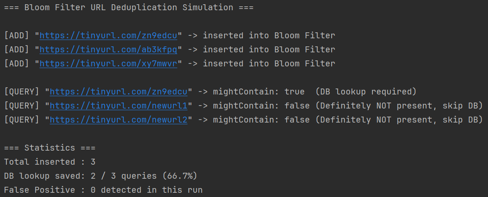

# 블룸 필터(Bloom Filter)의 원리와 실전 적용

**참고 자료:**

> [Burton Howard Bloom, 1970: "Space/Time Trade-offs in Hash Coding with Allowable Errors"]
(https://dl.acm.org/doi/10.1145/362686.362692)

> [Redis Documentation: "Bloom Filter Commands (RedisBloom)"]
(https://redis.io/docs/latest/develop/data-types/probabilistic/bloom-filter/)

> [Google Guava Library: "BloomFilter — API Documentation"]
(https://guava.dev/releases/snapshot/api/docs/com/google/common/hash/BloomFilter.html)

## 1. URL 단축기에서 블룸 필터가 필요한 이유

- **문제 상황**: 

    URL 단축기에서 해시 충돌 해소 전략을 사용할 때, 새로 생성된 단축 URL이 이미 존재하는지 확인하기 위해 **매번 데이터베이스에 질의**해야 함. 

    초당 1,160건의 쓰기 요청이 발생하는 시스템에서 이 오버헤드는 심각한 병목이 됨

- **전통적인 해시셋(HashSet)의 한계**: 

    모든 URL을 메모리에 올려두면 정확하지만, 10년치 3,650억 개 레코드를 메모리에 유지하는 것은 현실적으로 불가능

- **해결책**: 

    확률론 기반의 공간 효율적 자료구조인 블룸 필터(Bloom Filter)를 도입하여 새로 생성된 단축 url이 이미 존재하는지 빠르게 판단

## 2. 블룸 필터의 핵심 원리

비트 배열(Bit Array)과 다수의 해시 함수를 조합하여 집합 멤버십(membership)을 검사하는 확률적 자료구조

**[핵심 특성]**

- **데이터 구조**: 길이 `m`의 비트 배열 + `k`개의 독립적인 해시 함수

- **삽입(Insert)**: 원소를 `k`개의 해시 함수에 통과시켜 나온 `k`개의 인덱스 위치를 모두 `1`로 설정

- **검사(Query)**: `k`개의 인덱스를 모두 확인하여, 하나라도 `0`이면 **확실히 없음(Definitely NOT present)**, 모두 `1`이면 **아마도 있음(Possibly present)**

**[False Positive(오탐)의 발생 원리]**

- 서로 다른 원소들의 해시 인덱스가 우연히 겹치면, 실제로 삽입하지 않은 원소도 "있음"으로 판단될 수 있음

- False Negative(미탐)는 절대 발생하지 않음: 한 번 `1`로 설정된 비트는 지워지지 않으므로, 삽입된 원소는 반드시 "있음"으로 판단됨

**[False Positive 확률 계산식]**

$$P \approx \left(1 - e^{-kn/m}\right)^k$$

- `n`: 삽입된 원소의 수
- `m`: 비트 배열의 크기
- `k`: 해시 함수의 수
- 최적 해시 함수 수: $k = \frac{m}{n} \ln 2$

**[URL 단축기 적용 예시 추정]**

| 파라미터 | 값 |
|:---|:---|
| 예상 원소 수 `n` | 3,650억 개 (10년치) |
| 오탐률 목표 `P` | 1% (0.01) |
| 필요 비트 수 `m` | ≈ 4.4조 bit ≈ **549 GB** |
| 최적 해시 함수 수 `k` | ≈ 7개 |

> HashSet으로 동일 데이터를 저장할 경우 약 36.5 TB가 필요한 것과 비교하면, **약 66배 공간 절약**

## 3. 실전 구현 (Java & BitSet)

비트 배열 연산을 효율적으로 처리하기 위해 Java의 `BitSet` 자료구조 활용

**[BloomFilter 구조]**

- **데이터 구조**: `BitSet bitArray` (비트 배열) + `int[] hashSeeds` (해시 함수 시드 배열)

- **삽입 로직**: URL을 각 시드로 해시하여 나온 인덱스들을 `bitArray`에 `set()`

- **검사 로직**: 동일한 인덱스들을 `get()`하여 하나라도 `false`이면 미존재로 판단

**[핵심 로직 분석]**

- **해시 함수 다양성 확보**: 단일 해시 함수에 서로 다른 시드(seed)를 XOR하여 `k`개의 독립적인 해시 함수를 시뮬레이션

- **검사 조기 종료**: `mightContain()` 메서드는 비트가 `0`인 인덱스를 발견하는 즉시 `false`를 반환하여 불필요한 연산 제거

- **시간 복잡도**: 삽입·검사 모두 O(k) — 해시 함수 수에만 비례하며 저장된 원소 수와 무관

```java
/* [검사] 멤버십 검사: k개의 인덱스 중 하나라도 0이면 확실히 미존재 */
public boolean mightContain(String url) {
    for (int seed : hashSeeds) {
        int index = hash(url, seed);
        if (!bitArray.get(index)) return false; // 하나라도 0이면 확실히 없음
    }
    return true; // 모두 1이면 아마도 있음 (False Positive 가능성 존재)
}
```

## 4. 블룸 필터의 동작 프로세스

URL 단축기의 해시 충돌 해소 흐름에 블룸 필터를 적용한 처리 순서

1. **URL 단축 요청 수신**: 사용자가 긴 URL을 POST 요청으로 전송

2. **블룸 필터 1차 검사**: `mightContain(shortURL)`로 단축 URL 후보를 검사
    - 결과가 `false`이면 → **새로 생성된 URL** → DB 질의 없이 즉시 삽입 가능
    - 결과가 `true`이면 → **충돌 가능성 있음** → DB에 존재 여부 재확인 필요

3. **DB 질의 (필요한 경우만)**: 블룸 필터가 `true`를 반환한 경우에만 DB SELECT 실행

4. **충돌 미발생 확인 시**: 블룸 필터에 해당 URL을 `add()`하고 DB에 삽입

5. **충돌 발생 시**: 사전에 정의된 문자열을 덧붙여 새 후보를 생성하고 2번으로 반복

> 오탐률 1% 설정 기준, **평균적으로 DB 질의 횟수를 99% 감소**시킬 수 있음

## 5. 시뮬레이션 결과

`BloomFilter.java` 실행 시 도출되는 로그 데이터 분석



**[결과 해석]**

- **DB 질의 절감 확인**: 삽입되지 않은 URL에 대해 블룸 필터가 `false`를 반환하여 DB 접근 없이 처리 완료

- **False Negative 없음**: 삽입된 `zn9edcu`는 반드시 `true`를 반환하여 데이터 무결성 유지

- **소규모 테스트의 한계**: 원소 수가 적어 이번 시뮬레이션에서는 False Positive가 관측되지 않았으나, 원소가 늘어날수록 설정된 오탐률 수준에 수렴함

## 6. 성능 및 한계점 검증

정확성과 공간 효율 사이의 트레이드오프 분석

| 비교 항목 | HashSet (정확한 집합) | 블룸 필터 (Bloom Filter) |
|:---|:---|:---|
| **정확도** | 완벽 (오탐 없음) | False Positive 존재 (설정값에 따라 조절) |
| **공간 효율** | 낮음 (원소 전체 저장) | 매우 높음 (비트 배열만 저장) |
| **삭제 지원** | 가능 | 불가 (Counting Bloom Filter로 보완 가능) |
| **시간 복잡도** | O(1) 평균 | O(k) — k는 해시 함수 수 (상수) |
| **적용 사례** | 소규모 캐시 | Cassandra, HBase, Chrome 악성 URL 필터 |

**[블룸 필터의 변형]**

- **Counting Bloom Filter**: 각 비트를 카운터로 대체하여 삭제 연산 지원 (공간 비용 증가)
- **Scalable Bloom Filter**: 원소가 늘어남에 따라 내부 필터를 동적으로 추가하여 오탐률 유지

## 7. 결론

- **공간 효율성**: 수십 TB 수준의 HashSet을 수백 GB 수준의 비트 배열로 대체하여 현실적인 인메모리 운용 가능

- **DB 부하 감소**: False Negative가 없다는 특성으로 인해, 블룸 필터가 `false`를 반환한 경우 DB 질의를 완전히 생략할 수 있어 쓰기 처리량이 대폭 향상됨

- **트레이드오프 명확성**: False Positive 확률은 비트 배열 크기(`m`)와 해시 함수 수(`k`)로 설계 시점에 조절 가능하므로, 시스템 요구사항에 맞게 정확도와 자원 사이의 균형을 명시적으로 결정할 수 있음

<br><br>

#### BloomFilter.java (블룸 필터 구현 코드)

```java
import java.util.BitSet;

/* 블룸 필터(Bloom Filter) 실전 구현 클래스 */
public class BloomFilter {

    // 비트 배열: 멤버십 정보를 저장하는 핵심 자료구조
    private final BitSet bitArray;

    // 해시 함수 시뮬레이션을 위한 시드 배열 (k개의 해시 함수)
    private final int[] hashSeeds;

    // 비트 배열의 크기 (m)
    private final int size;

    public BloomFilter(int size, int[] hashSeeds) {
        this.size = size;
        this.hashSeeds = hashSeeds;
        this.bitArray = new BitSet(size);
    }

    /* 특정 시드를 사용한 해시 인덱스 계산 */
    // 문자열을 돌며 시드를 곱해 정수형태로 압축
    private int hash(String value, int seed) {
        int result = 0;
        for (char c : value.toCharArray()) {
            result = result * seed + c;
        }
        // 음수 방지 후 비트 배열 범위 내로 제한
        return Math.abs(result) % size;
    }

    /* [삽입] 원소 삽입: k개의 해시 함수로 나온 인덱스를 모두 1로 설정 */
    public void add(String url) {
        for (int seed : hashSeeds) {
            int index = hash(url, seed);
            bitArray.set(index);
        }
        System.out.println("[ADD] \"" + url + "\" -> inserted into Bloom Filter");
    }

    /* [검사] 멤버십 검사: k개의 인덱스 중 하나라도 0이면 확실히 미존재 */
    public boolean mightContain(String url) {
        for (int seed : hashSeeds) {
            int index = hash(url, seed);
            if (!bitArray.get(index)) {
                return false; // Definitely NOT present
            }
        }
        return true; // Possibly present (False Positive 가능성 있음)
    }

    /* 테스트 시나리오 */
    public static void main(String[] args) {
        System.out.println("=== Bloom Filter URL Deduplication Simulation ===\n");

        // 비트 배열 크기: 1000, 해시 함수 7개 (시드 배열로 시뮬레이션)
        int[] seeds = {7, 11, 13, 17, 19, 23, 29};
        BloomFilter bf = new BloomFilter(1000, seeds);

        // 1. 단축 URL 후보 삽입
        bf.add("https://tinyurl.com/zn9edcu");
        bf.add("https://tinyurl.com/ab3kfpq");
        bf.add("https://tinyurl.com/xy7mwvr");

        System.out.println();

        // 2. 멤버십 검사
        String[] queries = {
            "https://tinyurl.com/zn9edcu",  // 삽입된 URL
            "https://tinyurl.com/newurl1",  // 삽입되지 않은 URL
            "https://tinyurl.com/newurl2"   // 삽입되지 않은 URL
        };

        int saved = 0;
        int total = queries.length;

        for (String url : queries) {
            boolean result = bf.mightContain(url);
            String verdict = result
                ? "mightContain: true  (DB lookup required)"
                : "mightContain: false (Definitely NOT present, skip DB)";
            System.out.println("[QUERY] \"" + url + "\" -> " + verdict);
            if (!result) saved++;
        }

        // 3. 통계 출력
        System.out.println("\n=== Statistics ===");
        System.out.println("Total inserted : 3");
        System.out.printf("DB lookup saved: %d / %d queries (%.1f%%)%n",
            saved, total, (double) saved / total * 100);
        System.out.println("False Positive : 0 detected in this run");
    }
}
```
