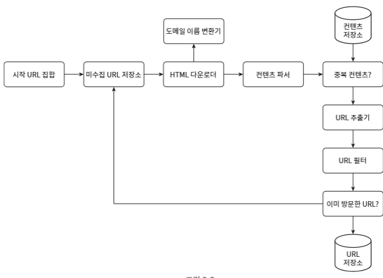
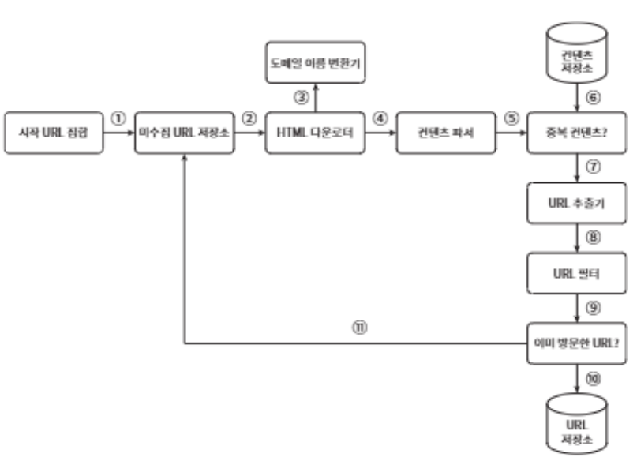
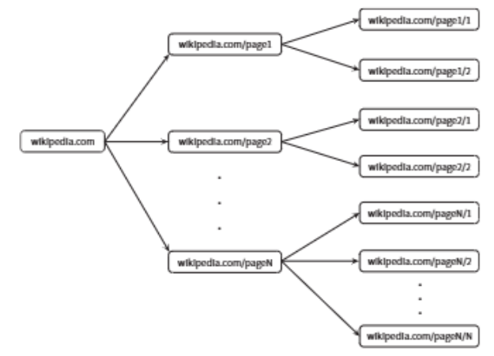
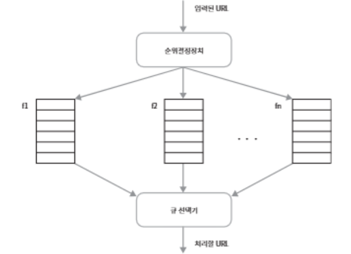

# 09장. 웹 크롤러 설계

> 웹 크롤러: 검색 엔진에서 널리 쓰는 기술로, 웹에 새로 올라오거나 갱신된 콘텐츠를 찾아내는 것이 주된 목적. 로봇(robot) 또는 스파이더(spider)라고 불림

콘텐츠는 웹 페이지일 수도 있고, 이미지나 비디오, 또는 PD 파일일 수도 있음

웹 크롤러는 몇 개 웹 페이지에서 시작하여 그 링크를 따라 나가면서 새로운 콘텐츠를 수집

**<크롤러는 다양하게 이용>**

- **검색 엔진 인덱싱(search engine indexing)**: 크롤러의 가장 보편적인 용례. 

    크롤러는 웹 페이지를 모아 검색 엔진을 위한 로컬 인덱스(local index)를 생성. 

    일례로 Googlebot은 구글(Google) 검색 엔진이 사용하는 웹 크롤러

- **웹 아카이빙(web archiving)**: 나중에 사용할 목적으로 장기보관하기 위해 웹에서 정보를 모으는 절차. 
    
    많은 국립 도서관이 크롤러를 돌려 웹 사이트를 아카이빙. 
    
    대표적으로는 미국 국회 도서관(US Library of Congress), EU 웹 아카이브

- **웹 마이닝(web mining)**: 웹의 폭발적 성장세는 데이터 마이닝(data mining) 업계에 전례 없는 기회

    웹 마이닝을 통해 인터넷에서 유용한 지식을 도출 가능

    일례로, 유명 금융 기업들은 크롤러를 자용해 주주총회 자료나 연차 보고서(annual report)를 다운받아 기업의 핵심 사업 방향을 알아냄

- **웹 모니터링(web monitoring)**: 크롤러를 사용하면 인터넷에서 저작권이나 상표권이 침해되는 사례 모니터링. 

    일례로 디지마크(Digimarc)사는 웹 크롤러를 사용해 해적판 저작물을 찾아내서 보고

웹 크롤러의 복잡도: 웹 크롤러가 처리해야 하는 데이터의 규모에 따라 달라짐

따라서 우선 설계할 웹 크롤러가 감당해야 하는 데이터의 규모와 기능을 조사

## 1단계: 문제 이해 및 설계 범위 확정

**<웹 크롤러의 기본 알고리즘>**

1. URL 집합이 입력으로 주어지면, 해당 URL들이 가리키는 모든 웹 페이지를 다운로드한다.

2. 다운받은 웹 페이지에서 URL들을 추출한다.

3. 추출된 URL들을 다운로드할 URL 목록에 추가하고 위의 과정을 처음부터 반복한다.

=> 웹 크롤러가 이처럼 단순하게 동작하지는 않으므로, 설계를 진행하기 전에 질문을 던져서 요구사항을 알아내고 설계 범위 좁히기

    지원자: 이 크롤러의 주된 용도는 무엇인가요? 검색 엔진 인덱스 생성용인가요? 아니면 데이터 마이닝? 아니면 그 외의 다른 용도가 있나요?

    면접관: 검색 엔진 인덱싱에 쓰일 것입니다.
    
    지원자: 매달 얼마나 많은 웹 페이지를 수집해야 하나요?

    면접관: 10억 개(1billion)의 웹 페이지를 수집해야 합니다.

    지원자: 새로 만들어진 웹 페이지나 수정된 웹 페이지도 고려해야 하나요?

    면접관: 그렇습니다.

    지원자: 수집한 웹 페이지는 저장해야 합니까?

    면접관: 네. 5년간 저장해 두어야 합니다.

    지원자: 중복된 콘텐츠는 어떻게 해야 하나요?

    면접관: 중복된 콘텐츠를 갖는 페이지는 무시해도 됩니다.

=> 면접관과 크롤러 기능 요구사항을 명확히 하는 한편, 좋은 웹 크롤러가 만족시켜야 할 다음과 같은 속성에 주의를 기울이는 것도 바람직

- **규모 확장성**

- **안정성(ronustness)**

- **예절(politeness)**

- **확장성(extensibility)**

### 개략적 규모 추청

아래의 추정치는 많은 가정으로부터 나온 것.
그에 관해 면접관과 합의해 두는 것이 중요

- 매달 10억 개의 웹 페이지를 다운로드한다.

- QPS = 10억(1billion, 즉 1,000,000,000)/30일/24시간/3600초 = 대략 400페이지/초

- 최대(Peak) QPS = 2xQPS = 800

- 웹 페이지의 크기 평균은 500k라고 가정

- 10억 페이지 x 500k = 500TB/월. 

- 1개월치 데이터를 보관하는 데는 500TB, 5년간 보관한다고 가정하면 결국 500TB x 12개월 x 5년 = 30PB의 저장용량이 필요할 것

## 2단계: 개략적 설계안 제시 및 동의 구하기
> 요구사항이 분명해지면 개략적 설계를 진행

**<설계안>**

### 시작 URL 집합
> 시작 URL 집합은 웹 크롤러가 크롤링을 시작하는 출밤점

예: 어떤 대학 웹사이트로부터 찾아 나갈 수 있는 모든 휍 페이지를 크롤링 하는 가장 직관적인 방법은 해당 대학의 도메인 이름이 붙은 모든 페이지의 URL을 시작 URL로 사용

<전체 웹을 크롤링해야 하는 경우>:
1.  크롤러가 가능한 한 많은 링크를 탐색할 수 있도록 하는 URL 선택 - 전체 URL 공간을 작은 부분집합으로 나누는 전략

2. 주제별로 다른 시작 URL을 사용 - 예를 들어 URL 공간을 쇼핑, 스포츠, 건강 등등의 주제별로 세분화하고 그 각각에 다른 시작 URL을 사용

### 미수집 URL 저장소

대부분의 현대적 웹 크롤러는 크롤링 상태를 다음 두 가지로  나눠 관리

1. 다운로드할 URL

2. 다운로드된 URL

    => '다운로드할 URL'을 저장 관리하는 컴포넌트 = 미수집 URL 저장소URL frontier)

### HTML 다운로더
> HTML 다운로더(downloader)는 인터넷에서 웹 페이지를 다운로드하는 컴포넌트

다운로드할 페이지의 URL은 미수집 URL 저장소가 제공

### 도메인 이름 변환기
> 웹 페이지를 다운받으려면 URL을 IP 주소로 변환하는 절차 필요

HTML 다운로더는 도메인 이름 변화기를 사용하여 URL에 대응되는 IP 주소를 알아냄

### 콘텐츠 파서
> 웹 페이지를 다운로드하면 파싱(parsing)과 검증(validation) 절차 필요

이상한 웹 페이지는 문제를 일으킬 수 있는데다 저장공간만 낭비하게 되기 때문

크롤링 서버 안에 콘텐츠 파서를 구현하면 크롤링 과정이 느려지게 될 수 있으므로 독립된 컴포넌트 생성

### 중복 콘텐츠인가?
> 웹에 공개된 연구 결과에 따르면, 29% 가량의 웹 페이지 콘텐츠는 중복이므로 같은 콘텐츠를 여러 번 저장

이를 해결하기 위해, 자료 구조를 도입하여 데이터 중복을 줄이고 데이터 처리에 소요되는 시간을 줄임

두 HTML 문서를 비교하는 방법 : 두 문서를 문자열로 보고 비교하는 것이겠지만, 비교 대상 문서의 수가 10억에 달하는 경우에는 느리고 비효율적이어서 적용하기 곤란할 것. 효과적인 방법은 웹 페이지의 해시 값을 비교하는 것

### 콘텐츠 저장소
> 콘텐츠 저장소는 HTML 문서를 보관하는 시스템

저장소를 구현하는 데 쓰일 기술을 고를 때는 저장할 데이터의 유형, 크기, 저장소 접근 빈도, 데이터의 유효 기간 등을 종합적으로 고려

본 설계안의 경우, 디스크와 메모리를 동시에 사용하는 저장소 선택

- 데이터 양이 너무 많으므로 대부분의 콘텐츠는 디스크에 저장

- 인기 있는 콘텐츠는 메모리에 두어 접근 지연시간을 줄일 것

### URL 추출기
> URL 추출기는 HTML 페이지를 파싱하여 링크들을 골라내는 역할

상대 경로(relative path)는 전부 *http://en/wikipedia.org*를 붙여 절대 경로(absolute path)로 변환

### URL 필터
> URL 필터는 특정한 콘텐츠 타입이나 파일 확장자를 갖는 URL, 접속 시 오류가 발생하는 URL, 접근 제외 목록(deny list)에 포함된 URL 등을 크롤링 대상에서 배제하는 역할

### 이미 방문한 URL?
> 이미 방문한 URL이나 미수집 URL 저장소에 보관된 URL을 추적할 수 있도록 하는 자료 구조를 사용할 것

이미 방문한 적이 있는 URL인지 추적하면 같은 URL을 여러 번 처리하는 일을 방지할 수 있으므로 서버 부하를 줄이고 시스템이 무한 루프에 빠지는 일 방지 

해당 자료구조로는 블룸 필터(bloom filter)나 해시 테이블이 널리 사용

### URL 저장소
> URL 저장소는 이미 방문한 URL을 보관하는 저장소

### 웹 크롤러 작업 흐름

**<작업 흐름의 각 단계를 쉽게 설명하기 위해 일련번호를 붙인 다이어그램>**

1. 시작 URL들을 미수집 URL 저장소에 저장한다.

2. HTML 다운로더는 미수집 URL 저장소에 URL 목록을 가져온다.

3. HTML 다운로더는 도메인 이름 변환기를 사용하여 URL의 IP 주소를 알아내고, 해당 IP 주소로 접속하여 웹 페이지를 다운받는다.

4. 콘텐츠 파서는 다운된 HTML 페이지를 파싱하여 올바른 형식을 갖춘 페이지인지 검증한다.

5. 콘텐츠 파싱과 검증이 끝나면 중복 콘텐츠인지 확인하는 절차를 개시한다.

6. 중복 콘텐츠인지 확인하기 위해서, 해당 페이지가 이미 저장소에 있는지 본다.
    - 이미 저장소에 있는 콘텐츠인 셩우에는 처리하지 않고 버린다.
    - 저장소에 없는 콘텐츠인 경우에는 저장소에 저장한 뒤 URL 추출기로 전달한다.

7. URL 추출기는 해당 HTML 페이지에서 링크를 골라낸다.

8. 골라낸 링크를 URL 필터로 전달한다.

9. 필터링이 끝나고 남은 URL만 중복 URL 판별 단계로 전달한다.

10. 이미 처리한 URL인지 확인하기 위하여, URL 저장소에 보과노딘 URL인지 살핀다. 이미 저장소에 있는 URL은 버린다.

11. 저장소에 없는 URL은 URL 저장소에 저장할 뿐 아니라 미수집 URL 저장소에도 전달한다.

## 3단계: 상세 설계

**<컴포넌트와 구현 기술>**

- DFS(Depth-First Search) vs BFS(Breath-First Search)

- 미수집 URL 저장소

- HTML 다운로더

- 안정성 확보 전략

- 확장성 확보 전략

- 문제 있는 콘텐츠 감지 및 회피 전략

### DFS를 쓸 것인가, BFS를 쓸 것인가

- 웹: 유향 그래프(directed graph)와 동일. 페이지는 노드이고, 하이퍼링크(URL)는 에지(edge)라고 보면됨

- 크롤링 프로세스: 이 유향 그래프를 에지를 따라 탐색하는 과정

DFS, BFS는 이 그래프 탐색에 널리 사용되는 두 가지 알고리즘

DFS(깊이 우선 탐색법, depth-first search)는 그래프 크기가 클 경우 어느 정도로 깊숙이 가게 될지 가늠하기 어려워서 좋은 선택 X

따라서 웹 크롤러는 보통 BFS(너비 우선 탐색, breath-first search)을 사용

BFS는 FIFO(First-In-Fist-Out) 큐를 사용하는 알고리즘. 이 큐의 한쪽으로는 탐색할 URL을 집어넣고 다른 한쩍으로는 꺼내기만 함

**<이 구현법의 문제접>**

- **한 페이지에서 나오는 링크의 상당수는 같은 서버로 되돌아간다.**

    
    
    wikipedia.com 페이지에서 추출한 모드 링크는 내부 링크, 즉 동일한 wikipedia.com 서버의 다른 페이지를 참조하는 링크다.

    결국 크롤러는 같은 호스트에 속한 많은 링크를 다운받느라 바빠지게 되는데, 이때 링크들을 병렬로 처리하게 된다면 위키피디아 서버는 수많은 요청으로 과부하에 걸리게 될 것이다.

    이런 크롤러는 보통 '예의 없는(impdolite)' 크롤러로 간주

- **표준적 BFS 알고리즘은 URL 간에 우선순위를 두지 않는다.**

    처리 순서에 있어 모든 페이지를 공평하게 대우한다는 뜻이다.

    하지만 모든 웹 페이지가 같은 수준의 품질, 같은 수준의 중요성을 갖지는 않는다. 

    페이지 순위(page rank), 사용자 트래픽의 양, 업데이트 빈ㄷ 등 여러 가지 척도에 비추어 처리 우선순위를 구별하는 것이 합당할 것이다.

### 미수집 URL 저장소
> 미수집 URL 저장소를 활용하면 '예의(impolite)'를 갖춘 크롤러, URL 사이의 우선순위와 신선도(freshness)를 구별하는 크롤러 구현 가능

**<미수집 URL 저장소의 구현 방법>**

- **예의**

    웹 크롤러는 수집 대상 서버로 짧은 시간 안에 너무 많은 요청을 보내는 것을 삼가

    예의 바른 크롤러를 만드는 데 있어 지켜야할 한 가지 원칙
    => 동일 웹 사이트에 애해서는 한 번에 한 페이지만 요청한다는 것. 같은 웹 사이트의 페이지를 다운받는 태스크는 시간차를 두고 실행하도록 하면 될 것

    이 요구사항을 만족시키려면 웹사이트의 호스트명(hostname)과 다운로드를 수행하는 작업 스레드(worker thread) 사이의 관계 유지

    즉, 각 다운로드 스레드는 별도 FIFO 큐를 가지고 있어서, 해당 큐에서 꺼낸 URL만 다운로드

    **<설계>**

    - **큐 라우터(queue router)**: 같은 호스트에 속한 URL은 언제나 같은 큐(b1, b2, ..., bn)로 가도록 보장하는 역할을 한다.

    - **매핑 테이블(mapping table)**: 호스트 이름과 큐 사이의 관계를 보관하는 테이블. 위의 표와 같은 형태를 띤다.

    - **FIFO 큐(b1부터 bn까지)**: 같은 호스트에 속한 URL은 언제나 같은 큐에 보관된다.

    - **큐 선택기(queue selector)**: 큐 선택기는 큐들을 순회하면서 큐에서 URL을 꺼내서 해당 큐에서 나온 URL을 다운로드하도록 지정된 작업 스레드에 전달하는 역할을 한다.

    - **작업 스레드(worker thread)**: 작업 스레드는 전달된 URL을 다운로드하는 작업을 수행한다. 전달된 URL은 순차적으로 처리될 것이며, 작업물 사이에는 일정한 지연시간(delay)을 둘 수 있다.

- **우선순위**

    유용성에 따라 URL의 우선순위를 나눌 때는 페이지링크(PageRank), 트래픽 양, 갱신 빈도(update frequency)등 다양한 척도를 사용할 수 있을 것

    본 절에서 설명할 순위결정장치(prioritizer)는 URL 우선순위를 정하는 컴포넌트

    **<URL 우선순위를 고려하여 변경한 설계>**

    

    - 순위결정장치(prioritizer): URL 입력으로 받아 우선순위를 계산한다.

    - 큐(f1, ... fn): 우선순위별로 큐가 하나씩 할당된다. 우선순위가 높으면 선택될 확률도 올라간다.

    - 큐 선택기: 임의 큐에서 처리할 URL을 꺼내는 역할을 담당한다. 순위가 높은 큐에서 더 자주 꺼내도록 프로그램되어 있다.

    위의 그림은 이를 반영할 전체 설계로, 아래의 두 개 모듈이 존재

    - 전면 큐(fron queue): 우선순위 결정 과정을 처리한다.

    - 후면 큐(back queue): 크롤러가 예의 바르게 동작하도록 보증한다.

- **신선도**

웹 페이지는 수시로 추가되고, 삭제되고, 변경되므로 데이터의 신선함(freshness)을 유지하기 위해서는 이미 다운로드한 페이지라고 해도 주기적으로 재수집(rectawl)

모든 URL을 재수집하는 것은 많은 시간과 자원이 필요하므로 다음과 같으 최적화된 작업 존재

- 웹 페이지의 변경 이력(update history) 활용

- 우선순위를 활용하여, 중요한 페이지는 좀 더 자주 재수집

- **미수집 URL 저장소를 위한 지속성 저장장치**

검색 엔진을 위한 크롤러의 경우, 처리해야 하는 URL의 수는 수억 개 이므로 그 모두를 메모리에 보관하는 것은 안정성이나 규모 확장성 측면에서 바람직 X

따라서 대부분의 URL은 디스크에 두지만 IO 비용을 줄이기 위해 메모리 버퍼에 큐를 두는 절충안(hybrid approach)을 선택

버퍼에 있는 데이터는 주기적으로 디스크에 기록

### HTML 다운로더
> HTML 다운로더(downloader)는 HTTP 프로토콜을 통해 웹 페이지를 내려 받음

**Robots.txt**
> 로봇 계의 프로토콜이라고도 불리는 Robots.txt는 웹사이트가 크롤러와 소통하는 표준적인 방법

이 파일에는 크롤러가 수집해도 되는 페이지 목록이 들어있으므로 웹 사이트를 긁어 가기 전에 크롤러는 해당 파일에 나열된 규칙을 먼저 확인

Robots.txt 파일을 거푸 다운로드하는 것을 피하기 위해, 이 파일을 주기적으로 다시 다운받아 캐시에 보관

**성능 최적화**

**<HTML 다운로더에 사용할 수 있는 성능 최적화 기법>**

1. 분산 크롤링
> 성능을 높이기 위해 크롤링 작업을 여러 서버에 분산하는 방법

각 서버는 여러 스레드를 들려 다운로드 작업을 처리

이 구성을 위해 URL 공간은 작은 단위로 분할하여, 각 서버는 그 중 일부의 다운로드를 담당

2. 도메인 이름 변환 결과 예시
> 도멩니 이름 변환기(DNS Resolver)는 크롤러 성능의 병목 중 하나인데, 이는 DNS 요청을 보내고 결과를 받는 작업의 동기적 특성 때문

DNS 요청의 결과를 받기 전까지는 다음 작업 진행 X

DNS 요청이 처리되는 데는 보통 10ms에서 200ms가 소요되고, 크롤러 스레드 가운데 어느 하나라도 이 작업을 하고 있으면 다른 스레드의 DNS 요청은 전부 블록(block)

3. 지역성
> 크롤링 작업을 수행하는 서버를 지역별로 분산하는 방법

크롤링 서버가 크롤링 대상 서버와 지역적으로 가까우면 페이지 다운로드 시간은 줄어들 것

지역성(locality)을 활용하는 전략은 크롤 서버, 캐시, 큐, 저장소 등 대부분의 컴포넌트에 적용 가능

4. 짧은 타임아웃
> 어떤 웹 서버는 응답이 느리거나 아예 응답 하지 않는데, 이런 경우에 최대 얼마나 기다릴지를 미리 정해 두는 것

이 시간 동안 서버가 응답하지 않으면 크롤러는 해당 페이지 다운로드를 중단하고 다음 페이지로 넘어감

**안정성**

**<다운로더 서버들에 부하를 분산할 때 적용 가능한 기술>**

이 기술을 이용하면 다운로더 서버를 쉽게 추가하고 삭제가능

- 크롤링 상태 및 수집 데이터 저장: 장애가 발생한 경우에도 쉽게 복구하도록 크롤링 상태와 수집된 데이터를 지속적 저장장치에 기록

- 예외 처리(exception handling): 대규모 시스템에서 에러(error)는 자주 발생하므로, 예외가 발생해도 전체 시스템이 중단되는 일 없이 작업 진행

- 데이터 검증(data validation): 시스템 오류를 방지하기 위한 중요 수단 가운데 하나

**확장성**
> 시스템을 설계할 때는 새로운 형태의 콘텐츠를 쉽게 지원할 수 있도록 설계

**문제 있는 콘텐츠 감지 및 회피**

1. 중복 콘텐츠

    웹 콘텐츠의 30% 가량은 중복. 해시나 체크성(check-sum)을 사용하면 중복 콘텐츠를 쉽게 탐지 가능

2. 거미 덫

    크롤러를 무한 루프에 빠뜨리도록 설계한 웹페이지

3. 데이터 노이즈

    광고나 스크립트 코드, 스팸 URL 같은 콘텐츠는 거의 가차기 없어 크롤러에게 도움 될 것이 없으므로 가능하다면 제외.

## 4단계: 마무리

**<이번 장에서 다룬 내용>**

- 좋은 크롤러가 갖추어야 하는 특성

    - 규모 확장성(scalability)
    - 확장성(extensibility)
    - 안정성...

- 크롤러의 설계안을 제시하고, 핵심 컴포넌트에 쓰이는 기술

**<추가로 고려해보면 좋은 내용>**

- 서버 측 렌더링(server-side rendering)

- 원치 않는 페이지 필터링

- 데이터베이스 다중화 및 샤딩

- 수평적 규모 확장성(horizontal scalability)

- 가용성, 일관성, 안정성

- 데이터 분석 솔루션(analytics)
