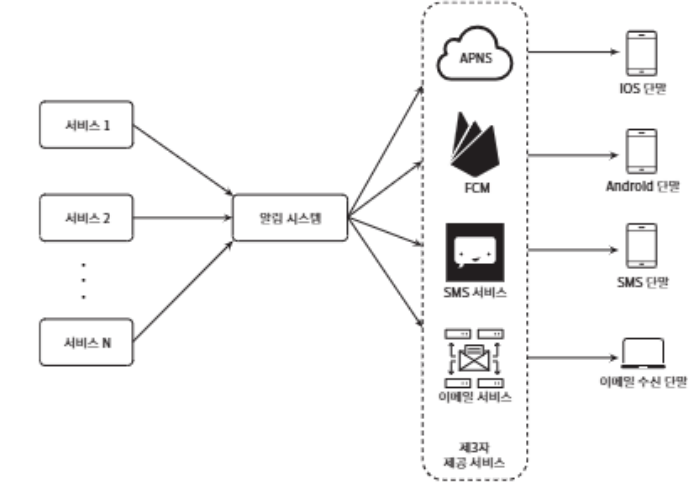
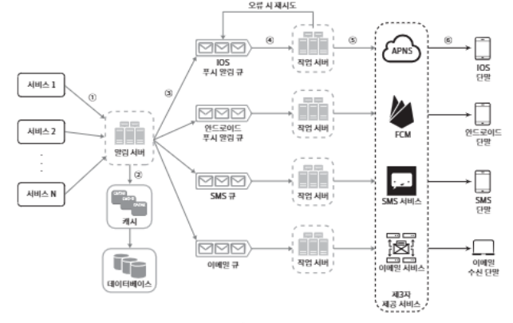
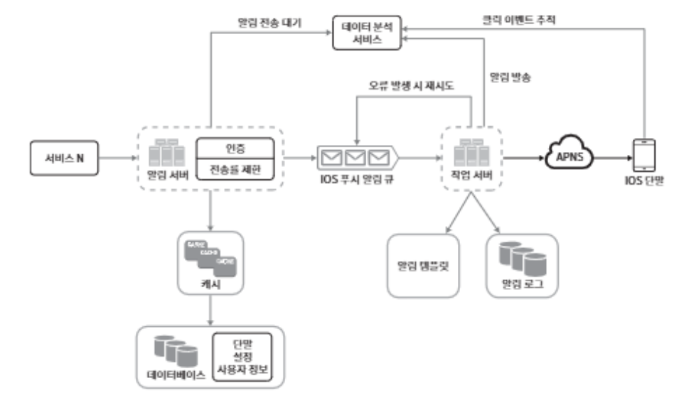

# 알림 시스템 설계

> 알림 시스템(notification system): 최근 많이 프로그램이 채택한 인기 있는 기능이고, 이 기능을 갖춘 애플리케이션 프로그램은 최신 뉴스, 제품 업데이트, 이베니트 선물 등 고객에게 중요할 만한 정보를 지동기적으로 제공


## 1단계: 문제 이해 및 설게 범위 확정

- 하루에 백만 건 이상의 알림을 처리하는 확장성 높은 시스템을 구축하는게 쉬운 과제는 X

- 알림 시스템이 어떻게 구현되는지에 대한 깊은 이해가 필요

## 2단계: 개략적 설계안 제시 및 동의 구하기

> iOS 푸시 알림, 안드로이드 푸시 알림, SMS 메시지, 그리고 이메일을 지원하는 알림 시스템의 개략적 설계안을 살펴볼 예정

- 알림 유형별 지원 방안
- 연락처 정보 수집 절차
- 알림 전송 및 수신 절차

### 알림 유형별 지원 방안

#### iOS 푸시 알림

> iOS에서 푸시 알림을 보내기 위해서는 세 가지 컴포넌트가 필요

- 알림 제공자(provider): 알림 요청(notification request)을 만들어 애플 푸시 알림 서비스(APNS: Apple Push Notification Service)로 보내는 주체. 알림 요청을 만들려면 다음과 같은 데이터가 필요
    - 단말 토큰(device token): 알림 요청을 보내는 데 필요한 고유 식별자
    - 페이로드(payload): 알림 내용을 담은 JSON 딕셔너리(dictionary)
        ```json
        {
            "aps": {
                "alert": {
                    "title": "Game Request",
                    "body": "Bob wants to play chess",
                    "action-loc-key": "PLAY"
                },
                "badge": 5
            }
        }
        ```

- APNS: 애플이 제공하는 원격 서비스. 푸시 알림을 iOS 장치로 보내는 역할.

- iOS 단말(iOS device): 푸시 알림을 수신하는 사용자 단말

#### 안드로이드 푸시 알림

- 안드포이드 푸시 알림도 비슷한 절차로 전송

- APNS 대신 FCM(Firebase Cloud Messaging)을 사용

#### SMS 메시지

- SMS 메시지를 보낼 때는 보통 트윌리오(Twilio), 넥스모(Nexmo) 같은 제 3사업자의 서비스를 많이 이용

- 이런 서비스는 대부분 사용 서비스라서 이용 요금 지불 필요

#### 이메일

- 대부분의 회사는 고유 이메일 서버를 구축할 역량을 보유했음에도, 많은 회사가 상용 이베일 서비스를 이용

- 그중 유명한 서비스로 센드그리드(Sendgrid), 메일침프(Mailchimp)가 있으며, 전송 성공률도 높고 데이터분석 서비스(analyistics)도 제공

### 연락처 정보 수집 절차
> 알림을 보내려면 모바일 단말 토큰, 전화번호, 이메일 주소 등의 정보가 필요

- 사용자가 우리 앱을 설치하거나 처음으로 계정을 등록하면 API 서버는 해당 사용자의 정보를 수집하여 데이터베이스에 저장

(데이터베이스에 연락처 정보를 저장할 테이블 구조)

-> 필수 정보만 담은 개략적인 설계안으로서, 이메일 주소와 전화번호는 user 테이블에 저장하고, 단말 토큰은 device 테이블에 저장. 한 사용자가 여러 단말을 가질 수 있고, 알림은 모든 단말에 전송되어야 한다는 점을 고려

### 알림 전송 및 수신 절차

#### 개략적 설계안 (초안)


- 1부터 N까지의 서비스: 이 서비스 각각은 마이크로서비스(microservice)일 수도 있고, 크론잡(cronjob)일 수도 있고, 분산 시스템 컴포넌트일 수도 있음. 사용자에게 납기일을 알리고자 하는 과금 서비스, 배송 알림을 보내려는 쇼핑몰 웹사이트 드잉 그 예.

- 알림 시스템(notification system): 알림 전송/수신 처리의 핵심. 1개 서버만 사용하는 시스템이라 가정면, 이 시스템은 서비스 1~N에 알림 전송을 위한 API를 제공해야 하고 제 3자 서비스에 전달할 알림 페이로드(payload)를 만들어 낼 수 있어야 함.

- 제3자 서비스(third party services): 이 서비스들은 사용자에게 알림을 실제로 전달하는 역할. 제3자 서비스와의 통합을 진행할 때 유의할 것은 쉽게 새로운 서비스를 통합하거나 기존 서비스를 제거할 수 있어야 하는 '확장성'.

- iOS, 안드로이드, SMS, 이메일 단말: 사용자는 자시 ㅏ단말에서 알림을 수신

**<이 설계에 문제점>**

- SPOF(Single-Point-Of-Failure)
- 규모 확장성
- 성능 병목

#### 개략적 설계안 (계산된 버전)

- 데이터베이스와 캐시를 알림 시스템의 주 서버에서 분리

- 알림 서버를 증설하고 자동으로 수평적 규모 확장이 이루어질 수 있도록 설계

- 메시지 큐를 이용해 시스템 컴포넌트 사이의 강한 결합을 끊음



- 1부터 N까지의 서비스: 알림 시스템 서버의 API를 통해 알림을 보낼 서비스들

- 알림 서버(notification server):
    - 알림 전송 API: 스펨 방지를 위해 보통 사내 서비스 또는 인증된 클라이언트만 이용 가능
    - 알림 검증(validation): 이메일 주소, 전화번호 등에 대한 기본적 검증을 수행
    - 데이터베이스 또는 캐시 질의: 알림에 포함시킬 데이터를 가져오는 기능
    - 알림 전송: 알림 데이터를 메시지 큐에 넣음

<이메일 형태의 알림을 보내는 데 사용하는 API 예제>
*POST https://api.example.com/v/sms/send*

<API 호출 시 전송할 데이터(body)의 사례>
```json
{
    "to": [
        {
            "user_id": 123456
        }
    ],
    "from": {
        "email": "from_address@example.com"
    },
    "subject": "Hello, World!",
    "content": [
        {
            "type": "text/plan",
            "value": "Hello, World!"
        }
    ]
}
```

- 캐시(cache): 사용자 정보, 단말 정보, 알림 템플릿(template) 등을 캐시

- 데이터베이스(DB): 사용자, 알림, 설정 등 다양한 정보 저장

- 메시지 큐(message queue): 시스템 컴포넌트 간 의존성을 제거하기 위해 사용. 다량의 알림이 전송되어야 하는 경우를 대비한 버퍼 역할도 수행

- 3자 서비스 가운데 하나에 장애가 발생해도 다른 종류의 알림은 정상 동작

- 작업 서버(workers): 메시지 큐에서 전송할 알림을 꺼내서 제3자 서비스로 전달하는 역할을 담당하는 서버

- 제3자 서비스(third-party service): 설계 초안을 이야기할 때 이미 설명

- iOS, 안드로이드, SMS, 이메일 단말: 이미 설명

<알림 전송 과정>
1. API를 호출하여 알림 서버로 알림을 보낸다.
2. 알림 서버는 사용자 정보, 단말 토큰, 알림 설정 같은 메타데이터(metadata)를 캐시나 데이터베이스에서 가져온다.
3. 알림 서버는 전송할 알림에 맞는 이벤트를 만들어서 해당 이벤트를 위한 큐에 넣는다. 가령 iOS 푸시 알림 이벤트는 iOS 푸시 알림 큐에 넣어야 한다.
4. 작업 서버는 메시지 큐에서 알림 이벤트를 꺼낸다.
5. 작업 서버는 알림을 제3자 서비스로 보낸다.
6. 제3자 서비스는 사용자 단말로 알림을 전송한다.

## 3단게: 상세 설계

### 안정성
> 분산 환경에서 운영될 알림 시스템을 설계할 때는 안정성을 확보하기 위한 사항 몇 가지는 반드시 고혀

- 데이터 손실 방지
    - 알림 전송 시스템의 가장 중요한 요구사항 가운데 하나는 어떤 상황에서도 알림이 소실되면 안 된다는 것
    - 이 요구사항을 만족하려면 알림 시스템은 알림 데이터를 DB에 보관하고 재시도 매커니즘 구현 필요

- 알림 중복 전송 방지
    - 같은 알림이 여러번 반복되는 것을 완전히 막는 것은 불가능 
    - 중복 전송 빈도를 줄이려면 중복을 탐지하는 매커니즘을 도입하고, 오류를 신중하게 처리
        (간단한 중복 방지 로직의 사례)
        - 보내야 할 알림이 도착하면 그 이벤트 ID를 검사하여 이전에 본 적이 있는 이벤트인지를 살핌. 중복된 이벤트라면 버리고, 그렇지 않으면 알림을 발송 

#### 추가로 필요한 컴포넌트 및 고려사항

- 알림 템플릿

    - 대형 알림 시스템은 하루에도 수백만 건 이상의 알림을 처리하지만, 그 알림 메시지 대부분의 형식이 비슷
    - 알림 템플릿을 사용해 전송될 알림들의 형식을 일관성 있게 유지할 수 있고, 오류 가능성뿐만 아니라 알림 작성에 드는 시간 감소

- 알림 설정

    - 많은 웹사이트와 앱에서는 사용자가 알림 설정을 상세히 조장할 수 있도록 함
    - 이 정보는 알림 설정 테이블에 보관

- 전송률 제한

    - 사용자에게 너무 많은 알림을 보내지 않도록 하기 위해, 한 사용자가 받을 수 있는 알림의 빈도를 제한

- 재시도 방법

    - 제3자 서비스가 알림 전송에 실패하면, 해당 알림을 재시도 큐에 넣음. 같은 문제가 게쏙해서 발생하면 개발자에게 통지(alert)

- 푸시 알림과 보안

    - iOS와 안드로이드 앱의 경우, 알림 전송 API는 appKey와 appSecret을 사용하여 보안을 유지
    - 따라서 인증된(authenticated), 혹은 승은된(verified) 클라이언트만 해당 API를 사용하여 알림 전송 가능

- 큐 모니터링

    - 알림 시스템을 모니터링 할 때 중요한 메트릭 하나는 큐에 쌓인 알림의 개수
    - 이 수가 너무 크면 작업 서버들이 이벤트를 빠르게 처리하고 있지 못하다는 뜻 -> 작업 서버 증설 필요

- 이벤트 추정

    - 알림 확인을 , 클릭을, 실제 앱 사용으로 이어지는 비율 같은 메트릭은 사용자를 이해하는데 중요
    - 데이터 분석 서비스는 보통 이벤트 추적 기능도 제공

#### 수정된 설계안


- 알림 서버에 인증(authentication)r과 전송률 제한(rate-limiting) 기능이 추가

- 전송 실페에 대응하기 위한 재시도 기능 추가. 전송에 실패한 알림은 다시 큐에 넣고 지정된 횟수만큼 재시도

- 전송 템플릿을 사용하여 알림 생성 과정을 단순화하고 알림 내용의 일관성을 유지

- 모니터링과 추적 시스템을 추가하여 시스템 상태를 확인하고 추후 시스템을 개선하기 쉽도록 변경

## 4단계: 마무리
> 알림은 중요 정보를 계속 알려준다는 점에서 필요불가결한 기능

<이번 장의 핵심 주제>

- 안정성(reliability)
- 보안(security)
- 이벤트 추적 및 모니터링
- 사용자 설정
- 전송률 제한
