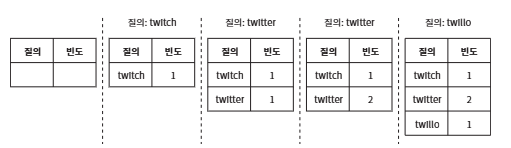

# 13장. 검색어 자동완성 시스템

## 1단계: 문제 이해 및 설계 범위 확정

**자동완성(autocomplete, typeahead, search-as-you=type, incremental search)**: 검색창에 단어를 입력하면 글자에 맞는 검색어가 자동으로 완성되어 표시되는 기능

**<요구사항>**
- 사용자가 입력하는 단어: 자동완성될 검색어의 첫 부분으로 한정

- 자동완성 검색어 표시 개수: 5개

- 자동완성 검색어 개수 선택 기준: 질의 빈도에 따라 정해지는 검색어 인기 순위

- 맞춤법 검사 기능 제공 여부: X. 맞춤법 검사나 자동수정은 지원하지 않음

- 질의 언어: 영어. 시간이 된다면 다국적 지원도 생각

- 대문자나 특수 문자 처리 여부: X. 모든 질의는 영어 소문자로 이루어진다고 가정

- 사용자 지원: 일간 능동 사용자(DAU) 기준으로 천만(10million)명

**<요구사항 정리>**
- 빠른 응답 속도: 100밀리초 이내

- 연관성: 자동완성되어 출력되는 검색어는 사용자가 입력한 단어와 연관된 것

- 정렬: 계산 결과는 인기도 등의 순위 모델에 의해 정렬

- 규모 확장성: 많은 트래픽을 감당할 수 있도록 확장 가능

- 고가용성:일부 장애가 발생하거나, 느려지거나, 예상치 못한 네트워크 문제가 생겨도 시스템은 계속 사용 가능

### 개략적 규모 추정
- 일간 능동 사용자(DAU)는 천만 명으로 가정한다.

- 평균적으로 한 사용자는 매일 10건의 검색을 수행한다고 가정한다.

- 질의할 때마다 평균적으로 20바이트의 데이터를 입력한다고 가정한다.
    - 문자 인코딩 방법으로는 ASCII를 사용한다고 가정할 것이므로, 1문자 = 1바이트이다.

    - 질의문은 평균적으로 4개 단어로 이루어진다고 가정할 것이며, 각 단어는 평균적으로 다섯 글자로 구성된다고 가정할 것이다.

    - 따라서 질의당 평균 4 x 5 = 20바이트이다.

- 검색창에 글자를 입력할 때마다 클라이언트는 검색어 자동완성 백엔드에 요청을 보낸다.

    따라서 평균적으로 1회 검색당 20건의 요청이 백엔드로 전달된다.

    예를 들어 검색창에 dinner라고 입력하면 다음의 6개 요청이 순차적으로 백엔드에 전송된다.

    - search?1=d
    - search?1=di
    - search?1=din
    - search?1=dinn
    - search?1=dinne
    - search?1=dinner

- 대략 초당 24,000건의 질의(QPS)가 발생할 것이다(=10,000,000사용자 x 10질의/일 x 20자/24시간/36000초).

- 최대 QPS = QPS x 2 = 대략 48,000

- 질의 가운데 20% 정도는 신규 검색어라고 가정할 것이다.

    따라서 대략 0.4GB 정도다(=10,000,000사용자 x 10질의 / 일 x 20자 x 20%).

    매일 0.4GB의 신규 데이터가 시스템에 추가된다는 뜻이다.

## 2단계: 개략적 설계안 제시 및 동의 구하기

개략적으로 보면 시스템은 두 부분으로 나뉨

- **데이터 수집 서비스(data gathering service)**: 사용자가 입력한 질의를 실시간으로 수집하는 시스템
    
- **질의 서비스(query service)**: 주어진 질의에 다섯 개의 인기 검색어를 정렬해 내놓는 서비스

### 데이터 수집 서비스

- 질의문과 사용빈도를 저장하는 빈도 테이블(frequency table)이 있다고 기정

- 처음에 이 테이블은 비어 있는데, 사용자가 'twitch', 'twitter', 'twitter', 'twillo'를 순서대로 검색하면 그 상태가 다음과 같이 바뀜


### 질의 서비스

다음 표와 같은 빈도테이블이 있는 상태라 가정하면, 두 개의 필드가 존재

**<빈도 테이블>**
|query|frequency|
|:---|:---|
|twitter|35|
|twitch|29|
|twilight|25|
|twin peak|21|
|twitch prime|18|
|twitter search|14|
|twillo|10|
|twin peak sf|8|

- query: 질의문을 저장하는 필드

- frequency: 질의문이 사용된 빈도를 저장하는 필드

사용자가 "tw"를 검색창에 입력하면 아래의 "top 5" 자동완성 검색어가 표시

|tw|
|:---|
|twitter|
|twitch|
|twilight|
|twin peak|
|twich prime|

가장 많이 사용된 5개 검색어("top 5")는 아래의 SQL 질의문을 사용해 계산

``` 
SELECT * FROM frequency_table
WHERE query Like `prefix%`
ORDER BY frequency DESC
LIMIT 5
```
데이터 양이 적을 때는 괜찮지만 데이터가 많이지면 DB 병목 현상 발생

## 3단계: 상세 설계

**<최적화 순서>**

- 트라이(trie) 자료구조 
- 데이터 수집 서비스
- 질의 서비스
- 규모 확장이 가능한 저장소
- 트라이 연산

### 트라이 자료구조

**트라이**: 문자열들을 간략하게 저장할 수 있는 자료구조. 문자열을 꺼내는 연산에 초점을 맞추어 설계된 자료구조

- 트라이는 트리 형태의 자료구조

- 이 트리의 루트 노드는 빈 문자열

- 각 노드는 글자(character) 하나를 저장하며, 26개(해당 글자 다음에 등장할 수 있는 모든 글자의 개수)의 자식 노드를 가질 수 있음

- 각 트리 노드는 하나의 단어, 또는 접두어 문자열(prefix string)

**<트라이로 검색어 자동완성 구현 방법>**

- *p*: 접두어의 길이

- *n*: 트라이 안에 있는 노드 개수

- *c*: 주어진 노드의 자식 노드 개수

(가장 많이 사용된 질의어 *k*찾는 방법)

- 해당 접두어를 표현하는 노드들 찾기. 시간 복잡도는 *O(p)*

- 해당 노드부터 시작하는 하위 트리를 탐색하여 모든 유효 노드 찾기
    
    유효한 검색 문자열을 구성하는 노드가 유효 노드. 시간 복잡도는 *O(c)*

- 유효 노드들을 정렬하여 가장 인기 있는 검색어 k개 찾기. 시간 복잡도는 *O(clog c)*

*k=2*이고 사용자가 검색창에 'be'을 입력했다고 가정

**<알고리즘 동작 과정>**

1. 접두어 노드 'be'을 찾는다.

2. 해당 노드부터 시작하는 하위 트리를 탐색하여 모든 유효 노드를 찾는다.

    [beer: 10]. [best:35], [bet: 29]가 유효 노드

3. 유효 노드를 정렬하여 2개만 골라낸다.

    [best: 35]와 [bet: 29]가 접두어(즉, 검색어) "tr"에 대해 검색된 2개의 인기 검색어이다.

=> 이 알고리즘의 시간 복잡도는 각 단계에 소요된 시간의 합. 즉, *O(p)* + *O(c)* + *O(clog c)*.

이 알고리즘은 직관적이지만 최악의 경우에는 *k*개 결과를 얻으려고 전체 트라이를 다 검색해야 하는 일 발생 가능

**<해결 방법>**

1. 접두어의 최대 길이를 제한

2. 각 노드에 인기 검색어를 캐시

#### 접두어 최대 길이 제한

- 사용자가 검색창에 긴 검색어를 입력하는 일 거의 X

- 따라서 *p*값은 작은 정숫값(가령 50 같은)이라고 가정해도 안전

- 검색어의 최대 길이를 제한할 수 있다면 "접두어 노드를 찾는" 단계의 시간 복잡도는 *O(p)*에서 *O*(작은 상숫값)=*O*(1)로 바뀔 것

#### 노드에 인기 검색어 캐시

- 각 노드에 *k*개의 인기 검색어를 저장해 두면 전체 트라이를 검색하는 일 방지

- 5~10개 정도의 자동완성 제안을 표시하면 충분하므로, k는 작은 값. 여기서는 5개 질의를 캐시한다고 가정

- 각 노드에 인지 질의어를 캐시하면 'top 5'검색어를 질의하는 시간 복잡도 낮추기 가능

- 각 노드에 질의어를 저장할 공간이 많이 필요하게 된다는 단점 존재. 그러나 빠른 응답속도가 아주 중요할 때는 이 정도 저장공간을 희생할 만한 가치 있음

- 개선된 구조: 각 노드에 가장 인기 있는 검새개어 다섯 가지를 저장하도록 함. 

    예를 들어 접두어 be를 나타내는 노드에는 [best: 35, bet: 29, bee: 20, be: 15, beer: 10]의 다섯 개 검색어를 캐시

**<최적화 기법 적용에 따른 시간 복잡도 변화>**

1. 접두어 노드를 찾는 시간 복잡도는 *O(1)*로 변화

2. 최고 인기 검색어 5개를 찾는 질의의 시간 복잡도도 *O(1)*로 변화. 검색 결과가 이미 캐시되었기 때문

=> 각 단계의 시간 복잡도가 *O*(1)로 바뀐 덕분에, 최고 인기 검색어 k개를 찾는 전체 알고리즘의 복잡도도 *O*(1)로 변화

### 데이터 수집 서비스

**<실시간 데이터 수정 방법의 문제점>**

- 매일 수천만 건의 질의가 입력될 텐데 그때마다 트라이를 갱신하면 질의 서비스는 심각하게 느려질 것

- 일단 트라이가 만들어지고 나면 인기 검색어는 그다지 자주 바뀌지 않을 것. 트라이는 자주 갱신할 필요 X

규모 확장이 쉬운 데이터 수집 서비스를 만들려면 데이터가 어디서 오고 어떻게 이용되는지를 살펴야 함

트위터 같은 실시간 애플리케이션이라면 제안되는 검색어를 항상 신선하게 유지, 하지만 구글 검색 같은 애플리케이션이라면 자주 바꿔줄 필요 X

용례가 달라지더라도 데이터 수집 서비스의 토대는 변화 X -> 트라이를 만드는 데 쓰는 데이터는 보통 데이터 분석 서비스(analytics)나 로깅 서비스(logging service)로부터 올 것이기 때문

**<데이터 분석 서비스의 수정된 설계안>**

**데이터 분석 서비스 로그**

- 로그에는 검색창에 입력된 질의에 관한 원본 데이터가 보관

- 새로운 데이터가 추가될 뿐 수정은 이루어지지 않으며 로그 데이터에는 인덱스를 걸지 X

(로그 파일 예제)

|query|time|
|:---|:---|
|tree|2019-10-01 22:01:01|
|try|2019-10-01 22:01:05|
|tree|2019-10-01 22:01:30|
|toy|2019-10-01 22:02:22|
|tree|2019-10-02 22:02:42|
|try|2019-10-03 22:03:03|

**로그 취합 서버**

- 데이터 분석 서비스로부터 나오는 로그는 보통 그 양이 엄청나고 데이터 형식도 제각각인 경우가 많으므로 이 데이터를 잘 취합하여 우리 시스템이 쉽게 소비할 수 있도록 해야함

- 데이터 취합 방식은 우리 서비스의 용례에 따라 달라질 수도 있음

- 트위터 같은 실시간 애플리케이션의 경우 결과를 빨리 보여주는 것이 중요하므로 데이터 취합 주기를 보다 짧게 가져갈 필교아 있음

**취합된 데이터**

|query|time|frequency|
|:---|:---|:---|
|tree|2019-10-01|12000|
|tree|2019-10-08|15000|
|tree|2019-10-15|9000|
|toy|2019-10-01|8500|
|toy|2019-10-08|6256|
|toy|2019-10-15|8866|

- time: 해당 주가 시작한 날짜

- frequency: 해당 질의가 해당 주에 사용된 횟수의 합

**작업 서버**

- 주기적으로 비동기적 작업(job)을 실행하는 서버 집합

- 트라이 자료구조를 만들고 트라이 데이터베이스에 저장하는 역할

**트라이 캐시**

- 분산 캐시 시스템으로 데이터를 메모리에 유지하여 읽기 연산 성능을 높이는 구실

- 매주 트라이 데이터베이스의 스냅샷을 떠서 갱신

**트라이 데이터베이스**

- 지속성 저장소

(트라이 데이터베이스로 사용할 수 있는 선택지)

1. **문서 저장소**: 새 트라이를 매주 만들 것이므로, 주기적으로 트라이를 직렬화하여 데이터베이스에 저잘 가능

    몽고DB(Mongo DB)같은 문서 저장소를 활용하면 이런 데이터를 편리하게 거장 가능

2. **키-값 저장소**: 트라이는 아래 로직을 적용하면 해시 테이블 형태로 변환 가능

    - 트라이에 보관된 모든 접두어를 해시 테이블 키로 변환

    - 각 트라이 노드에 보관된 모든 데이터를 해시 테이블 값으로 변환

**질의 서비스**

(개략적 설계안의 비효율성을 개선한 새 설계안)

1. 검색 질의가 로드밸런서로 전송된다.

2. 로드밸런서는 해당 질의를 API서버로 보낸다.

3. API 서버는 트라이 캐시에서 데이터를 가져와 해당 요청에 대한 자동완성 검색어 제안 응답을 구성한다.

4. 데이터가 트라이 캐시에 없는 경우에는 데이터를 데이터베이스에서 가져와 캐시에 채운다.

    그래야 다음에 같은 접두어에 대한 질의가 오면 캐시에 보관된 데이터를 사용해 처리 가능

    캐시 미스(cache miss)는 캐시 서버의 메모리가 부족하거나 캐시 서버에 장애가 있어도 발생 가능

    질의 서비스는 빨라야 함

    (최적화 방안)

    - **AJAX 요청(request)**: 웹 애플리케이션의 경우 브라우저는 보통 AJAX 요청을 보내어 자동완성된 검색어 목록을 가져옴

    - **브라우저 캐싱(browser caching)**: 대부분 애플리케이션의 경우 자동완성 검색어 제안 결과는 짧은 시간 안에 자주 바뀌지 않음

        따라서 제안된 검색어들을 브라우저 캐시에 넣어두면 후속 질의의 결과는 해당 캐시에서 바로 가져감

**트라이 연산**

- 트라이는 검색어 자동완선 시스템의 핵심 컴포넌트

(트라이 생성)

트라이를 갱신하는 두 가지 방법

1. 매주 한 번 갱신하는 방법

2. 트라이의 각 노드를 개별적으로 갱신하는 방법

(검색어 연산)

- 혐오성이 짙거나, 폭력적이거나, 성적으로 노골적이거나, 여러 가지로 위험한 질의어를 자도오안성 결과에서 제거헤야 함

- 좋은 방법은 트라이 캐시 앞에 필터 계층(filter layer)을 두고 부적절한 질의어가 반환되지 않도록 하는 것

- 필터 계층을 두면 필터 규직에 따라 검색 결과를 자유롭게 변경 가능

- 데이터베이스에서 해당 검색어를 물리적으로 삭제하는 것은 다음번 업데이트 사이클에 비동기적으로 진행

**저장소 규모 확장**

- 검색어를 보관하기 위해 두 대 서버가 필요하다면 'a'부터 'm'까지 글자로 시작하는 검색어는 첫 번째 서버에 저장하고, 나머지는 두 번째 서버에 저장

- 세 대 서버가 필요하다면 'a'부터 'i'까지는 첫 번째 서버에, 'j'부터 'r'까지는 두 번째 서버에, 나머지는 세 번째 서버에 저장

이 방법을 쓰는 경우 사용 가능한 서버는 최대 26개로 제한되는데, 영어 알파벳에는 26자 밖에 없기 때문

이 이상으로 서버 대수를 늘리려면 샤딩에 쓰고, 두 번째 글자는 두 번째 레벨의 샤딩에 쓰는 것

예를 들어 'a'로 시작하는 검색어를 네 대 서버에 나눠 보관하고 싶다고 가정.

그러면 'aa'부터 'ag'까지는 첫 번째 서버에, 'ah'부터 'an'까지는 두 번째 서버에, 'ao'부터 'au'까지는 세 번째 서버에, 나머지는 네 번째 서버에 보관하면 될 것

=> 이 문제를 해결하기 위해, 과거 질의 데이터의 패던을 분석하여 샤딩하는 방법 제안

## 4단계: 마무리

- 다국어 지원이 가능하도록 확장하려면: 트라이에 유니코드(unicode)데이터를 저장

- 국가별로 인기 검색어 순위가 다르면: 국가별로 다른 트라이를 사용

- 실시간으로 변하는 검색어의 추이를 반영하려면: 새로운 뉴스 이벤트가 생긴다든가 하는 이유로 특정 검색어의 인기가 갑자기 높아질 수 있지만 현 설계안은 그런 검색어를 지원하기에 적합 X

    - 작업 서버가 매주 한 번씩만 돕도록 되어 있어서 시의 적절하게 트라이를 갱신할 수 없음

    - 설사 때맞춰 서버가 실행된다 해도, 트라이를 구성하는 데 너무 많은 시간이 소요

**<도움이 될 만한 몇 가지 아이디어>**

- 샤딩을 통하여 작업 대상 데이터의 양을 줄임

- 순위 모델(ranking model)를 바꾸어 최근 검색어에 보다 높은 가중치를 주도록 함

- 데이터가 스트림 형태로 올 수 있다는 점, 즉 한번에 모든 데이터를 동시에 사용할 수 없을 가능성이 있다는 점을 고려
