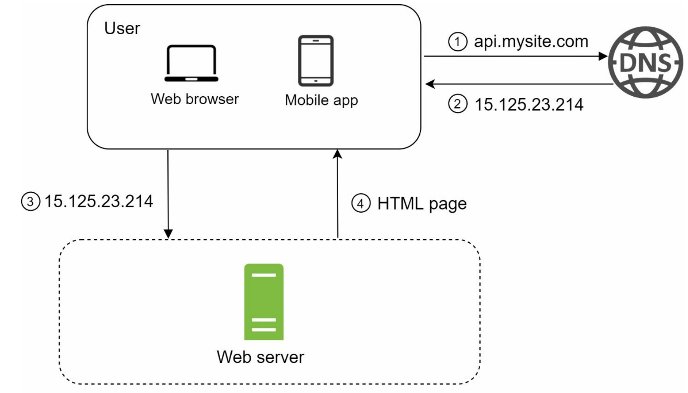

# 1장 사용자 수에 따른 규모 확장성

---

## 단일 서버

---

- 모든 컴포넌트가 단 한대의 서버에서 실행되는 시스템
- 웹, 앱, 데이터베이스, 캐시 등이 전부 서버 한 대에서 실행

### 사용자 요청 처리 과정

---

1. 사용자는 도메인 이름 (api.mysite.com)을 이용하여 웹사이트에 접속한다.
   - 도메인 이름을 도메인 이름 서비스 (DNS)에 질의하여 IP 주소로 변환하는 과정이 필요하다.
   - DNS는 제3 사업자가 제공하는 서비스를 이용하므로 우리 시스템의 일부는 아니다.
2. DNS 조회 결과로 IP 주소가 반환된다. (15.125.23.214)
3. 해당 IP 주소로 HTTP 요청이 전달된다.
4. 요청을 받은 웹 서버는 HTML 페이지나 JSON 형태의 응답을 반환한다.

### 실제 요청이 어디서 오는지

---

실제 요청은 **웹 앱**이나 **모바일 앱**의 두 가지 종류의 단말로부터 온다.

- **웹 애플리케이션**: 비즈니스 로직, 데이터 저장 등을 처리하기 위해서는 서버 구현용 언어 (자바, 파이썬 등)를 사용하고, 프레젠테이션용으로는 클라이언트 구현용 언어 (HTML, 자바스크립트 등)를 사용한다.
- **모바일 앱**: 모바일 앱과 웹 서버 간 통신을 위해서는 HTTP 프로토콜을 이용한다. HTTP 프로토콜을 통해서 반환될 응답 데이터의 포맷으로는 보통 JSON이 쓰인다.

과거에는 서버가 '화면'까지 다 그려서 보내줬기 때문에, 웹과 모바일 서버를 따로 만들거나 모바일 대응이 매우 힘들었다. 웹 서버가 HTML 전체를 생성해서 응답해주었고, 이를 모바일 앱이 받는다면 해석하기 힘들었다. 현재는 REST API를 사용하며 서버가 JSON으로 응답하기 때문에 하나의 서버로 모든 단말에 응답할 수 있게 되었다.

## 데이터베이스

---

사용자가 늘면 서버 하나로는 충분하지 않아서 여러 서버를 두어야 한다.
하나는 웹/모바일 트래픽 처리 용도고, 다른 하나는 데이터베이스용이다.
웹/모바일 트래픽 처리 서버 (웹 계층)과 데이터베이스 서버 (데이터 계층)를 분리하면 각각을 독립적으로 확장해 나갈 수 있다.

### 어떤 데이터베이스를 사용할 것인가?

---

전통적인 관계형 데이터베이스 (relational database)와 비-관계형 데이터베이스 사이에서 고를 수 있다.

- 관계형 데이터베이스
  - 관계형 데이터베이스 관리 시스템 (Relational Database Management System, RDBMS) 라고도 부른다.
  - MySQL, Oracle, PostgreSQL 등이 있다.
  - 자료를 테이블과 열, 칼럼으로 표현한다.
  - SQL을 사용하면 여러 테이블에 있는 데이터를 그 관계에 따라 조인하여 합칠 수 있다.

- 비-관계형 데이터베이서
  - NoSQL이라고도 부른다.
  - CouchDB, Neo4j, Cassandra, HBase, Amamzon DynamoDB 등이 있다.
  - NoSQL의 4가지 종류
    - 키-값 저장소 (key-value store)
    - 그래프 저장소 (graph store)
    - 칼럼 저장소 (column sotre)
    - 문서 저장소 (document store)
  - 일반적으로 조인 연산은 지원하지 않는다.

### 비-관계형 데이터베이스가 바람직한 선택인 경우

- 아주 낮은 응답 지연시간 (latency)이 요구됨
- 다루는 데이터가 비정형 (unstructured)이라 관계형 데이터가 아님
- 데이터 (JSON, YAML, XML 등)를 직렬화하거나 (serialize) 역직렬화 (deserialize) 할 수 있기만 하면 됨
- 아주 많은 양의 데이터를 저장할 필요가 있음

## 수직적 규모 확장 vs 수평적 규모 확장

---

**스케일 업 (scale up)**: 수직적 규모 확장 (vertical scaling) 프로세스는 서버에 고사양 자원 (더 좋은 CPU, 더 많은 RAM 등)을 추가하는 행위를 말한다.

**스케일 아웃 (scale out)**: 수평적 규모 확장 프로세스는 더 많은 서버를 추가하여 성능을 개선하는 행위를 말한다.

### 수직적 규모 확장의 단점

---

서버로 유입되는 트래픽의 양이 적을 때는 수직적 확장이 좋은 선택이며, 이 방법의 가장 큰 장점은 단순함이다.

- 수직적 규모 확장에는 한계가 있다. 한 대의 서버에 CPU나 메모리를 무한대로 증설할 방법은 없다.
- 수직적 규모 확장법은 장애에 대한 자동복구 (failover) 방안이나 다중화 (redundancy) 방안을 제시하지 않는다.
  - 서버에 장애가 발생하면 웹사이트/앱은 완전히 중단된다.

이런 단점 때문에, 대규모 애플리케이션을 지원하는 데는 수평적 규모 확장법이 보다 적절하다.
앞서 본 설계에서 사용자는 웹 서버에 바로 연결된다.

- 웹 서버가 다운 -> 사용자는 웹 서비스에 접속할 수 없음
- 너무 많은 사용자가 접속하여 웹 서버가 한계 상황에 도달 -> 응답 속도가 느려지거나 서버 접속이 불가능

이런 문제를 해결하는 데는 부하 분산기 또는 **로드밸런서**를 도입하는 것이 최선이다.

### 로드밸런서

---

**로드밸런서**: 부하 분산 집합(load balancing set)에 속한 웹 서버들에게 트래픽 부하를 고르게 분산하는 역할을 한다.

- **로드밸런서 동작 방식**
  

- 사용자는 로드밸런서의 Public IP 주소로 접속한다.
  - 웹 서버는 클라이언트의 접속을 직접 처리하지 않는다.
- 더 나은 보안을 위해, 서버 간 통신에는 Private IP 주소가 이용된다.
  - Private IP 주소는 같은 네트워크에 속한 서버 사이의 통신에만 쓰일 수 있는 IP 주소로, 인터넷을 통해서는 접속할 수 없다.

부하 분산 집합에 또 하나의 웹 서버를 추가하고 나면 장애를 자동복구하지 못하는 문제(no failover)는 해소되며, 웹 계층의 가용성(availability)은 향상된다.

- 서버 1이 다운되면 모든 트래픽은 서버 2로 전송된다.
  - 웹 사이트 전체가 다운되는 일이 방지된다.
  - 부하를 나누기 위해 새로운 서버를 추가할 수도 있다.
- 웹사이트로 유입되는 트래픽이 가파르게 증가하면 웹 서버 계층에 더 많은 서버를 추가하기만 하면 된다.
  - 로드밸런서가 자동적으로 트래픽을 분산하기 시작할 것이다.

이제 웹 계층은 괜찮아 보인다. 하지만 현재 설계 안에는 하나의 데이터베이스 서버 뿐이고, 역시 장애의 자동복구나 다중화를 지원하는 구성은 아니다.
**데이터베이스 다중화**는 이런 문제를 해결하는 보편적인 기술이다.

### 데이터베이스 다중화

---

서버 사이에 주(master) - 부(slave) 관계를 설정하고 데이터 원본은 주서버에, 사본은 부 서버에 저장하는 방식이다.
쓰기 연산은 마스터에서만 지원한다. 부 데이터베이스는 주 데이터베이스로부터 그 사본을 전달받으며, 읽기 연산만을 지원한다.
대부분의 애플리케이션은 읽기 연산의 비중이 쓰기 연산보다 훨씬 높다. -> 부 데이터베이스의 수 > 주 데이터베이스의 수

- **데이터베이스 다중화의 장점**
  - 더 나은 성능
    - 모든 데이터 변경 연산은 주 데이터베이스 서버로만 전달
    - 읽기 연산은 부 데이터베이스 서버들로 분산
    - 병렬로 처리될 수 있는 질의(query)의 수가 늘어나므로, 성능은 좋아진다.
  - 안정성(reliability)
    - 자연 재해 등의 이유로 데이터베이스 서버 가운데 일부가 파괴되어도 데이터는 보존될 것이다.
    - 데이터를 지역적으로 떨어진 여러 장소에 다중화시켜 놓을 수 있기 때문이다.
  - 가용성(availability)
    - 데이터를 여러 지역에 복제해 둠 -> 하나의 데이터베이스 서버에 장애가 발생하더라도 다른 서버에 있는 데이터를 가져와 계속 서비스할 수 있게 된다.

- **데이터베이스 서버 가운데 하나가 다운된다면?**
  - 부 서버가 한 대 뿐인데 다운된 경우라면, 읽기 연산은 한시적으로 모두 주 데이터베이스로 전달될 것이다. 또한 즉시 새로운 부 데이터베이스 서버가 장애 서버를 대체할 것이다.
    부 서버가 여러 대인 경우에 읽기 연산은 나머지 부 데이터베이스 서버들로 분산될 것이며, 새로운 부 데이터베이스 서버가 장애 서버를 대체할 것이다.
  - 주 데이터베이스 서버가 다운되면, 한 대의 부 데이터베이스만 있는 경우 해당 부 데이터베이스 서버가 새로운 주 서버가 될 것이며, 모든 데이터베이스 연산은 일시적으로 새로운 주 서버상에서 수행될 것이다. 그리고 새로운 부 서버가 추가될 것이다.
    프로덕션 환경에서는 훨씬 복잡한데, 부 서버에 보관된 데이터가 최신 상태가 아닐 수 있기 때문이다. 없는 데이터는 복구 스크립트(recovery scrip)를 돌려서 추가해야 한다.
    **다중 마스터**나 **원형 다중화** 방식을 도입하면 도움이 될 수 있지만 해당 구성은 훨씬 복잡하다.

- 동작 과정
  - 사용자는 DNS로부터 로드밸런서의 공개 IP 주소를 받는다.
  - 사용자는 해당 IP 주소를 사용해 로드밸런서에 접속한다.
  - HTTP 요청은 서버 1이나 서버 2로 전달된다.
  - 웹 서버는 사용자의 데이터를 부 데이터베이스 서버에서 읽는다.
  - 웹 서버는 데이터 변경 연산은 주 데이터베이스로 전달한다.

이제 웹 계층과 데이터 계층에 대해 충분히 이해하게 되었으니, 응답 시간(latency)를 개선해 볼 순서다. 응답 시간은 캐시(cache)를 붙이고, 정적 콘텐츠를 콘텐츠 전송 네트워크(CDN)로 옮기면 개선할 수 있다.

## 캐시

---

캐시는 값비싼 연산 결과 또는 자주 참조되는 데이터를 메모리 안에 두고, 뒤이은 요청이 보다 빨리 처리될 수 있도록 하는 저장소다.
웹 페이지를 새로고침할 때마다 1번 이상의 데이터베이스 호출이 발생한다.
애플리케이션의 성능은 데이터베이스를 얼마나 자주 호출하느냐에 크게 좌우되는데, 캐시는 그런 문제를 완화할 수 있다.

### 캐시 계층

---

캐시 계층(cache tier)은 데이터가 잠시 보관되는 곳으로 데이터베이스보다 훨씬 빠르다.

- **캐시 계층을 두었을 때의 장점**
  - 성능이 개선된다.
  - 데이터베이스의 부하를 줄일 수 있다.
  - 캐시 계층의 규모를 독립적으로 확장시키는 것도 가능해진다.

- **캐시 우선 읽기 전략 (read-through caching strategy)**
  
  이것 이외에도 다양한 캐시 전략이 있는데, 캐시할 데이터의 종류, 크기, 액세스 패턴에 맞는 캐시 전략을 선택하면 된다.

### 캐시 사용 시 유의할 점

- 캐시는 어떤 상황에 바람직한가?
  - 데이터 갱신은 자주 일어나지 않지만 참조는 빈번하게 일어난다면 고려해볼 만하다.
- 어떤 데이터를 캐시에 두어야 하는가?
  - 캐시는 휘발성 메모리에 두므로, 영속적으로 보관할 데이터를 캐시에 두는 것은 바람직하지 않다.
- 캐시에 보관된 데이터는 어떻게 만료되는가?
  - 만료된 데이터는 캐시에서 삭제되어야 한다. 만료 정책이 없다면 데이터는 캐시에 계속 남게 된다.
  - 만료 기한이 너무 짧으면, 데이터베이스를 너무 자주 조회한다.
  - 만료 기한이 너무 길면, 원본과 차이가 날 가능성이 높아진다.
- 일관성(consistency)은 어떻게 유지되는가?
  - 저장소의 원본을 갱신하는 연산과 캐시를 갱신하는 연산이 단일 트랜잭션으로 처리되지 않는 경우 이 일관성은 깨질 수 있다.
- 장애에는 어떻게 대처할 것인가?
  - 캐시 서버를 한 대만 두는 경우 해당 서버는 단일 장애 지점(Single Point of Failure ,SPOF)이 되어버릴 가능성이 있다. -> 여러 지역에 걸쳐 캐시 서버를 분산시켜야 한다.
  - 단일 장애 지점: 어떤 특정 지점에서의 장애가 전체 시스템의 동작을 중단시켜버릴 수 있는 경우
- 캐시 메모리는 얼마나 크게 잡을 것인가?
  - 너무 작으면 데이터가 너무 자주 캐시에서 밀려나버려 캐시의 성능이 떨어지게 된다.
  - 캐시 메모리를 과할당(overprovision)하는 것이 한 가지 방법이다.
- 데이터 방출(eviction) 정책은 무엇인가?
  - 캐시가 꽉 찼을 때 추가로 캐시에 데이터를 넣어야 할 경우 기존 데이터를 내보내야 한다. 이것을 캐시 데이터 방출 정책이라고 한다.
  - LRU(Least Recently Used) - 마지막으로 사용된 시점이 가장 오래된 데이터를 내보내는 정책
  - LFU(Least Frequently Used) - 사용된 빈도가 가장 낮은 데이터를 내보내는 정책
  - FIFO(First In First Out) - 가장 먼저 캐시에 들어온 데이터를 가장 먼저 내보내는 정책

## 콘텐츠 전송 네트워크 (CDN)

---

정적 콘텐츠를 전송하는 데 쓰이는, 지리적으로 분산된 서버의 네트워크이다.

- 이미지, 비디오, CSS, JavaScript 파일 등을 캐시할 수 있다.

동적 콘텐츠 캐싱은 간단하게 요약하면 요청 경로, 질의 문자열, 쿠키, 요청 헤더 등의 정보에 기반하여 HTML 페이지를 캐시하는 것이다.

### 어떻게 동작하나?

---

- 어떤 사용자가 웹사이트르 방문하면, 그 사용자에게 가장 가까운 CDN 서버가 정적 콘텐츠를 전달한다.
- 사용자가 CDN 서버로부터 멀면 멀수록 웹사이트는 천천히 로드된다.
  

1. 사용자 A가 이미지 URL을 이용해 image.png에 접근한다.
2. CDN 서버의 캐시에 해당 이미지가 없는 경우, 서버는 원본 서버에 요청하여 파일을 가져온다.
3. 원본 서버가 파일을 CDN 서버에 반환한다. 응답의 HTTP 헤더에는 해당 파일이 얼마나 오래 캐시될 수 있는지를 설명하는 TTL(Time-To-Live) 값이 들어 있다.
4. CDN 서버는 파일을 캐시하고 사용자 A에게 반환한다. 이미지는 TTL에 명시된 시간이 끝날 때까지 캐시된다.
5. 사용자 B가 같은 이미지에 대한 요청을 CDN 서버에 전송한다.
6. 만료되지 않은 이미지에 대한 요청은 캐시를 통해 처리된다.

### CDN 사용 시 고려해야 할 사항

---

- **비용**: CDN은 보통 제3 사업자에 의해 운영된다. CDN으로 들어가고 나가는 데이터 전송 양에 따라 요금을 내게 된다. 자주 사용되지 않는 콘텐츠를 캐싱하는 것은 이득이 크지 않으므로, CDN에서 빼는 것을 고려하자.
- **적절한 만료 시한 설정**: 시의성이 중요한(time-sensitive) 콘텐츠의 경우 만료 시점을 잘 정해야 한다. 너무 길면 콘텐츠의 신선도가 떨어지고, 너무 짧으면 원본 서버에 빈번히 접속하게 되어서 좋지 않다.
- **CDN 장애에 대한 대처 방안**: CDN 자체가 죽었을 경우 웹사이트/애플리케이션이 어떻게 동작해야 하는지 고려해야 한다. 일시적으로 CDN이 응답하지 않을 경우, 해당 문제를 감지하여 원본 서버로부터 직접 콘텐츠를 가져오도록 클라이언트를 구성하는 것이 필요할 수도 있다.
- **콘텐츠 무효화(invalidation) 방법**: 아직 만료되지 않은 콘텐츠라 하더라도 아래 방법 가운데 하나를 쓰면 CDN에서 제거할 수 있다. - CDN 서비스 사업자가 제공하는 API를 이용하여 콘텐츠 무효화 - 콘텐츠의 다른 버전을 서비스하도록 오브젝트 버저닝(object versioning) 이용. 콘텐츠의 URL 마지막에 버전 번호를 인자로 주면 된다. image.png?v=2
  
  CDN과 캐시가 추가된 설계이다. 변화된 부분은 다음과 같다.

1. 정적 콘텐츠는 더 이상 웹 서버를 통해 서비스하지 않으며, CDN을 통해 제공하여 더 나은 성능을 보장한다.
2. 캐시가 데이터베이스 부하를 줄여준다.

## 무상태 웹 계층

---

웹 계층을 수평적으로 확장하기 위해서는 상태 정보(사용자 세션 데이터와 같은)를 웹 계층에서 제거하여야 한다.
바람직한 전략은 상태 정보를 관계형 데이터베이스나 NoSQL 같은 지속성 저장소에 보관하고, 필요할 때 가져오도록 하는 것이다. 이렇게 구성된 웹 계층을 무상태 웹 계층이라고 부른다.

### 상태 정보 의존적인 아키텍처

---

상태 정보를 보관하는 서버는 클라이언트 정보, 즉 상태를 유지하여 요청들 사이에 공유되도록 한다.

사용자 A의 세션 정보나 프로필 이미지 같은 상태 정보는 서버 1에 저장된다. 사용자 A를 인증하기 위해 HTTP 요청은 반드시 서버 1로 전송되어야 한다. 요청이 서버 2로 전송되면 서버 2에 사용자 A에 관한 데이터가 없으므로 인증은 실패할 것이다.

- **문제**: 같은 클라이언트로부터의 요청은 항상 같은 서버로 전송되어야 한다.
  - 대부분의 로드밸런서가 이를 지원하기 위해 고정 세션(sticky session)이라는 기능을 제공하고 있는데, 이는 로드밸런서에 부담을 준다.
  - 게다가 로드밸런서 뒷단에 서버를 추가하거나 제거하기도 까다로워진다.
  - 서버의 장애를 처리하기도 복잡해진다.

### 무상태 아키텍처

---

- 이 구조에서 사용자로부터의 HTTP 요청은 어떤 웹 서버로도 전달될 수 있다.
- 웹 서버는 상태 정보가 필요할 경우 공유 저장소(shared storage)로부터 데이터를 가져온다.
- 따라서 상태 정보는 웹 서버로부터 물리적으로 분리되어 있다.
  - 이런 구조는 단순하고, 안정적이며, 규모 확장이 쉽다.

무상태 웹 계층을 갖도록 기존 설계를 변경한 결과다.

공유 저장소는 관계형 데이터베이스, Memcached/Redis, NoSQL 모두 가능하다.
1의 자동 규모 확장(autoscailing)은 트래픽 양에 따라 웹 서버를 자동으로 추가하거나 삭제하는 기능을 뜻한다.

## 데이터 센터

---

가용성을 높이고 전 세계 어디서도 쾌적하게 사용할 수 있도록 하기 위해서는 여러 데이터 센터(data center)를 지원하는 것이 필수다.

두 개의 데이터 센터를 이용하는 사례다.

- 지리적 라우팅(geoDNS-routing or geo-routing): 장애가 없는 상황에서 사용자는 가장 가까운 데이터 센터로 안내된다.
- geoDNS: 사용자의 위치에 따라 도메인 이름을 어떤 IP 주소로 변환할지 결정할 수 있도록 해 주는 DNS 서비스
- 데이터 센터 중 하나에 심각한 장애가 발생하면 모든 트래픽은 장애가 없는 데이터 센터로 전송된다.

### 다중 데이터센터 아키텍처를 만들기 위해 해결해야 할 기술적 난제

---

- **트래픽 우회**: 올바른 데이터 센터로 트래픽을 보내는 효과적인 방법을 찾아야 한다.
  - GeoDNS는 사용자에게서 가장 가까운 데이터센터로 트래픽을 보낼 수 있게 해준다.
- **데이터 동기화(synchronization)**: 데이터 센터마다 별도의 데이터베이스를 사용하고 있는 상황이라면, 장애가 자동으로 복구되어(failover) 트래픽이 다른 데이터베이스로 우회된다 해도, 해당 데이터센터에는 찾는 데이터가 없을 수 있다.
  - 보편적 전략은 데이터를 여러 데이터센터에 걸쳐 다중화하는 것이다. ex) 넷플릭스
- **테스트와 배포(deployment)**: 여러 데이터 센터를 사용하도록 시스템이 구성된 상황이라면 웹 사이트 또는 애플리케이션을 여러 위치에서 테스트해보는 것이 중요하다.
  - 자동화된 배포 도구는 모든 데이터 센터에 동일한 서비스가 설치되도록 하는 데 중요한 역할을 한다.

## 메시지 큐

---

메시지의 무손실(durability, 즉 메시지 큐에 일단 보관된 메시지는 소비자가 꺼낼 때까지 안전히 보관된다는 특성)을 보장하는, 비동기 통신(asynchronous communication)을 지원하는 컴포넌트다.

- 메시지의 버퍼 역할을 하며, 비동기적으로 전송된다.

### 기본 아키텍처

---

- 생산자/발행자(producer/publisher)라고 불리는 입력 서비스가 메시지를 만들어 메시지 큐에 발행(publish)한다.
- 큐에는 보통 소비자/구독자(consumer/subscriber)라 불리는 서비스 혹은 서버가 연결되어 있는데, 메시지를 받아 그에 맞는 동작을 수행하는 역할을 한다.

### 장점

---

- 서비스 또는 서버 간 결합이 느슨해져서, 규모 확장성이 보장되어야 하는 안정적 애플리케이션을 구성하기 좋다.
  - 직접 통신 구조에서는 요청이 몰리면 서버가 터지지만, 메시지 큐만 있으면 일단 큐에 쌓아두고 천천히 처리가 가능해진다.
  - 소비 서버가 한 대로 부족하다면, 소비 서버만 늘려서 해결할 수 있다.
  - 서버끼리 직접 통신하면 상대방 서버의 주소를 알아야 하고 상대가 응답할 때까지 기다려야 한다. -> 큐에 메시지를 던지고 다른 일을 하러 가면, 상대방 서버가 죽어 있어도 메시지는 안전하게 보관된다. 상대방 서버가 살아나면 그때 큐에서 꺼내 처리할 수 있다.
- 생산자는 소비자 프로세스가 다운되어 있어도 메시지를 발행할 수 있고, 소비자는 생산자 서비스가 가용한 상태가 아니더라도 메시지를 수신할 수 있다.

- 웹 서버는 사진 보정 작업을 큐에 넣는다.
- 사진 보정 작업 프로세스들은 이 작업을 메시지 큐에서 꺼내어 비동기적으로 완료한다.
- 생산자와 소비자 서비스의 규모는 각기 독립적으로 확장될 수 있다.
- 큐의 크기가 커지면 -> 작업 프로세스를 추가해야 처리 시간을 줄일 수 있다.
- 큐가 거의 항상 비어 있는 상태라면 -> 작업 프로세스의 수는 줄일 수 있을 것이다.

## 로그, 메트릭 그리고 자동화

---

소규모 웹 사이트를 만들 때는 로그나 메트릭(metric), 자동화(automation) 같은 것들은 꼭 할 필요는 없다. 하지만 웹 사이트와 함께 사업 규모가 커지고 나면, 그런 도구에 필수적으로 투자해야 한다.

- **로그**
  - 에러 로그 모니터링을 통해 시스템의 오류와 문제들을 보다 쉽게 찾아낼 수 있도록 한다.
  - 에러 로그는 서버 단위로 모니터링할 수도 있지만, 로그를 단일 서비스로 모아주는 도구를 활용하면 더 편리하게 검색하고 조회할 수 있다.
- **메트릭**
  - 메트릭을 잘 수집하면 사업 현황에 관한 유용한 정보를 얻을 수도 있고, 시스템의 현재 상태를 손쉽게 파악할 수도 있다.
  - 호스트 단위 메트릭: CPU, 메모리, 디스크 I/O에 관한 메트릭
  - 종합(aggregated) 메트릭: 데이터베이스 계층의 성능, 캐시 계층의 성능 같은 것이 여기 해당한다.
  - 핵심 비즈니스 메트릭: 일별 능동 사용자(daily active user), 수익(revenue), 재방문(retention) 같은 것이 여기 해당한다.
- **자동화**
  - 시스템이 크고 복잡해지면 생산성을 높이기 위해 자동화 도구를 활용해야 한다.
  - 지속적 통합(continuous integration)을 도와주는 도구를 활용하면 개발자가 만드는 어떤 코드가 어떤 검증 절차를 자동으로 거치도록 할 수 있어 문제를 쉽게 감지할 수 있다.
  - 빌드, 테스트, 배포 등의 절차를 자동화할 수 있어 개발 생산성을 크게 향상시킬 수 있다.

### 메시지 큐, 로그, 메트릭, 자동화 등을 반영하여 수정한 설계안

---

1. 메시지 큐는 각 컴포넌트가 보다 느슨히 결합될 수 있도록 하고, 결함에 대한 내성을 높인다.
2. 로그, 모니터링, 메트릭, 자동화 등을 지원하기 위한 장치를 추가했다.

## 데이터베이스의 규모 확장

---

저장할 데이터가 많아지면 데이터베이스에 대한 부하도 증가한다. 데이터베이스를 증설할 방법을 찾아야 한다.

### 수직적 확장

---

스케일 업이라고도 부르는 수직적 규모 확장법은 기존 서버에 더 많은, 또는 고성능의 자원(CPU, RAM, 디스크 등)을 증설하는 방법이다.

- **약점**
  - 데이터베이스 서버 하드웨어에는 한계가 있으므로 CPU, RAM 등을 무한 증설할 수 없다.
  - SPOF(Single Point of Failure)로 인한 위험성이 크다.
  - 비용이 많이 든다. 고성능 서버로 갈수록 가격이 올라가기 마련이다.

### 수평적 확장

---

데이터베이스의 수평적 확장은 샤딩(sharding)이라고도 부르는데, 더 많은 서버를 추가함으로써 성능을 향상시킬 수 있도록 한다.

- 수직적 확장법과 수평적 확장법
  

- **샤딩**: 대규모 데이터베이스를 샤드(shard)라고 부르는 작은 단위로 분할하는 기술을 일컫는다.
  - 모든 샤드는 같은 스키마를 쓰지만 샤드에 보관되는 데이터 사이에는 중복이 없다.

- **사례**
  
  
- 사용자 데이터를 어느 샤드에 넣을지는 사용자 ID에 따라 정해진다.
- 이 사례에서는 `user_id % 4`를 해서 함수로 사용하여 데이터가 보관되는 샤드를 정한다.

- 샤딩 전략 구현에서 고려해야 할 가장 중요한 것은 **샤딩 키(sharding key)를 어떻게 정하느냐** 하는 것이다.
- 샤딩 키는 파티션 키(partition key)라고도 부르는데, 데이터가 어떻게 분산될지 정하는 하나 이상의 칼럼으로 구성된다.
  - 위의 사례에서는 user_id가 샤딩 키이다.
- 샤딩 키를 통해 올바른 데이터베이스에 질의를 보내어 데이터 조회나 변경을 처리하므로 효율을 높일 수 있다.
- 데이터를 고르게 분할 할 수 있도록 샤딩 키를 정해야 한다.

- **샤딩을 도입할 때 생기는 문제**
  - 데이터의 재 샤딩: 데이터가 너무 많아져서 하나의 샤드로는 더 이상 감당하기 어려울 때, 샤드 간 데이터 분포가 균등하지 못하여 어떤 샤드에 할당된 공간 소모가 다른 샤드에 비해 빨리 진행될 때(샤드 소진, shard exhaustion) 필요하다. 샤드 키를 계산하는 함수를 변경하고 데이터를 재배치하여야 한다.
  - 유명인사(celebrity) 문제: 핫스팟 키(hotspot key) 문제라고도 부르는데, 특정 샤드에 질의가 집중되어 서버에 과부하가 걸리는 문제다. 이 문제를 풀려면 유명인사 각각에 샤드 하나씩을 할당해야 할 수도 있고, 심지어는 더 잘게 쪼개야할 수도 있다.
  - 조인과 비정규화(join and de-normalization): 일단 하나의 데이터베이스를 여러 샤드 서버로 쪼개고 나면, 여러 샤드에 걸친 데이터를 조인하기가 힘들어진다. 이를 해결하는 한 가지 방법은 데이터베이스를 비정규화하거나 하나의 테이블에서 질의가 수행될 수 있도록 하는 것이다.

- **데이터베이스 샤딩을 적용한 아키텍처**
  

## 백만 사용자, 그리고 그 이상

---

- 웹 계층은 무상태 계층으로
- 모든 계층에 다중화 도입
- 가능한 한 많은 데이터를 캐시할 것
- 여러 데이터 센터를 지원할 것
- 정적 콘텐츠는 CDN을 통해 서비스할 것
- 데이터 계층은 샤딩을 통해 그 규모를 확장할 것
- 각 계층은 독립적 서비스로 분할할 것
- 시스템을 지속적으로 모니터링하고, 자동화 도구들을 활용할 것
