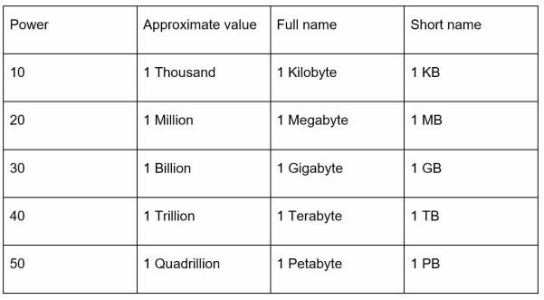
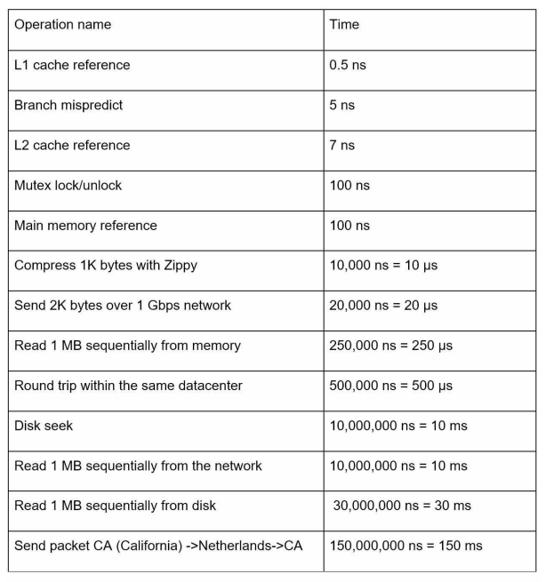
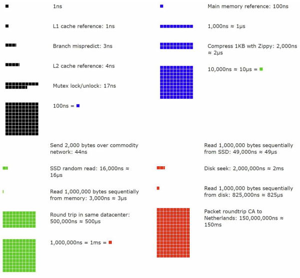
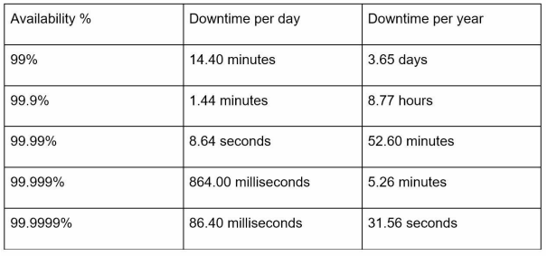

# **2장 개략적인 규모 추정**

**개략적인 규모 추정**: 보편적으로 통용되는 성능 수치상에서 사고 실험을 행하여 추정치를 계산하는 행위로서, 어떤 설계가 요구사항에 부합할 것인지 보기 위한 것
- 무모하게 오버 엔지니어링을 하거나, 반대로 너무 빈약하게 설계해서 시스템이 터지는 것을 방지하기 위한 나침반 역할
- **2의 제곱수**나 **응답지연 값**, **가용성에 관계된 수치들**을 기본적으로 잘 이해하고 있어야 한다.

---
# 2의 제곱수

- 데이터 볼륨(용량)의 단위를 2의 제곱수로 표현하면 어떻게 되는지를 알아야 한다.
- 최소 단위는 1바이트이고, 8비트로 구성된다. (ASCII 문자 하나가 차지하는 메모리 크기가 1Byte)
- 흔히 쓰이는 데이터 볼륨 단위 (2의 제곱 기준)

---
# 모든 프로그래머가 알아야 하는 응답지연 값

- 통상적인 컴퓨터에서 구현된 연산들의 응답지연 값

- 2020년 기준으로 시각화한 수치

### 결론
- 메모리는 빠르지만 디스크는 아직도 느리다
- 디스크 탐색은 가능한 한 피하라
- 단순한 압축 알고리즘은 빠르다
- 데이터를 인터넷으로 전송하기 전에 가능하면 압축하라
- 데이터 센터는 보통 여러 지역(region)에 분산되어 있고, 센터들 간에 데이터를 주고받는 데는 시간이 걸린다.

---
# 가용성에 관계된 수치들

**고가용성**은 시스템이 오랜 시간 동안 지속적으로 중단 없이 운영될 수 있는 능력을 지칭하는 용어다.
- %로 값을 표현 - 100%면 시스템이 단 한 번도 중단된 적이 없었음을 의미한다.

**SLA(Service Level Agreement)** 는 서비스 사업자와 고객 사이에 맺어진 합의를 의미한다.
- 이 합의에는 서비스 사업자가 제공하는 서비스의 가용시간(uptime)이 공식적으로 기술되어 있다.
- 가용시간은 관습적으로 숫자 9를 사용해 표시한다. 9가 많을수록 좋다.
- 아마존, 구글, 마이크로소프트 같은 사업자는 99% 이상의 SLA를 제공한다.
	- 99% 이상의 가용성을 약속하는 SLA
    

---
# 예제: 트위터 QPS와 저장소 요구량 추정

**가정**
- 월간 능동 사용자(monthly active user)는 3억 명이다.
- 50%의 사용자가 트위터를 매일 사용한다.
- 평균적으로 각 사용자는 매일 2건의 트윗을 올린다.
- 미디어를 포함하는 트윗은 10% 정도다.
- 데이터는 5년간 보관된다.

**추정**
QPS(Query Per Second) 추정치
- 일간 능동 사용자(Daily Active User, DAU) = 3억 × 50% = 1.5억
- QPS = 1.5억(DAU) × 2(하루에 올리는 트윗 수) / 24시간 / 3600초 = 약 3500
- 최대 QPS(Peek QPS) = 2 × QPS = 약 7000 (피크 시간 고려해서 QPS의 2배)

미디어 저장을 위한 저장소 요구량
- 평균 트윗 크기
	- tweet_id에 64바이트
	- 텍스트에 140바이트
	- 미디어에 1MB
- 미디어 저장소 요구량: 1.5억 × 2 × 10% × 1MB = 30TB/일
- 5년간 미디어를 보관하기 위한 저장소 요구량: 30TB × 365 × 5 = 약 55PB

---
# 팁

개략적인 규모 추정과 관계된 면접에서 가장 중요한 것은 **문제를 풀어 나가는 절차**다.
- 올바른 절차를 밟느냐가 결과를 내는 것보다 중요하다.

### 근사치를 활용한 계산(rounding and approximation)

- 면접장에서 복잡한 계산에 시간을 쓰는 것은 낭비다. 계산 결과의 정확함을 평가하는 것이 목적이 아니기 때문이다.
- 적절한 근사치를 활용하여 시간을 절약하자.

### 가정(assumption)들은 적어 두라
- DAU, 사용자 행동, 데이터 보관 기간, 읽기/쓰기 비율 등 면접관이 제시하지 않은 것은 가정으로 고정하고 시작한다.
- 나중에 살펴볼 수 있도록 적어 두라.

### 단위(unit)를 붙여라
- 적을 당시에는 단위를 알고 있어도 나중에는 헷갈리게 된다.
- 단위를 붙이는 습관을 들여 모호함을 방지해라.

### 많이 출제되는 문제
- QPS, 최대 QPS, 저장소 요구량, 캐시 요구량, 서버 수 등을 추정하는 것
- 이런 값들을 계산하는 연습을 미리 하도록 하자.

---