# **안정 해시 설계**

- 수평적 규모 확장성을 달성하기 위해서는 요청 또는 데이터를 서버에 균등하게 나누는 것이 중요하다.
- 안정 해시는 이 목표를 달성하기 위해 보편적으로 사용하는 기술이다.
- 하지만 우선 이 해시 기술이 풀려고 하는 문제부터 좀 더 살펴보자.

---

# 해시 키 재배치(rehash) 문제

N개의 캐시 서버가 있다고 하자. 이 서버들에 부하를 균등하게 나누는 보편적 방법은 아래의 해시 함수를 사용하는 것이다.

`serverIndex=hash(key)%N`

- N은 서버의 개수이다. 총 4대의 서버를 사용하는 예제를 살펴보자.

- 특정한 키가 보관된 서버를 알아내기 위해, 나머지(modular) 연산을 f(key) % 4와 같이 적용하였다.
- 예를 들어, `hash(key0)%4=1`이면, 클라이언트는 캐시에 보관된 데이터를 가져오기 위해 서버 1에 접속하여야 한다.
- 아래 그림은 본 예제에서 키 값이 서버에 어떻게 분산되는지 보여준다.

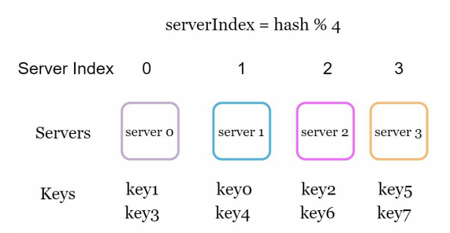

- 이 방법은 서버 풀(server pool)의 크기가 고정되어 있을 때, 그리고 데이터 분포가 균등할 때는 잘 동작한다.
- 하지만 서버가 추가되거나 기존 서버가 삭제되면 문제가 생긴다.
  - 예를 들어 1번 서버가 장애를 일으켜 동작을 중단했다고 하자. 그러면 서버 풀의 크기는 3으로 변한다. 그 결과로, 키에 대한 해시 값은 변하지 않지만 나머지 연산을 적용하여 계삲나 서버 인덱스 값은 달라질 것이다.
  - 따라서 아래와 같은 결과를 얻는다.

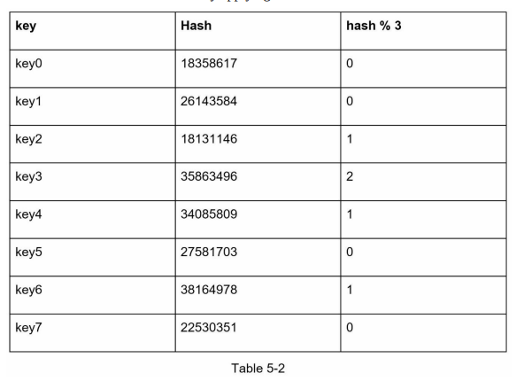

- 아래 그림은 변화된 키 분포를 보여준다.

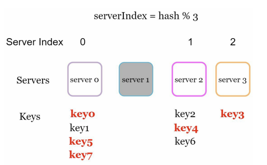

- 장애가 발생한 1번 서버에 보관되어 있는 키 뿐만 아니라 대부분의 키가 재분배되었다.
- 1번 서버가 죽으면 대부분 캐시 클라이언트가 데이터가 없는 엉뚱한 서버에 접속하게 된다는 뜻이다.
- 그 결과로 대규모 캐시 미스(cache miss)가 발생하게 될 것이다.
- 안정 해시는 이 문제를 효과적으로 해결하는 기술이다.

---

# 안정 해시

**안정 해시(consistent hash)**: 해시 테이블 크기가 조정될 때 평균적으로 오직 k/n개의 키만 재배치하는 해시 기술

- k는 키의 개수이고, n은 슬롯(slot)의 개수다.

---

## 해시 공간과 해시 링

- 해시 함수 f로는 SHA-1을 사용한다고 하고, 그 함수의 출력 값 범위는 x0, x1, x2, x3, ..., xn과 같다고 하자.
- SHA-1의 해시 공간(hash space) 범위는 0부터 $2^{160} - 1$ 이라고 알려져 있다. 따라서 x0은 0, xn은 $2^{160} - 1$이며, 나머지 x1부터 xn - 1까지는 그 사이의 값을 갖게 될 것이다.
- 아래 그림은 이 해시 공간을 그림으로 표현한 것이다.

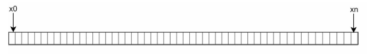

- 이 해시 공간의 양쪽을 구부려 접으면 아래와 같은 해시 링(hash ring)이 만들어진다.

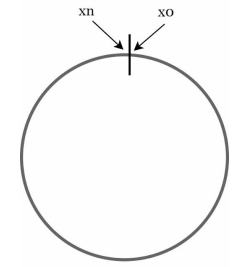

---

## 해시 서버

이 해시 함수 f를 사용하면 서버 IP나 이름을 이 링 위의 어떤 위치에 대응시킬 수 있다.

- 아래 그림은 4개의 서버를 이 해시 링 위에 배치한 결과다.

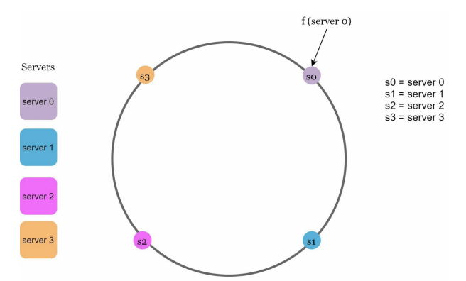

---

## 해시 키

여기 사용된 해시 함수는 "해시 키 재배치 문제"에 언급된 함수와는 다르며, 나머지(modular) 연산 %는 사용하지 않고 있음에 유의하자.

- 아래 그림과 같이, 캐시할 키 key0, key1, key2, key3 또한 해시 링 위의 어느 지점에 배치할 수 있다.

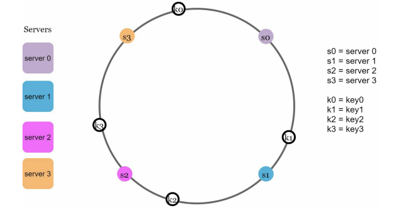

---

## 서버 조회

어떤 키가 저장되는 서버는, 해당 키의 위치로부터 시계 방향으로 링을 탐색해 나가면서 만나는 첫 번째 서버다.

- key0 -> 서버 0
- key1 -> 서버 1
- key2 -> 서버 2
- key3 -> 서버 3

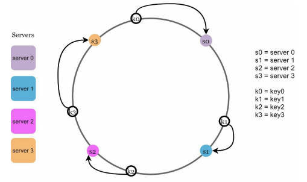

---

## 서버 추가

방금 설명한 내용에 따르면, 서버를 추가하더라도 키 가운데 일부만 재배치하면 된다.

- 아래 그림을 보면 새로운 서버 4가 추가된 뒤에 key0만 재배치됨을 알 수 있다.
- 서버 4가 추가되기 전, key0은 서버 0에 저장되어 있다.
- 하지만, 서버 4가 추가된 뒤에 key0은 서버 4에 저장될 것인데 왜냐하면 key0의 위치에서 시계 방향으로 순회했을 때 처음으로 만나게 되는 서버가 서버 4이기 때문이다.
- 다른 키들은 재배치되지 않는다.

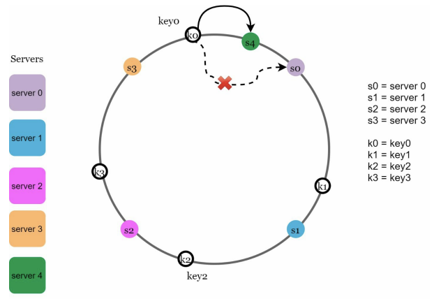

---

## 서버 제거

하나의 서버가 제거되면 키 가운데 일부만 재배치된다.

- 서버 1이 삭제 -> key1만이 서버 2로 재배치
- 나머지 키에는 영향이 없다.

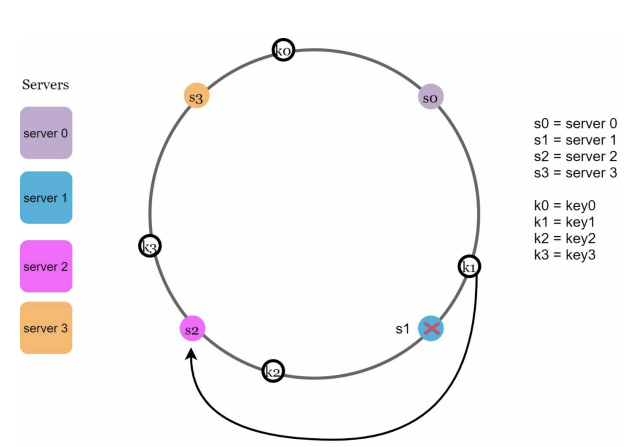

---

## 기본 구현법의 두 가지 문제

안정 해시 알고리즘의 기본 절차

- 서버와 키를 균등 분포(uniform distribution) 해시 함수를 사용해 해시 링에 배치한다.
- 키의 위치에서 링을 시계 방향으로 탐색함다 만나는 최초의 서버가 키가 저장될 서버다.

이 접근법에는 두 가지 문제가 있다.

1. 서버가 추가되거나 삭제되는 상황을 감안하면 파티션(partition)의 크기를 균등하게 유지하는 게 불가능하다.
   - 파티션: 인접한 서버 사이의 해시 공간이다.
   - 어떤 서버는 굉장히 작은 해시 공간을 할당 받고, 어떤 서버는 굉장히 큰 해시 공간을 할당 받는 상황이 가능하다.
   - 아래 그림은 s1이 삭제되는 바람에 s2의 파티션이 다른 파티션 대비 거의 두 배로 커지는 상황을 보여준다.

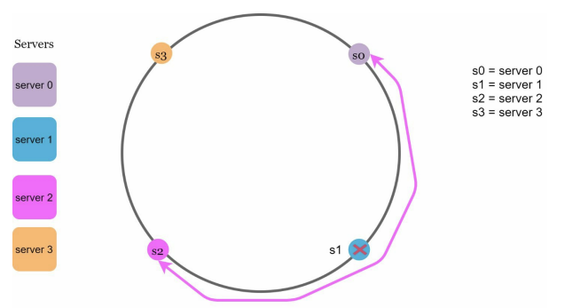

2. 키의 균등 분포(uniform distribution)를 달성하기가 어렵다.
   - 서버가 아래 그림과 같이 배치되어 있다고 해보자.
   - 서버 1과 서버 3은 아무 데이터도 갖지 않는 반면, 대부분의 키는 서버 2에 보관될 것이다.

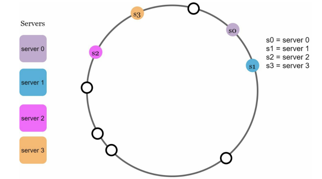

이 문제를 해결하기 위해 제안된 기법이 가상 노드(virtual node) 또는 복제(replica)라 불리는 기법이다.

---

## 가상 노드

**가상 노드(virtual node)**: 실제 노드 또는 서버를 가리키는 노드로서, 하나의 서버는 링 위에 여러 개의 가상 노드를 가질 수 있다.

- 아래 그림을 보면 서버 0과 서버 1은 3개의 가상 노드를 가질 수 있다.
- 여기서 숫자 3은 이미로 정한 것이며, 실제 시스템에서는 그보다 훨씬 큰 값이 사용된다.
- 서버 0을 링에 배치하기 위해 s0 하나만 쓰는 대신, s0_0, s0_1, s0_2의 세 개 가상 노드를 사용하였다.
- 마찬가지로 서버 1을 링에 배치할 때는 s1_0, s1_1, s1_2의 세 개 가상 노드를 사용했다.
- 따라서 각 서버는 하나가 아닌 여러 개 파티션을 관리해야 한다.
- s0으로 표시된 파티션은 서버 0이 관리하는 파티션이고, s1로 표시된 파티션은 서버 1이 관리하는 파티션이다.
- 서버를 링 위에 여러 번 배치해서 데이터를 고르게 분산시키는 기법이다. 가상 노드는 분신과 같다. 실제 서버는 하나인데, 링 위에서는 세 군데에 존재하는 척 하는 것이다.

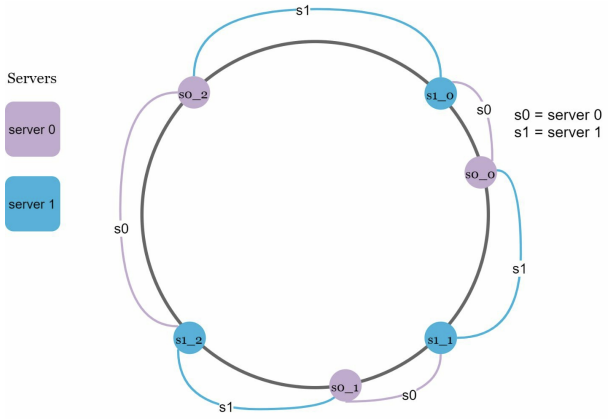

키의 위치로부터 시계방향으로 링을 탐색하다 만나는 최초의 가상 노드가 해당 키가 저장될 서버가 된다.

- k0가 저장되는 서버는 k0의 위치로부터 링을 시계방향으로 탐색하다 만나는 최초의 가상 노드 s1_1가 나타내는 서버, 즉 서버 1이다.

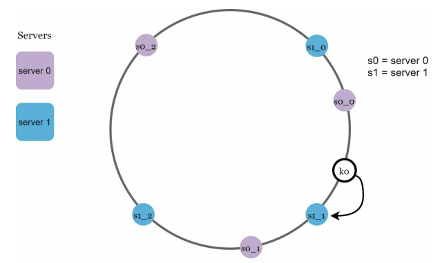

가상 노드의 개수를 늘리면 키의 분포는 점점 더 균등해진다.

- 표준 편차(standard deviation)가 작아져서 데이터가 고르게 분포되기 때문이다.
  - 표준 편차: 데이터가 어떻게 퍼져 나갔는지를 보이는 척도다.
- 100~200개의 가상 노드를 사용했을 경우 표준 편차 값은 평균의 5%(200개)에서 10%(100개) 사이다.
- 가상 노드의 개수를 더 늘리면 표준 편차의 값은 더 떨어진다.
- 그러나 가상 노드의 데이터를 저장할 공간은 더 많이 필요하게 될 것이다.
- 타협적 결정(tradeoff)이 필요하다.
- 시스템 요구사항에 맞도록 가상 노드 개수를 적절히 조정하자.

---

## 재배치할 키 결정

서버가 추가되거나 제거되면 어느 범위의 키들이 재배치되어야 할까?

- 아래 그림과 같이 서버 4가 추가되었다고 가정하자.
- 이에 영향 받은 범위는 s4(새로 추가된 노드)부터 그 반시계 방향에 있는 첫 번째 서버 s3까지이다.
  - 즉 s3부터 s4 사이에 있는 키들을 s4로 재배치하여야 한다.

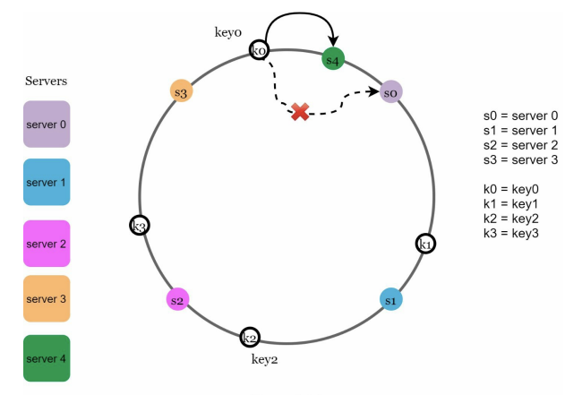

서버 s1이 아래 그림과 같이 삭제되면 s1(삭제된 노드)부터 그 반시계 방향에 있는 최초 서버 s0 사이에 있는 키들이 s2로 재배치되어야 한다.

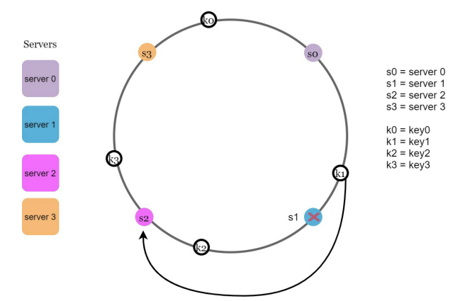

---

# 마치며

안정 해시의 이점

- 서버가 추가되거나 삭제될 때 재배치되는 키의 수가 최소화된다.
- 데이터가 보다 균등하게 분포하게 되므로 수평적 규모 확장성을 달성하기 쉽다.
- 핫스팟(hotspot) 키 문제를 줄인다. 특정한 샤드(shard)에 대한 접근이 지나치게 빈번하면 서버 과부하 문제가 생길 수 있다.
  - 유명인의 데이터가 전부 같은 샤드에 몰리는 상황을 생각해보면 이해가 쉬울 것이다.
  - 안정 해시는 데이터를 좀 더 균등하게 분배하므로 이런 문제가 생길 가능성을 줄인다.
