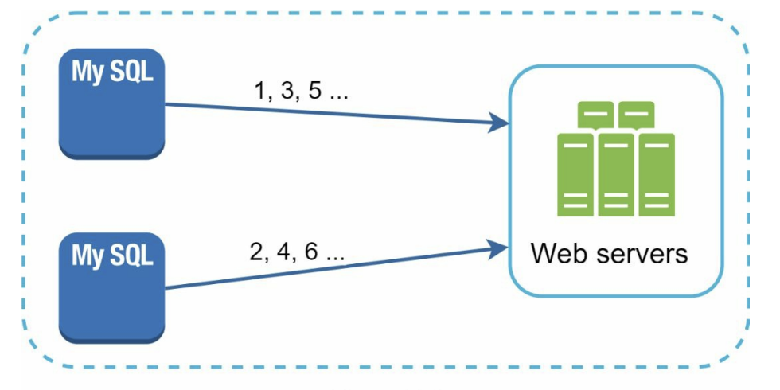
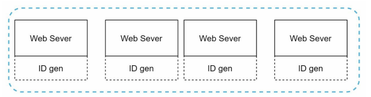
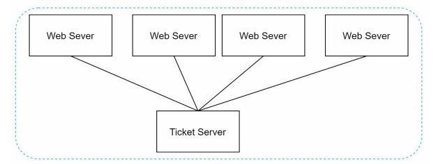
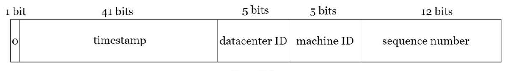
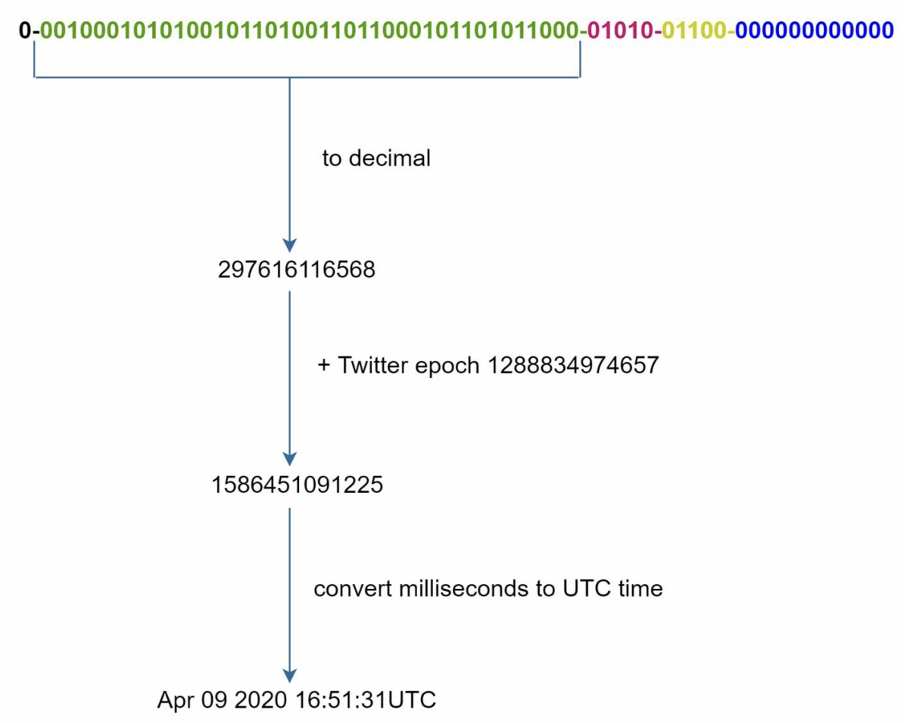

# **분산 시스템을 위한 유일 ID 생성기 설계**

분산 환경에서는 auto_increment 속성이 설정된 관계형 데이터베이스의 기본 키를 사용하는 게 통하지 않는다.

- `auto_increment` 속성은 한 DB 서버 내에서 순서대로 숫자를 증가시키는 방식이다.
- 분산 환경에서는 여러 DB 서버가 존재하기 때문에 각 서버가 독립적으로 ID를 만든다면 **중복 ID**가 생길 수 있다.
- 그렇다고 ID 생성을 한 DB 서버에 맡기면, 모든 서버가 중앙 DB에 요청하므로 **중앙 DB가 병목이 되고, 트래픽이 많아지면 감당하기 어려워진다.**

---

# 1단계 문제 이해 및 설계 범위 확정

시스템 설계 면접 문제를 푸는 첫 단계는 적절한 질문을 통해 모호함을 없애고 설계 방향을 정하는 것이다.

질문 예시

- ID는 어떤 특성을 갖나요?
  - 유일, 정렬 가능
- 새로운 레코드에 붙일 ID는 항상 1만큼 큰 값이어야 하나요?
  - ID의 값은 시간이 흐름에 따라 커질 테지만 언제나 1씩 증가하지는 않음. 그러나 아침에 만든 ID보다 저녁에 만든 ID가 큰 값을 갖는다.
- ID는 숫자로만 구성되나요?
- 시스템 규모는 어느 정도입니까?
  - 초당 10,000 ID를 생성할 수 있어야 한다.

**이번 문제에 대한 답안이 만족해야 할 요구사항**

- ID는 유일해야 한다.
- ID는 숫자로만 구성되어야 한다.
- ID는 64비트로 표현될 수 있는 값이어야 한다.
- ID는 발급 날짜에 따라 정렬 가능해야 한다.
- 초당 10,000개의 ID를 만들 수 있어야 한다.

---

# 2단계 개략적 설계안 제시 및 동의 구하기

분산 시스템에서 유일성이 보장되는 ID를 만드는 방법은 여러 가지다.

---

## 다중 마스터 복제(multi-master replication)

이 접근법은 데이터베이스의 auto_increment 기능을 활용하는 것이다.
다만 다음 ID의 값을 구할 때 1만큼 증가시켜 얻는 것이 아니라, k만큼 증가시킨다.

- k: 현재 사용 중인 데이터베이스 서버의 수
  이렇게 하면 규모 확장성 문제를 어느 정도 해결할 수 있는데, 데이터베이스 수를 늘리면 초당 생산 가능 ID 수도 늘릴 수 있기 때문이다.

단점:

- 여러 데이터 센터에 걸쳐 규모를 늘리기 어렵다.
  - 서버 수와 ID 증가 규칙(step/offset)이 강하게 연결되어 있어 확장 시 설정 충돌과 관리 복잡도가 커진다.
- ID의 유일성은 보장되겠지만 그 값이 시간 흐름에 맞추어 커지도록 보장할 수는 없다.
  - 여러 서버가 독립적으로 ID를 생성하므로 ID 크기와 실제 생성 순서가 일치하지 않을 수 있다.
- 서버를 추가하거나 삭제할 때도 잘 동작하도록 만들기 어렵다.
  - 서버 수가 바뀌면 기존 ID 생성 규칙을 다시 조정해야 해서 충돌 위험과 운영 부담이 발생한다.

---

## UUID

`UUID`: 컴퓨터 시스템에 저장되는 정보를 유일하게 식별하기 위한 128비트짜리 수

- 충돌 가능성이 지극히 낮다.
- 09c93e62-50b4-468d-bf8a-c07e1040bfb2 같은 형태를 띈다.
- 서버 간 조율 없이 독립적으로 생성 가능하다

이 구조에서 각 웹 서버는 별도의 ID 생성기를 사용해 독립적으로 ID를 만들어낸다.

**장점**

- UUID를 만드는 것은 단순하다. 서버 사이의 조율이 필요 없으므로 동기화 이슈도 없다.
- 각 서버가 자기가 쓸 ID를 알아서 만드는 구조이므로 규모 확장도 쉽다.

**단점**

- ID가 128비트로 길다. 이번 장에서 다루는 문제의 요구사항은 64비트이다.
- ID를 시간순으로 정렬할 수 없다.
- ID에 숫자 아닌 값이 포함될 수 있다.

---

## 티켓 서버(ticket server)

플리커(Flicker)는 분산 기본 키(distributed primary key)를 만들어 내기 위해 이 기술을 이용하였다.

auto_increment 기능을 갖춘 데이터베이스 서버, 즉 티켓 서버를 중앙 집중형으로 하나만 사용하는 것이다.

**장점**

- 유일성이 보장되는 오직 숫자로만 구성된 ID를 쉽게 만들 수 있다.
- 구현하기 쉽고, 중소 규모 애플리케이션에 적합하다.

**단점**

- 티켓 서버가 SPOF(Single-Point-Of-Failure)가 된다. 이 서버에 장애가 발생하면, 해당 서버를 이용하는 모든 시스템이 영향을 받는다. 이 이슈를 피하려면 티켓 서버를 여러 대 준비해야 한다. 하짐나 그렇게 하면 데이터 동기화 같은 새로운 문제가 발생할 것이다.

---

## 트위터 스노플레이크 접근법

ID를 먼저 생성하기에 앞서, divide and conquer을 먼저 적용해보자.

- 생성해야 하는 ID의 구조를 여러 section으로 분할하는 것이다.

- `sign 비트`: 1비트를 할당한다. 지금으로서는 쓰임새가 없지만 나중을 위해 유보해 둔다. 음수와 양수를 구별하는 데 사용 가능하다.
- `타임스탬프(timestamp)`: 41비트를 할당한다. 기원 시각(epoch) 이후로 몇 밀리초(millisecond)가 경과했는지를 나타내는 값이다.
- `데이터센터 ID`: 5비트를 할당한다. 따라서 $2^5=32$개 데이터센터를 지원할 수 있다.
- `서버 ID`: 5비트를 할당한다. 따라서 데이터센터당 32개 서버를 사용할 수 있다.
- `일련번호`: 12비트를 할당한다. 각 서버에서는 ID를 생성할 때마다 이 일련번호를 1만큼 증가시킨다. 이 값은 1밀리초가 경과할 때마다 0으로 초기화(reset)된다.

---

# 3단계 상세 설계

개략적 설게에서 살펴본 다양한 유일성 보장 ID생성기 중 트위터 스노플레이크 접근법을 사용하여 보다 상세한 설계를 진행해 본다.

- 데이터센터 ID와 서버 ID는 시스템이 시작할 때 결정되며, 일반적으로 시스템 운영 중에는 바뀌지 않는다.
  - 데이터센터 ID나 서버 ID를 잘못 변경하게 되면 ID 충돌이 발생할 수 있으므로, 그런 작업 시에는 신중해야 한다.
- 타임 스탬프나 일련번호는 ID 생성기가 돌고 있는 중에 만들어지는 값이다.

---

## 타임스탬프

타임스탬프는 시간이 흐름에 따라 점점 큰 값을 갖게 되므로, 결국 ID는 시간 순으로 정렬 가능하게 될 것이다.
아래 그림은 앞서 살펴본 ID 구조를 따르는 값의 이진 표현 형태로부터 UTC 시각을 추출하는 예제다.

41비트로 표현할 수 있는 타임스탬프의 최댓값은 $2^41 - 1 = 2199023255551$밀리초이다. 이 값은 대략 69년에 해당한다.
따라서 이 ID 생성기는 69년동안만 정상 동작하는데, 기원 시각을 현재에 가깝에 맞춰서 오버플로(overflow)가 발생하는 시점을 늦춰 놓은 것이다.
69년이 지나면 기원 시각을 바꾸거나 ID 체계를 다른 것으로 이전(migration)하여야 한다.

---

## 일련번호

일련번호는 12비트이므로 $2^{12} = 4096$개의 값을 가질 수 있다.
어떤 서버가 같은 밀리초 동안 하나 이상의 ID를 만들어 낸 경우에만 0보다 큰 값을 갖게 된다.

---

# 4단계 마무리

이번 장에서는 유일성이 보장되는 ID 생성기 구현에 쓰일 수 있는 다양한 전략, 즉 다중 마스터 복제, UUID, 티켓 서버, 트위터 스노플레이크의 네 가지 방법을 살펴보았다.

설계를 진행하고, 시간이 조금 남았다면 면접관과 다음을 추가로 논의할 수도 있을 것이다.

- `시계 동기화(clock synchronization)`: 하나의 서버가 여러 코어에서 실행되거나 여러 서버가 물리적으로 독립된 여러 장비에서 실행되는 경우 유효하지 않을 수 있다. NTP(Network Time Protocol)은 이 문제를 해결하는 가장 보편적 수단이다.
- `각 section의 길이 최적화`: 예를 들어 동시성(concurrency)이 낮고 수명이 긴 애플리케이션이라면 일련번호 section의 길이를 줄이고 타임스탬프 section의 길이를 늘리는 것이 효과적일 수도 있을 것이다.
- `고가용성(high availability)`: ID 생성기는 필수 불가결(mission critical) 컴포넌트이므로 아주 높은 가용성을 제공해야 할 것이다.
