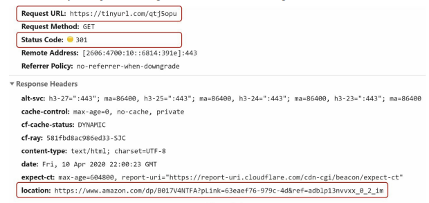
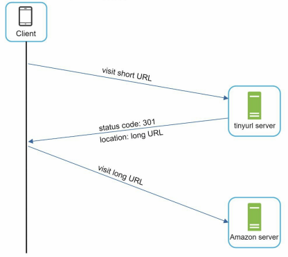
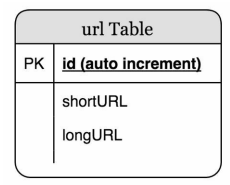
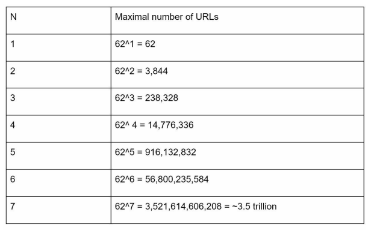
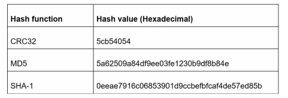
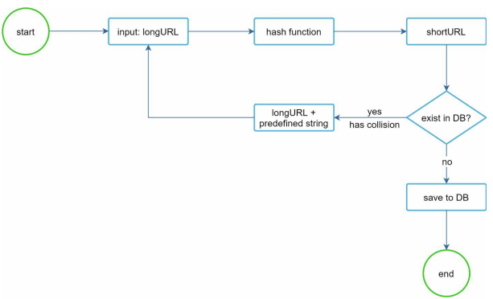
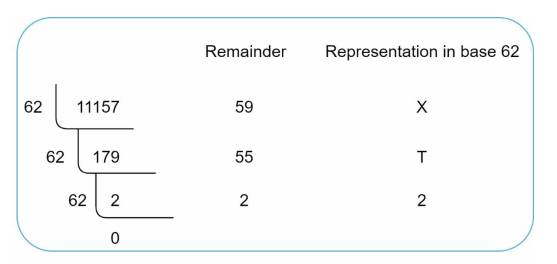
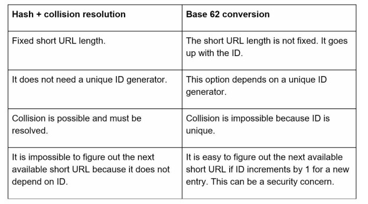
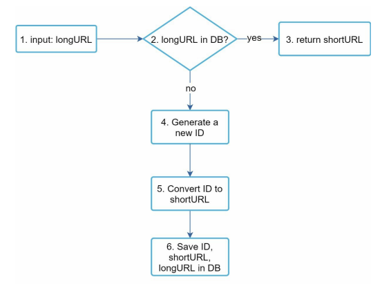
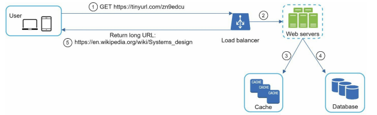

# **URL 단축기 설계**

## 1단계 문제 이해 및 설계 범위 확정

질문을 통해 모호함을 줄이고 요구사항을 알아내야 한다.

이 시스템의 기본적 기능은 아래와 같다.

1. `URL 단축`: 주어진 긴 URL을 훨씬 짧게 줄인다.
2. `URL 리디렉션(redirection)`: 축약된 URL로 HTTP 요청이 오면 원래 URL로 안내
3. 높은 가용성과 규모 확장성, 그리고 장애 감내가 요구됨

---
### 개략적 추정

- `쓰기 연산`: 매일 1억 개의 단축 URL 생성
- `초당 쓰기 연산`: 1억(100million)/24/3600 = 1160
- `읽기 연산`: 읽기 연산과 쓰기 연산 비율은 10:1이라고 하자. 그 경우 읽기 연산은 초당 11,600회 발생한다. (1160 x 10 = 11,600)
- URL 단축 서비스를 10년간 운영하다고 가정하면 1억(100million) x 365 x 10 = 3650억(365 billion) 개의 레코드를 보관해야 한다.
- 축약 전 URL의 평균 길이는 100이라고 하자.
- 따라서 10년 동안 필요한 저장 용량은 3650억(365 billion) x 100바이트 = 36.5TB이다.

---
## 2단계 개략적 설계안 제시 및 동의 구하기

### API 엔드포인트

URL 단축기는 기본적으로 두 개의 엔드포인트를 필요로 한다.

1. `URL 단축용 엔드포인트`: 새 단축 URL을 생성하고자 하는 클라이언트는 이 엔드포인트에 단축할 URL을 인자로 실어서 POST 요청을 보내야 한다. 

```txt
POST /api/v1/data/shorten
- 인자: {longUrl: longURLstring}
- 반환: 단축 URL
```

2. `URL 리디렉션용 엔드포인트`: 단축 URL에 대해서 HTTP 요청이 오면 원래 URL로 보내주기 위한 용도의 엔드포인트.

```txt
GET /api/v1/shortUrl
- 반환: HTTP 리디렉션 목적지가 될 원래 URL
```

---
### URL 리디렉션



위 그림은 브라우저에 단축 URL을 입력하면 무슨 일이 생기는지 보여준다.
단축 URL을 받은 서버는 그 URL을 원래 URL로 바꾸어서 301 응답의 Location 헤더에 넣어 반환한다.



301 응답과 302 응답의 차이
- `301 Permanently Moved`: 해당 URL에 대한 HTTP 요청의 처리 책임이 영구적으로 Location 헤더에 반환된 URL로 이전되었다는 응답
- `302 Found`: 주어진 URL로의 요청이 '일시적으로' Location 헤더가 지정하는 URL에 의해 처리되어야 한다는 응답
서버 부하를 줄이는 것이 중요하면 `301 Permanently Moved`를, 트래픽 분석(analytics)이 중요할 때는 `302 Found`를 쓰는 쪽이 클릭 발생률이나 발생 위치를 추적하는 데 좀 더 유리할 것이다.

URL 리디렉션을 구현하는 가장 직관적인 방법은 해시 테이블을 사용하는 것이다. - `<단축 URL, 원래 URL>`
- 원래 URL = hashTable.get(단축 URL)
- 301 또는 302 응답 Location 헤더에 원래 URL을 넣은 후 전송

---
### URL 단축

해시 함수는 다음 요구사항을 만족해야 한다.

- 입력으로 주어지는 긴 URL이 다른 값이면 해시 값도 달라야 한다.
- 계산된 해시 값은 원래 입력으로 주어졌던 긴 URL로 복원될 수 있어야 한다.

---
## 3단계 상세 설계

### 데이터 모델

모든 것을 해시 테이블에 두는 접근법은 초기 전략으로는 괜찮지만 메모리는 유한하고 비싸기 때문에 실제 시스템에 사용하기에는 곤란하다.
- 더 나은 방법은 `<단축 URL, 원래 URL>`의 순서쌍을 관계형 데이터베이스에 저장하는 것이다.
- 아래는 단순화한 예시 테이블이다.



---
### 해시 함수

편의상 해시 함수가 계산하는 단축 URL 값을 hashValue라고 지칭하겠다.

---
#### 해시 값 길이

hashValue는 [0-9, a-z, A-Z]의 문자들로 구성된다. - 사용할 수 있는 문자의 개수: $10 + 26 + 26 = 62$
- hashValue의 길이를 정하기 위해서는 $62^n >= 3650억(365 billion)$인 n의 최솟값을 찾아야 한다.
- n = 7이면 3.5조 개의 URL을 만들 수 있고, 이는 요구사항을 만족시키기 충분한 값이기 때문에 hashValue의 길이는 7로 하겠다.



---
#### 해시 후 충돌 해소

긴 URL을 줄이려면, 원래 URL을 7글자 문자열로 줄이는 해시 함수가 필요하다.
- 손쉬운 방법: CRC32, MD5, SHA-1 같이 잘 알려진 해시 함수 이용



CRC가 계산한 가장 짧은 해시값조차도 7보다는 길다.
줄이는 방법
1. 계산된 해시 값에서 처음 7개 글자만 이용
	- 해시 결과가 서로 충돌할 확률이 높아진다.
	- 충돌이 실제로 발생했을 때는, 충돌이 해소될 때까지 사전에 정한 문자열을 해시값에 덧붙인다.
		- 충돌은 해소할 수 있지만 단축 URL을 생성할 때 한 번 이상 데이터베이스 질의를 해야 하므로 오버헤드가 크다.
	- 데이터베이스 대신 블룸 필터를 사용하면 성능을 높일 수 있다.
		- 블룸 필터: 어떤 집합에 특정 원소가 있는지 검사할 수 있도록 하는, 확률론에 기초한 공간 효율이 좋은 기술



---
#### base-62 변환

수의 표현 방식이 다른 두 시스템이 같은 수를 공유하여야 하는 경우에 유용하다.
62진법을 쓰는 이유는 hashValue에 사용할 수 있는 문자(character) 개수가 62개이기 때문이다.

- 62진법은 수를 표현하기 위해 총 62개의 문자를 사용하는 진법이다.
	- 0은 0으로, 9는 9로, 10은 a로, 11은 b로, ... 35는 z로, 36은 A로, ... 61은 Z로
- $11157_{10} = 2 * 62^2 + 55 * 61^1 + 59 * 62^0 = [2, 55, 59] => [2, T, X] => 2TX_{62}$



---
#### 두 접근법 비교



---
### URL 단축기 상세 설계

시스템의 핵심 컴포넌트이므로, 그 처리 흐름이 논리적으로는 단순해야 하고 기능적으로는 언제나 동작하는 상태로 유지되어야 한다.
본 예제에서는 62진법 변환 기법을 사용해 설계할 것이다.



1. 입력으로 긴 URL을 받는다.
2. 데이터베이스에 해당 URL이 있는지 검사한다.
3. 데이터베이스에 있다면 해당 URL에 대한 단축 URL을 만든 적이 있는 것이다. 따라서 데이터베이스에서 해당 단축 URL을 가져와서 클라이언트에게 반환한다.
4. 데이터베이스에 없는 경우에는 해당 URL은 새로 접수된 것이므로 유일한 ID를 생성한다. 이 ID는 데이터베이스의 기본 키로 사용된다.
5. 62진법 변환을 적용, ID를 단축 URL로 만든다.
6. ID, 단축 URL, 원래 URL로 새 데이터베이스 레코드를 만든 후 단축 URL을 클라이언트에 전달한다.

주의점: longURL로 base62 진법 변환을 하는 게 아니라 ID를 기준으로 수행

---
### URL 리디렉션 상세 설계



쓰기보다 읽기를 더 자주 하는 시스템이라, `<단축 URL, 원래 URL>`의 쌍을 캐시에 저장하여 성능을 높였다.

로드밸런서의 동작 흐름
1. 사용자가 단축 URL을 클릭한다.
2. 로드밸런서가 해당 클릭으로 발생한 요청을 웹 서버에 전달한다.
3. 단축 URL이 이미 캐시에 있는 경우에는 원래 URL을 바로 꺼내서 클라이언트에게 전달한다.
4. 캐시에 해당 단축 URL이 없는 경우에는 데이터베이스에서 꺼낸다. 데이터베이스에 없다면 아마 사용자가 잘못된 단축 URL을 입력한 경우일 것이다.
5. 데이터베이스에서 꺼낸 URL을 캐시에 넣은 후 사용자에게 반환한다.

---
## 4단계 마무리

설계 후 시간이 남는다면 다음과 같은 것을 면접관과 이야기할 수 있을 것이다.

- `처리율 제한 장치 (Rate limiter)`: 악의적인 사용자가 과도하게 많은 URL 단축 요청을 보내는 것은 잠재적인 보안 문제가 될 수 있다. 처리율 제한 장치는 IP 주소나 기타 필터링 규칙을 바탕으로 요청을 걸러내는 역할을 한다.
- `웹 서버 계층 확장 (Web server scaling)`: 웹 계층은 상태 정보가 없는(stateless) 구조이므로, 웹 서버를 추가하거나 제거함으로써 쉽게 확장할 수 있다.
- `데이터베이스 확장 (Database scaling)`: 데이터베이스 다중화(replication)와 샤딩(sharding)은 보편적으로 사용되는 기술이다.
- `분석 (Analytics)`: 데이터는 비즈니스 성공에 있어 점점 더 중요해지고 있다. URL 단축 서비스에 분석 솔루션을 통합하면 얼마나 많은 사람이 링크를 클릭했는지, 언제 클릭했는지 등 중요한 질문에 대한 답을 얻는 데 도움이 됩니다.
- `가용성, 일관성 및 신뢰성 (Availability, consistency, and reliability)`: 이 개념들은 모든 대규모 시스템의 성공을 결정짓는 핵심 요소이다.