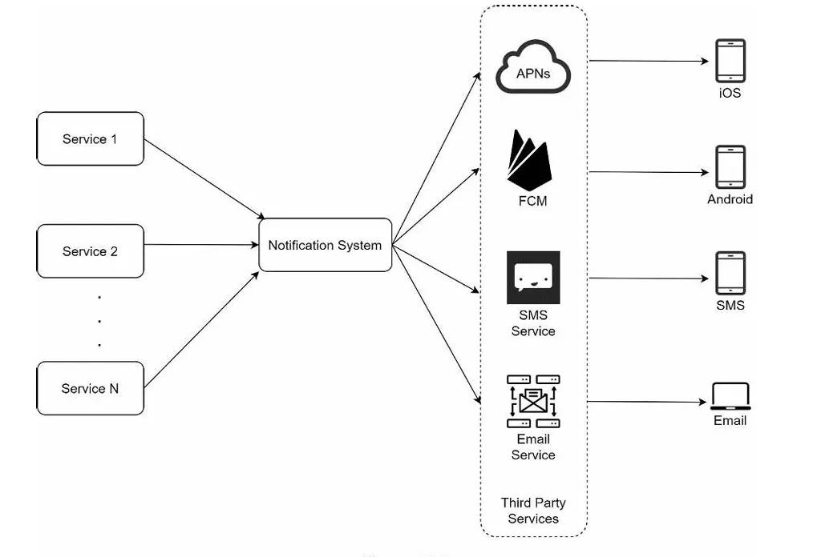
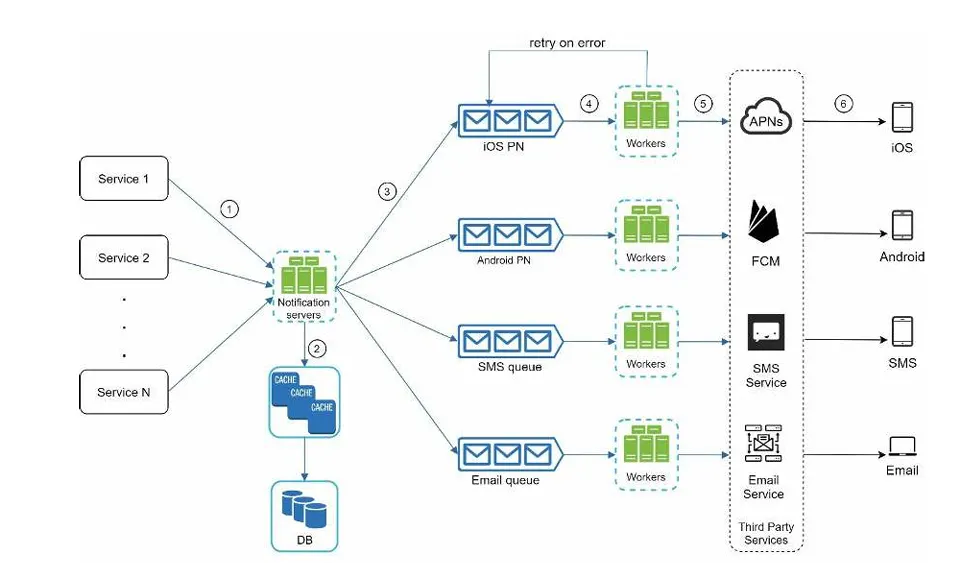
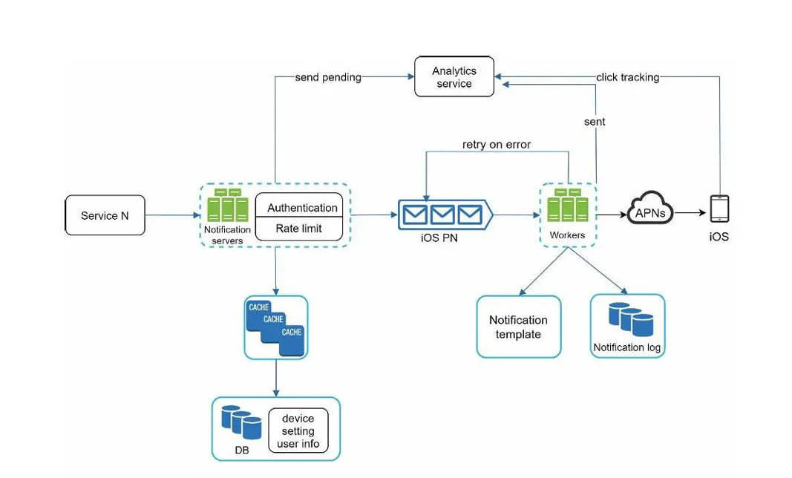

알림 시스템은 최근 많은 프로그램이 채택한 인기 있는 기능이다.

고객에게 중요할 만한 정보를 비동기적으로 제공한다.

알림 시스템

- 모바일 푸시 알림
- SMS 메시지
- 이메일

# 1단계: 문제 이해 및 설계 범위 확정

- 푸시 알림, SMS 메시지, 이메일
- 연성 실시간 시스템
    - 알림은 가능한한 빨리 전달되어야 하지만 시스템에 높은 부하가 걸렸을 때 약간의 지연은 무방하다.
- IOS 단말, 안드로이드 단말, 랩톱/데스크톱을 지원해야 한다
- 클라이언트 애플리케이션 프로그램이 만들 수 있고 서버 측에서 스케줄링하여 알림을 만들 수도 있다.
- 사용자가 알림을 받지 않도록 설정하면 사용자에게 더이상 알림이 가지 않는다.
- 천만 건의 모바일 푸시 알림, 백만 건의 SMS 메시지, 5백만 건의 이메일을 보낼 수 있어야 한다.

# 2단계

- 알림 유형별 지원 방안
- 연락처 정보 수집 절차
- 알림 전송 및 수신 절차

## 알림 유형별 지원 방안

### iOS 푸시 알림

ios 푸시 알림을 봰기 위해서는 세 가지 컴포넌트가 필요하다.

- 알림 제공자(provider): 알림 요청을 만들어 애플 푸시 알림 서비스(APNS)로 보내는 주체다.
    
    알림 요청을 만들려면 다음과 같은 데이터가 필요하다.
    
    - 단말 토큰: 알림 요청을 보내는 데 필요한 고유 식별자다.
    - 페이로드: 알림 내용을 담은 JSON 딕셔너리다.
    
    ```java
    {
    	"aps": {
    					"alert": {
    							"title" : "Game Request",
    							"body: : "Bob wants to play chess",
    							"action-loc-key": "PLAY"
    						},
    						"badge":5
    					}
    }
    ```
    
- APNS: 애플이 제공하는 원격 서비스
푸시 알림을 iOS 장치로 보내는 역할을 담당한다.
- IOS 단말: 푸시 알림을 수신하는 사용자 단말

### 안드로이드 푸시 알림

안드로이드 푸시 알림도 비슷한 절차로 전송되지만 APNS 대신 FCM을 사용한다는 점만 다르다.

### SMS 메시지

트윌리오, 넥스모 같은 제3사업자의 서비스를 많이 이용한다.

이런 서비스는 대부분 상용 서비스라서 이용요금을 내야 한다.

### 이메일

많은 회사가 상용 이메일 서비스를 이용한다.

- 센드그리드, 메일침프

전송 성공률도 높고, 데이터 분석 서비스도 제공한다.

## 연락처 정보 수집 절차

알림을 보내려면 모바일 단말 토큰, 전화번호, 이메일 주소 등의 정보가 필요하다.

사용자가 우리 앱을 설치하거나 처음으로 계정을 등록하면 API 서버는 해당 사용자의 정보를 수집하여 데이터베이스에 저장한다.이메일 주소와 전화번호는 user테이블에 저장하고, 단말 토큰은 device 테이블에 저장한다.

한 사용자가 여러 단말을 가질 수 있고, 알림은 모든 단말에 전송되어야 한다.

## 알림 전송 및 수신 절차

- 1부터 N까지의 서비스: 이 서비스 각각은 마이크로서비일수도 있고, 크론잡일 수도 있고, 분산 시스템 컴포넌트일 수도 있다. 사용자에게 납기일을 알리고자 하는 과금 서비스, 배송 알림을 보내려는 쇼핑몰 웹사이트 등이 그 예이다.
- 알림 시스템: 알림 시스템은 알림 전송/수신 처리의 핵심이다.
- 제3자 서비스: 사용자에게 알림을 실제로 전달하는 역할을 한다.
    - 제 3자 서비스와의 통합을 진행할 때 유의할 것은 확장성이다.
    - 쉽게 새로운 서비스를 통합하거나 기존 서비스를 제거할 수 있어야 한다는 의미이다.
- iOS, 안드로이드, SMS, 이메일 단말: 사용자는 자기 단말에서 알림을 수신한다.




### 이 설계의 문제점

- SPOF : 알림 서비스에 서버가 하나밖에 없다는 것은, 그 서버에 장애가 생기면 전체 서비스의 장애로 이어진다는 뜻
- 규모 확장성: 한 대 서비스로 푸시 알림에 관계된 모든 것을 처리하므로, 데이터베이스나 캐시 등 중요 컴포넌트의 규모를 개별적으로 늘릴 방법이 없다.
- 성능 병목: 알림을 처리하고 보내는 것은 자원을 많이 필요로 하는 작업일 수 있다.
    - 따라서 모든 것을 한 서버로 처리하면 사용자 트래픽이 많이 몰리는 시간에는 시스템이 과부하 상태에 빠질 수 있다.

## 개략적 설계안

- 데이터베이스와 캐시를 알림 시스템의 주 서버에서 분리한다.
- 알림 서버를 증설하고 자동으로 수평적 규모 확장이 이루어질 수 있도록 한다.
- 메시지 큐를 이용해 시스템 컴포넌트 사이의 강한 결합을 끊는다.




- 1부터 N까지의 서비스: 알림 시스템 서버의 API를 통해 알림을 보낼 서비스들
- 알림 서버
    - 알림 전송 API: 스팸 방지를 위해 보통 사내 서비스 또는 인증된 클라이언트만 이용 가능하다.
    - 알림 검증: 이메일 주소, 전화번호 등에 대한 기본적 검증을 수행한다.
    - 데이터베이스 또는 캐시 질의: 알림에 포함시킬 데이터를 가져오는 기능
    - 알림 전송: 알림 데이터를 메시지 큐에 넣는다.
- 캐시: 사용자 정보, 단말 정보, 알림 템플릿 등을 캐시한다.
- 데이터베이스(DB): 사용자, 알림, 설정 등 다양한 정보를 저장한다.
- 메시지 큐: 시스템 컴포넌트 간 의존성을 제거하기 위해 사용한다.
- 작업 서버: 메시지 큐에서 전송할 알림을 꺼내어 제 3자 서비스로 전달하는 역할을 담당하는 서버다.

### 동작 과정

1. API를 호출하여 알림 서버로 알림을 보낸다.
2. 알림 서버는 사용자 정보, 단말 토큰, 알림 설정 같은 메타데이터를 캐시나 데이터베이스에서 가져온다.
3. 알림 서버는 전송할 알림에 맞는 이벤트를 만들어서 해당 이벤트를 위한 큐에 넣는다.
4. 작업 서버는 메시지 큐에서 알림 이벤트를 꺼낸다.
5. 작업 서버는 알림을 제 3자 서비스로 보낸다.
6. 제 3자 서비스는 사용자 단말로 알림을 전송한다.

# 3단계 상세 설계

- 안정성
- 추가로 필요한 컴포넌트 및 고려사항: 알림 템플릿, 알림 설정, 전송률 제한, 재시도 메커니즘, 보안, 큐에 보관된 알림에 대한 모니터링과 이벤트 추ㅊ적 등
- 개선된 설계안

## 안정성

### 데이터 손실 방지

알림 전송 시스템의 가장 중요한 요구사항 가운데 하나는 어떤 상황에서도 알림이 소실되면 안 된다는 것이다.

알림이 지연되거나 순서가 틀려도 괜찮지만, 사리지면 곤란하다는 것이다.

알림 시스템은 알림 데이터를 데이터베이스에 보관하고 재시도 메커니즘을 구현해야 한다.

→ 알림 로그 데이터베이스를 유지하는 것이 한 가지 방법이다.

### 알림 중복 전송 방지

같은 알림이 여러번 반복되는 것을 완전히 막는 것은 가능하지 않다.

대부분의 경우 알림은 딱 한 번만 전송되겠지만, 분산 시스템의 특성상 가끔은 같은 알림이 중복되어 전송되기도 한다.

그 빈도를 줄이려면 중복을 탐지하는 매커니즘을 도입하고, 오류를 신중하게 처리해야 한다.

- 보내야 할 알림이 도착하면 그 이벤트 ID를 검사하여 이전에 본 적이 있는 이벤트인지 살핀다.
- 중복된 이벤트라면 버리고, 그렇지 않으면 알림을 발송한다.

## 추가로 필요한 컴포넌트 및 고려사항

### 알림 템플릿

대형 알림 시스템은 하루에도 수백만 건 이상의 알림을 처리한다.

그런데 그 알림 메시지 대부분은 형식이 비슷하다.

알림 템플릿은 이런 유사성을 고려하여, 알림 메시지의 모든 부분을 처음부터 다시 만들 필요 없도록 해 준다.

알림 템플릿은 인자나 스타일, 추적 링크를 조정하기만 하면 사전에 지정한 형식에 맞춰 알림을 만들어 내는 틀이다.

### 알림 설정

사용자는 이미 너무 많은 알림을 받고 있어서 쉽게 피곤함을 느낀다.

따라서 많은 웹사이트와 앱에서는 사용자가 알림 설정을 상세히 조정할 수 있도록 하고 있다.

이 정보는 알림 설정 테이블에 보관된다.

특정 종류의 알림을 보내기 전에 반드시 해당 사용자가 해당 알림을 켜 두었는지 확인해야 한다.

### 전송률 제한

알림을 너무 많이 보내기 시작하면 사용자가 알림 기능을 아에 꺼 버릴 수도 있기 때문에 전송률을 제한해야 한다.

### 재시도 방법

제3자 서비스가 알림 전송에  실패하면, 해당 알림을 재시도 전용  큐에 넣는다..

### 푸시 알림과 보안

iOS와 안드로이드 앱의 경우, 알림 전송 API는 appKey와 appSecret을 사용하여 보안을 유지한다.

따라서 인증된, 혹은 승인된 클라이언트만 해당 API를 사용하여 알림을 보낼 수 있다.

### 큐 모니터링

알림 시스템을 모니터링 할 때 중요한 메트릭 하나는 큐에 쌓인 알림의 개수이다.

이 수가 너무 크면 작업 서버들이 이벤트를 빠르게 처리하고 있지 못하다는 뜻이다.

그런 경우에는 작업 서버를 증설하는게 바람직할 것이다.

### 이벤트 추적

알림 확인율, 클릭율, 실제 앱 사용으로 이어지는 비율 같은 메트릭은 사용자를 이해하는데 중요하다.

데이터 분석 서비스는 보통 이벤트 추적 기능도 제공한다. 

따라서 보통 알림 시스템을 만들면 데이터 분석 서비스와도 통합해야만 한다.

## 수정된 설계안


