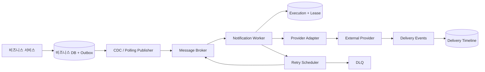

# 이벤트 ID만 검사하면 중복 알림을 막을 수 있을까?

## Transactional Outbox와 Effectively-once Delivery

---

# 출처

- Apache Kafka Documentation - Design: Message Delivery Semantics  
  https://kafka.apache.org/documentation/#semantics

- Apache Kafka Documentation - Idempotent and Transactional Producer  
  https://kafka.apache.org/documentation/#producerconfigs_enable.idempotence

- Debezium Documentation - Outbox Event Router  
  https://debezium.io/documentation/reference/stable/transformations/outbox-event-router.html

- Amazon SQS Documentation - Visibility Timeout  
  https://docs.aws.amazon.com/AWSSimpleQueueService/latest/SQSDeveloperGuide/sqs-visibility-timeout.html

- Amazon SQS Documentation - Dead-letter Queues  
  https://docs.aws.amazon.com/AWSSimpleQueueService/latest/SQSDeveloperGuide/sqs-dead-letter-queues.html

- AWS Builders' Library - Timeouts, Retries and Backoff with Jitter  
  https://aws.amazon.com/builders-library/timeouts-retries-and-backoff-with-jitter/

- Stripe API Documentation - Idempotent Requests  
  https://docs.stripe.com/api/idempotent_requests

- Firebase Documentation - Understanding Message Delivery  
  https://firebase.google.com/docs/cloud-messaging/understand-delivery

---

# 1. 가장 위험한 구간은 전송과 ACK 사이에 있다

작업 서버가 주문 완료 알림을 처리한다고 가정하자.

1. 메시지 큐에서 이벤트를 읽는다.
2. 외부 알림 제공자에게 전송을 요청한다.
3. 메시지 처리를 완료했다고 ACK한다.

2번은 성공했지만 3번 전에 작업 서버가 죽을 수 있다.

큐에는 ACK가 남지 않았으므로 다른 작업 서버가 같은 이벤트를 다시 읽는다. 반면 외부 알림 제공자는 첫 번째 요청을 이미 처리했을 수 있다.

| 시스템 | 기록된 상태 |
| --- | --- |
| 메시지 큐 | 처리 완료 기록 없음 |
| 외부 제공자 | 전송 요청 수락 |
| 작업 서버 | 장애로 상태 유실 |

이 구간에서는 작업 서버가 첫 번째 요청의 성공 여부를 확정할 수 없다.

네트워크 timeout도 실패를 뜻하지 않는다. 요청은 성공하고 응답만 유실됐을 수 있다. 이처럼 성공과 실패를 구분할 수 없는 결과를 ambiguous outcome이라고 한다.

---

# 2. Kafka의 Exactly-once가 해결하지 못하는 것

Kafka의 idempotent producer는 producer가 같은 레코드를 재전송해도 Kafka 로그에 중복으로 기록되지 않도록 한다.

Kafka transaction은 레코드를 읽고 다른 Kafka topic에 결과를 쓰는 작업을 원자적으로 처리할 수 있다.

Kafka가 제어하는 범위에서는 강한 처리 보장을 만들 수 있다.

> Kafka record 소비 → Kafka record 생산

하지만 알림 작업 서버의 최종 결과는 Kafka 밖에서 발생한다.

> Kafka record 소비 → FCM, APNs, SMS 또는 이메일 API 호출

Kafka broker는 외부 제공자의 transaction에 참여하지 않는다. 외부 제공자도 Kafka offset commit에 참여하지 않는다.

따라서 Kafka transaction이 성공해도 사용자가 알림을 정확히 한 번 받았다는 뜻은 아니다.

Exactly-once라는 표현을 볼 때는 항상 보장 범위를 확인해야 한다.

- 브로커에 레코드를 한 번 기록한다는 뜻인가?
- 스트림 처리 결과를 한 번 반영한다는 뜻인가?
- 외부 API의 부수 효과까지 한 번 발생한다는 뜻인가?

알림 전송은 마지막 질문에 해당하며, 메시지 브로커만으로 해결할 수 없다.

---

# 3. 이벤트 ID를 먼저 저장하면 유실될 수 있다

이벤트 ID를 저장한 뒤 알림을 보내는 방식부터 살펴보자.

```sql
INSERT INTO processed_event(event_id, processed_at)
VALUES ('order-1234-completed', NOW());
```

`event_id`에 unique constraint를 설정하면 여러 작업 서버가 같은 이벤트를 동시에 처리해도 하나만 INSERT에 성공한다.

그러나 INSERT 직후 작업 서버가 죽으면 문제가 생긴다.

1. `processed_event` 저장 성공
2. 작업 서버 장애
3. 외부 제공자 호출은 실행되지 않음
4. 이벤트 재전달
5. 이미 처리한 ID로 판단하고 폐기

데이터베이스에는 처리 완료 기록이 있지만 실제 알림은 전송되지 않는다.

중복을 막기 위해 만든 기록이 오히려 유실을 확정한다.

---

# 4. 이벤트 ID를 나중에 저장하면 중복될 수 있다

순서를 바꿔 외부 전송 후 이벤트 ID를 저장할 수도 있다.

1. 외부 제공자 호출 성공
2. 작업 서버 장애
3. `processed_event`에는 기록되지 않음
4. 이벤트 재전달
5. 외부 제공자 다시 호출

이번에는 알림이 중복될 수 있다.

| 처리 순서 | 장애 시 결과 |
| --- | --- |
| ID 저장 → 외부 전송 | 알림 유실 가능 |
| 외부 전송 → ID 저장 | 알림 중복 가능 |

외부 API 호출과 로컬 DB transaction을 원자적으로 묶을 수 없기 때문에 순서만 바꿔서는 해결되지 않는다.

이것이 단순한 이벤트 ID 검사만으로 exactly-once 알림을 만들 수 없는 이유다.

---

# 5. 알림을 만들기 전에도 Dual Write가 발생한다

알림 작업 서버 앞단에서도 원자성 문제가 발생한다.

주문 서비스는 주문 상태를 변경하고 `OrderCompleted` 이벤트를 발행해야 한다.

두 작업을 순서대로 실행하면 다음 상태가 가능하다.

| 먼저 실행한 작업 | 장애 시 발생하는 불일치 |
| --- | --- |
| 주문 DB commit | 주문은 완료됐지만 이벤트가 없음 |
| 이벤트 발행 | 완료되지 않은 주문의 이벤트가 존재 |

데이터베이스와 메시지 브로커에 각각 쓰는 작업을 dual write라고 한다.

두 시스템에 걸친 분산 transaction을 구성할 수도 있지만, 운영 복잡도와 결합도가 커진다. 실무에서는 비즈니스 데이터와 발행할 이벤트를 같은 DB transaction에 저장하는 Transactional Outbox를 자주 사용한다.

---

# 6. Transactional Outbox

주문 상태와 이벤트를 같은 데이터베이스 transaction으로 저장한다.

```sql
BEGIN;

UPDATE orders
SET status = 'COMPLETED'
WHERE id = 1234;

INSERT INTO outbox_event (
    event_id,
    aggregate_type,
    aggregate_id,
    event_type,
    payload,
    created_at
) VALUES (
    'order-1234-completed',
    'ORDER',
    '1234',
    'ORDER_COMPLETED',
    '{"orderId": 1234, "userId": 42}',
    NOW()
);

COMMIT;
```

하나의 로컬 transaction이므로 두 변경은 함께 commit되거나 함께 rollback된다.

Outbox는 주문이 완료됐는데 이벤트가 사라지는 문제를 막는다. 다만 이벤트를 외부 브로커로 전달하는 과정은 여전히 남아 있다.

---

# 7. Polling Publisher와 CDC

Outbox 이벤트를 브로커로 옮기는 방법은 두 가지가 대표적이다.

## Polling Publisher

별도 프로세스가 미발행 이벤트를 주기적으로 조회해 브로커에 보낸다.

여러 publisher가 동시에 같은 행을 가져가지 않도록 row lock이나 `SKIP LOCKED` 같은 동시성 제어가 필요하다.

```sql
SELECT *
FROM outbox_event
WHERE published_at IS NULL
ORDER BY created_at
LIMIT 100
FOR UPDATE SKIP LOCKED;
```

구현은 비교적 단순하지만 polling 간격만큼 지연이 생긴다. 오래된 레코드의 보관과 삭제 정책도 직접 관리해야 한다.

## CDC

CDC는 데이터베이스 transaction log에서 outbox 테이블의 변경을 읽는다.

Debezium Outbox Event Router는 outbox 행을 Kafka record로 변환하고, aggregate 정보에 따라 topic이나 key를 구성할 수 있다.

애플리케이션이 outbox 행을 다시 조회하지 않아도 되며, DB에 추가 polling 부하를 만들지 않는다는 장점이 있다.

반면 connector, schema 변경, offset, transaction log 보존 기간까지 운영 범위가 넓어진다.

---

# 8. Outbox는 중복 발행을 허용한다

Outbox는 이벤트 생성의 원자성을 보장하지만, 브로커 발행을 정확히 한 번으로 만들지는 않는다.

Polling Publisher가 다음 순서로 실행된다고 가정하자.

1. outbox 이벤트를 브로커에 발행한다.
2. `published_at`을 갱신한다.

1번 성공 후 2번 전에 publisher가 죽으면 같은 outbox 행을 다시 발행한다.

순서를 반대로 바꾸면 브로커 발행 전에 `published_at`만 기록되어 이벤트가 유실될 수 있다.

Outbox가 보장하는 것은 다음과 같다.

- 비즈니스 상태가 commit되면 발행할 이벤트도 DB에 남는다.
- 발행 프로세스가 실패해도 이벤트를 다시 찾을 수 있다.

Outbox가 보장하지 않는 것은 다음과 같다.

- 브로커에 이벤트가 물리적으로 한 번만 기록됨
- 소비자가 이벤트를 한 번만 받음
- 외부 알림이 한 번만 전송됨

따라서 Outbox 이후의 파이프라인은 중복 전달을 정상 상황으로 간주해야 한다.

---

# 9. Idempotent Consumer의 실제 책임

소비자는 이벤트 ID를 단순 조회한 뒤 INSERT하면 안 된다.

다음 코드는 두 작업 서버가 동시에 조회할 때 race condition이 생긴다.

```sql
SELECT COUNT(*)
FROM processed_event
WHERE event_id = 'order-1234-completed';
```

두 서버가 모두 0을 확인한 뒤 전송할 수 있다.

중복 처리 권한은 데이터베이스의 원자적 연산으로 획득해야 한다.

```sql
INSERT INTO notification_execution (
    event_id,
    status,
    lease_until,
    created_at
) VALUES (
    'order-1234-completed',
    'PROCESSING',
    NOW() + INTERVAL '30 seconds',
    NOW()
)
ON CONFLICT (event_id) DO NOTHING;
```

INSERT에 성공한 작업 서버만 처리 권한을 얻는다.

여기에 `lease_until`을 두는 이유는 PROCESSING 상태에서 서버가 죽을 수 있기 때문이다. lease가 없다면 해당 이벤트는 영원히 처리 중인 상태로 남는다.

lease가 만료되면 다른 작업 서버가 처리 권한을 인수할 수 있다. 다만 이전 서버의 외부 요청이 실제로 실패했는지는 여전히 알 수 없으므로 중복 가능성은 남는다.

Idempotent Consumer는 동시 실행을 제어하지만 외부 API의 ambiguous outcome까지 제거하지는 못한다.

---

# 10. 진짜 멱등성은 부수 효과의 경계에 있어야 한다

가장 강한 해결책은 외부 제공자가 idempotency key를 지원하는 것이다.

예를 들어 Stripe는 동일한 idempotency key로 POST 요청을 재시도하면 첫 번째 요청의 결과를 다시 반환한다.

알림 제공자가 같은 기능을 제공한다면 논리적 알림 ID를 요청 키로 전달할 수 있다.

```json
{
  "idempotencyKey": "order-1234-completed:user-42:push",
  "target": "device-token",
  "title": "주문이 완료되었습니다"
}
```

작업 서버가 timeout 후 요청을 다시 보내더라도 제공자는 같은 전송 작업으로 인식한다.

하지만 모든 푸시, SMS, 이메일 제공자가 이 기능을 제공하는 것은 아니다. 제공하더라도 키의 보존 기간이나 중복 판정 범위가 다를 수 있다.

따라서 외부 제공자의 멱등성 지원 여부는 provider adapter의 중요한 계약이 된다.

| Provider 기능 | 작업 서버의 전략 |
| --- | --- |
| Idempotency key 지원 | 동일 키로 안전하게 재시도 |
| 요청 상태 조회 지원 | timeout 후 상태 조회 |
| 둘 다 미지원 | 중복 가능성을 허용하고 추적 |

멱등성을 가장 바깥쪽 부수 효과까지 전달할 수 없다면 exactly-once는 끝까지 이어지지 않는다.

---

# 11. 같은 이벤트와 같은 알림은 다르다

이벤트 ID만으로 중복을 판정하면 요구사항에 따라 문제가 생길 수 있다.

하나의 주문 완료 이벤트로 여러 채널과 여러 디바이스에 알림을 보낼 수 있기 때문이다.

논리적 알림의 식별자는 전송 단위를 반영해야 한다.

> deduplication key = eventId + userId + channel + destination

예시는 다음과 같다.

| eventId | userId | channel | destination | 서로 다른 전송인가? |
| --- | --- | --- | --- | --- |
| order-1234 | 42 | PUSH | device-A | 기준 전송 |
| order-1234 | 42 | PUSH | device-B | 예 |
| order-1234 | 42 | EMAIL | user@example.com | 예 |
| order-1234 | 42 | PUSH | device-A | 아니요 |

반대로 이벤트 ID를 매번 새로 생성하면 같은 비즈니스 사건이 재발행될 때 중복을 찾을 수 없다.

재시도할 때는 같은 ID를 유지하고, 새로운 알림 의도를 만들 때만 새 ID를 생성해야 한다.

---

# 12. 재시도 횟수보다 Retry Budget이 중요하다

10장의 재시도 큐를 실제로 운영하려면 단순한 최대 횟수보다 넓은 정책이 필요하다.

재시도는 일시적 장애를 복구하지만, 장애가 난 제공자에 부하를 추가한다. 여러 작업 서버가 동시에 같은 간격으로 재시도하면 retry storm이 발생한다.

Exponential backoff는 시도 간격을 늘리고, jitter는 재시도 시점을 분산한다.

> delay = min(maxDelay, baseDelay × 2^attempt) + randomJitter

그러나 무한히 재시도할 수는 없다. 알림의 가치에는 유효 시간이 있기 때문이다.

| 알림 | 재시도 정책의 기준 |
| --- | --- |
| 결제 결과 | 긴 만료 시간, 높은 우선순위 |
| 로그인 인증번호 | 짧은 만료 시간, 만료 후 즉시 폐기 |
| 당일 할인 | 행사 종료 시각까지만 재시도 |
| 댓글 알림 | 지연 허용, 묶음 처리 가능 |

Retry Budget은 다음 조건을 함께 제한한다.

- 최대 시도 횟수
- 최대 누적 대기 시간
- 이벤트의 절대 만료 시각
- 채널별 비용
- 제공자별 오류율과 rate limit

재시도 여부는 오류 코드뿐 아니라 알림이 아직 가치 있는지도 보고 결정해야 한다.

---

# 13. DLQ Redrive도 새로운 전송이다

DLQ에 들어간 메시지를 원래 큐로 돌려보내는 redrive는 단순 복구 버튼이 아니다.

메시지가 DLQ로 이동하기 전 일부 외부 요청은 성공했을 수 있다. 원인을 수정하고 전부 redrive하면 이미 성공한 알림도 다시 전송될 수 있다.

안전한 redrive에는 다음 정보가 필요하다.

- 논리적 알림 ID와 deduplication key
- 모든 전송 시도와 provider 응답
- 마지막 오류가 일시적인지 영구적인지
- 알림 만료 시각
- 현재 destination이 여전히 유효한지
- 이전 요청의 상태를 provider에서 조회할 수 있는지

DLQ 메시지는 오류별로 분류해야 한다.

| 오류 | Redrive 판단 |
| --- | --- |
| 일시적 provider 장애 | 복구 후 재처리 |
| 잘못된 payload | 코드 또는 데이터 수정 후 재처리 |
| 만료된 device token | destination 제거 후 폐기 |
| 알림 유효 시간 만료 | 폐기 |
| 성공 여부 불명 | 중복 위험을 평가한 뒤 결정 |

DLQ 운영에서도 exactly-once보다 추적 가능성과 통제된 재처리가 중요하다.

---

# 14. Provider Accepted와 사용자 수신은 다른 사건이다

외부 제공자의 성공 응답은 대개 요청을 수락했다는 뜻이다.

디바이스 전달, 화면 표시, 사용자 확인은 그 이후에 일어난다. 제공자와 플랫폼에 따라 관측 가능한 단계도 다르다.

알림 상태를 하나의 `SUCCESS`로 표현하면 어느 경계까지 성공했는지 알 수 없다.

| 상태 | 의미 |
| --- | --- |
| PROVIDER_ACCEPTED | 외부 제공자가 요청을 수락 |
| DELIVERED | 디바이스 전달 확인 |
| DISPLAYED | 클라이언트가 화면 표시를 보고 |
| OPENED | 사용자가 알림을 선택 |

상태 이벤트는 순서대로 도착하지 않을 수 있다.

예를 들어 `DELIVERED` 이벤트가 먼저 기록된 뒤 지연된 `PROVIDER_ACCEPTED` 이벤트가 도착할 수 있다. 이때 상태를 이전 단계로 되돌리면 안 된다.

단순 상태 컬럼 하나보다 각 단계의 발생 시각을 별도로 저장하면 순서가 바뀐 이벤트를 안전하게 수용할 수 있다.

```sql
CREATE TABLE notification_delivery (
    notification_id VARCHAR(100) PRIMARY KEY,
    provider_accepted_at TIMESTAMP NULL,
    delivered_at TIMESTAMP NULL,
    displayed_at TIMESTAMP NULL,
    opened_at TIMESTAMP NULL
);
```

이 모델은 한 번의 성공 여부가 아니라 전달 과정에서 어디까지 관측했는지를 기록한다.

---

# 15. 심화 설계



10장의 설계에 추가되는 책임은 다음과 같다.

| 경계 | 추가 책임 |
| --- | --- |
| 비즈니스 DB → Broker | Transactional Outbox |
| Broker → Worker | 중복 전달을 전제로 한 원자적 실행 권한 획득 |
| Worker → Provider | idempotency key 또는 요청 상태 조회 |
| Worker 장애 복구 | lease와 takeover |
| 재시도 | Retry Budget, backoff, jitter, expiration |
| DLQ | 오류 분류와 안전한 redrive |
| Provider → 분석 저장소 | 단계별 delivery timeline |

---

# 16. Effectively-once Delivery

외부 제공자와 디바이스까지 하나의 transaction으로 묶을 수 없다면 물리적인 exactly-once delivery는 보장하기 어렵다.

현실적인 목표는 effectively-once다.

> 같은 작업이 여러 번 시도되더라도 사용자가 관찰하는 결과와 내부 비즈니스 상태는 한 번 처리된 것처럼 만든다.

이를 위해 각 경계에서 다른 전략을 사용한다.

1. 비즈니스 상태와 이벤트 생성은 Transactional Outbox로 묶는다.
2. Outbox와 브로커는 중복 발행 가능성을 허용한다.
3. 소비자는 unique key와 lease로 동시 실행을 제어한다.
4. 외부 제공자가 지원하면 동일한 idempotency key를 끝까지 전달한다.
5. ambiguous outcome은 숨기지 않고 전송 시도 기록에 남긴다.
6. 재시도와 redrive는 만료 시간과 중복 위험을 함께 판단한다.
7. 요청 수락과 실제 전달 상태를 분리해 관측한다.

---

# 17. 결론

이벤트 ID 검사는 중복 방지의 시작점이지 완성된 해결책이 아니다.

ID를 외부 전송 전에 저장하면 유실될 수 있고, 전송 후 저장하면 중복될 수 있다. Transactional Outbox는 비즈니스 DB와 이벤트 생성 사이의 불일치를 해결하지만 외부 알림의 exactly-once까지 보장하지는 않는다.

결국 중요한 것은 모든 구간을 하나의 transaction으로 묶는 일이 아니다. 각 시스템의 보장 범위를 구분하고, 중복 가능한 경계마다 멱등성·lease·재시도 예산·전송 이력을 배치하는 일이다.

알림 시스템은 중복 가능성을 제거한다고 가정할 때보다, 중복이 발생해도 결과를 통제하도록 설계할 때 더 안정적이다.
