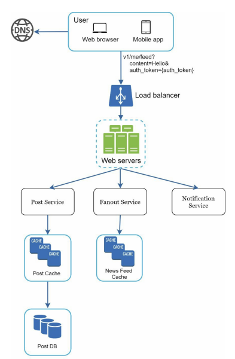
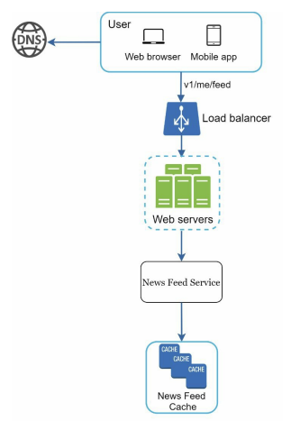
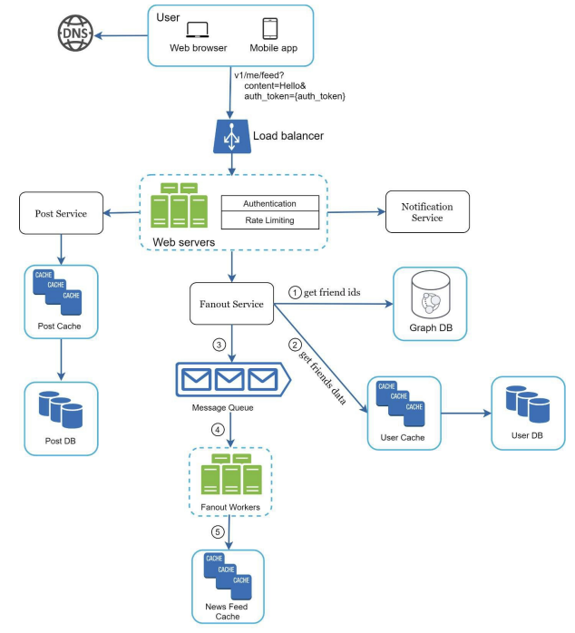
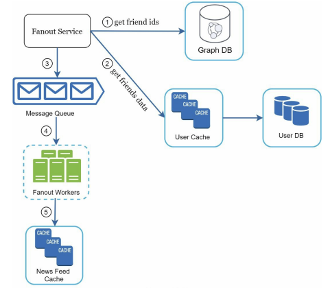
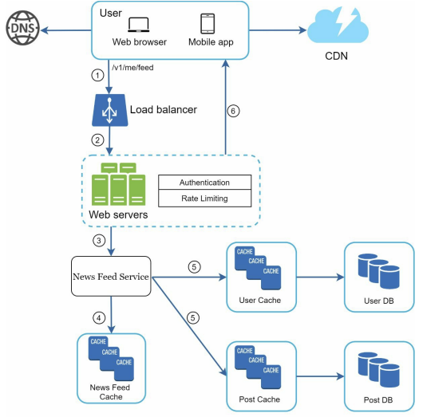
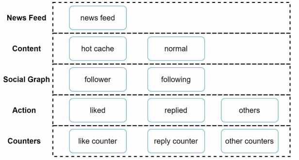

# **뉴스 피드 시스템 설계**

---

# 1단계 문제 이해 및 설계 범위 확정

1. 모바일 앱과 웹 둘 다 지원
2. 중요한 기능: 뉴스 피드 페이지에 새로운 스토리 업로드, 친구들이 올리는 스토리 보기
3. 뉴스 피드에는 시간 흐름 역순으로 스토리가 표시
4. 한 명의 사용자는 최대 5,000명의 친구를 가질 수 있음
5. 트래픽은 매일 천만 명 (10million DAU)
6. 스토리에는 이미지나 비디오 등의 미디어 파일이 포함될 수 있다.

---

# 2단계 개략적 설계안 제시 및 동의 구하기

- `피드 발행`: 사용자가 스토리를 포스팅하면 해당 데이터를 캐시와 데이터베이스에 기록한다. 새 포스팅은 친구의 뉴스 피드에도 전송된다.
- `뉴스 피드 생성`: 지면 관계상 뉴스 피드는 모든 친구의 포스팅을 시간 흐름 역순으로 모아서 만든다고 가정한다.

---

## 뉴스 피드 API

뉴스 피드 API: 클라이언트가 서버와 통신하기 위해 사용하는 수단이다.
- HTTP 프로토콜 기반

---

**피드 발행 API**

새 스토리를 포스팅하기 위한 API다. HTTP POST 형태로 요청을 보내면 된다.
`POST /v1/me/feed`

인자:
- 바디(body): 포스팅 내용에 해당한다.
- Authorization 헤더: API 호출을 인증하기 위해 사용한다.

---

**피드 읽기 API**

뉴스 피드를 가져오는 API다.
`GET /v1/me/feed`

인자:
- Authorization 헤더: API 호출을 인증하기 위해 사용한다.

---

## 피드 발행

피드 발행 시스템의 개략적 형태

- 사용자: 모바일 앱이나 브라우저에서 새 포스팅을 올리는 주체다. `POST /v1/me/feed` API를 사용한다.
- 로드 밸런서: 트래픽을 웹 서버들로 분산한다.
- 웹 서버: HTTP 요청을 내부 서비스로 중계하는 역할을 담당한다.
- 포스팅 저장 서비스(post service): 새 포스팅을 데이터베이스와 캐시에 저장한다.
- 포스팅 전송 서비스(fanout service): 새 포스팅을 친구의 뉴스 피드에 푸시한다. 뉴스 피드 데이터는 캐시에 보관하여 빠르게 읽어갈 수 있도록 한다.
- 알림 서비스(notification service): 친구들에게 새 포스팅이 올라왔음을 알리거나, 푸시 알림을 보내는 역할을 담당한다.

---

## 뉴스 피드 생성

- 사용자: 뉴스 피드를 읽는 주체다. `GET /v1/me/feed` API를 이용한다.
- 로드 밸런서: 트래픽을 웹 서버들로 분산한다.
- 웹 서버: 트래픽을 뉴스 피드 서비스로 보낸다.
- 뉴스 피드 서비스(news feed service): 캐시에서 뉴스 피드를 가져오는 서비스다.
- 뉴스 피드 캐시(news feed cache): 뉴스 피드를 렌더링할 때 필요한 피드 ID를 보관한다.

---

# 3단계 상세 설계

## 피드 발행 흐름 상세 설계

**웹 서버**
웹 서버는 클라이언트와 통신할 뿐 아니라 인증이나 처리율 제한 등의 기능도 수행한다. 올바른 인증 토큰을 Authorization 헤더에 넣고 API를 호출하는 사용자만 포스팅할 수 있어야 한다.
또한, 스팸을 막고 유해한 콘텐츠가 자주 올라오는 것을 방지하기 위해서 특정 기간 동안 한 사용자가 올릴 수 있는 포스팅의 수 제한을 두어야 한다.

**포스팅 전송(팬아웃) 서비스**
포스팅 전송(팬아웃): 어떤 사용자의 새 포스팅을 그 사용자와 친구 관계에 있는 모든 사용자에게 전달하는 과정이다. 팬 아웃에는 두 가지 모델이 있는데 하나는 쓰기 시점에 팬아웃(fanout-on-write)하는 모델이고(푸시 모델), 다른 하나는 읽기 시점에 팬아웃(fanout-on-read)하는 모델이다(풀 모델).

- `쓰기 시점에 팬아웃하는 모델`: 새로운 포스팅을 기록하는 시점에 뉴스 피드를 갱신하게 된다. 다시 말해, 포스팅이 완료되면 바로 해당 사용자의 캐시에 해당 포스팅을 기록하는 것이다.
- 장점
	- 뉴스 피드가 실시간으로 갱신되며 친구 목록에 있는 사용자에게 즉시 전송된다.
	- 새 포스팅이 기록되는 순간에 뉴스 피드가 이미 갱신되므로(pre-computed) 뉴스 피드를 읽는 데 드는 시간이 짧아진다.
- 단점
	- 친구가 많은 사용자의 경우 친구 목록을 가져오고 그 목록에 있는 사용자 모두의 뉴스 피드를 갱신하는 데 많은 시간이 소요될 수도 있다. 핫키(hotkey)라고 부르는 문제다.
	- 서비스를 자주 이용하지 않는 사용자의 피드까지 갱신해야 하므로 컴퓨팅 자원이 낭비된다.

- `읽기 시점에 팬아웃하는 모델`: 피드를 읽어야 하는 시점에 뉴스 피드를 갱신한다. 따라서 요청 기반(on-demand) 모델이다. 사용자가 본인 홈페이지나 타임라인을 로딩하는 시점에 새로운 포스트를 가져오게 된다.
- 장점
	- 비활성화된 사용자, 또는 서비스에 거의 로그인하지 않는 사용자의 경우에는 이 모델이 유리하다. 로그인하기까지는 어떤 컴퓨팅 자원도 소모하지 않는다.
	- 데이터를 친구 각각에 푸시하는 작업이 필요 없으므로 핫키 문제도 생기지 않는다.
- 단점
	- 뉴스 피드를 읽는 데 많은 시간이 소요될 수 있다.

---

본 설계안의 경우에는 이 두 가지 방법을 결합하여 장점은 취하고 단점은 버리는 전략을 취하도록 하겠다.
- 뉴스 피드를 빠르게 가져올 수 있도록 하는 것은 아주 중요하므로 대부분의 사용자에 대해서는 푸시 모델을 사용한다.
- 친구나 팔로워가 아주 많은 사용자의 경우에는 팔로워로 하여금 해당 사용자의 포스팅을 필요할 때 가져가도록 하는 풀 모델을 사용하여 시스템 과부하를 방지할 것이다.
- 안정 해시를 통해 요청과 데이터를 보다 고르게 분산하여 핫키 문제를 줄여볼 것이다.

팬아웃 서비스 부분만 자세히 살펴보자.

1. 그래프 데이터베이스에서 친구 ID 목록을 가져온다.
2. 사용자 정보 캐시에서 친구들의 정보를 가져온다. 그런 후에 사용자 설정에 따라 친구 가운데 일부를 걸러낸다.
3. 친구 목록과 새 스토리의 포스팅 ID를 메시지 큐에 넣는다.
4. 팬아웃 작업 서버가 메시지 큐에서 데이터를 꺼내어 뉴스 피드 데이터를 뉴스 피드 캐시에 넣는다. 뉴스 피드 캐시는 <포스팅 ID, 사용자 ID>의 순서쌍을 보관하는 매핑 테이블이라고 볼 수 있다.
   사용자 정보와 포스팅 정보를 전부 이 테이블에 저장하지 않는 이유는, 그렇게 하면 메모리 요구량이 지나치게 늘어날 수 있기 때문이다. 따라서 ID만 보관한다.
   또한 메모리 크기를 적정 수준으로 유지하기 위해서, 이 캐시의 크기에 제한을 두며, 해당 값은 조정이 가능하도록 한다.

---

## 피드 읽기 흐름 상세 설계

이미지나 비디오와 같은 미디어 콘텐츠는 CDN에 저장하여 빨리 읽어갈 수 있도록 하였다.

1. 사용자가 뉴스 피드를 읽으려는 요청을 보낸다. 요청은 `/v1/me/feed`로 전송될 것이다.
2. 로드밸런서가 요청을 웹 서버 가운데 하나로 보낸다.
3. 웹 서버는 피드를 가져오기 위해 뉴스 피드 서비스를 호출한다.
4. 뉴스 피드 서비스는 뉴스 피드 캐시에서 포스팅 ID 목록을 가져온다.
5. 뉴스 피드에 표시할 사용자 이름, 사용자 사진, 포스팅 컨텐츠, 이미지 등을 사용자 캐시와 포스팅 캐시에서 가져와 완전한 뉴스 피드를 만든다.
6. 생성된 뉴스 피드를 JSON 형태로 클라이언트에게 보낸다. 클라이언트는 해당 피드를 렌더링한다.

---

## 캐시 구조

캐시는 뉴스 피드 시스템의 핵심 컴포넌트다.
본 설계안의 경우에는 아래와 같이 캐시를 다섯 계층으로 나눈다.

- `뉴스 피드`: 뉴스 피드의 ID를 보관한다.
- `컨텐츠`: 포스팅 데이터를 보관한다. 인기 컨텐츠는 따로 보관한다.
- `소셜 그래프`: 사용자 간 관계 정보를 보관한다.
- `행동(action)`: 포스팅에 대한 사용자의 행위에 관한 정보(좋아요, 댓글)를 보관한다.
- `횟수(counter)`: '좋아요' 횟수, 응답 수, 팔로어 수, 팔로잉 수 등의 정보를 보관한다.

---

# 4단계 마무리

이번 설계안은 뉴스 피드 발행과 생성의 두 부분으로 구성되어 있다.

다루면 좋을 만한 주제

**데이터베이스의 규모 확장**
- 수직적 규모 확장 vs 수평적 규모 확장
- SQL vs NoSQL
- 주-부(master-slave) 다중화
- 복제본(replica)에 대한 읽기 연산
- 일관성 모델(consistency model)
- 데이터베이스 샤딩(sharding)

이 외에도 논의해보면 좋을 만한 주제
- 웹 계층을 무상태로 운영하기
- 가능한 한 많은 데이터를 캐시할 방법
- 여러 데이터 센터를 지원할 방법
- 메시지 큐를 사용하여 컴포넌트 사이의 결합도 낮추기
- 핵심 메트릭(key metric)에 대한 모니터링, 예를 들어 트래픽이 몰리는 시간대의 QPS, 사용자가 뉴스 피드 새로고침할 때의 지연시간
