# 14장 유튜브 설계

---

# 1단계 문제 이해 및 설계 범위 확정

- 빠른 비디오 업로드
- 원활한 비디오 재생
- 재생 품질 선택 기능
- 낮은 인프라 비용
- 높은 가용성과 규모 확장성, 그리고 안정성
- 지원 클라이언트: 모바일 앱, 웹브라우저, 스마트 TV

---

## 개략적 규모 추정

- 일간 능동사용자 수는 5백만
- 한 사용자는 하루에 평균 5개의 비디오를 시청
- 10%의 사용자가 하루에 1비디오 업로드
- 비디오 평균 크기는 300MB
- 비디오 저장을 위해 매일 새로 요구되는 저장 용량 = 5백만 x 10% x 300MB = 150TB
- CDN 비용
    - 클라우드 CDN을 통해 비디오를 서비스할 경우 CDN에서 나가는 데이터의 양에 따라  과금한다.

CDN을  통해 비디오를 서비스하면 비용이 엄청나다.

---

# 2단계 개략적 설계안 제시 및 동의 구하기

CDN과 BLOB 스토리지의 경우에는 기존 클라우드 서비스를 활용

- 규모 확장이 쉬운 BLOB 저장소나 CDN을 만드는 것은 지극히 복잡할 뿐 아니라 많은 비용이 드는 일이다.
- 넷플릭스는 아마존의 클라우드 서비스를 사용하고, 페이스북은 아카마이의 CDN을 이용한다.

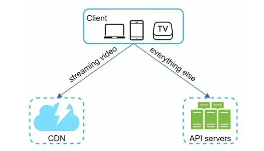

- 단말(client): 컴퓨터, 모바일 폰, 스마트 TV를 통해서 유튜브를 시청할 수 있다.
- CDN: 비디오는 CDN에 저장한다. 재생 버튼을 누르면 CDN으로부터 스트리밍이 이루어진다.
- API 서버: 비디오 스트리밍을 제외한 모든 요청은 API 서버가 처리한다. 피드 추천, 비디오 업로드 URL 생성, 메타데이터 데이터베이스와 캐시 갱신, 사용자 가입 등등이 API 서버가 처리하는 작업이다.

---

## 비디오 업로드 절차

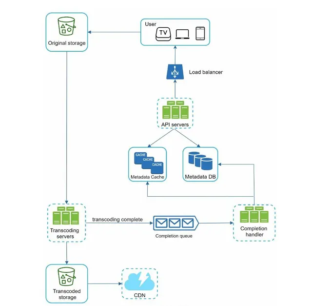

- 사용자: 컴퓨터나 모바일 폰, 혹은 스마트 TV를 통해 유튜브를 시청하는 이용자다.
- 로드밸런서: API 서버 각각으로 고르게 요청을 분산하는 역할을 담당한다.
- API 서버: 비디오 스트리밍을 제외한 다른 모든 요청을 처리한다.
- 메타데이터 데이터베이스: 비디오의 메타데이터를 보관한다.
    - 샤딩과 다중화를 적용하여 성능 및 가용성 요구사항을 충족한다.
- 메타데이터 캐시: 성능을 높이기 위해 비디오 메타데이터와 사용자 객체는 캐시한다.
- 원본 저장소: 원본 비디오를 보관할 대형 이진 파일 저장소(BLOB, Binary Large Object storage) 시스템
    - BLOB 저장소는 이진 데이터를 하나의 개체로 보관하는 데이터베이스 관리 시스템이다.
- 트랜스코딩 서버: 비디오 트랜스코딩은 비디오 인코딩이라 부르기도 하는 절차로, 비디오의 포맷(MPEG, HLS 등)을 변환하는 절차다. 단말이나 대역폭 요구사항에 맞는 최적의 비디오 스트림을 제공하기 위해 필요하다.
- 트랜스코딩 비디오 저장소: 트랜스코딩이 완료된 비디오를 저장하는 BLOB 저장소다.
- CDN :  비디오를 캐시하는 역할을 담당한다. 사용자가 재생 버튼을 누르면 비디오 스트리밍은 CDN을 통해 이루어진다.
- 트랜스코딩 완료 큐: 비디오 트랜스코딩 완료 이벤트들을 보관할 메시지 큐다.
- 트랜스코딩 완료 핸들러: 트랜스코딩 완료 큐에서 이벤트 데이터를 꺼내어 메타데이터 캐시와 데이터베이스를 갱신할 작업 서버들이다.

---

## 프로세스 a: 비디오 업로드

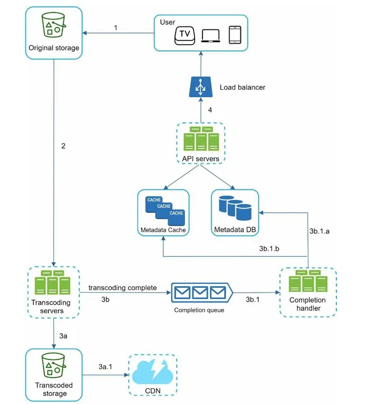

1. 비디오를 원본 저장소에 업로드한다.
2. 트랜스코딩 서버는 원본 저장소에서 해당 비디오를 가져와 트랜스코딩을 시작한다.
3. 트랜스코딩이 완료되면 아래 두 절차가 병렬적으로 수행된다.
    1. 완료된 비디오를 트랜스코딩 비디오 저장소로 업로드한다.
    2. 트랜스코딩 완료 이벤트를 트랜스코딩 완료 큐에 넣는다.
        
        3a.1. 트랜스코딩이 끝난 비디오를 CDN에 올린다.
        
        3b.1. 완료 핸들러가 이벤트 데이터를 큐에서 꺼낸다.
        
        3b.1.a, 3b.1.b. 완료 핸들러가 메타데이터 데이터베이스와 캐시를 갱신한다.
        
4. API 서버가 단말에게 비디오 업로드가 끝나서 스트리밍 준비가 되었음을 알린다.

---

## 프로세스 b: 메타데이터 갱신

원본 저장소에 파일이 업로드되는 동안, 단말은 병렬적으로 비디오 메타데이터 갱신 요청을 API 서버에 보낸다.

이 요청에 포함된 메타데이터에는 파일 이름, 크기, 포맷 등의 정보가 들어 있다.

API 서버는 이 정보로 메타데이터 캐시와 데이터베이스를 업데이트한다.

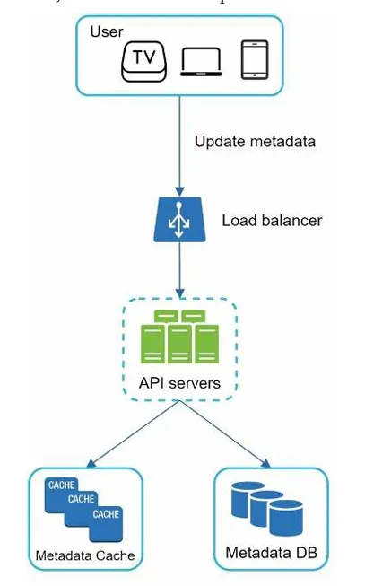

---

## 비디오 스트리밍 절차

스트리밍은 여러분의 장치가 원격지의 비디오로부터 지속적으로 비디오 스트림을 전송 받아 영상을 재생하는 것을 말한다.

스트리밍 프로토콜은 비디오 스트리밍을 위해 데이터를 전송할 때 쓰이는 표준화된 통신방법이다.

- 프로토콜마다 지원하는 비디오 인코딩이 다르고 플레이어도 다르다
- 비디오 스트리밍 서비스를 설계할 때는 서비스의 용례에 맞는 프로토콜을 잘 골라야 한다.

비디오는 CDN에서 바로 스트리밍된다.

사용자의 단말에 가장 가까운 CDN 에지 서버가 비디오 전송을 담당할 것이다.

따라서 전송지연은 아주 낮다.

---

# 3단계 상세 설계

---

## 비디오 트랜스코딩

비디오를 녹화하면 단말은 해당 비디오를 특정 포맷으로 저장한다.

이 비디오가 다른 단말에서도 순조롭게 재생되려면 다른 단말과 호환되는 비트레이트와 포맷으로 저장되어야 한다.

- 비트레이트는 비디오를 구성하는 비트가 얼마나 빨리 처리되어야 하는지를 나타내는 단위다.
    - 비트레이트가 높은 비디오는 일반적으로 고화질 비디오다.
    - 비트레이트가 높은 비디오 스트림을 정상 재생하려면 보다 높은 성능의 컴퓨팅 파워가 필요하고, 인터넷 회선 속도도 빨라야 한다.

---

### 비디오 트랜스코딩이 중요한 이유

- 가공되지 않은 원본 비디오는 저장 공간을 많이 차지한다.
    
    가령 초당 60프레임으로 녹화된 HD 비디오는 수백 GB 저장공간을 차지하게 될 수 있다.
    
- 상당수의 단말과 브라우저는 특정 종류의 비디오 포맷만 지원한다.
    - 호환성 문제를 해결하려면 하나의 비디오를 여러 포맷으로 인코딩해 두는 것이 바람직하다.
- 사용자에게 끊김 없는 고화질 비디오 재생을 보장하려면, 네트워크 대역폭이 충분하지 않은 사용자에게는 저화질 비디오를, 대역폭이 충분한 사용자에게는 고화질 비디오를 보내는 것이 바람직하다.
- 모바일 단말의 경우 네트워크 상황이 수시로 달라질 수 있다.
- 비디오가 끊김 없이 재생되도록 하기 위해서는 비디오 화질을 자동으로 변경하거나 수동으로 변경할 수 있도록 하는 것이 바람직하다.

---

### 인코딩 포맷 구성 요소

- 컨테이너: 비디오 파일, 오디오, 메타데이터를 담는 바구니 같은 것이다.
    - 컨테이너 포맷은 .avi, .mov, .mp4 같은 파일 확장자를 보면 알 수 있다.
- 코덱: 비디오 화질은 보존하면서 파일 크기를 줄일 목적으로 고안된 압축 및 압축 해제 알고리즘이다.
    - 가장 많이 사용되는 비디오 코덱으로는 H.264, VP9, HEVC가 있다.

---

## 유향 비순환 그래프(DAG) 모델

비디오를 트랜스코딩하는 것은 컴퓨팅 자원을 많이 소모할 뿐 아니라 시간도 많이 드는 작업이다.

각기 다른 유형의 비디오 프로세싱 파이프라인을 지원하는 한편 처리 과정의 병렬성을 높이기 위해서는 적절한 수준의 추상화를 도입하여 클라이언트 프로그래머로 하여금 실행할 작업(task)을 손수 정의할 수 있도록 해야 한다.

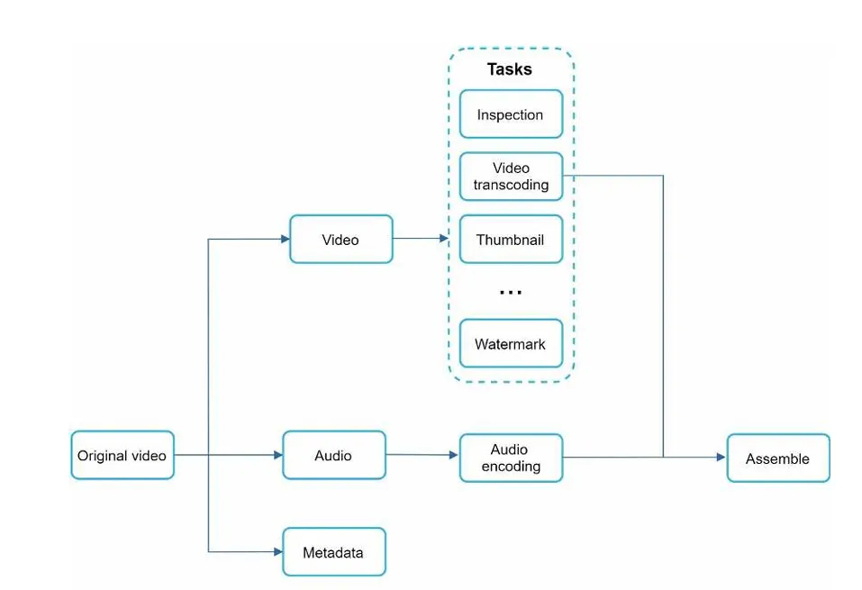

원본 비디오는 일단 비디오, 오디오, 메타데이터의 세 부분으로 나뉘어 처리된다.

---

### 비디오 부분

- 검사(inspection) : 좋은 품질의 비디오인지, 손상은 없는지 확인하는 작업이다.
- 비디오 인코딩(video encoding): 비디오를 다양한 해상도, 코덱, 비트레이트 조합으로 인코딩하는 작업이다.
- 섬네일(thumbnail): 사용자가 업로드한 이미지나 비디오에서 자동 추출된 이미지로 섬네일을 만드는 작업이다.
- 워터마크(watermark): 비디오에 대한 식별정보를 이미지 위에 오버레이 형태로 띄워 표시하는 작업이다.

---

## 비디오 트랜스코딩 아키텍처

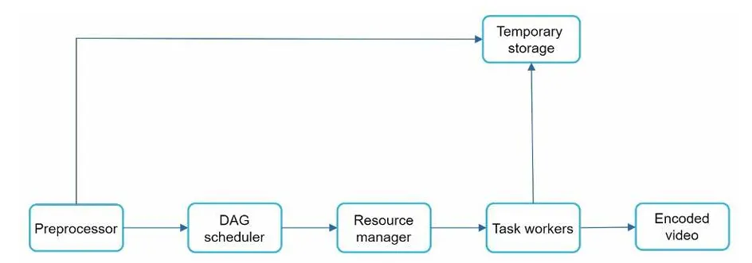

---

### 전처리기(preprocessor)

전처리기가 하는 일

1. 비디오 분할: 비디오 스트림을 GOP라고 불리는 단위로 쪼갠다. GOP 는 특정 순서로 배열된 프레임 그룹이다. 하나의 GOP는 독립적으로 재생 가능하며, 길이는 보통 몇 초 정도다.
2. DAG 생성: 클라이언트 프로그래머가 작성한 설정 파일에 따라 DAG를 만들어낸다. 
    - 밑의 그림은 2개 노드와 1개 연결선으로 구성된 DAG의 사례다.
        
        

        
3. 데이터 캐시: 전처리기는 분할된 비디오의 캐시이기도 하다. 안정성을 높이기 위해 전처리기는 GOP와 메타데이터를 임시 저장소에 보관한다. 비디오 인코딩이 실패하면 시스템은 이렇게 보관된 데이터를 활용해 인코딩을 재개한다.

---

## DAG 스케줄러

DAG 스케줄러는 DAG 그래프를 몇 개 단계로 분한할한 다음에 그 각각을 자원 관리자의 작업 큐에 집어넣는다.

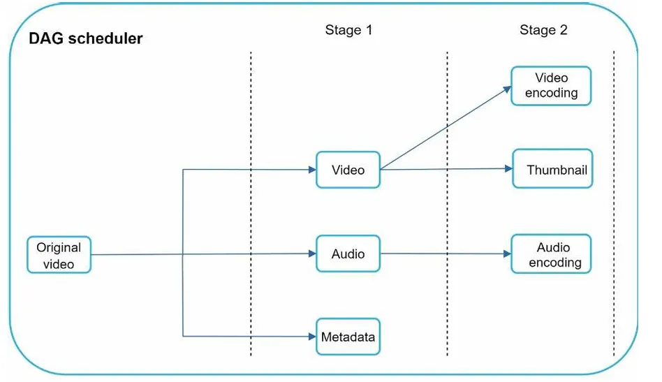

위의 그림은 하나의 DAG 그래프를 2개 작업 단계로 쪼갠 사례다. 

첫 단계에서는 비디오, 오디오, 메타데이터를 분리한다.

두 번째단계에선 해당 비디오 파일을 인코딩하고 섬네일을 추출하며, 오디오 파일 또한 인코딩한다.

---

## 자원 관리자

자원 관리자는 자원 배분을 효과적으로 수행하는 역할을 담당한다.

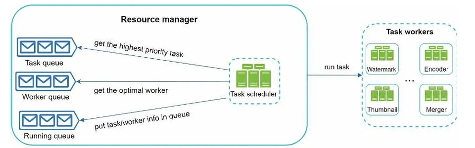

- 작업 큐(task queue): 실행할 작업이 보관되어 있는 우선순위 큐이다.
- 작업 서버 큐(worker queue): 작업 서버의  가용 상태 정보가 보관되어 있는 우선순위 큐다.
- 실행 큐(running queue): 현재 실행 중인 작업 및 작업 서버 정보가 보관되어 있는 큐다.
- 작업 스케줄러: 최적의 작업/서버 조합을 골라, 해당 작업 서버가 작업을 수행하도록 지시하는 역할을 담당한다.

자원 관리자는 다음과 같이 동작한다.

- 작업 관리자는 작업 큐에서 가장 높은 우선순위의 작업을 꺼낸다.
- 작업 관리자는 해당 작업을 실행하기 적합한 작업 서버를 고른다.
- 작업 스케줄러는 해당 작업 서버에게 작업 실행을 지시한다.
- 작업 스케줄러는 해당 작업이 어떤 서버에게 할당되었는지에 관한 정보를 실행 큐에 넣는다.
- 작업 스케줄러는 작업이 완료되면 해당 작업을 실행 큐에서 제거한다.

---

## 작업 서버

작업 서버는 DAG에 정의된 작업을 수행한다.

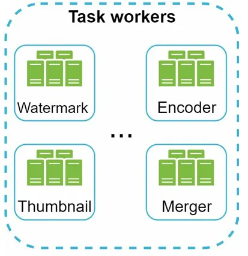

---

## 임시 저장소

임시 저장소 구현에는 여러 저장소 시스템을 활용할 수 있다.

어떤 시스템을 선택할 것이냐는 저장할 데이터의 유형, 크기, 이용 빈도, 데이터 유효기간 등에 따라 달라진다.

- 메타데이터는 작업 서버가 빈번히 참조하는 정보이고 그 크기도 작은 것이 보통이다.
    - 따라서 메모리에 캐시해 두면 좋을 것이다.
- 그러나 비디오/오디오 데이터는 BLOB 저장소에 두는 것이 바람직하다.

임시 저장소에 보관한 데이터는 비디오 프로세싱이 완료되면 삭제한다.

---

## 인코딩된 비디오

인코딩된 비디오는 인코딩 파이프라인의 최종 결과물이다.

- funny_720p.mp4같은 이름을 갖는다.

---

## 시스템 최적화

---

### 속도 최적화: 비디오 병렬 업로드

비디오 전부를 한 번의 업로드로 올리는 것은 비효율적이다.

하나의 비디오는 작은 GOP 들로 분할할 수 있다.

이렇게 분할한 GOP를 병렬적으로 업로드하면 설사 일부가 실패해도 빠르게 업로드를 재개할 수 있다.

따라서 비디오를 GOP 경계에 맞춰 분할하는 작업을 단말이 수행하면 업로드 속도를 높일 수 있다.

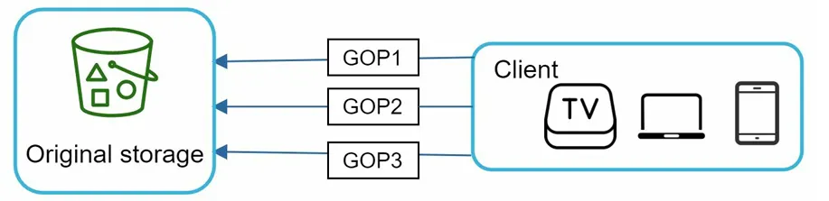

---

### 속도 최적화: 업로드 센터를 사용자 근거리에 지정

업로드 속도를 개선하는 또 다른 방법은 업로드 센터를 여러 곳에 두는 것이다.

→ CDN을 업로드 센터로 이용한다.

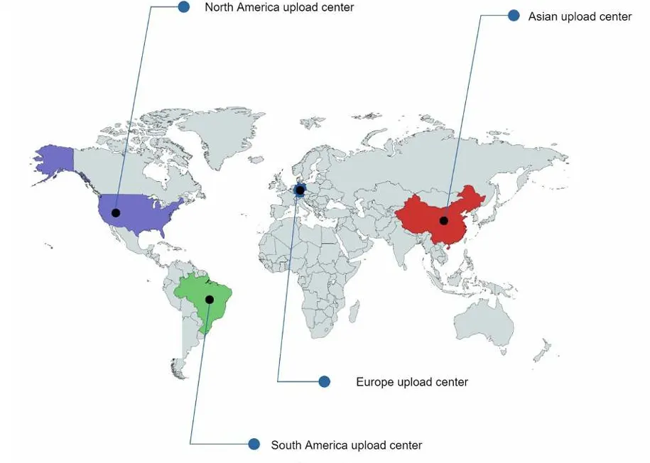

---

### 속도 최적화: 모든 절차를 병렬화

낮은 응답지연을 달성하는 것은 어려운 일이다.

이를 위한 방법으로, 느슨하게 결합된 시스템을 만들어서 병렬성을 높이는 것이다.

비디오를 원본 저장소에서 CDN으로 옮기는 절차를 보자

어떤 단계의 결과물은 이전 단계의 결과물을 입력으로 사용하여 만들어진다

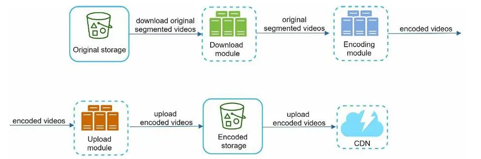

- 메시지 큐를 도입하기 전에 인코딩 모듈은 다운로드 모듈의 작업이 끝나기를 기다려야 했다.
- 메시지 큐를 도입한 뒤에 인코딩 모듈은 다운도르 모듈의 작업이 끝나기를 더 이상 기다릴 필요가 없다.
    
    메시지 큐에 보관된 이벤트 각각을 인코딩 모듈은 병렬적으로 처리할 수 있다.
    
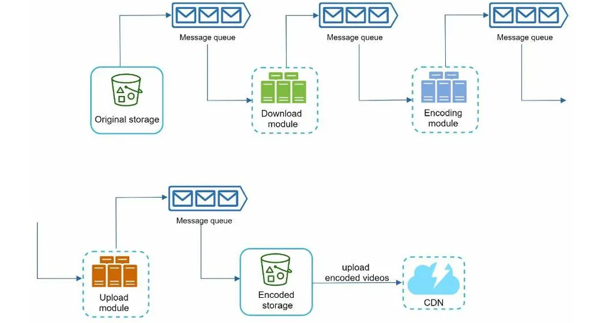

---

### 안정성 최적화: 미리 사인된 업로드 URL

허가받은 사용자만이 올바른 장소에 비디오를 업로드할 수 있도록 하기 위해, 미리 사인된 업로드 URL을 이용한다.

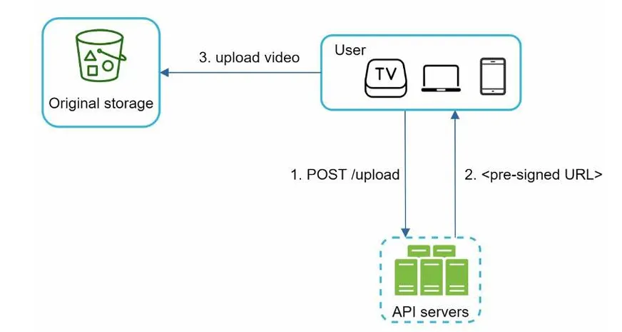

1. 클라이언트는 HTTP 서버에 POST요청을 하여 미리 사인된 URL을 받는다.
해당 URL이 가리키는 객체에 대한 접근 권한이 이미 주어져 있는 상태다.
2. API 서버는 미리 사인된 URL을 돌려준다.
3. 클라이언트는 해당 URL이 가리키는 위치에 비디오를 업로드한다.

---

### 안정성 최적화: 비디오 보호

많은 콘텐츠 제작자가 비디오를 인터넷에 업로드하기를 주저하는데, 비디오 원본을 도난 당할까 우려해서다.

- 디지털 저작권 관리 시스템 도입: 애플의 페어플레이, 구글의 와이드바인, 마이크로소프트의 플레이레디
- AES 암호화: 비디오를 암호화하고 접근 권한을 설정하는 방식, 암호화된 비디오는 재생 시에만 복호화한다. 허락된 사용자만 암호화된 비디오를 시청할 수 있다.
- 워터마크: 비디오 위에 소유자 정보를 포함하는 이미지 오버레이를 올리는 것이다.

---

### 비용 최적화

CDN은 시스템의 핵심 부분이다.

세계 어디서도 끊김 없이 빠르게 비디오를 시청할 수 있도록 해 준다.

하지만 CDN은 데이터 크기가 크면 클수록 비싸다.

1. 인기 비디오는 CDN을 통해 재생하되 다른 비디오는 비디오 서버를 통해 재생한다.
2. 인기가 별로 없는 비디오는 인코딩할 필요가 없을 수도 있다. 짧은 비디오라면 필요할 때 인코딩하여 재생할 수 있다.
3. 어떤 비디오는 특정 지역에서만 인기가 높다. 이런 비디오는 다른 지역에 옮길 필요가 없다.
4. CDN을 직접 구축하고 인터넷 서비스 제공자(ISP)와 제휴한다. 
CDN을 직접 구축하는 것은 초대형 프로젝트다.
ISP는 전세계 어디나 있으며 사용자와 가깝다.

---

### 오류 처리

장애를 아주 잘 감내하는 시스템을 만들려면 이런 오류를 우아하게 처리하고 빠르게 회복해야 한다.

- 회복 가능 오류: 특정 비디오 세그먼트를 트랜스코딩하다 실패했다든가 하는 오류는 회복 가능한 오류에 속한다. 일반적으로 보면 이런 오류는 재시도하면 해결된다.
- 회복 불가능 오류: 비디오 포맷이 잘못되었다거나 하는 회복 불가능한 오류가 발견되면 시스템은 해당 비디오에 대한 작업을 중단하고 클라이언트에게 적절한 오류 코드를 반환해야 한다.
