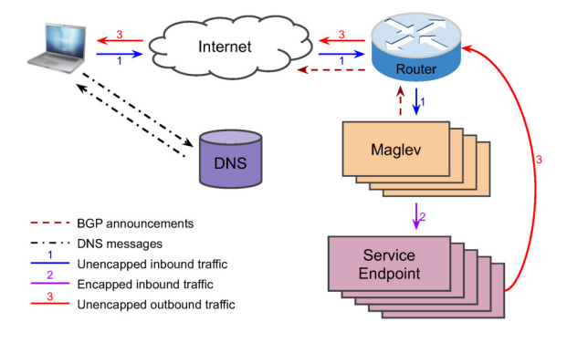

[https://static.googleusercontent.com/media/research.google.com/en//pubs/archive/44824.pdf]

# **Maglev**

**: 구글이 개발한 분산형 소프트웨어 네트워크 로드밸런서**

**→ consistent hashing 알고리즘 사용**

----
#### 1. 배경과 필요성
- 구글의 서비스는 초당 수백만 건의 요청을 처리하며, 낮은 지연시간을 위해 전 세계 클러스터에 서버가 분산되어 있다
- 특정 서버에 부하가 쏠리지 않도록 클러스터 내 트래픽을 효율적으로 분산하는 것이 필수이다
- 논리적으로 라우터와 서비스 엔드포인트 사이에 위치하여 패킷을 매칭하고 포워딩한다

#### 2. 기존 하드웨어 로드밸런서의 한계

| **구분** | **내용** |
| --- | --- |
| 확장성 제약 | 단일 장비의 최대 가용량에 전체 시스템 성능이 제한됨 |
| 가용성 부족 | 1+1 (Active-Passive) 방식의 단순 중복일 뿐, 진정한 고가용성 구현이 어려움 |
| 유연성 결여 | 새로운 기능 추가나 프로그래밍이 불가능에 가까움 |
| 고비용 | 장비 구매 및 물리적 배포 비용이 매우 비쌈 |

#### 3. 범용 서버 기반의 소프트웨어 로드밸런싱

구글은 특수 하드웨어 대신 범용 서버(Commodity Server)에서 실행되는 소프트웨어 시스템을 선택했다

- Scale-out 모델: 장비 개수를 늘리는 것만으로 시스템 전체 용량을 선형적으로 확장할 수 있다
- ECMP 포워딩: 라우터로부터 들어오는 트래픽을 모든 Maglev 장비에 고르게 분산한다
- N+M 중복성: 단순 쌍이 아닌 다수의 장비를 활용해 높은 가용성과 신뢰성을 제공한다
- 빠른 배포: 기존 클러스터 인프라를 그대로 사용하므로 테스트와 배포가 매우 빠르다

#### 4. Maglev 핵심 설계 및 특징

**① 초고속 패킷 처리 (High Throughput)**

- 작은 패킷으로도 10Gbps 라인 속도(Line Rate)를 달성한다
- 이를 통해 시스템 구축의 경제성을 확보했다

**② 연결 지속성 보장 (Connection Continuity)**

- **Connection Tracking:** 기존 연결 정보를 기억하여 동일한 엔드포인트로 패킷을 전달한다
- **Consistent Hashing (Maglev Hashing):** 장비 장애나 구성 변화가 잦은 역동적인 클러스터 환경에서도 패킷이 엉뚱한 곳으로 튀지 않도록 신뢰성을 보장한다

**③ 독립성 확보 (Isolation)**

- 클러스터 내부에서 서비스들을 여러 개의 샤드(Shard)로 분산 실행하여 시스템 간 간섭을 최소화한다

---

## **2. System Overview**

- **BGP(Border Gateway Protocol)**: 인터넷에서 데이터를 전송하는 데 가장 적합한 네트워크 경로를 결정하는 일련의 규칙
    - BGP Announcements: 인터넷의 서로 다른 네트워크들이 서로 어떤 IP 주소 대역을 보유하고 있는지, 그곳으로 가려면 어떤 경로를 거쳐야하는지 알리는 정보 교환 방식
- **DNS message**: DNS 프로토콜에서 도메인 이름과 IP 주소간의 변환 정보를 요청하거나 응답하기 위해 클라이언트와 서버 간에 주고받는 데이터 패킷 형식



: Maglev의 작동 원리와 데이터 흐름 시각화

#### 주요 구성 요소

- User (Laptop): 서비스를 이용하려는 사용자
- DNS: 도메인 이름 → 서버의 IP 주소
- Router: 외부 인터넷과 내부 네트워크를 연결하는 관문
- Maglev: 소브트웨어 기반의 로드밸런서로, 들어오는 요청을 여러 서버로 분산
- Service Endpoint: 실제로 서비스를 처리하는 개별 서버들

#### 데이터 흐름

- 사전 단계
    - **DNS messages**: 사용자가 웹사이트에 접속하기 전 DNS에 질의하여 IP주소를 받아온다
    - **BFP announcements**: 라우터와 Maglev 사이에서 경로 정보를 주고 받아, 인터넷 상의 트래픽이 Maglev로 향하도록 설정한다
      
- 트래픽 이동 경로
    - 1번 - **Unencapped inbound traffic**: 사용자의 요청이 인터넷과 라우터를 거쳐 Maglev로 들어온다. 이 단계에서는 아직 캡슐화 되지 않은 순수 상태이다
    - 2번 - **Encapped inbound traffic**: Maglev가 요청을 받으면 적절한 서비스 엔드포인트를 결정한다. 그 후, 패킷을 캡슐화하여 선택된 서버로 보낸다.
    - 3번 - **Unencapped outbound traffic**: 서비스 서버가 응답을 보낼 때는 Maglev를 다시 거치지 않고 라우터를 통해 사용자에게 직접 보낸다. 이를 DSR(Direct Server Return) 방식이라고 하며, 로드밸런서의 병목 현상을 줄여준다.
      
- 요약: 들어올 때는 Maglev를 거치고, 나갈 때는 서버가 직접 응답한다
  
----
### 2.1 Frontend Serving Architecture

개념: **VIP (Virtual IP)**

- 특정 물리적 서버가 아닌, 여러 서비스 엔드포인트를 대표하는 **가상 IP 주소**
- 사용자가 구글 서비스에 접속할 때 실제로 마주하는 주소로, Maglev가 이 VIP와 실제 서버들을 연결한다
    
    

**접속 및 데이터 흐름**

Step 1: 접속 시도 (DNS 단계)

- 사용자가 주소를 입력하면 DNS 서버가 사용자의 위치와 각 서버의 부하 상태를 확인하고, 가장 적절한 지역의 VIP를 사용자에게 알려준다

Step 2: 트래픽 진입 (Router 단계)

- 사용자의 요청 패킷이 라우터에 도착한다
- ECMP(Equal-Cost-Multi-Path) 기술을 사용하여 여러 대의 Maglev 장비 중 하나로 패킷을 고르게 분산하여 전달한다

Step 3: 부하 분산 및 전달 (Maglev 단계)

- 패킷을 받은 Maglev는 이를 처리할 최적의 서비스 엔드포인트를 선택한다
- GRE 캡슐화 - 원래 패킷을 외부 IP 헤더로 감싸서 선택된 서버로 보낸다

Step 4: 응답 반환 (DSR 단계)

- **Direct Server Return (DSR):** 서버는 요청을 처리한 후, 다시 Maglev를 거치지 않고 라우터를 통해 사용자에게 직접 응답을 보낸다
- 일반적으로 들어오는 요청보다 나가는 응답의 크기가 훨씬 크기 때문에, Maglev의 부하를 줄여 성능을 극대화한다

|  기술 용어   | 역할 설명 |
| ---- | ---- |
| **BGP** | 인터넷에서 데이터를 전송하는 데 가장 적합한 네트워크 경로를 결정하는 일련의 규칙으로, Maglev가 라우터에게 “내가 이 VIP를 담당하고 있다”라고 경로를 알리는 프로토콜 |
| **ECMP** | 동일한 목적지까지 여러개의 동일 비용 경로가 있을 때, 3계층 라우팅 레벨에서 트래픽을 분산시키는 기술 (Maglev 장비 간 분산)→ “어느 서버로 보낼까?" |
| **GRE** | 패킷을 다른 패킷 안에 집어넣어 목적지까지 배달하는 캡슐화 기술  |
| **DSR** | 응답 시 로드밸런서를 건너뛰고 서버가 클라이언트에게 직접 데이터를 보내는 방식 |
| Maglev | 구글이 만든 소프트웨어 로드밸런서 → “어느 LB 장비로 보낼까?”  |

 


Maglev 장비 내부의 소프트웨어 구조

### 2.2 Maglev Configuration

#### 1. 듀얼 엔진 구조: Controller & Forwarder

→ Maglev 장비 한 대는 크게 두 가지 엔진이 협력하여 작동함

- Controller - 설정 관리 + VIP 광고 + 상태 판
    - **Forwarder 상태 감시**: 포워더가 정상인지 주기적으로 체크함
    - **BGP 제어**: 포워더에 문제가 생기면 라우터에 알림을 보내 해당 장비로 트래픽이 들어오지 않도록 차단함
- Forwarder - 실제 트래픽 처리 (로드 밸런싱 수행)
    - **패킷 전달**: 사용자로부터 들어오는 모든 트래픽을 실제 엔드포인트로 전달
    - **서버 관리**: 여러 대의 서버를 그룹으로 묶어 관리하며, 각 서버의 health check를 진행해 정상적인 서버로만 데이터를 보낸다
      
    
```bash
IP → BP → VIP → Config Manager
```
    

① IP

- 실제 패킷을 받는 인터페이스
- ECMP 통해 들어온 트래픽이 여기로 들어옴

② BP (Backend Pool)

- 특정 VIP에 연결된 백엔드 서버 그룹
- 여기서 Maglev의 consistent hashing이 동작해서 이 요청이 어떤 서버로 갈지 결정된다
- ex) web server 10대

③ VIP (Virtual IP)

- 서비스 엔드포인트로, 클라이언트가 접속하는 주소
- VIP 하나당 여러 BP 연결 가능
    - A/B 테스트 → 새로운 기능 배포 테스트 중
    - 지역/네트워크 기반 분리 → 사용자 위치나 네트워크 특성에 따라 다른 서버 사용
    - 서비스 기능 분리 → 하나의 API에서 읽기 쓰기 분리
    - 장애 대응 → 평소에 한 그룹만 쓰다가 장애 시 전환
    - 트래픽 타입별 분리 → 모바일 vs 웹 트래픽 분리

---

#### 1. 설정 및 안정성
- 설정 업데이트: 외부 시스템으로부터 서비스할 VIP와 서버 정보를 받아 실시간으로 반영한다
- 중답 없이 변경: 설정을 변경할 때 시스템이 멈추지 않도로 한 번에 안정하게 적용함
- 연결 유지: 장비들 사이에 아주 미세한 설정 차이가 생기더라도, consistent hashing 기술을 통해 사용자의 접속이 끊기지 않도록 보호함

#### 2. Backend Pool 구조
- 자주 사용하는 서버들을 묶어 관리하며, 그룹 안에 다른 그룹을 포함할 수 있는 계층적 구조를 지원함
- 여러 그룹에 속한 동일한 서버의 경우, health check를 한 번만 수행하여 시스템의 부하를 줄임

#### 3. Sharding 샤딩
- 클러스터 내의 Maglev 장비들을 샤드별로 나누어 각기 다른 서비스를 담당하게 할 수 있음
- 특정 서비스에 트래픽이 몰려도 다른 서비스에 영향을 주지 않아서 새로운 기능을 특정 그룹에서만 미리 테스트해 보기에 용이함

----
## 3. Forwarder Design and Implementation

포워더는 엄청난 양의 패킷을 빠르고 안정적으로 처리해야 하므로 Maglev에서 매우 중요한 구성 요소이다. 

### 3.1 Overall Structure


#### 1. 커널 우회 (Kernel Bypass)
- 패킷 처리 과정에서 리눅스 커널을 완전히 배제함
- 커널을 거치는 오버헤드를 줄여 NIC와 포워더가 직접 소통함으로써 고속으로 처리함
  

#### 2. 일반적인 패킷 처리 방식 - 커널 사용

1 ) 외부에서 패킷이 들어오면 NIC가 이를 받음

2 ) NIC가 커널에 신호를 보내면, 커널이 패킷을 자신의 메모리 공간으로 가져옴

3 ) 커널이 패킷을 뜯어보며 TCP/IP 규격에 맞는지, 어디로 보낼지 등을 검사함

4 ) 검사가 끝나면 커널은 자신의 메모리에 있는 데이터를 애플리케이션(포워더)의 메모리 영역으로 복사함

5 ) 포워더가 데이터를 읽음

→ 데이터를 여기저기 복사하고 CPU가 커널모드와 사용자모드를 왔다 갔다 하느라 Context Switching 시간이 많이 소요됨

| 비교 항목 | **일반 방식 (Standard Kernel)** | **커널 우회 방식 (Kernel Bypass)** |
| --- | --- | --- |
| 중간 관리자 | 리눅스 커널 (안전하지만 느림) | 없음 (복잡하지만 매우 빠름) |
| 데이터 복사 | 커널 ↔ 앱 (최소 1회 이상 복사) | Zero-copy (복사 없음) |
| CPU 부하 | 모드 전환 및 복사로 부하 높음 | 패킷 처리에만 CPU 집중 가능 |
| 성능 | 초당 수십만 패킷 처리 수준 | 초당 수천만 패킷 처리 가능 |


#### 3. 패킷 처리 5단계 흐름

① 스티어링 (Steering)

- NIC로부터 들어온 패킷의 5-튜플 해시를 계산함
- 해시값에 따라 패킷을 여러 개의 수신 큐로 분산함

→ 동일한 연결의 패킷이 항상 같은 스레드에 할당되어 패킷 순서 뒤바뀜을 방지함 

② 필터링 (Filtering) 

- 패킷 스레드가 수신 큐에서 패킷을 꺼내 설정된 VIP와 대조함
- 구글 서비스와 관련 없는 불필요한 패킷은 이 단계에서 즉시 폐기함

③ 연결 추적 (Connection Tracking)

- 기존 연결 → 이전에 선택했던 서버가 살아있으면, 계산 없이 즉시 그 서버로 보냄
- 신규 연결 → 연결 테이블에 기록이 없으면 Consistent Hashing을 통해 새 서버를 선택하고 테이블에 저장함
- 스레드 간 간섭을 피하기 위해 각 스레드는 자신만의 연결 테이블을 가짐

④ 캡슐화 (Encapsulation)

- 선택된 서버로 패킷을 보내기 위해 원래 패킷 위에 GRE/IP 헤더를 덧씌움

⑤ 믹싱 (Muxing)

- 여러 스레드에서 처리가 끝난 패킷들을 한데 모아 NIC를 통해 외부로 전송함

| 기술 | 적용 이유 |
| --- | --- |
| 5-튜플 해싱 | 패킷 순서 보장 및 서버 선택 연산 최소화 |
| 스레드별 테이블 | 스레드 간 데이터 동기화로 인한 성능 저하(Contention) 방지 |
| 라운드 로빈 폴백 | 특정 큐가 가득 차는 과부하 상황 발생 시 트래픽을 강제 분산하여 유실 방지 |

**결론**

Maglev 포워더는 최대한 커널을 피하고, 스레드끼리 서로 간섭하지 않으며, 한 번 정한 서버는 끝까지 기억한다는 원칙으로 설계됨 → 이를 통해 수백만 개의 패킷을 지연 없이 처리함

----
### 3.2 Fast Packet Processing

Maglev 포워더는 구글의 방대한 트래픽 수요에 맞춰 제공 용량을 비용 효율적으로 확장하기 위해 패킷을 최대한 빠르게 처리해야 한다.


#### 1. 성능 목표
- 10Gbps 라인 레이트 달성
- 과제 → 작은 패킷의 경우 초당 906만 개를 처리해야 하는 높은 부하 발생

#### 2. 최적화 기술

① 커널 개입 X (Kernel Bypass)

- 리눅스 커널의 네트워크 스택을 사용하지 않고 사용자 공간에서 NIC와 직접 소통한다
- 커널을 거칠 때 발생하는 막대한 계산 비용을 제거함

② 데이터 복사 X (Zero-copy)

- 패킷 풀(Packet Pool) 공유: NIC와 포워더가 메모리 공간을 공유한다
- 링 큐(Ring Queue) 방식: 실제 데이터를 옮기지 않고, 데이터의 위치를 가리키는 포인터만 이동시켜 처리 속도를 극대화 한다
    - 수신: received → processed → reserved
    - 송신: sent → ready → recycled

③ 스레드 경합 X (Shared-nothing)

- 코어 고정(CPU Pinning): 각 패킷 스레드를 특정 CPU 코어에 할당하여 context switching을 방지한다
- 데이터 독립: 스레드 간에 데이터를 공유하지 않아, 자원 점유를 위한 대기 시간이 발생하지 않는다

#### 3. 지연 시간 Latency 관리

| 구분 | 소요 시간 | 발생 원인 및 특징 |
| --- | --- | --- |
| 일반 처리 | 약 350ns | 순수 패킷 처리 시간 → 매우 빠르다 |
| 저부하 시 | 최대 50µs | 패킷이 모일 때까지 기다리는 배치 타이머 대기 시간 |
| 과부하 시 | 최대 300µs | 패킷 풀이 가득 차서 처리를 기다리는 대기 시간 |

**결론**

Maglev는 범용 서버의 한계를 극복하기 위해 하드웨어 제어권을 직접 가져오고, CPU 코어를 극한으로 활용하는 구조를 채택함

### 3.3 Backend Selection

백엔드 선택 전략 → 연결의 일관성 유지

- TCP와 같은 연결 지향 프로토콜은 한 번 연결된 Backend로 모든 패킷이 계속 전달되어야 함
    - 연결 추적 테이블로 기억하고, 정보가 없으면 consistent hashing으로 서버를 결정

----

**1차 방어선 - Connection Tracking 연결 추적 테이블**

**작동방식** 

1) 패킷의 5-튜플 정보를 해시 테이블에 저장한다

2) 동일한 사용자의 패킷이 오면 테이블을 조회해 기존 서버로 즉시 전달한다

**장점**

- 서버가 추가/삭제되는 등 환경이 변해도 기존에 연결된 사용자는 끊김 없이 서비스를 이용할 수 있다

**한계**

- 장비 변경 대응 불가
    - 라우터(ECMP)에 의해 트래픽이 다른 Maglev 장비로 넘어가면, 새 장비에는 과거 기록이 없어 연결이 끊길 수 있다
    - 메모리 제한 → SYN 플러드 공격 등으로 테이블이 가득 차면 더 이상 새로운 연결을 기억할 수 없다

----
**2차 방어선 - Consistent Hashing 일관된 해싱**

- Connection Tracking이 없거나 사용할 수 없는 상황에 대비
- 특정 정보가 없어도 알고리즘에 의해 항상 일정한 서버를 선택하게 함
- 여러 대의 Maglev 장비가 있더라도, 동일한 패킷에 대해서는 모든 Maglev가 동일한 서버를 선택하도록 설계되어 있어 장비 이동 시에도 연결 유지가 가능함

| 시나리오 | 문제점 | Maglev의 해결책 |
| --- | --- | --- |
| Maglev 장비 점검/업그레이드 | 라우터가 트래픽을 다른 Maglev로 전달 (ECMP Shuffle) | **일관된 해싱**을 통해 어떤 장비로 가든 동일한 백엔드 서버를 선택 |
| 네트워크 공격 (SYN Flood) | 연결 추적 테이블이 가득 참 | 테이블이 없어도 **일관된 해싱**으로 서버를 일정하게 선택하여 서비스 유지 |
| 백엔드 서버 상태 변화 | 서버가 죽거나 새로 추가됨 | **연결 추적**이 우선적으로 기존 사용자를 보호하고, 나머지는 해싱으로 재분배 |

----
### 3.4 Consistent Hashing

기존의 Consistent Hashing 기술들이 서버가 추가/삭제될 때 변동 최소화에 집중했다면, Maglev는 **모든 서버에 트래픽을 얼마나 똑같이 나누느냐**를 최우선으로 한다.

- 서버 한 곳에 트래픽이 몰리면 전체 시스템 효율이 떨어짐
- 모든 백엔드 서버가 룩업 테이블(Lookup Table)에서 거의 정확히 같은 수의 칸을 차지하도록 설계함

#### 1. 알고리즘 작동 원리
- **우선순위 목록 생성** - 각 서버는 테이블의 모든 칸(0 ~ M-1)에 대해 자신이 선호하는 순위를 무작위로 가진다
- **순차적 자리 선점** - 서버들이 1번부터 N번까지 차례대로 돌아가며 자기 순서에 자신이 가장 좋아하는 칸 하나를 선택해 자신의 이름을 적는다
- 테이블의 모든 칸이 가득 찰 때까지 이 과정을 반복한다

→ 결과적으로, 모든 서버는 테이블에서 동일한 개수의 칸을 확보하게 된다

#### 2. 일반 Consistent Hashing vs Maglev Hashing 
- 구조의 차이: 링(Ring) vs 표(Table)
    - **일반 Consistent Hashing**: 거대한 Ring에 서버와 데이터를 배치한다. 데이터는 시계 방향으로 가장 가까운 서버를 찾아간다
    - **Maglev Hashing**: 정해진 크기의 Lookup Table을 사용한다. 모든 칸은 어떤 서버가 주인인지 이미 결정되어 있고, 패킷은 해시값을 인덱스로 삼아 테이블에서 서버를 바로 찾는다
- 우선순위의 차이: 번동 최소화 vs 부하 분산
    - **일반 Consistent Hashing**: 서버가 추가되거나 삭제될 때, 영향을 받는 구간의 데이터만 이동시키는데 최적화 되어있음. 트래픽이 특정 서버에 쏠릴 위험을 방지하기 위해 가상노드를 사용하면 구조가 복잡해짐
    - **Maglev Hashing**: 로드밸런싱을 강조하며, 모든 서버가 정확히 똑같은 양의 칸을 나눠 갖는 것에 집중한다. 서버가 수백 대여도 모든 서버의 부하가 1% 오차 내외로 완벽하게 균등 분배된다.

| 비교 항목 | 일반 Consistent Hashing | Maglev Hashing |
| --- | --- | --- |
| 핵심 원리 | 해시 링 위에서 가장 가까운 노드 선택 | 서버별 선호도 순위에 따라 테이블 칸 점유 |
| 균등성 | 가상 노드 수에 따라 확률적으로 결정 | 수학적으로 거의 완벽한 균등 보장 |
| 조회 속도 | 이진 탐색 등 | O(1) 배열 인덱스 참조로 끝 |
| 주 사용처 | 분산 캐시(Memcached, Redis 등) | 고성능 네트워크 부하 분산기(Maglev) |

#### 3. 구글이 Maglev 방식을 새로 만든 이유

: 일반적인 방식은 서버 한두 대가 죽었을 때 이동하는 데이터 양을 최소화하는 데 유리하지만, 구글의 VIP 하나에 수백 대가 물려있는 상황에서는 모든 서버에 1/N으로 딱 맞게 배분하는 것이 장비 효율면에서 훨씬 중요하기 때문이다.

----
## 4. Operational Experience

변화하는 요구사항에 맞춰 Maglev가 어떻게 발전했는지, 그리고 시스템을 모니터링하고 디버깅하기 위해 만든 도구들이 무엇인지에 대해 설명한다.

### 4.1 Evolution of Maglev

#### 1. 페일오버 Failover
- 과거: 하드웨어 장비처럼 Active-Passive 쌍으로 운영함. 장비 절반이 항상 쉬는 상태라 자원 효율이 낮고 확장이 어려웠음
- 현재: **ECMP 모델**로 전환함. 모든 Maglev 장비가 동시에 트래픽을 처리하여 전체 용량을 극대화하고 운영 구조를 단순화함
#### 2. 패킷 처리 Packet Processing
- 과거: 리눅스 커널 네트워크 스택을 사용. 인터럽트, 컨텍스트 스위칭, 데이터복사로 인한 오버헤드가 큼
- 현재: **커널 우회(Kernel Bypass)** 메커니즘 도입. 불필요한 스택을 제거하고 직접 처리하여 장비당 처리량을 5배 이상 향상시킴

### 4.2 VIP Matching

비상시 트래픽을 타 클러스터로 보낼 때, 모든 VIP 정보를 실시간으로 동기화하기 어려움

→ Prefix(클러스터 그룹) / Suffx(서비스 유형) 매칭 방식 도입

- 유연한 확장성 확보
- Maglev가 처음 접하는 클러스터의 트래픽이라도 미리 정의된 명명 규칙에 따라 정확한 서비스 풀로 전달 가능

### 4.3 Fragment Handling

패킷이 쪼개지면 일부 조각에는 포트 정보가 없어 일반적인 5-튜플 해싱이 불가능함

[해결]

1. IP 주소 기반 3-튜블 해시를 사용해 클러스터 내의 특정 Maglev 장비 한 대로 모든 조각을 모음
2. 조각을 모은 Maglev가 첫 번째 패킷 정보를 바탕으로 나머지 조각들도 동일한 서버로 배달하도록 관리

### 4.4 Monitoring and Debugging

- 화이트박스/블랙박스 모니터링
    - 외부 도달 가능성과 내부 지표를 실시간으로 감시하여 장애 시 즉시 알림을 보냄
- Packet-tracer: 복잡한 네트워크 경로 중 어느 Maglev와 어느 백엔드 서버를 거쳤는지 추적하는 특수 패킷 도구
    - 특수 표식 패킷을 보내 실제 거쳐가는 Maglev 장비 이름과 선택된 서버 정보를 추적
    - 분산 환경의 가시성 확보에 핵심적인 역할을 수행
