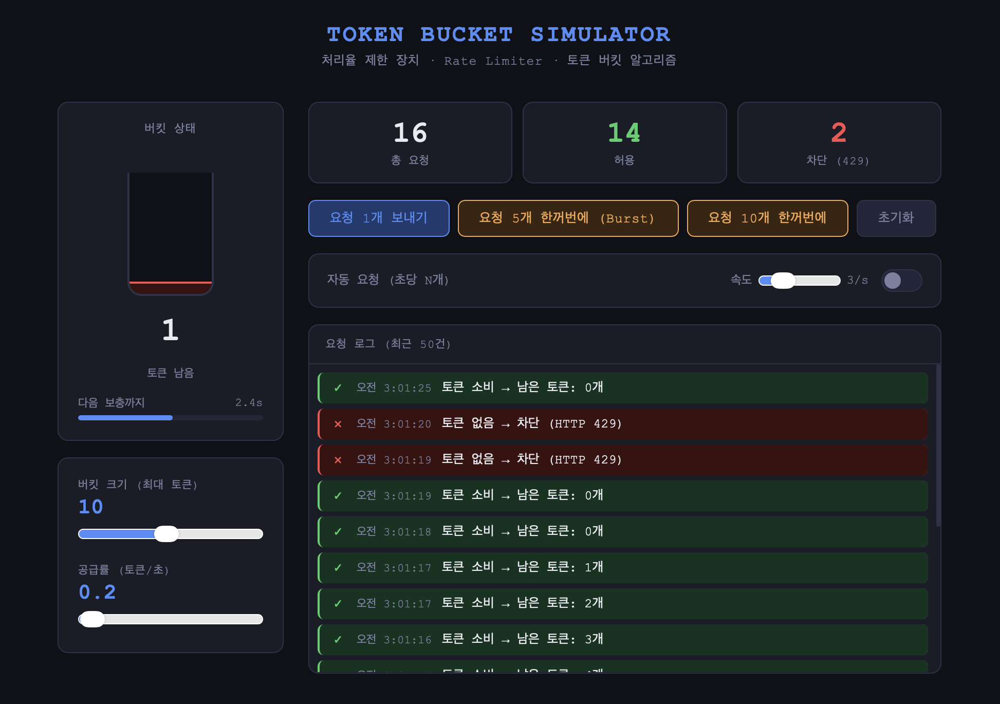

[🔗 노션 링크](https://www.notion.so/3-4-5-presenatation-md-3382c2a9e09280db81ace74dbc32317a?source=copy_link)

# 토큰 버킷 알고리즘 구현

`token_bucket_simulator.html`

처리율 제한 장치에 대한 이해를 높이고자, 5가지 알고리즘 중 토큰 버킷 알고리즘을 구현해보았습니다.



## **1. 이용 방법**

### **개요**

토큰 버킷 알고리즘은 처리율 제한(Rate Limiting)을 구현하는 대표적인 방법입니다. 이 시뮬레이터는 토큰 버킷의 동작을 시각적으로 보여주며, 요청 처리, 토큰 공급, 통계 확인 등을 실시간으로 테스트할 수 있습니다.

### **시작하기**

1. 브라우저에서 token_bucket_simulator.html 파일을 엽니다.
2. 페이지가 로드되면 기본 설정(버킷 크기: 10토큰, 공급률: 0.2토큰/초)으로 시작합니다.

### **UI 구성 및 사용법**

### 왼쪽 영역 (버킷 상태)

- **버킷 시각화**: 물통 모양으로 현재 토큰 수를 표시합니다. 높이가 토큰 수에 비례합니다.
- **토큰 수 표시**: "10 토큰 남음"처럼 현재 토큰 수를 숫자로 보여줍니다.
- **보충 진행 바**: 다음 토큰 공급까지 남은 시간을 프로그레스 바로 표시합니다.

### 왼쪽 영역 (컨트롤)

- **버킷 크기 슬라이더**: 최대 토큰 수를 1~20개로 조절합니다. 변경 시 즉시 적용됩니다.
- **공급률 슬라이더**: 토큰 공급 속도를 0.1~10 토큰/초로 조절합니다. (기본값: 0.2, 즉 10초에 2토큰)

### 오른쪽 영역 (통계 및 컨트롤)

- **통계 카드**:
    - 총 요청: 보낸 요청 총 수
    - 허용: 성공한 요청 수 (토큰이 있었을 때)
    - 차단: 실패한 요청 수 (토큰이 없어 429 에러)
- **요청 버튼**:
    - "요청 1개 보내기": 단일 요청 테스트
    - "요청 5개 한꺼번에 (Burst)": 버스트 요청 테스트
    - "요청 10개 한꺼번에": 대량 요청 테스트
    - "초기화": 모든 상태를 초기화
- **자동 요청**:
    - 토글 스위치로 자동 요청 모드 켜기/끄기
    - 속도 슬라이더: 초당 요청 수 (1~10개/초)
- **요청 로그**: 최근 50건의 요청 결과를 시간순으로 표시 (허용/차단 아이콘 포함)

### **사용 팁**

- 토큰이 부족하면 요청이 차단됩니다. 공급률을 높여 토큰을 빠르게 채우거나, 버킷 크기를 늘려보세요.
- 자동 모드로 지속적인 요청을 보내며 알고리즘 동작을 관찰할 수 있습니다.
- 로그를 통해 각 요청의 성공/실패를 실시간으로 확인하세요.

## **2. 구현 내용**

### **파일 구조**

- **HTML**: 페이지 구조 정의 (`<head>`, `<body>`)
- **CSS**: 스타일링 (다크 테마, 그리드 레이아웃, 애니메이션)
- **JavaScript**: 토큰 버킷 알고리즘 구현 및 UI 상호작용

### **주요 알고리즘 (토큰 버킷)**

토큰 버킷은 다음과 같이 동작합니다:

- 버킷에 최대 `cap`개의 토큰을 저장할 수 있습니다.
- 매 `1/rate`초마다 1개의 토큰이 추가됩니다. (rate: 토큰/초)
- 요청이 오면 1개의 토큰을 소비합니다. 토큰이 없으면 요청을 거부합니다.
- 이 시뮬레이터는 100ms마다 `tick()` 함수를 호출하여 보충 로직을 실행합니다.

### **JavaScript 주요 코드 설명**

### 상태 변수

```jsx
let cap = 10, rate = 0.2;  // 버킷 크기, 공급률
let tokens = cap;           // 현재 토큰 수
let total = 0, allowed = 0, blocked = 0;  // 통계
let refillProgress = 0;     // 보충 진행도 (0~interval)
let lastTick = Date.now();  // 마지막 틱 시간
```

### 핵심 함수

- **`tryRequest()`**: 요청 처리. 토큰이 있으면 소비하고 허용, 없으면 차단.
- **`handleRequest(n)`**: n개의 요청을 순차적으로 처리.
- **`tick()`**: 100ms마다 호출. 보충 진행도를 업데이트하고, interval마다 토큰 추가.
- **`updateBucket()`**: 버킷 UI 업데이트 (높이, 색상).
- **`updateStats()`**: 통계 UI 업데이트.
- **`pushLog(type, time, msg)`**: 로그 추가.
- **`resetAll()`**: 모든 상태 초기화.

### 이벤트 핸들러

- 슬라이더 변경 시 상태 변수와 UI 업데이트.
- 버튼 클릭 시 요청 처리.
- 자동 모드 토글 및 속도 조절.

### 보충 로직 상세

- **`tryRequest()` 메서드 상세 설명**
    
    ```jsx
    function tryRequest() {
        total++;
        const now = new Date().toLocaleTimeString('ko-KR');
        if (tokens >= 1) {
          tokens = Math.max(tokens - 1, 0);
          allowed++;
          pushLog('allowed', now, `토큰 소비 → 남은 토큰: ${Math.floor(tokens)}개`);
        } else {
          blocked++;
          pushLog('blocked', now, `토큰 없음 → 차단 (HTTP 429)`);
        }
        updateStats(); // 버킷 UI 업데이트
        updateBucket(); // 통계 UI 업데이트
      }
    ```
    
- **`tick()` 메서드 상세 설명**
    
    `tick()` 함수는 토큰 버킷 시뮬레이터의 핵심 로직으로, 토큰의 보충(리필) 과정을 실시간으로 처리합니다. 이 함수는 100ms마다 자동으로 호출되며, 토큰 버킷 알고리즘의 "시간 기반 토큰 공급"을 구현합니다.
    
    ## **함수 개요**
    
    - **호출 주기**: `setInterval(tick, 100)`으로 100ms(0.1초)마다 실행
    - **목적**: 토큰을 일정한 속도로 버킷에 추가하고, UI를 업데이트
    - **알고리즘**: 연속적인 시간 누적을 통해 이산적 토큰 공급을 시뮬레이션
    
    ## **코드 분석**
    
    ```jsx
    function tick() {
      const now = Date.now();
      const dt = (now - lastTick) / 1000;  // 경과 시간 계산 (초 단위)
      lastTick = now;
    
      const interval = 1 / rate;  // 토큰 1개 공급 간격 (초)
      refillProgress += dt;       // 보충 진행도 누적
    
      // UI 업데이트: 프로그레스 바
      const pct = Math.min(refillProgress / interval, 1);
      document.getElementById('refill-fill').style.width = (pct * 100) + '%';
      
      // UI 업데이트: 남은 시간 표시
      const rem = Math.max(interval - refillProgress, 0);
      document.getElementById('refill-cd').textContent = rem.toFixed(1) + 's';
    
      // 토큰 보충 조건 체크
      if (refillProgress >= interval) {
        refillProgress -= interval;  // 진행도 리셋
        if (tokens < cap) {
          tokens = Math.min(tokens + 1, cap);  // 토큰 추가 (최대 cap까지)
          updateBucket();  // UI 업데이트
        }
      }
    }
    ```
    
    ## **단계별 동작 설명**
    
    ### **1. 시간 계산 (`dt`)**
    
    ```jsx
    const now = Date.now();
    const dt = (now - lastTick) / 1000;
    lastTick = now;
    ```
    
    - `Date.now()`: 현재 시간 (밀리초)
    - `dt`: 마지막 호출 이후 경과 시간 (초 단위 변환)
    - `lastTick` 업데이트: 다음 호출을 위한 기준 시간 설정
    
    **예시**: 100ms마다 호출되지만, 브라우저 성능에 따라 실제 간격이 105ms일 수 있음. `dt ≈ 0.105`
    
    ### **2. 보충 간격 계산 (`interval`)**
    
    ```jsx
    const interval = 1 / rate;
    ```
    
    - `rate`: 초당 토큰 공급 속도 (기본값: 0.2 토큰/초)
    - `interval`: 토큰 1개를 공급하는 데 걸리는 시간
    
    **예시**: `rate = 0.2` → `interval = 5`초 (10초에 2토큰 공급)
    
    ### **3. 진행도 누적 (`refillProgress`)**
    
    ```jsx
    refillProgress += dt;
    ```
    
    - `refillProgress`: 현재 보충 사이클의 진행도 (0 ~ interval)
    - 매 호출마다 경과 시간을 더해 누적
    
    **예시**: 첫 호출 `dt=0.1`, `refillProgress=0.1` → 다음 호출 `dt=0.1`, `refillProgress=0.2`
    
    ### **4. UI 업데이트 (프로그레스 바)**
    
    ```jsx
    const pct = Math.min(refillProgress / interval, 1);
    document.getElementById('refill-fill').style.width = (pct * 100) + '%';
    ```
    
    - `pct`: 진행도 비율 (0~1)
    - 프로그레스 바의 너비를 진행도에 맞춰 조정
    
    ### **5. UI 업데이트 (남은 시간)**
    
    ```jsx
    const rem = Math.max(interval - refillProgress, 0);
    document.getElementById('refill-cd').textContent = rem.toFixed(1) + 's';
    ```
    
    - `rem`: 다음 토큰 공급까지 남은 시간
    - 화면에 "1.0s"처럼 표시
    
    ### **6. 토큰 보충 로직**
    
    ```jsx
    if (refillProgress >= interval) {
      refillProgress -= interval;
      if (tokens < cap) {
        tokens = Math.min(tokens + 1, cap);
        updateBucket();
      }
    }
    ```
    
    - 조건: 누적 진행도가 간격을 넘으면 토큰 공급
    - `refillProgress -= interval`: 다음 사이클을 위해 진행도 리셋
    - 토큰 추가: 버킷이 가득 차지 않은 경우에만
    - `updateBucket()`: 버킷 UI 업데이트 (높이, 색상)
    
    ### 한줄 요약
    
    **약 0.1초(100ms)마다** `tick()`이 호출되고, refillProgress는 0.1씩 계속 올라가다가 5(interval)가 되면 토큰이 1개 추가되는 것.
    
    ## **동작 예시**
    
    **설정**: `rate = 0.2` (10초에 2토큰), `interval = 5`초
    
    **예시 시뮬레이션** (이상적인 0.1초 간격 가정):
    
    - 시작: `refillProgress = 0.0`
    - 1회 호출: `refillProgress = 0.1` (남은 시간: 4.9s)
    - 2회 호출: `refillProgress = 0.2` (남은 시간: 4.8s)
    - ...
    - 50회 호출 (약 5초 후): `refillProgress = 5.0`
        - 조건 `refillProgress >= 5` 만족 → **토큰 1개 추가**
        - `refillProgress -= 5` → `refillProgress = 0.0` (리셋)
        - 다음 사이클 시작
    
    ## **특징 및 장점**
    
    - **연속성 시뮬레이션**: 100ms 단위로 호출하지만, 실제 경과 시간을 누적하여 부정확한 타이밍을 보정
    - **실시간 UI**: 프로그레스 바와 시간 표시로 보충 과정을 시각화
    - **유연성**: `rate` 변경 시 즉시 반영 (다음 tick부터 적용)
    - **정확성**: `Math.min()`과 `Math.max()`로 범위 제한

### **기술적 특징**

- **실시간 업데이트**: `setInterval(tick, 100)`으로 100ms마다 보충.
- **반응형 UI**: CSS 그리드와 Flexbox로 레이아웃 구성.
- **다크 테마**: CSS 변수로 색상 관리.
- **애니메이션**: 토큰 높이 변화, 로그 슬라이드 인 등.
- **모바일 지원**: `viewport` 메타 태그로 반응형 디자인.