### 단일 서버

먼저 모든 컴포넌트가 한 대의 서버에서 실행되는 간단한 시스템부터 설계해서 사용자 요청 흐름을 정리해보자.
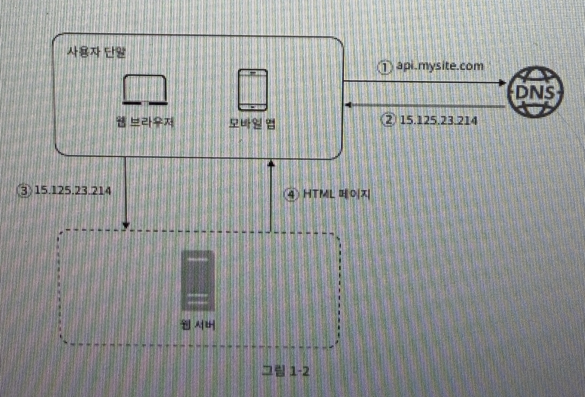


1. 사용자는 도메인 이름(api.mysite.com)을 이용하여 웹사이트에 접속한다. 이 때 DNS 서버를 통해 실제 IP 주소를 받아와야 한다.

2. DNS 조회 결과로 IP 주소가 반환된다.

3. 해당 IP 주소로 HTTP 요청이 전달된다.

4. 요청을 받은 웹 서버는 HTML 페이지나 JSON 형태의 응답을 반환한다.

실제 요청은 웹 앱 또는 모바일 앱으로부터 온다. 응답 데이터 포맷은 JSON을 많이 사용하며 예시는 다음과 같다.

- GET/users/12 : id가 12인 사용자 데이터 접근
```json
{
	"id" : 12,
	"firstName" : "John",
	"lastName" : "Smith",
	"address" : {
		"streetAddress" : "21 2nd Street",
		"city" : "New York",
		"state" : "NY",
		"postalCode" : 10021
		},
		"phoneNumbers" : [
			"212 555-1234",
			"646 555-4567"
		]
}
```

---

### 데이터베이스
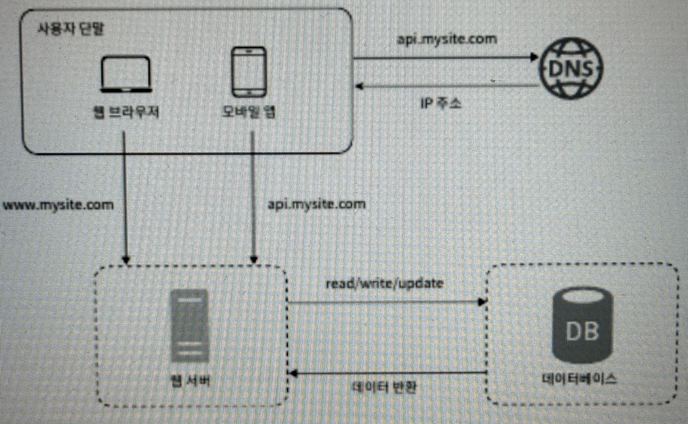
사용자가 늘면 서버를 늘려야 하는데, 웹 요청 처리 서버와 데이터베이스 서버를 분리하여 사용할 수 있다.

관계형 데이터베이스(RDBMS) vs 비관계형 데이터베이스(NoSQL)

- 관계형 : 자료를 열과 칼럼으로 표현하며 MySQL, 오라클 DB, PostgreSQL 등이 있다.
- 비 관계형 : 키-값 저장소(key-value store), 그래프 저장소(graph store), 칼럼 저장소(cloumn store), 문서 저장소(document store) 의 4가지 분류로 나눌 수 있으며 대표적으로 CouchDB, Cassandra, HBase, Amazon DynamoDB 등이 있다.

대부분 관계형을 쓰는 것이 일반적이지만, 다음과 같은 경우에는 비관계형이 나을 수도 있다.

- 아주 낮은 응답 지연시간(latency) 요구됨
- 다루는 데이터가 비정형이라 관계형 데이터가 아님
- 데이터를 직렬화 하거나 역직렬화 할 수 있기만 하면 됨
- 아주 많은 양의 데이터를 저장할 필요가 있음

---

### 수직적 규모 확장 vs 수평적 규모 확장

- 수직적 규모 확장 : 스케일 업 이라고도 불리며 서버에 더 고사양의 자원을 추가하는 것을 말한다.
- 수평적 규모 확장 : 스케일 아웃 이라고도 불리며 더 많은 서버를 추가하여 성능을 개선하는 것을 말한다.

서버 유입 트래픽의 양이 적을 때에는 수직적 확장이 좋지만, 몇 가지 단점이 있다.

1. 한계 존재. 한 대의 서버에 CPU나 메모리를 무한대로 늘릴 순 없다.
2. 장애에 대한 자동복구 방안이나 다중화 방안을 제시하지는 않는다.

따라서 한 대의 서버에 부하가 몰리면 응답이 느려지거나 접속이 불가능해질 수도 있는데, 이를 해결하기 위해 로드밸런서의 도입이 필요하다.

**로드밸런서**

로드밸런서는 부하 분산 집합에 속한 웹 서버들에게 트래픽 부하를 고르게 분산하는 역할을 한다.
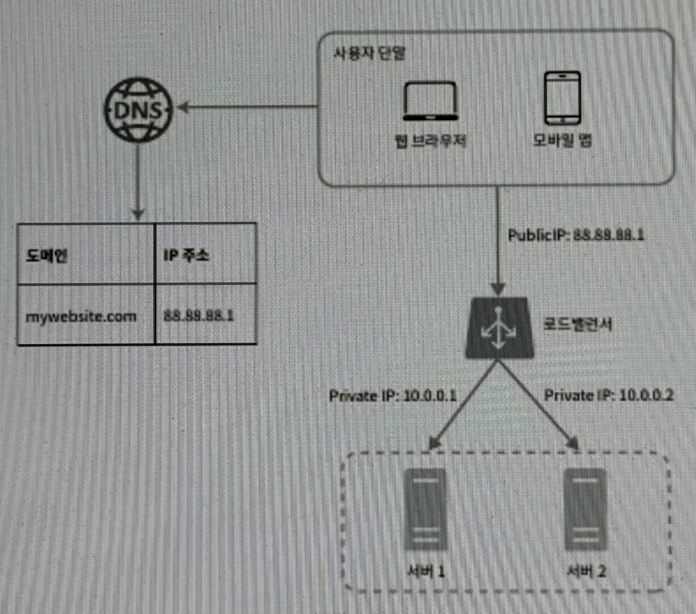

사용자는 로드밸런서의 public IP 주소로 접근하며, 서버간의 내부 통신은 private IP 주소로  이루어진다.

**데이터베이스 다중화**

데이터베이스를 다중화하여 주와 부를 나누고, 원본은 주 서버에, 사본은 부 서버에 저장한다. 부 데이터베이스 서버는 주 데이터베이스 서버로부터 사본을 전달받고, 읽기 연산만 지원한다. 보통 읽기 연산이 쓰기 연산보다 많이 필요하므로 부 데이터베이스 서버가 주 데이터베이스 서버보다 많다.

데이터베이스 다중화를 통해 성능, 안정성, 가용성을 확보할 수 있다.

---

### 캐시

캐시는 비싼 연산 결과 또는 자주 참조되는 데이터를 메모리 안에 두고, 같은 요청이 오면 보다 빨리 처리될 수 있도록 하는 저장소이다. 데이터베이스보다 훨씬 빠르다.

캐시 서버를 이용하는 방법은 간단한데, 대부분의 캐시 서버들이 일반적으로 널리 쓰이는 프로그래밍 언어로 API를 제공하기 때문이다. 다음 코드는 memcached API의 사용 예이다.

```bash
SECONDS = 1
cache.set('myKey', 'hi there', 3600*SECONDS)
cache.get('myKey')
```

**캐시 사용 시 유의할 점**

- 데이터 갱신은 자주 일어나지 않지만 참조는 빈번하게 일어나는 상황에서 바람직하다.
- 캐시는 데이터를 휘발성 메모리에 두므로, 영속적으로 보관할 데이터는 지속적 저장소에 저장해야한다.
- 캐시 보관 데이터 만료 정책을 마련해야 한다. 너무 짧으면 데이터베이스 접근이 많아지므로 성능이 저하되고, 너무 길면 원본과 차이가 발생할 가능성이 높아져서 적절히 조절해야 한다.
- 일관성이 유지되는지 (데이터베이스의 데이터와 캐시의 데이터가 일치하는지)를 살펴야 한다.
- 장애 대처 방법 : 캐시도 하나만 두었을 때 장애에 의해서 피해가 있을 수 있으므로 분산하는 것이 안전하다.
- 캐시 메모리 크기 : 너무 작으면 캐시의 데이터가 너무 자주 변경되어 성능이 저하될 수 있다.
- 데이터 방출 정책 : 캐시가 가득 찼을 때 어떤 데이터를 내보낼 지 정책을 잘 짜야한다. LRU와 LFU, FIFO 등을 사용할 수 있다.

---

### 콘텐츠 전송 네트워크 (CDN)

CDN은 정적 콘텐츠를 전송하는데 쓰이는 지리적으로 분산된 서버의 네트워크 이다. 이미지, 비디오, CSS, JavaScript 파일 등을 캐시할 수 있다.
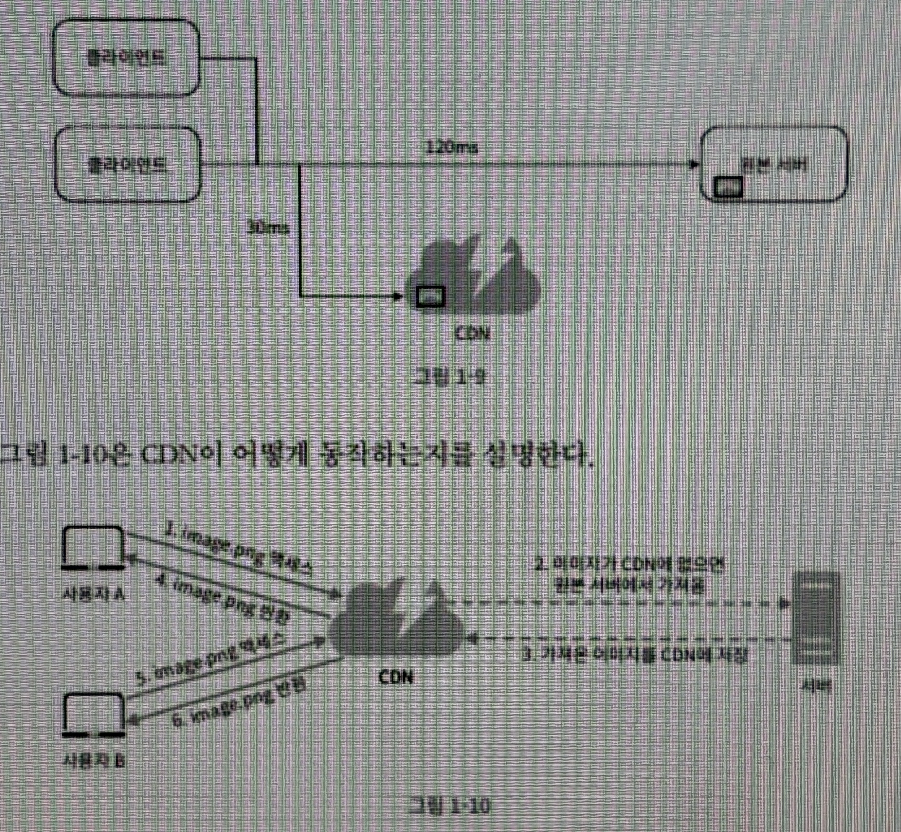

1. 사용자가 이미지 URL을 통해 image.png에 접근한다.
2. CDN 서버의 캐시에 해당 이미지가 없는 경우, 서버는 원본 서버에 요처하여 파일을 가져온다.
3. 원본 서버가 파일을 CDN 서버에 반환한다.
4. CDN 서버는 파일을 캐시하고 사용자 A에게 반환한다.
5. 사용자 B가 같은 이미지에 대한 요청을 CDN 서버에 전송한다.
6. 만료되지 않은 이미지에 대한 요청은 캐시를 통해 처리한다.

**CDN 사용 시 고려해야할 사항**

비용, 적절한 만료 시한 설정, CDN 장애에 대한 대처 방안, 콘텐츠 무효화

- CDN과 캐시가 추가된 설계
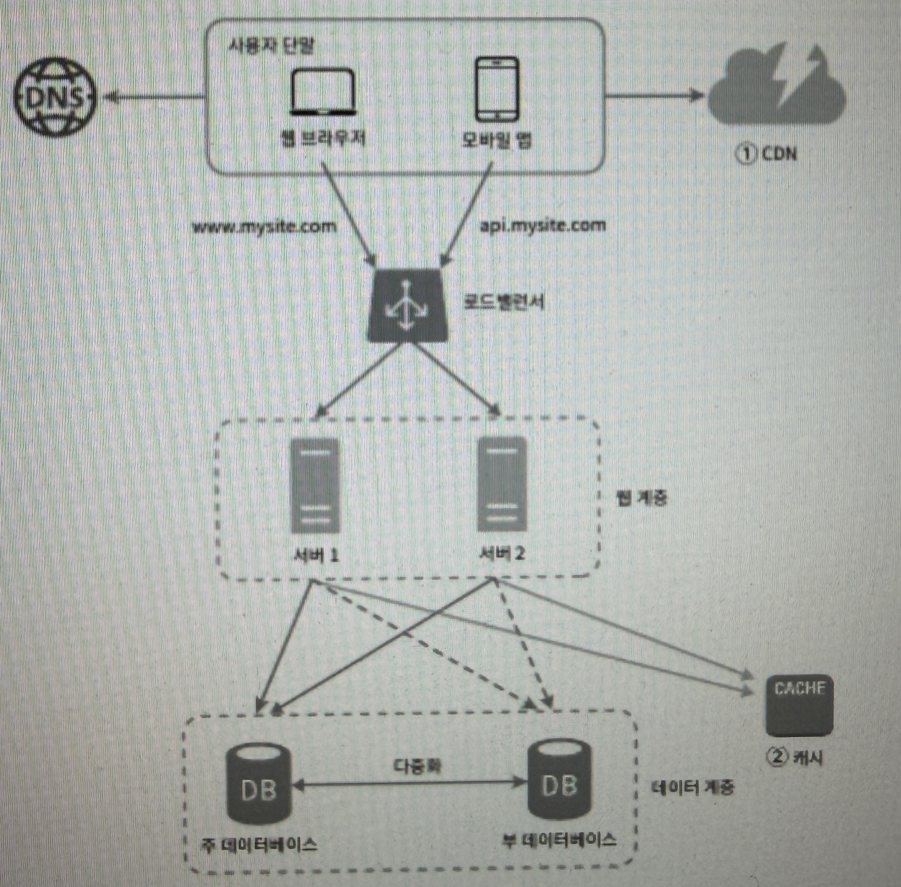

---

### 무상태(stateless) 웹 계층
무상태 웹 계층이란, 웹 서버가 사용자 세션에 대한 정보를 저장하지 않는 것을 말한다. 즉, 각 요청은 독립적이며 이전 요청과 관련이 없다. 무상태 웹 계층을 사용하면 웹 서버를 쉽게 확장할 수 있다.

- 상태 정보 의존적인 아키텍쳐
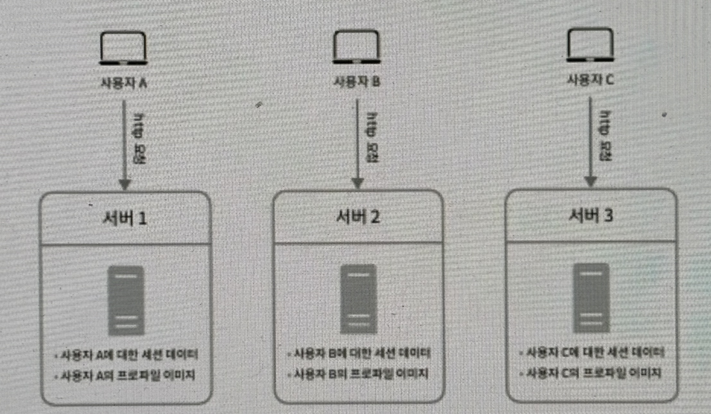
각 서버는 상태를 저장하기 때문에, 같은 클라이언트의 요청은 같은 서버로 전송되어야 하는데, 이를 위해 대부분의 로드밸런서가 고정 세션이라는 기능을 지원하지만, 이는 로드밸런서에 부담을 준다.

- 무상태 아키텍처
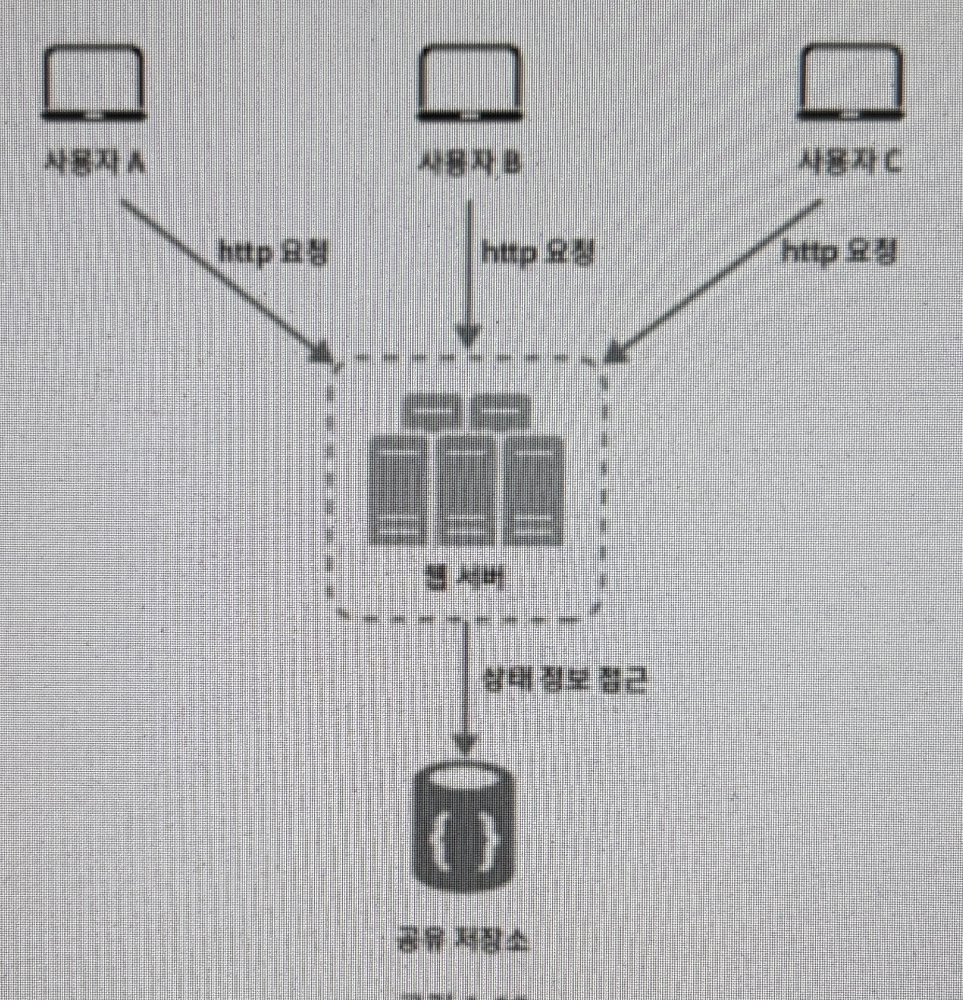
웹 서버는 상태 정보가 필요할 경우 공유 저장소로부터 데이터를 가져온다. 따라서 상태 정보는 웹 서버로부터 물리적으로 분리되어 있다. 이런 구조는 단순하고, 안정적이며, 규모 확장이 쉽다.

---

### 데이터 센터
데이터 센터가 여러 개일 경우, 보통 사용자는 가장 가까운 데이터센터로 안내되는데, 이를 지리적 라우팅이라고 한다. 물론 어떤 데이터센터에서 장애가 발생하면, 다른 데이터센터로 트래픽이 라우팅 되어야 한다.
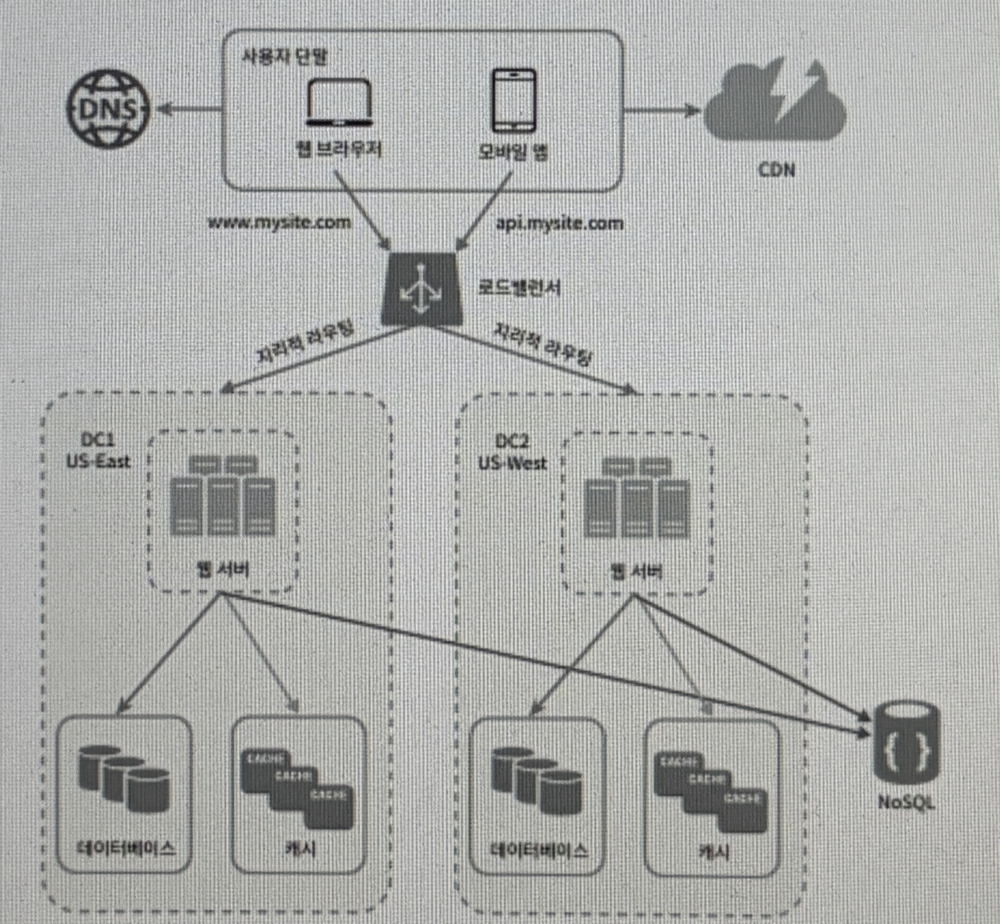
그림과 같은 다중 데이터센터 아키텍처를 만들려면 몇가지 난제를 해결해야한다.
- 트래픽 우회 : 데이터 센터 장애 시 트래픽이 다른 데이터센터로 우회되어야 한다.
- 데이터 동기화 : 데이터 센터 간에 데이터가 동기화되어야 한다.
- 테스트와 배포 : 웹사이트나 애플리케이션을 여러 위치에서 테스트 해보는 것이 중요하다.

---

### 메시지 큐
메시지 큐는 메시지의 무손실을 보장하는 비동기 통신을 지원하는 컴포넌트이다. 메시지의 버퍼 역할을 하며, 비동기적으로 전송한다.
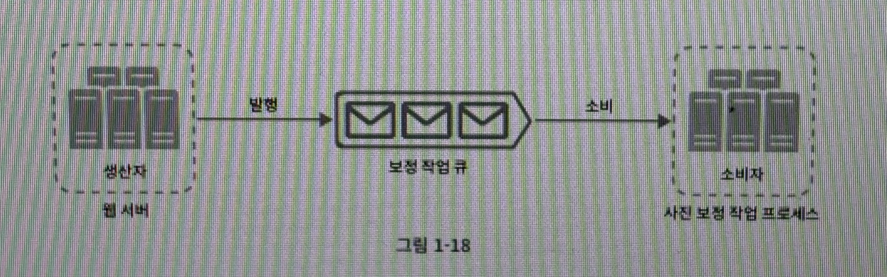
생산자는 소비자 프로세스가 다운되어 있어도 메시지를 발행할 수 있고, 소비자는 생산자 서비스가 가용한 상태가 아니더라도 메시지를 수신할 수 있다. 시간이 오래 걸리는 작업을 메시지 큐로 비동기 처리할 수 있다.
---

### 로그, 메트릭 그리고 자동화
- 로그 : 에러 로그 모니터링
- 메트릭 : 시스템의 성능과 상태를 측정하는 지표
  - 호스트 단위 메트릭 : CPU, 메모리, 디스크 I/O에 관한 메트릭
  - 종합 메트릭 : 데이터베이스 계층의 성능, 캐시 계층의 성능
  - 핵심 비즈니스 메트릭 : 일별 능동 사용자, 수익, 재방문
- 자동화 : 시스템의 배포, 확장, 장애 복구 등을 자동화하여 운영 효율성을 높이는 것

- 메시지 큐, 로그, 메트릭, 자동화 등을 반영한 설계안
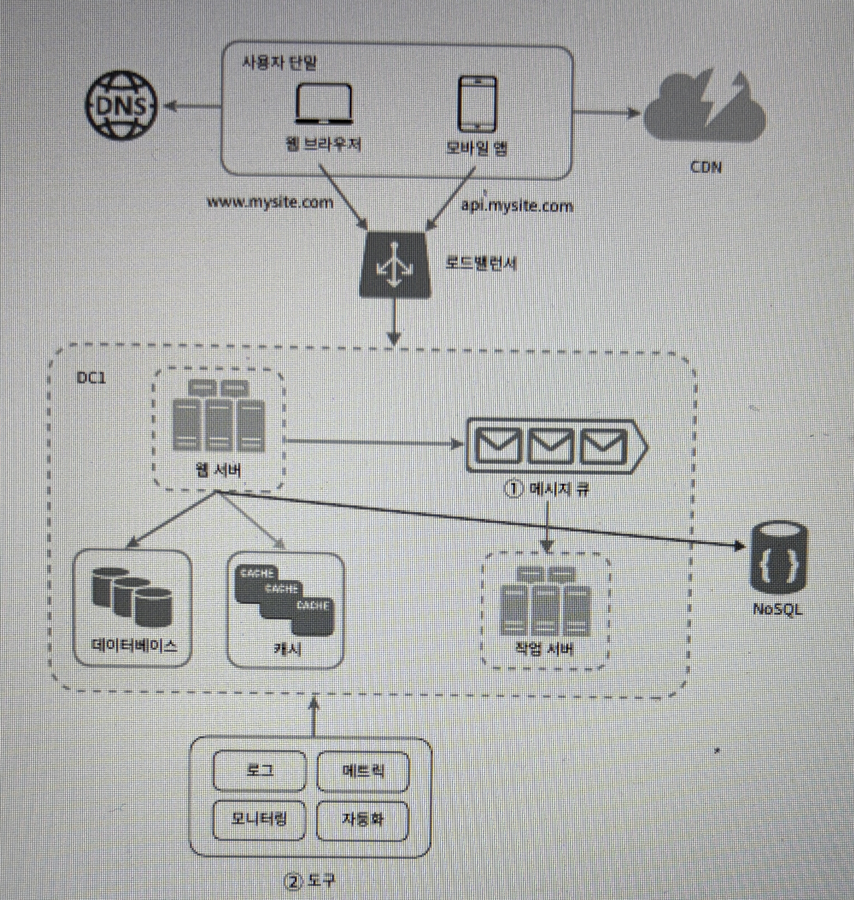
---

### 데이터베이스의 규모 확장
**수평적 확장**
수평적 확장을 샤딩 이라고도 부르는데, 데이터베이스를 샤드라고 부르는 작은 단위로 분할하는 기술이다. 모든 샤드는 같은 스키마를 쓰지만 샤드에 보관되는 데이터 사이에는 중복이 없다.
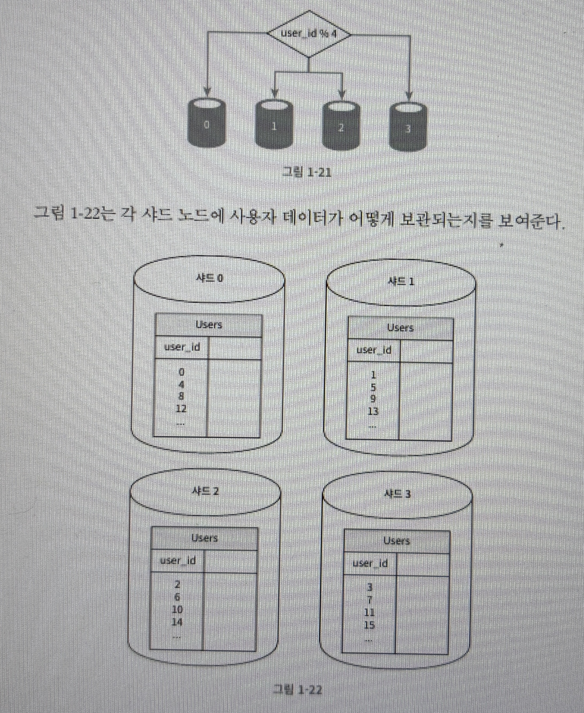
샤딩을 구현할 때 가장 중요한 것은 샤딩 키를 어떻게 정하느냐이다. 데이터가 어떻게 분산될지 정하는 하나 이상의 칼럼으로 구성된다. 위 그림의 경우 샤딩 키는 user_id이다.
샤딩은 훌륭한 기술이지만 새로운 문제도 생길 수 있다.
- 데이터의 재샤딩 : 데이터가 너무 많아져서 하나의 샤드로 감당이 안될 때, 샤드간 데이터 분포가 균등하지 못할 때 재샤딩이 필요하다.
- 유명인사 문제 : 핫스팟 키 문제라고도 부르는데, 특정 샤드에 질의가 집중되어 서버에 과부하가 걸리는 문제이다. 
- 조인과 비정규화 : 일단 하나의 데이터베이스를 여러 샤드 서버로 쪼개고 나면, 여러 샤드에 걸친 데이터를 조인하기가 힘들어진다. 이를 해결하기 위해 데이터베이스를 비정규화하여 하나의 테이블에서 질의가 수행되도록 할 수 있다.


- 샤딩까지 반영한 설계안
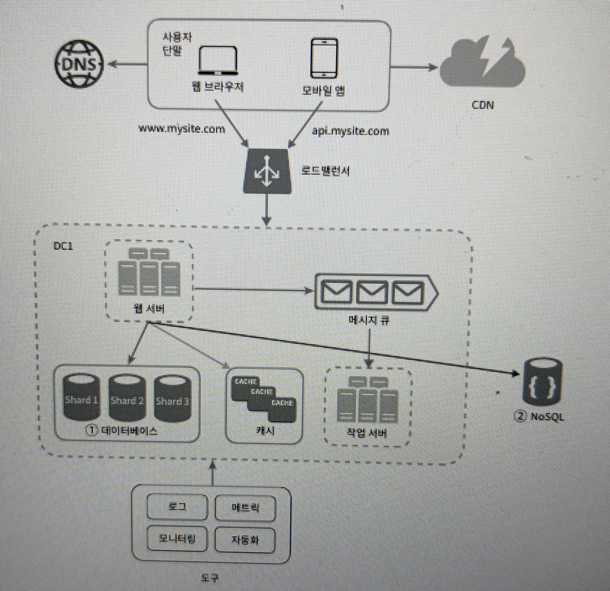
---

### 백만 사용자, 그리고 그 이상 
시스템 규모를 확장하는 것은 지속적이고 반복적인 과정이다. 시스템 규모 확장을 위해 이번 장에서 살펴본 기법들을 정리하면 다음과 같다.
- 웹 계층은 무상태 계층으로
- 모든 계층에 다중화 도입
- 여러 데이터 센터를 지원할 것
- 정적 콘텐츠는 CDN을 통해 서비스할 것
- 데이터 계층은 샤딩을 통해 그 규모를 확장할 것
- 각 계층은 독립적 서비스로 분할할 것
- 시스템을 지속적으로 모니터링하고, 자동화 도구들을 활용할 것