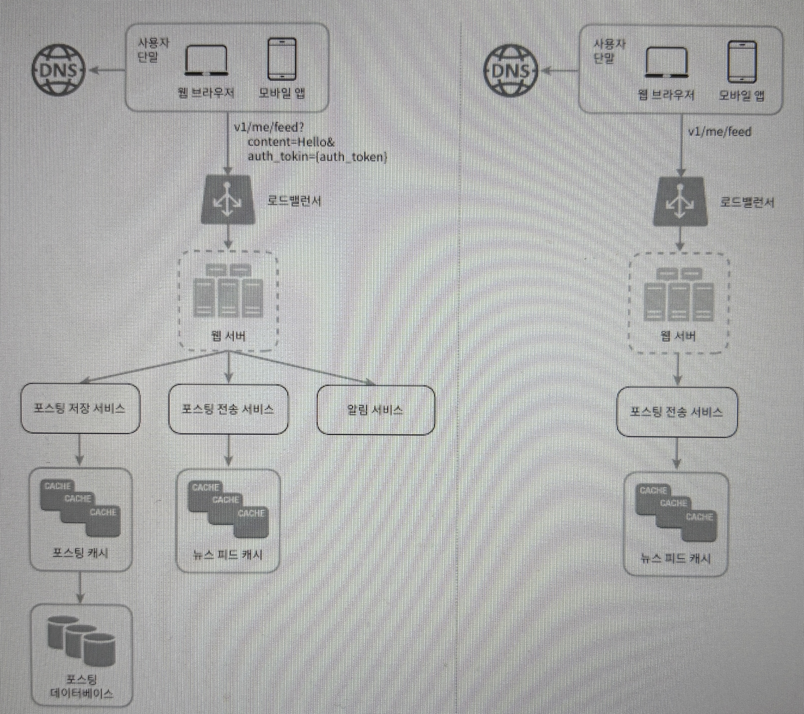
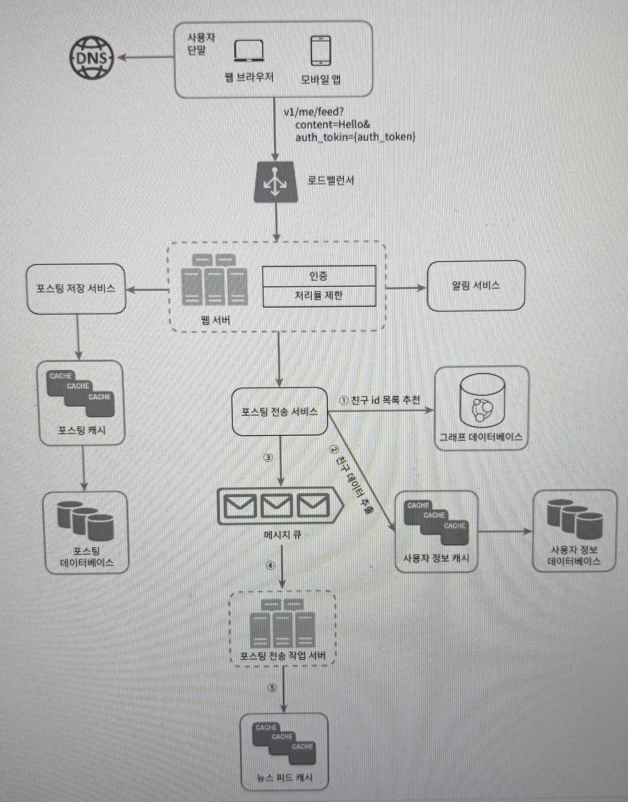
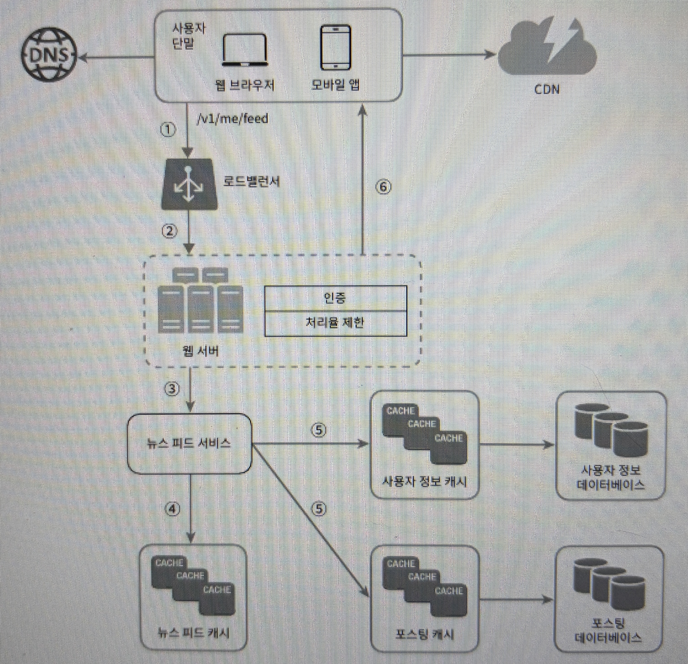

# 3장. 시스템 설계 면접 공략법

## 효과적 면접을 위한 4단계 접근법

**1단계 문제 이해 및 설계 범위 확정**

면접장에서 질문에 대한 대답을 빨리 하려고 노력하지 않아도 된다. 깊이 생각하고 질문하여 요구사항과 가정들을 분명히 하는 것이 중요하다.

- 예제

  뉴스 피드(news feed) 시스템을 설계하라는 요구를 받았다고 해 보자. 요구사항을 분명히 하기 위한 질문을 던져야 할 것이다. 여러분과 면접관 사이에 오갈 대화는 다음과 비슷할 것이다.

  **지원자:** 모바일 앱과 웹 앱 가운데 어느 쪽을 지원해야 하나요? 아니면 둘 다일까요?

  **면접관:** 둘 다 지원해야 합니다.

  **지원자:** 가장 중요한 기능은 무엇인가요?

  **면접관:** 새로운 포스트(post)를 올리고, 다른 친구의 뉴스 피드를 볼 수 있도록 하는 기능입니다.

  **지원자:** 이 뉴스 피드는 시간 역순으로 정렬되어야 하나요? 아니면 다른 특별한 정렬 기준이 있습니까? 제가 특별한 정렬 기준이 있는냐고 묻는 이유는, 피드에 올라갈 포스트마다 다른 가중치가 부여되어야 하는지 알고 싶어서인데요. 가령 가까운 친구의 포스트가 사용자 그룹(user group)에 올라가는 포스트보다 더 중요하다거나,

  **면접관:** 문제를 단순하게 만들기 위해, 일단 시간 역순으로 정렬된다고 가정합시다.

  **지원자:** 한 사용자는 최대 몇 명의 사용자와 친구를 맺을 수 있나요?

  **면접관:** 5000명입니다.

  **지원자:** 사이트로 오는 트래픽 규모는 어느 정도입니까?

  **면접관:** 일간 능동 사용자(daily active user, DAU)는 천만 명입니다.

  **지원자:** 피드에 이미지나 비디오도 올라올 수 있나요? 아니면 포스트는 그냥 텍스트입니까?

  **면접관:** 이미지나 비디오 같은 미디어 파일도 포스트할 수 있어야 합니다.

**2단계 개략적인 설계안 제시 및 동의 구하기**

- 설계안에 대한 최초 청사진 제시 및 의견을 구하라. 면접관을 마치 팀원인 것처럼 대하라. 훌륭한 면접관들은 지원자들과 대화하고 설계 과정에 개입하기를 즐긴다.
- 화이트보드나 종이에 핵심 컴포넌트를 포함하는 다이어그램을 그려라. 클라이언트(모바일/웹), API, 웹 서버, 데이터 저장소, 캐시, CDN, 메시지 큐 같은 것들이 포함될 수 있을 것이다.
- 이 최초 설계안이 시스템 규모에 관계된 제약사항들을 만족하는지를 개략적으로 계싼해보라. 계산 과정은 소리내어 설명하라. 아울러, 이런 개략적 추정이 필요한지는 면접관에게 미리 물어보도록 하자.
- 예제

  “뉴스 피드 시스템을 설계하라”는 질문을 그대로 활용해서 개략적 설계는 어떻게 만들어 내는지 살펴보자. 개략적으로 보면 이 설계는 두 가지 처리 플로로 나눠 생각할 수 있다. 피드 발행과 피드 생성이다.

**3단계 상세 설계**

이 단계로 왔다면 다음 목표는 달성한 상태일 것이다.

- 시스템에서 전반적으로 달성해야 할 목표와 기능 범위 확인
- 전체 설계의 개략적 청사진 마련
- 해당 청사진에 대한 면접관의 의견 청취
- 상세 설계에서 집중해야 할 영역들 확인

이후 해야할 일은 설계 대상 컴포넌트 사이의 우선순위를 정하는 것이다. 면접마다 우리가 집중해야 할 부분은 달라질 수밖에 없는데, 대부분의 경우에는 특정 시스템 컴포넌트들의 세부사항을 깊이 있게 설명하는 것이다.

- 예제

  뉴스 피드 시스템의 개략적 설계를 마친 상황이고, 면접관도 그 설계에 만족하고 있다고 가정해보자.

  이제 피드 발행과 뉴스 피드 가져오기 에 대해 보다 깊이 탐구해야 한다.

**4단계 마무리**

마지막 단계에서 면접관이 후속 질문을 던질 수도 있고 스스로 추가 논의를 진행하도록 할 수도 있다. 다음 지침을 활용하자!

- 면접관이 시스템 병목구간, 혹은 좀 더 개선 가능한 지점을 찾아내라고 했을 때 본인의 시스템이 완벽하다고 대답하지 말고, 비판적 사고 능력 보이기
- 본인이 만든 설계를 한번 다시 요약해서 환기시켜주기
- 오류가 발생하면 무슨 일이 생기는지 따져보기
- 운영 이슈 논의 OK → 메트릭, 로그, 시스템 배포 등
- 미래에 닥칠 규모 확장 요구 대처
- 다루지 못했던 세부적 개선사항들 제안

면접 때 해야할 것과 하지 말아야 할 것

**해야할 것**

- 질문을 통해 확인하기, 스스로 내린 가정이 옳다고 믿고 진행하지 말기
- 문제 요구사항 이해하기
- 정답이나 최선의 답안은 없음을 명심하기, 요구사항 정확하게 이해했는지 다시 확인하기
- 본인의 사고 흐름을 면접관도 이해할 수 있도록 소통하기
- 가능하다면 여러 해법 제시하기
- 개략적 설계에 면접관이 동의하면, 각 컴포넌트 세부사항 설명하기
- 면접관의 아이디어 이끌어내기 → 팀원처럼!
- 포기하지말기

**하지 말아야 할 것**

- 전형적인 면접 문제들도 대비하지 않은 상태에서 면접장 가지 않기
- 요구사항이나 가정들이 분명하지 않은 상태에서 설계 제시하지 않기
- 처음부터 특정 컴포넌트의 세부사항 너무 깊이 설명하지 말기
- 진행중에 막히면 힌트 요청을 주저하지 말기
- 소통 주저하지 말기, 침묵 속에서 설계 하지 말기
- 설계안 내놓는 순간 면접 끝났다고 생각하지 말기,  의견을 일찍, 자주 구하기

**시간 배분**

45분의 시간이 주어진다면, 각 단계에서 다음과 같이 시간을 쓰면 좋을 것이다.

1단계 - 문제 이해 및 설계 범위 확정 : 3~10분

2단계 - 개략적 설계안 제시 및 동의 구하기 : 10~15분

3단계 - 상세 설계 : 10~25분

4단계 - 마무리 : 3~5분