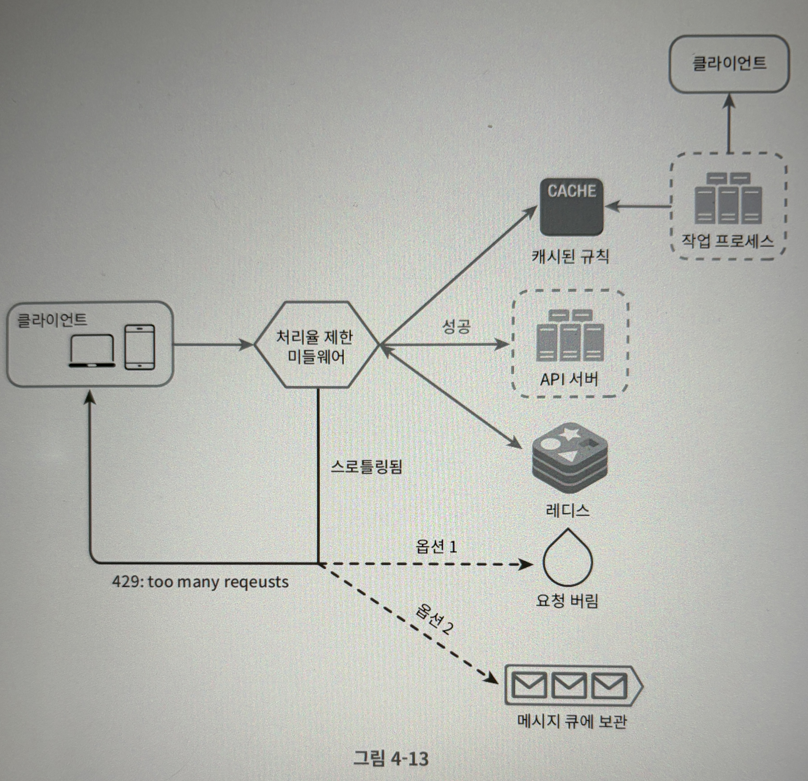
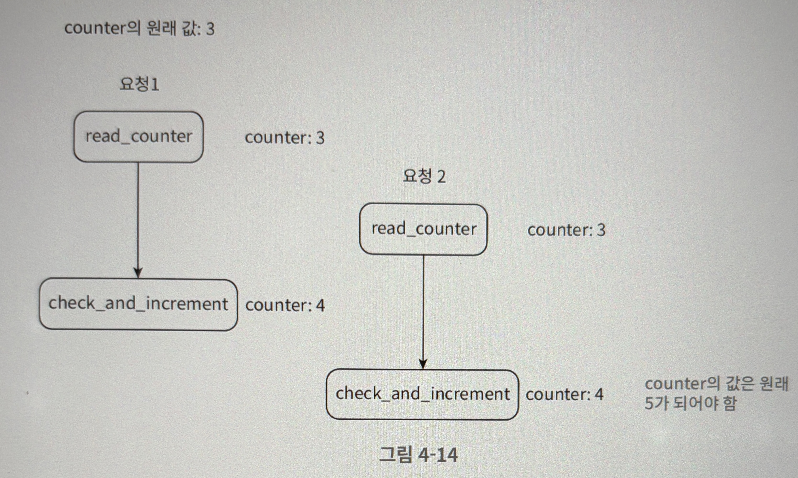

# 4장. 처리율 제한 장치의 설계

네트워크 시스템에서 처리율 제한 장치는 클라이언트 또는 서비스가 보내는 트래픽의 처리율을 제어하기 위한 장치이다.

API에 처리율 제한 장치를 두면 좋은 점은 다음과 같다.

- DoS 공격에 의한 자원 고갈을 방지할 수 있다.
- 비용을 절감한다.
- 서버 과부하를 막는다.

다음 단계들을 따라가보면서 처리율 제한 장치를 설계해보자

---

## 1단계 - 문제 이해 및 설계 범위 확정

처리율 제한 장치를 구현하는 데는 여러 알고리즘을 사용할 수 있는데, 그 각각은 고유한 장단점을 갖고 있다. 면접관과 소통하며 어떤 제한 장치를 구현해야 하는 지 분명하게 정하자

다음과 같은 요구사항을 가정해보자.

**요구사항**

- 설정된 처리율을 초과하는 요청은 정확하게 제한한다.
- 낮은 응답시간 : 이 처리율 제한 장치는 HTTP 응답시간에 나쁜 영향을 주어서는 곤란하다.
- 가능한 한 적은 메모리를 써야한다.
- 분산형 처리율 제한 : 하나의 처리율 제한 장치를 여러 서버나 프로세스에서 공유할 수 있어야 한다.
- 예외 처리 : 요청이 제한되었을 때는 그 사실을 사용자에게 분명하게 보여주어야 한다.
- 높은 결함 감내성 : 제한 장치에 장애가 생기더라도 전체 시스템에 영향을 주어서는 안된다.

---

## 2단계 - 개략적 설계안 제시 및 동의 구하기

기본적인 클라이언트-서버 통신 모델을 사용한다고 가정하자.

**처리율 제한 장치는 어디에 둘 것인가?**

- 클라이언트 측 : 클라이언트 요청은 쉽게 위변조가 가능하고, 모든 클라이언트의 구현을 통제하는 것이 어려울 수 있으므로 적절하지 않다.
- 서버 측 : 처리율 제한 장치를 API 서버에 두거나 API 서버로 가는 길목에 두어(미들웨어) API 서버로 가는 요청을 통제할수도 있다.

폭넓게 채택된 기술인 클라우드 마이크로서비스의 경우, 보통 API 게이트웨이라는 컴포넌트에 구현된다.

이를 어디에 둘 것인지는 다음 사항들을 고려해서 정해야 한다.

- 프로그래밍 언어, 캐시 서비스 등 현재 사용하고 있는 기술 스택
- 필요에 맞는 처리율 제한 알고리즘
- 시간적 여유 - 충분한 시간과 인력이 없다면 상용 API 게이트웨이를 쓰는 게 바람직할 것이다.

---

**처리율 제한 알고리즘**

- 토큰 버킷 (token bucket)

  지정된 용량을 갖는 컨테이너 (버킷)이 있고, 사전 설정된 양의 토큰이 주기적으로 채워진다. 토큰이 꽉 차있으면 더이상 추가되지 않는다. 각 요청이 처리될 때마다 하나의 토큰을 사용하고, 요청이 도착하면 버킷에 충분한 토큰이 있는 지 검사한다. 충분한 토큰이 있는 경우 토큰 하나를 꺼낸 후 요청을 시스템에 전달하지만, 그렇지 않으면 해당 요청은 버려진다.

  통상적으로 버킷은 API 엔드포인트마다 별도로 둔다. 예를 들어, 사용자가 하루에 한 번만 포스팅 할 수 있고, 친구는 150명까지 추가할 수 있고, 좋아요 버튼은 다섯 번까지만 누를 수 있다면 사용자마다 3개의 버킷을 둬야 한다.

  **장점**

    - 구현이 쉽다.
    - 메모리 사용 효율적이다.
    - 짧은 시간에 집중되는 트래픽도 처리 가능하다.

  **단점**

    - 버킷 크기와 토큰 공급률을 적절히 튜닝하는 것이 어려울 수 있다.
- 누출 버킷 (leaky bucket)

  토큰 버킷과 비슷하지만 요청 처리율이 고정되어있다. 보통 FIFO 큐로 구현하며, 흐름은 다음과 같다.

  요청이 도착하면 큐가 가득 차 있는 지 보고 그렇지 않다면 큐에 요청을 추가한다. 큐가 가득 차있으면 요청은 버린다. 지정된 시간마다 큐에서 요청을 꺼내어 처리한다.

  버킷 크기는 큐 사이즈와 같으며 처리율은 지정된 시간당 몇 개의 항목을 처리할지 지정하는 값으로 주로 초단위이다.

  **장점**

    - 큐의 크기가 제한되어 있어 메모리 사용이 효율적이다.
    - 고정된 처리율을 갖고있기 때문에 안정적인 출력이 필요한 경우 적합하다.

  **단점**

    - 단시간에 많은 트래픽이 몰리는 경우 큐에는 오래된 요청들이 쌓이고, 최신 요청들이 버려질 가능성이 높다.
    - 버킷 크기와 처리율을 튜닝하기 어려울 수 있다.
- 고정 윈도 카운터 (fixed window counter)

  타임라인을 고정된 간격의 윈도우로 나누고, 각 윈도우마다 카운터를 붙인다. 요청이 접수될 때마다 이 카운터의 값은 1씩 증가하며, 카운터가 사전에 설정한 임계치에 도달하면 새로운 요청은 새 윈도우가 열릴 때까지 버려진다.

  **장점**

    - 메모리 효율이 좋다.
    - 이해하기 쉽다.
    - 윈도우가 닫히는 시점에 카운터를 초기화하는 방식은 특정한 트래픽 패턴을 처리하기에 적합하다.

  **단점**

    - 윈도우 경계 부근에서 일시적으로 많은 트래픽이 몰려드는 경우, 기대했던 시스템의 처리 한도보다 많은 양의 요청을 처리하게 된다.
- 이동 윈도 로그 (sliding window log)

  고정 윈도 카운터 알고리즘의 윈도우 경계 부근에서 트래픽이 몰리는 경우 발생하는 문제를 해결해줄 알고리즘이다.

  **동작 원리**

    - 요청의 타임 스탬프를 추적한다. 타임 스탬프는 보통 레디스 등에 보관한다.
    - 새 요청이 오면 만료된 타임스탬프는 제거한다. 만료된 타임스탬프란 그 값이 현재 윈도우의 시작 시점보다 오래된 타임스탬프이다.
    - 로그의 크기가 허용치보다 같거나 작으면 요청을 시스템에 전달한다. 그렇지 않은 경우에는 처리를 거부한다.

  **장점**

    - 메커니즘이 정교해서 어느 순간의 윈도우를 보더라도, 허용되는 요청의 개수는 시스템의 처리율 한도를 넘지 않는다.

  **단점**

    - 거부된 요청의 타임스탬프도 보관하므로 다량의 메모리를 사용한다.
- 이동 윈도 카운터 (sliding window counter)

  고정 윈도 카운터와 이동 윈도 로그를 결합한 알고리즘이다. 즉, 윈도우를 움직이면서 카운터의 임계치를 기준으로 요청의 처리 여부를 결정한다.

  **장점**

    - 이전 시간대의 평균 처리율에 따라 현재 윈도우의 상태를 계산하므로 짧은 시간에 몰리는 트래픽에도 잘 대응한다.
    - 메모리 효율이 좋다.

  **단점**

    - 직전 시간대에 도착한 요청이 균등하게 분포되어 있다고 가정한 상태에서 추정치를 계산하기 때문에 다소 느슨하다. 클라우드플레어가 실시했던 실험에서 40억개의 요청 중 버려진 요청은 0.003%에 불과했다고 한다.

---

**개략적인 아키텍처**

카운터를 보관하기 위해 메모리상에서 동작하는 캐시가 바람직하다. (데이터베이스까지 가기에는 너무 느릴 것이다.) 이 때 Redis를 많이 사용하는데, INCR과 EXPIRE의 두 가지 명령어를 지원한다.

- INCR : 메모리에 저장된 카운터의 값을 1만큼 증가시킨다.
- EXPIRE : 카운터에 타임아웃 값을 설정한다. 설정된 시간이 지나면 카운터는 자동 삭제된다.

이 때 동작 흐름은 다음과 같다.

- 클라이언트가 처리율 제한 미들웨어에게 요청을 보낸다.
- 처리율 제한 미들웨어는 레디스의 지정 버킷에서 카운터를 가져와서 한도에 도달했는지 아닌지를 검사한다.
    - 한도에 도달했다면 요청은 거부된다.
    - 한도에 도달하지 않았다면 요청은 API 서버로 전달된다. 미들웨어는 카운터의 값을 증가시킨 후 다시 레디스에 저장한다.

---

## 3단계 - 상세 설계

이제 처리율 제한 규칙은 어떻게 만들어지고 어디에 저장되는 지, 처리가 제한된 요청들은 어떻게 처리되는 지 정해보자.

**처리율 제한 규칙**

리프트(Lyft)는 처리율 제한에 오픈소스를 사용하고 있다. 이 컴포넌트들을 보며 어떤 규칙이 사용되는 지 보자.

```bash
domain: messaging
descriptors:
	- key: message_type
		Value: marketing
		rate_limit:
				unit: day
				requests_per_unit: 5
```

위 코드는 시스템이 처리할 수 있는 마케팅 메시지의 최대치를 하루 5개로 제한하고 있다. 아래는 또 다른 예이다.

```bash
domain: auth
descriptors:
	- key: auth_type
		Value: login
		rate_limit:
				unit: minute
				requests_per_unit: 5
```

위 규칙은 클라이언트가 분당 5회 이상 로그인 할 수 없도록 제한하고 있다.

이런 규칙들은 보통 설정 파일 형태로 디스크에 저장된다.

---

**처리율 한도 초과 트래픽의 처리**

어떤 요청이 한도 제한에 걸리면 API는 HTTP 429 - too many requests 를 클라이언트에게 보낸다. 경우에 따라서는 한도 제한이 걸린 메시지를 나중에 처리하기 위해 큐에 보관할 수도 있다.

그렇다면 클라이언트는 자기 요청이 처리율 제한에 걸리고 있는지를 어떻게 알 수 있을까?

→ HTTP 헤더를 활용한다.

---

**상세 설계**



---

**분산 환경에서의 처리율 제한 장치의 구현**

여러 대의 서버와 병렬 스레드를 지원하는 시스템에서는 경쟁 조건(race condition)과 동기화(synchronization)에 대해 고민해야한다.

**경쟁조건**

병행성이 심한 환경에서 그림과 같은 경쟁 조건 이슈가 발생할 수 있다.



이를 해결하기 위해 가장 널리 알려진 방법은 락(lock)이다. 하지만 락은 시스템 성능을 상당히 떨어뜨리기 때문에 위 설계의 경우 다음 두 가지 해결책을 생각해볼 수 있다. 하나는 루아 스크립트(Lua Script)이고, 하나는 정렬 집합(sorted set)이라고 불리는 레디스 자료구조를 쓰는 것이다.

**동기화 이슈**

사용자가 많아지면 서버도 늘어날 것이다. 처리율 제한 장치 서버의 숫자도 많아질 수 있는데, 이 서버들끼리 동기화가 되어있지 않다면 처리율 제한을 제대로 수행하지 못할 것이다. 고정 세션을 활용해서 같은 클라이언트로부터의 요청은 항상 같은 처리율 제한 장치로 보낼 수 있도록 할 수 있지만 확장 가능성이나 유연성이 떨어지기 때문에 추천하지 않는다. 레디스와 같은 중앙 집중형 데이터 저장소를 사용하여 이 문제를 해결할 수 있을 것이다.

**성능 최적화**

여러 데이터 센터를 지원하는 문제는 처리율 제한 장치에 매우 중요한 문제이다. 사용자가 데이터센터로부터 물리적으로 멀리 떨어져 있다면 latency가 증가할 수밖에 없다. 따라서 대부분의 클라우드 서비스 사업자는 세계 곳곳에 에지 서버를 심어놨다.

그 다음 고려해야 할 것은 장치간에 데이터를 동기화할 때 최종 일관성 모델을 사용하는 것이다.

**모니터링**

처리율 제한 장치를 설치한 이후에도 모니터링을 통해 데이터를 모을 필요가 있다. 이를 통해 채택된 알고리즘이 효과적인지, 정의한 처리율 제한 규칙이 효과적인지 등을 점검할 수 있다.

---

## 4단계 - 마무리

다음과 같은 부분을 더 공부해보면 좋을 것 같다.

- 경성 또는 연성 처리율 제한
    - 경성 처리율 제한 : 요청의 개수가 임계치를 절대 넘어설 수 없다.
    - 연성 처리율 제한 : 요청 개수가 잠시동안은 임계치를 넘어설 수 있다.
- 다양한 계층에서의 처리율 제한
    - 이번 장에서는 애플리케이션 계층에서의 처리율 제한만 살펴봤지만, Iptables를 이용하여 OSI 3계층에서 제한한다거나 하는 식으로 다른 계층에서도 처리율을 제한할 수 있다.
- 처리율 제한을 회피하는 방법 - 클라이언트를 어떻게 설계하는 것이 최선인가?
    - 클라이언트 측 캐시를 사용하여 API 호출 횟수를 줄인다.
    - 처리율 제한의 임계치를 이애하고, 짧은 시간동안 너무 많은 메시지를 보내지 않도록 한다.
    - 예외나 에러를 처리하는 코드를 도입하여 클라이언트가 예외적 상황으로부터 우아하게 복구될 수 있도록 한다.
    - 재시도 로직을 구현할 때는 충분한 백오프 시간을 둔다.