# 4주차

# 5장. 안정 해시 설계

- 안정 해시 : 수평적 규모 확장성을 위해 요청 또는 데이터를 서버에 균등하게 나누는 것이 중요한데, 이 목표를 달성하기 위해 보편적으로 사용하는 기술이다.

---

## 해시 키 재배치(refresh) 문제

N개의 캐시 서버가 있다고 가정할 때, 이 서버들에 부하를 균등하게 나누는 보편적 방법은 다음 해시 함수를 사용하는 것이다.

```bash
serverIndex = hash(key) % N (N은 서버 개수)
```

- 예제 : N=4 일 때 다음 표는 주어진 각각의 키에 대해서 해시 값과 서버 인덱스를 계산한 것이다.

| 키 | 해시 | 해시 % 4 (서버 인덱스) |
| --- | --- | --- |
| key0 | 18358617 | 1 |
| key1 | 26143584 | 0 |
| key2 | 18131146 | 2 |
| key3 | 35863496 | 0 |
| key4 | 34085809 | 1 |
| key5 | 27581703 | 3 |
| key6 | 38164978 | 2 |
| key7 | 22530351 | 3 |

위 방법은 서버 풀의 크기가 고정되어 있을 때, 데이터 분포가 균등할 때에는 잘 동작한다. 하지만 서버가 추가되거나 기존 서버가 삭제되면 문제가 생길 수 있다. 예를 들어 1번 서버가 장애를 일으켜 동작이 중단되면, 서버 풀의 크기는 3으로 변하고 키에 대한 해시 값은 그대로지만 서버 인덱스 값은 달라진다. 위의 예제의 상황에서 mod4 값이 mod3으로 변하게 된다. 즉, 서버 하나가 죽으면 대부분의 캐시가 미스를 일으키게 된다.

---

## 안정 해시

- 안정 해시 : 해시 키 재배치의 문제를 효과적으로 해결할 수 있는 기술로, 해시 테이블의 크기가 조정될 때 평균 k/n개의 키만 재배치하는 해시 기술이다. k는 키의 개수이고, n은 슬롯의 개수이다.

### 해시 공간과 해시 링

- 동작 원리
  해시 함수 f로 SHA-1을 사용한다고 하고, 그 함수의 출력 값 범위는 x0, x1, x2, x3, … xn과 같다고 하자. SHA-1의 해시 공간 범위는 0 - 2^160 - 1 까지라고 알려져 있다. 따라서 x0은 0, xn은 2^160 - 1 이며 나머지 x1부터 xn-1 까지는 그 사이의 값을 갖게 된다.
    
    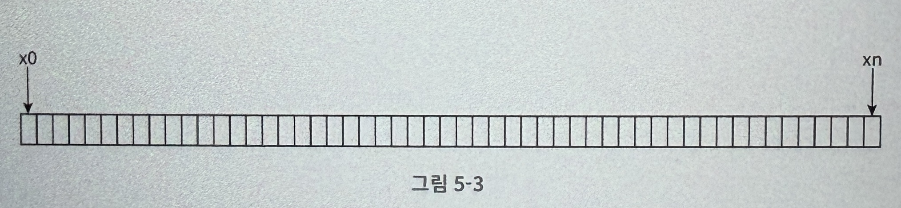

  이를 그림으로 표현하면 그림 5-3 처럼 그릴 수 있다.
    
    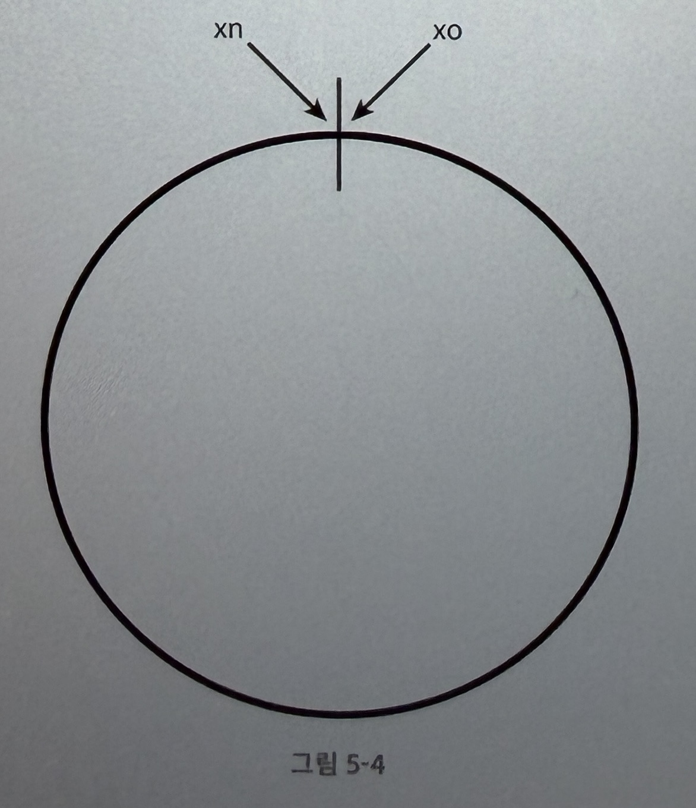

  이 해시 공간을 양쪽으로 구부려 접으면 그림 5-4 와 같이 해시 링이 만들어진다.


### 해시 서버

이 해시 함수 f를 사용하면 서버 IP나 이름을 이 링 위의 어떤 위치에 대응시킬 수 있다.

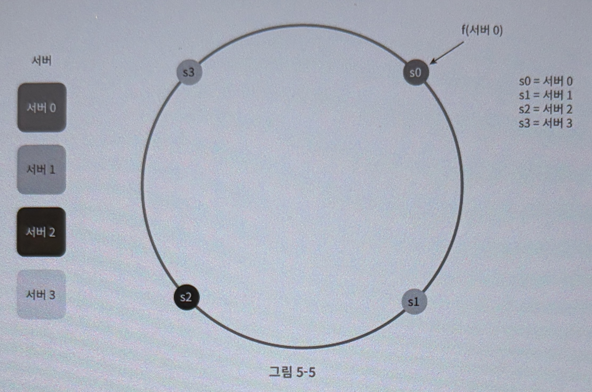

### 해시 키

여기 사용된 해시 함수는 %(modular) 연산을 사용하지 않는다. 캐시할 키 key0, key1, … 역시 해시 링 위의 어느 지점에 배치할 수 있다.

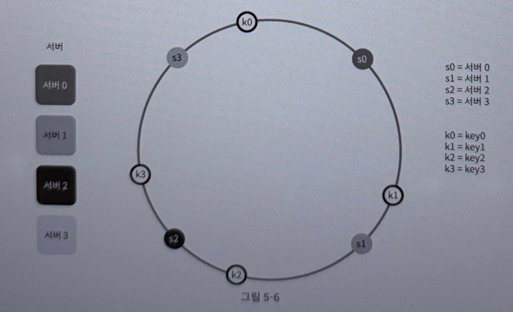

### 서버 조회

어떤 키가 저장되는 서버는, 해당 키의 위치로부터 시계 방향으로 링을 탐색해 나가면서 만나는 첫 번째 서버다.

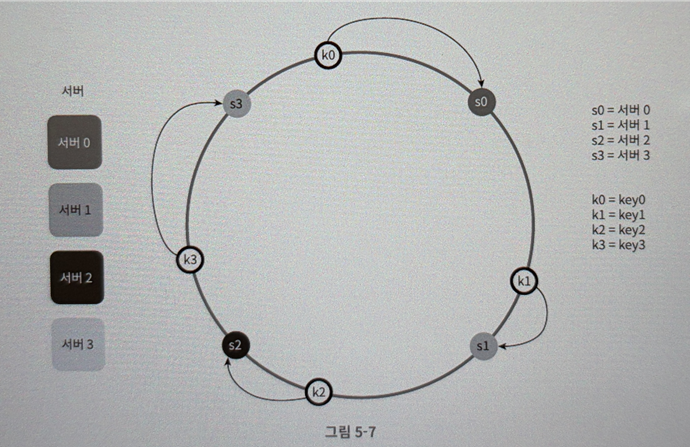

### 서버 추가

위 내용에 따르면 서버를 추가하더라도 키 가운데 일부만 재배치 하면 된다. 다음 그림을 보면 서버 4가 추가된 뒤에 key0만 재배치됨을 알 수 있다.

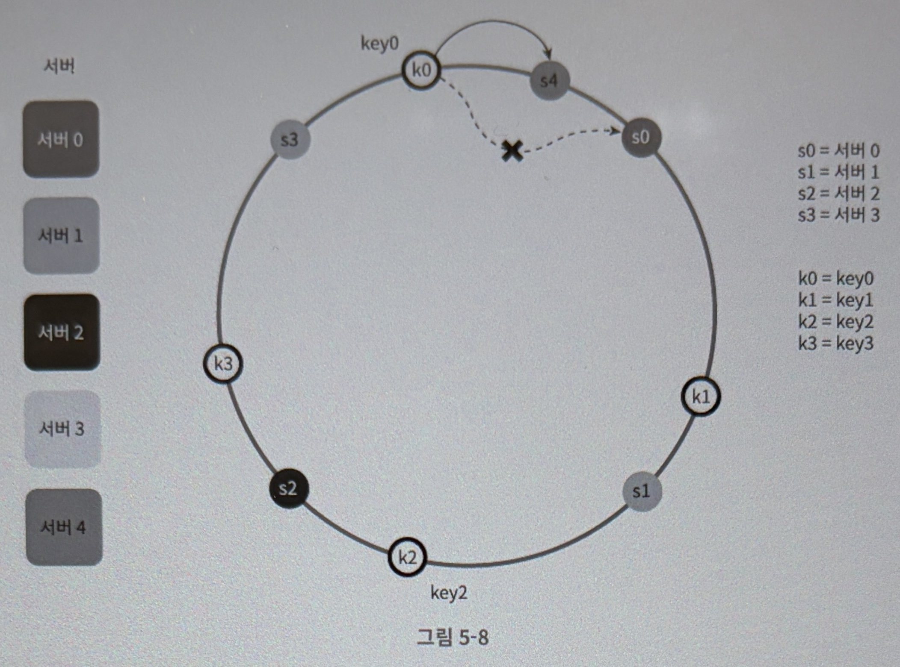

### 서버 제거

하나의 서버가 제거되면 키 가운데 일부만 재배치된다. 다음 그림을 보면 서버 1이 삭제되었을 때 key1만이 서버2로 재배치됨을 알 수 있다.

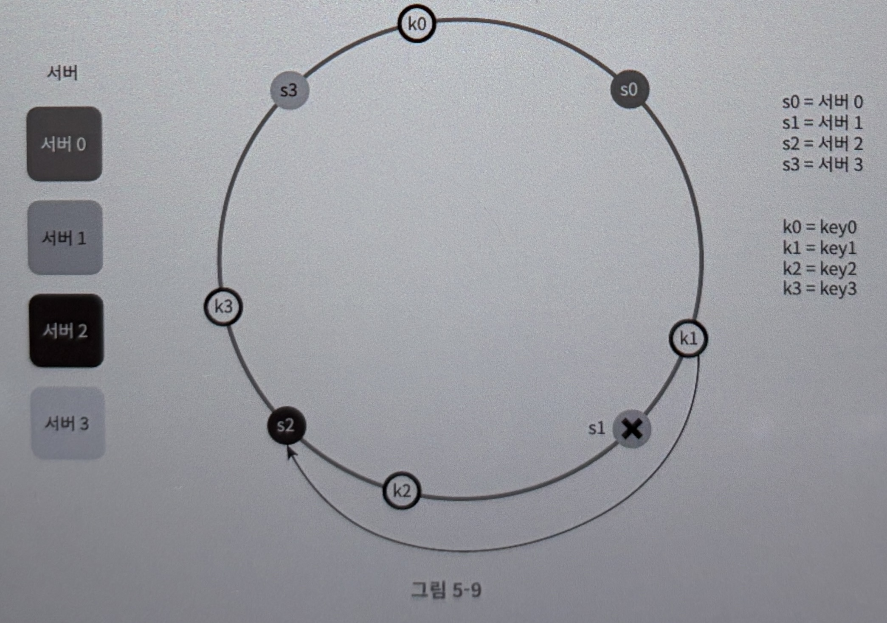

### 기본 구현법의 두 가지 문제

안정 해시 알고리즘의 기본 절차는 다음과 같다.

- 서버와 키를 균등 분포 해시 함수를 사용해 해시 링에 배치한다.
- 키의 위치에서 링을 시계 방향으로 탐색하다 만나는 최초의 서버가 키가 저장될 서버다.

이 접근법에는 두 가지 문제가 있다.

1. 서버가 추가되거나 삭제될 때 파티션(= 인접한 서버 사이의 해시 공간) 의 크기를 균등하게 유지하는 게 불가능하다. 즉, 어떤 서버는 굉장히 작은 해시 공간을 할당 받고, 어떤 서버는 굉장히 큰 해시 공간을 할당 받을 수 있다.

    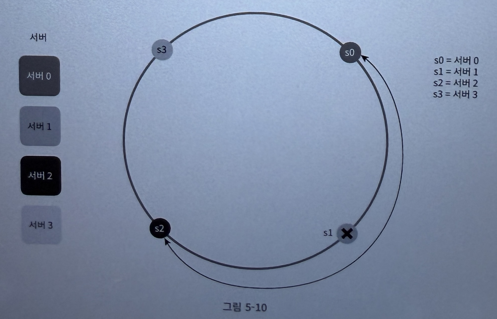
    
2. 키의 균등 분포를 달성하기가 어렵다. 다음 사진에서 서버 1과 서버 3은 아무 데이터도 갖지 않고, 대부분의 키가 서버 2에 보관될 것이다.

    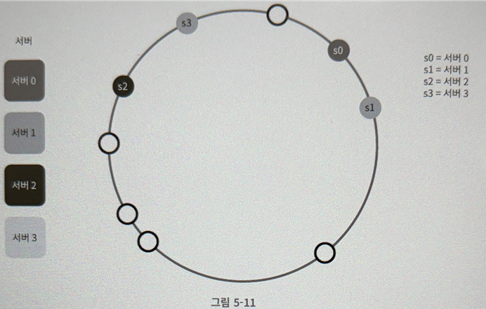

→ 이 두 가지 문제를 해결하기 위해 가상 노드 (또는 복제) 라고 불리는 기법이 사용된다.

### 가상 노드

- 가상 노드 : 실제 노드 또는 서버를 가리키는 노드로서, 하나의 서버는 링 위에 여러 개의 가상 노드를 가질 수 있다.
- 다음 그림을 보면 서버 0과 서버 1은 3개의 가상 노드를 가진다. 서버 0을 링에 배치하기 위해 s0 하나만 쓰는 대신 s0_0, s0_1, s0_2의 세 개의 가상 노드를 사용했다. 따라서 각 서버는 여러 개의 파티션을 관리해야 한다.

    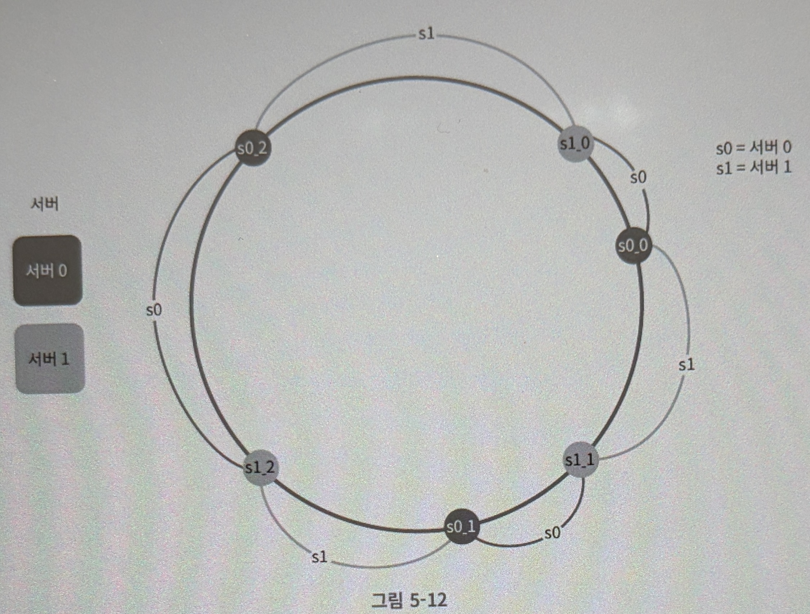
    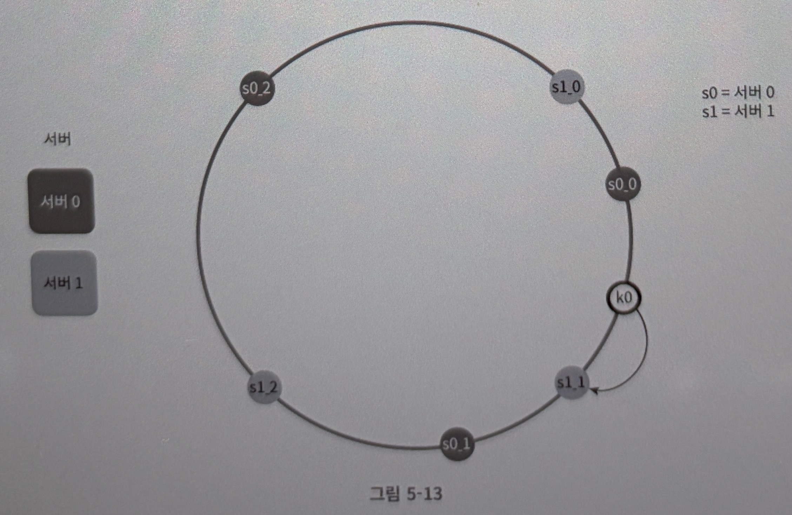

- 가상 노드의 개수를 늘리면 표준 편차가 작아져서 데이터가 고르게 분포되기 때문에 키의 분포는 점점 더 균등해진다. 하지만 가상 노드를 늘릴수록 해당 데이터를 저장할 공간이 더 많이 필요하게 되므로 tradeoff를 잘 생각하여 적절히 조정해야 한다.

### 재배치할 키 결정

서버가 추가되거나 제거되면 데이터 일부는 재배치해야 한다. 다음 그림에서 서버 4가 추가되었다고 해 보자. 범위는 s4(새로 추가된 노드)부터 그 반시계 방향에 있는 첫 번째 서버 s3까지이다. 즉 s3부터 s4 사지에 있는 키들을 s4로 재배치 해야한다.

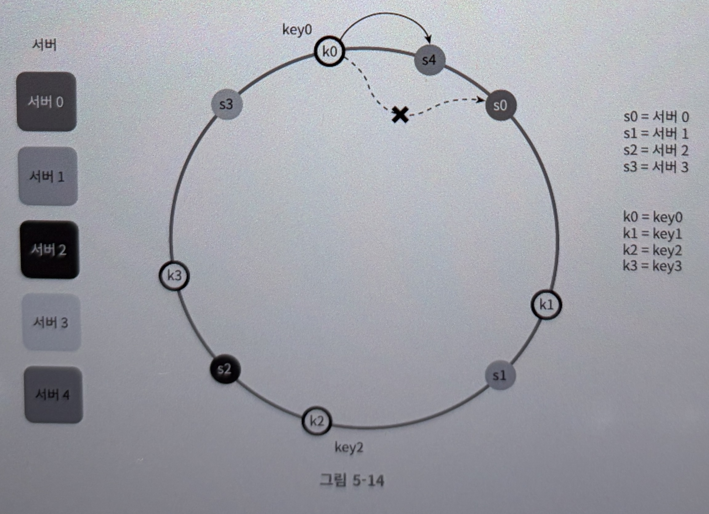

서버 s1이 그림 5-15와 같이 삭제되면 s1부터(삭제된 노드) 그 반시계 방향에 있는 최초 서버 s0 사이에 있는 키들이 s2로 재배치되어야 한다.

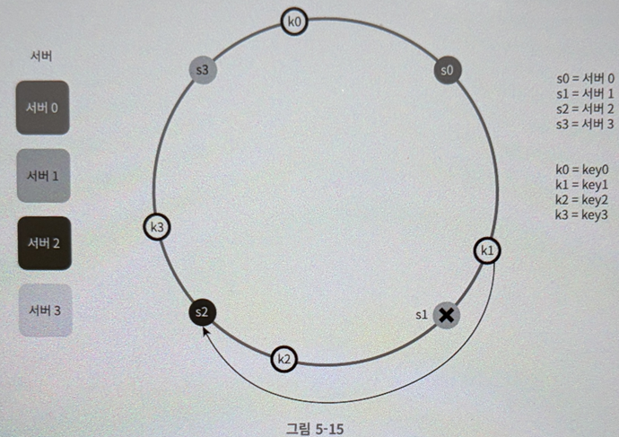

---

## 마무리

### 안정 해시의 이점

- 서버가 추가되거나 삭제될 때 재배치되는 키의 수가 최소화된다.
- 데이터가 보다 균등하게 분포하게 되므로 수평적 규모 확장성을 달성하기 쉽다.
- 핫스팟 키 문제를 줄인다.

### 안정 해시의 실사용 예

- 아마존 다이나모 데이터베이스의 파티셔닝 관련 컴포넌트
- 아파치 카산드라 클러스터에서의 데이터 파티셔닝
- 디스코드 채팅 어플리케이션
- 아카마이 CDN
- 매그래프 네트워크 부하 분산기