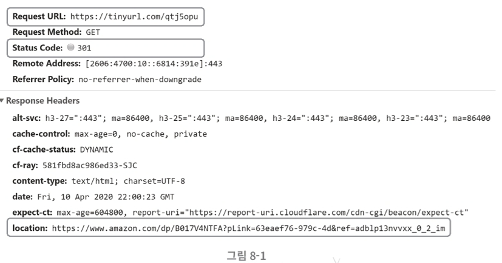
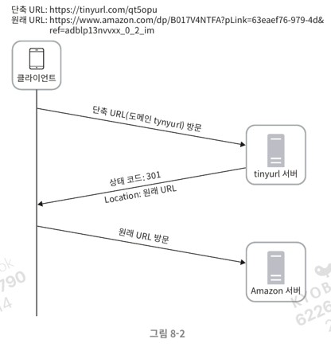
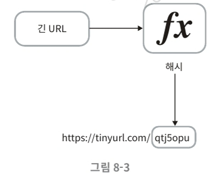
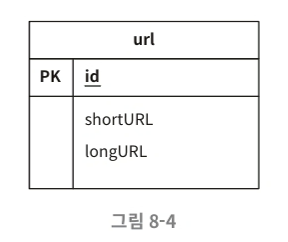
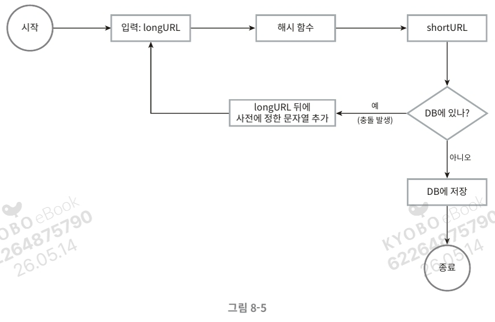
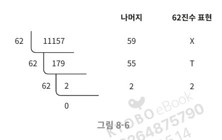
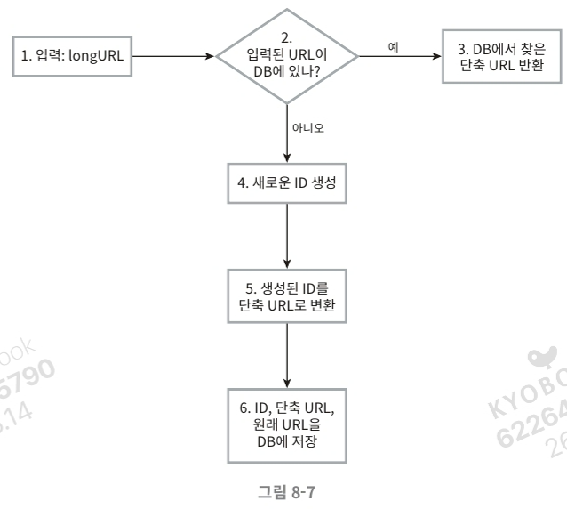
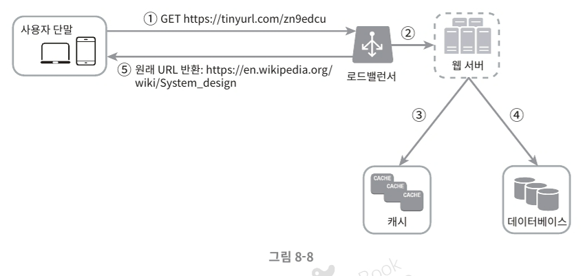

# 8장 URL 단축기 설계

이번 장에서는 재미있으면서도 고전적인 시스템 설계 문제 가운데 하나인, tinyurl 같은 URL 단축기를 설계하는 문제를 풀어본다.

## 1단계 문제 이해 및 설계 범위 확정

시스템 설계 면접 문제는 의도적으로 어떤 정해진 결말을 갖지 않도록 만들어진다. 따라서 면접장에서 시스템을 성공적으로 설계해 내려면 질문을 통해 모호함을 줄이고 요구사항을 알아내야 한다.

### 예제 동작

- 입력: `https://www.systeminterview.com/q=chatsystem&c=loggedin&v=v3&l=long`
- 출력: `https://tinyurl.com/y7ke-ocwj` 같은 단축 URL
- 단축 URL에 접속하면 원래 URL로 갈 수 있어야 함

### 요구사항 정리

- 단축 URL에 포함될 문자: 숫자(0~9)와 영문자(a~z, A~Z)만 사용
- 단축된 URL은 삭제나 갱신 불가 (시스템 단순화)
- 단축 URL의 길이는 짧을수록 좋음

### 기본 기능

1. **URL 단축**: 주어진 긴 URL을 훨씬 짧게 줄인다
2. **URL 리디렉션(redirection)**: 축약된 URL로 HTTP 요청이 오면 원래 URL로 안내
3. 높은 가용성과 규모 확장성, 그리고 장애 감내가 요구됨

### 개략적 추정

- 쓰기 연산: 매일 1억 개의 단축 URL 생성
- 초당 쓰기 연산: 1억 / 24 / 3600 = 1160
- 읽기 연산: 읽기와 쓰기 비율 10:1 → 초당 11,600회 (1160 × 10)
- 10년간 운영 가정 시: 1억 × 365 × 10 = 3650억 개의 레코드 보관 필요
- 축약 전 URL 평균 길이 100 가정
- 10년간 필요한 저장 용량: 3650억 × 100바이트 = **36.5TB**

---

## 2단계 개략적 설계안 제시 및 동의 구하기

이번 절에서는 API 엔드포인트, URL 리디렉션, 그리고 URL 단축 플로에 대해 살펴본다.

### API 엔드포인트

클라이언트는 서버가 제공하는 API 엔드포인트를 통해 서버와 통신한다. REST 스타일로 설계하며, URL 단축기는 기본적으로 두 개의 엔드포인트를 필요로 한다.

### 1. URL 단축용 엔드포인트

새 단축 URL을 생성하고자 하는 클라이언트가 단축할 URL을 인자로 실어서 POST 요청을 보낸다.

```
POST /api/v1/data/shorten
- 인자: {longUrl: longURLstring}
- 반환: 단축 URL
```

### 2. URL 리디렉션용 엔드포인트

단축 URL에 대해 HTTP 요청이 오면 원래 URL로 보내주기 위한 용도.

```
GET /api/v1/shortUrl
- 반환: HTTP 리디렉션 목적지가 될 원래 URL
```

### URL 리디렉션



단축 URL을 받은 서버는 그 URL을 원래 URL로 바꾸어서 301 응답의 Location 헤더에 넣어 반환한다.



### 301 vs 302의 차이

- **301 Permanently Moved**: 해당 URL에 대한 HTTP 요청의 처리 책임이 영구적으로 Location 헤더에 반환된 URL로 이전되었다는 응답. 브라우저가 응답을 **캐시(cache)**하므로 추후 같은 단축 URL 요청 시 캐시된 원래 URL로 직접 요청을 보냄
- **302 Found**: 주어진 URL로의 요청이 **'일시적으로'** Location 헤더가 지정하는 URL에 의해 처리되어야 한다는 응답. 클라이언트의 요청은 언제나 단축 URL 서버에 먼저 보내진 후 원래 URL로 리디렉션

### 어떤 것을 선택할까?

- **서버 부하를 줄이는 것이 중요** → 301 사용 (첫 번째 요청만 단축 URL 서버로 전송)
- **트래픽 분석(analytics)이 중요** → 302 사용 (클릭 발생률이나 발생 위치 추적에 유리)

### URL 단축 플로

단축 URL이 `www.tinyurl.com/{hashValue}` 같은 형태라고 가정. 결국 중요한 것은 긴 URL을 해시 값으로 대응시킬 해시 함수 `fx`를 찾는 일이다.



### 해시 함수의 요구사항

- 입력으로 주어지는 긴 URL이 다른 값이면 해시 값도 달라야 한다
- 계산된 해시 값은 원래 입력으로 주어졌던 긴 URL로 복원될 수 있어야 한다

---

## 3단계 상세 설계

이번 절에서는 데이터 모델, 해시 함수, URL 단축 및 리디렉션에 관한 보다 구체적인 설계안을 만들어본다.

### 데이터 모델

개략적 설계에서는 모든 것을 해시 테이블에 두었지만, 실제 시스템에서는 메모리가 유한하고 비싸기 때문에 곤란하다. 더 나은 방법은 `<단축 URL, 원래 URL>`의 순서쌍을 **관계형 데이터베이스**에 저장하는 것이다.



### 해시 함수

해시 함수(hash function)는 원래 URL을 단축 URL로 변환하는 데 쓰인다. 계산된 단축 URL 값을 **hashValue**라고 지칭한다.

### 해시 값 길이

hashValue는 `[0-9, a-z, A-Z]`의 문자들로 구성된다. 따라서 사용할 수 있는 문자 개수는 **10 + 26 + 26 = 62**개.

hashValue의 길이를 정하기 위해서는 `62^n ≥ 3650억`인 n의 최솟값을 찾아야 한다.

| n | URL 개수 |
| --- | --- |
| 1 | 62¹ = 62 |
| 2 | 62² = 3,844 |
| 3 | 62³ = 238,328 |
| 4 | 62⁴ = 14,776,336 |
| 5 | 62⁵ = 916,132,832 |
| 6 | 62⁶ = 56,800,235,584 |
| 7 | 62⁷ = 3,521,614,606,208 ≈ 3.5조(trillion) |
| 8 | 62⁸ = 218,340,105,584,896 |

**n = 7이면 3.5조 개의 URL 생성 가능** → hashValue 길이는 **7**로 결정

해시 함수 구현 기술은 두 가지를 살펴본다.

1. 해시 후 충돌 해소
2. base-62 변환

### 해시 후 충돌 해소

긴 URL을 7글자 문자열로 줄이는 해시 함수가 필요하다. 손쉬운 방법은 CRC32, MD5, SHA-1 같은 잘 알려진 해시 함수를 이용하는 것.

`https://en.wikipedia.org/wiki/Systems_design`을 축약한 결과:

| 해시 함수 | 해시 결과 (16진수) |
| --- | --- |
| CRC32 | 5cb54054 |
| MD5 | 5a62509a84df9ee03fe1230b9df8b84e |
| SHA-1 | 0eeae7916c06853901d9ccbefbfcaf4de57ed85b |

CRC32가 계산한 가장 짧은 해시값조차도 7보다 길다. 어떻게 줄일 수 있을까?

### 해결 방법

계산된 해시 값에서 **처음 7개 글자만** 이용. 하지만 이 경우 충돌 확률이 높아진다. 충돌 발생 시, 충돌이 해소될 때까지 사전에 정한 문자열을 해시값에 덧붙인다.



이 방법은 충돌은 해소할 수 있지만 단축 URL을 생성할 때 **한 번 이상 DB 질의를 해야 하므로 오버헤드가 크다**. DB 대신 **블룸 필터(Bloom filter)**를 사용하면 성능을 높일 수 있다.

### base-62 변환

진법 변환(base conversion)은 URL 단축기를 구현할 때 흔히 사용되는 접근법. 62진법을 쓰는 이유는 hashValue에 사용할 수 있는 문자 개수가 62개이기 때문이다.

### 변환 규칙

- 0 → 0, 9 → 9, 10 → a, 11 → b, ..., 35 → z, 36 → A, ..., 61 → Z
- 62진법에서 'a'는 10, 'Z'는 61을 나타냄

### 예제: 11157₁₀ → 62진수

```
11157₁₀ = 2 × 62² + 55 × 62¹ + 59 × 62⁰
       = [2, 55, 59]
       ⇒ [2, T, X]
       ⇒ 2TX₆₂
```



따라서 단축 URL은 `https://tinyurl.com/2TX`가 된다.

### 두 접근법 비교

| 해시 후 충돌 해소 전략 | base-62 변환 |
| --- | --- |
| 단축 URL 길이가 고정됨 | 단축 URL 길이가 가변적. ID 값이 커지면 같이 길어짐 |
| 유일성이 보장되는 ID 생성기가 필요치 않음 | 유일성 보장 ID 생성기가 필요 |
| 충돌이 가능해서 해소 전략이 필요 | ID 유일성이 보장된 후 적용 가능한 전략이라 충돌은 아예 불가능 |
| ID로부터 단축 URL을 계산하는 방식이 아니라서 다음에 쓸 수 있는 URL을 알아내는 것이 불가능 | ID가 1씩 증가하는 값이라고 가정하면 다음 단축 URL을 쉽게 알아낼 수 있어 보안상 문제 소지 |

### URL 단축기 상세 설계

URL 단축기는 시스템의 핵심 컴포넌트이므로, 처리 흐름이 단순하고 기능적으로 언제나 동작 상태로 유지되어야 한다. 본 예제에서는 **62진법 변환 기법**을 사용해 설계.



### 처리 순서

1. 입력으로 긴 URL을 받는다
2. 데이터베이스에 해당 URL이 있는지 검사한다
3. 데이터베이스에 있다면 해당 URL에 대한 단축 URL을 만든 적이 있는 것이다. 따라서 DB에서 해당 단축 URL을 가져와서 클라이언트에게 반환한다
4. 데이터베이스에 없는 경우에는 해당 URL은 새로 접수된 것이므로 유일한 ID를 생성한다. 이 ID는 데이터베이스의 기본 키로 사용된다
5. 62진법 변환을 적용, ID를 단축 URL로 만든다
6. ID, 단축 URL, 원래 URL로 새 데이터베이스 레코드를 만든 후 단축 URL을 클라이언트에 전달한다

### 예제

- 입력된 URL: `https://en.wikipedia.org/wiki/Systems_design`
- ID 생성기가 반환한 ID: 2009215674938
- 이 ID를 62진수로 변환: **zn9edcu**
- 새 DB 레코드:

| ID | shortURL | longURL |
| --- | --- | --- |
| 2009215674938 | zn9edcu | https://en.wikipedia.org/wiki/Systems_design |

### ID 생성기에 대한 참고

ID 생성기의 주된 용도는 단축 URL을 만들 때 사용할 ID를 만드는 것이고, 이 ID는 **전역적 유일성(globally unique)**이 보장되어야 한다. 고도로 분산된 환경에서 이런 생성기를 만드는 것은 무척 어려운 일 → 7장 분산 ID 생성기 참고.

### URL 리디렉션 상세 설계

쓰기보다 읽기를 더 자주 하는 시스템이라, `<단축 URL, 원래 URL>`의 쌍을 **캐시에 저장하여 성능을 높였다**.



### 로드밸런서의 동작 흐름

1. 사용자가 단축 URL을 클릭한다
2. 로드밸런서가 해당 클릭으로 발생한 요청을 웹 서버에 전달한다
3. 단축 URL이 이미 캐시에 있는 경우에는 원래 URL을 바로 꺼내서 클라이언트에게 전달한다
4. 캐시에 해당 단축 URL이 없는 경우에는 데이터베이스에서 꺼낸다. DB에도 없다면 사용자가 잘못된 단축 URL을 입력한 경우일 것이다
5. 데이터베이스에서 꺼낸 URL을 캐시에 넣은 후 사용자에게 반환한다

---

## 4단계 마무리

이번 장에서는 URL 단축기의 API, 데이터 모델, 해시 함수, URL 단축 및 리디렉션 절차를 설계해 보았다.

설계를 마친 후에도 시간이 좀 남는다면 다음과 같은 것을 면접관과 이야기할 수 있다.

### 추가 논의 주제

- **처리율 제한 장치(rate limiter)**: 엄청난 양의 URL 단축 요청이 밀려들 경우 무력화될 수 있는 잠재적 보안 결함이 있다. IP 주소를 비롯한 필터링 규칙(filtering rule)을 이용해 요청을 걸러낼 수 있다 (4장 참고)
- **웹 서버의 규모 확장**: 웹 계층은 무상태(stateless) 계층이므로, 웹 서버를 자유로이 증설/삭제 가능
- **데이터베이스의 규모 확장**: 다중화하거나 샤딩(sharding)하여 규모 확장성 달성
- **데이터 분석 솔루션(analytics)**: URL 단축기에 데이터 분석 솔루션을 통합해 두면 어떤 링크를 얼마나 많은 사용자가 클릭했는지, 언제 주로 클릭했는지 등 중요 정보 획득 가능
- **가용성, 데이터 일관성, 안정성**: 대규모 시스템이 성공적으로 운영되기 위해 반드시 갖추어야 할 속성들 (1장 참고)

---

## 참고문헌

- [1] A RESTful Tutorial: https://www.restapitutorial.com/index.html
- [2] Bloom filter: https://en.wikipedia.org/wiki/Bloom_filter