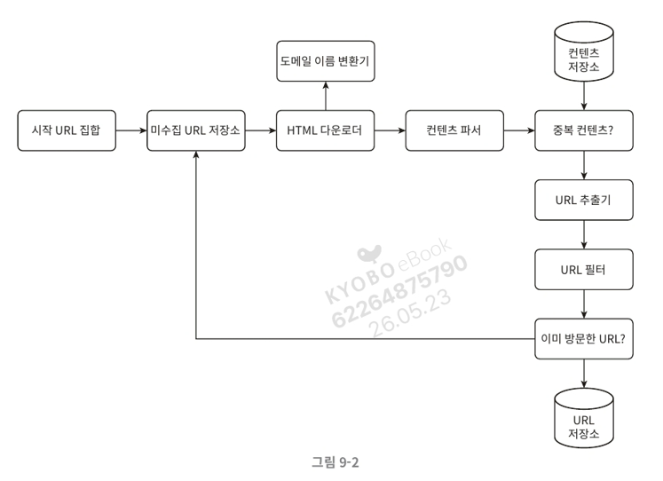
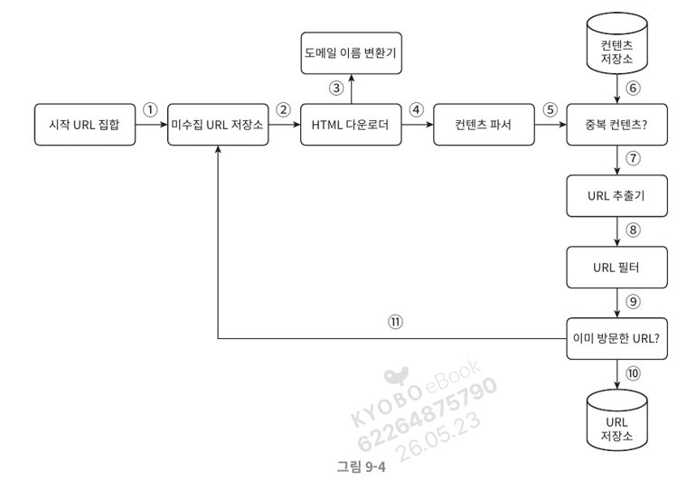
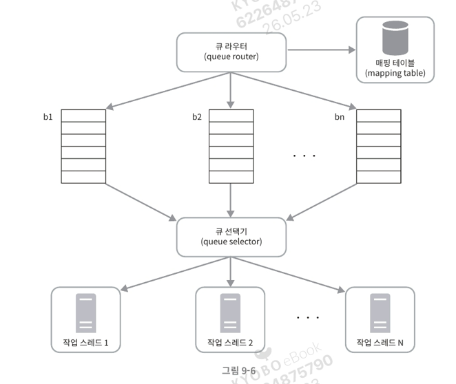
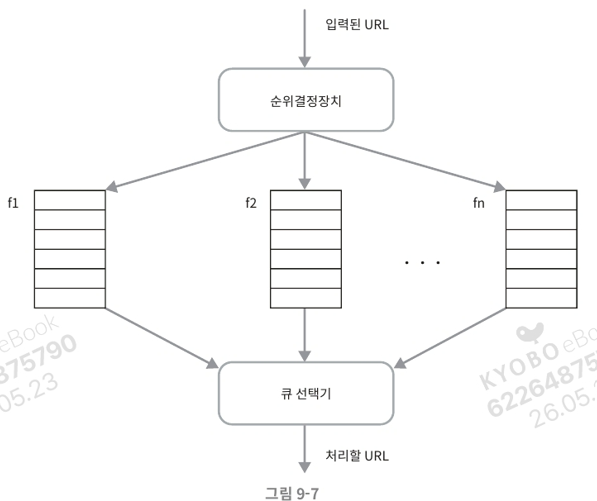
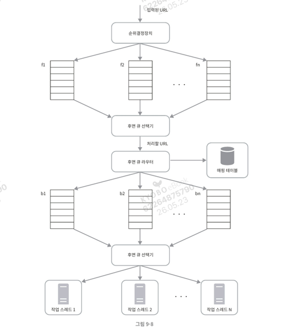

# 9장. 웹 크롤러 설계 (System Design Interview)

웹 크롤러(web crawler)는 로봇(robot) 또는 스파이더(spider)라고도 부른다. 검색 엔진에서 널리 쓰이는 기술로, 웹에 새로 올라오거나 갱신된 콘텐츠를 찾아내는 것이 주된 목적. 콘텐츠는 웹 페이지, 이미지, 비디오, PDF 파일 등이 될 수 있으며, 몇 개 웹 페이지에서 시작하여 그 링크를 따라 나가면서 새로운 콘텐츠를 수집한다.

## 크롤러의 용도

- **검색 엔진 인덱싱(search engine indexing)**: 크롤러의 가장 보편적인 용례. 웹 페이지를 모아 검색 엔진을 위한 로컬 인덱스(local index)를 만듦. 일례로 Googlebot은 구글 검색 엔진이 사용하는 웹 크롤러.
- **웹 아카이빙(web archiving)**: 나중에 사용할 목적으로 장기보관하기 위해 웹에서 정보를 모으는 절차. 미국 국회 도서관(US Library of Congress), EU 웹 아카이브 등이 대표적.
- **웹 마이닝(web mining)**: 웹을 통해 유용한 지식을 도출. 유명 금융 기업들은 크롤러로 주주 총회 자료나 연차 보고서(annual report)를 다운받아 기업의 핵심 사업 방향을 알아내기도 함.
- **웹 모니터링(web monitoring)**: 인터넷에서 저작권이나 상표권이 침해되는 사례를 모니터링. 일례로 디지마크(Digimarc)사는 웹 크롤러로 해적판 저작물을 찾아내 보고함.

웹 크롤러의 복잡도는 처리해야 하는 데이터의 규모에 따라 달라짐. 작은 학급 프로젝트 수준일 수도 있고, 별도의 엔지니어링 팀을 꾸려 지속적으로 관리·개선해야 하는 초대형 프로젝트가 될 수도 있음.

---

## 1단계: 문제 이해 및 설계 범위 확정

웹 크롤러의 기본 알고리즘

1. URL 집합이 입력으로 주어지면, 해당 URL들이 가리키는 모든 웹 페이지를 다운로드함.
2. 다운받은 웹 페이지에서 URL들을 추출함.
3. 추출된 URL들을 다운로드할 URL 목록에 추가하고 위의 과정을 처음부터 반복함.

다만 엄청난 규모 확장성을 갖는 크롤러를 설계하는 것은 매우 어려운 작업이므로, 설계 전에 질문을 던져 요구사항을 알아내고 설계 범위를 좁혀야 한다.

### 요구사항 확인 (면접 질의응답 정리)

- 주된 용도: 검색 엔진 인덱싱.
- 수집 규모: 매달 10억 개(1 billion)의 웹 페이지 수집.
- 새로 만들어지거나 수정된 웹 페이지도 고려해야 함.
- 수집한 웹 페이지는 5년간 저장.
- 중복된 콘텐츠를 갖는 페이지는 무시해도 됨.

### 좋은 웹 크롤러가 만족해야 할 속성

- **규모 확장성(scalability)**: 웹에는 수십억 개의 페이지가 존재함. 따라서 병행성(parallelism)을 활용하여 효과적으로 크롤링해야 함.
- **안정성(robustness)**: 잘못 작성된 HTML, 무응답 서버, 장애, 악성 코드가 붙은 링크 등 비정상적 입력·환경에 잘 대응할 수 있어야 함.
- **예절(politeness)**: 수집 대상 웹 사이트에 짧은 시간 동안 너무 많은 요청을 보내서는 안 됨.
- **확장성(extensibility)**: 새로운 형태의 콘텐츠를 지원하기 쉬워야 함. 예를 들어 이미지 파일도 크롤링하고 싶을 때 전체 시스템을 새로 설계해야 한다면 곤란함.

### 개략적 규모 추정

- 매달 10억 개의 웹 페이지를 다운로드함.
- QPS = 10억 / 30일 / 24시간 / 3600초 = 대략 **400 페이지/초**.
- 최대(Peak) QPS = 2 × QPS = **800**.
- 웹 페이지의 크기 평균은 500k라고 가정.
- 10억 페이지 × 500k = **500TB/월**의 저장 용량.
- 5년간 보관 가정 시: 500TB × 12개월 × 5년 = **30PB**의 저장 용량 필요.

---

## 2단계: 개략적 설계안 제시 및 동의 구하기

요구사항이 분명해지면 개략적 설계를 진행한다.



### 시작 URL 집합

웹 크롤러가 크롤링을 시작하는 출발점. 어떤 대학 웹사이트로부터 찾아 나갈 수 있는 모든 페이지를 크롤링하려면 해당 대학 도메인이 붙은 모든 페이지 URL을 시작 URL로 쓰는 것이 직관적. 전체 웹을 크롤링하는 경우에는 가능한 한 많은 링크를 탐색할 수 있도록 창의적으로 골라야 함. 일반적으로 전체 URL 공간을 작은 부분집합으로 나누는 전략(지역별, 주제별 등)을 씀. 정답은 없으며, 의도가 무엇인지를 정확히 전달하는 것이 중요.

### 미수집 URL 저장소 (URL frontier)

대부분의 현대적 웹 크롤러는 크롤링 상태를 (1) 다운로드할 URL, (2) 다운로드된 URL의 두 가지로 나눠 관리. 이 중 '다운로드할 URL'을 저장·관리하는 컴포넌트를 미수집 URL 저장소(URL frontier)라고 부름. FIFO(First-In-First-Out) 큐로 생각하면 됨.

### HTML 다운로더

인터넷에서 웹 페이지를 다운로드하는 컴포넌트. 다운로드할 페이지의 URL은 미수집 URL 저장소가 제공함.

### 도메인 이름 변환기

웹 페이지를 다운받으려면 URL을 IP 주소로 변환하는 절차가 필요. HTML 다운로더는 도메인 이름 변환기를 사용하여 URL에 대응되는 IP 주소를 알아냄.

### 콘텐츠 파서

웹 페이지를 다운로드하면 파싱(parsing)과 검증(validation) 절차를 거쳐야 함. 이상한 웹 페이지는 문제를 일으키고 저장 공간만 낭비하게 되므로 검증이 필요. 크롤링 서버 안에 파서를 두면 크롤링 과정이 느려질 수 있으므로 독립된 컴포넌트로 만듦.

### 중복 콘텐츠인가?

웹에 공개된 연구 결과에 따르면 약 29% 가량의 웹 페이지 콘텐츠는 중복임. 같은 콘텐츠를 여러 번 저장하는 것을 막기 위해 자료 구조를 도입하여 데이터 중복을 줄이고 처리 시간을 줄임. 두 HTML 문서를 문자열로 비교하는 것은 문서 수가 10억에 달할 경우 느리고 비효율적이므로, **웹 페이지의 해시 값을 비교**하는 것이 효과적.

### 콘텐츠 저장소

HTML 문서를 보관하는 시스템. 저장할 데이터의 유형, 크기, 접근 빈도, 유효 기간 등을 종합 고려해야 함. 본 설계안은 디스크와 메모리를 동시에 사용.

- 데이터 양이 너무 많으므로 대부분의 콘텐츠는 디스크에 저장함.
- 인기 있는 콘텐츠는 메모리에 두어 접근 지연시간을 줄임.

### URL 추출기

HTML 페이지를 파싱하여 링크들을 골라내는 역할. 상대 경로(relative path)는 전부 절대 경로(absolute path)로 변환함. (예: `/wiki/...` → `https://en.wikipedia.org/wiki/...`)

### URL 필터

특정한 콘텐츠 타입이나 파일 확장자를 갖는 URL, 접속 시 오류가 발생하는 URL, 접근 제외 목록(deny list)에 포함된 URL 등을 크롤링 대상에서 배제하는 역할.

### 이미 방문한 URL?

이미 방문한 URL이나 미수집 URL 저장소에 보관된 URL을 추적할 수 있도록 하는 자료 구조를 사용. 같은 URL을 여러 번 처리하는 일을 방지하여 서버 부하를 줄이고 무한 루프를 방지함. 해당 자료 구조로는 **블룸 필터(bloom filter)나 해시 테이블**이 널리 쓰임.

### URL 저장소

이미 방문한 URL을 보관하는 저장소.

### 웹 크롤러 작업 흐름



1. 시작 URL들을 미수집 URL 저장소에 저장함.
2. HTML 다운로더는 미수집 URL 저장소에서 URL 목록을 가져옴.
3. HTML 다운로더는 도메인 이름 변환기로 URL의 IP 주소를 알아내고, 해당 IP 주소로 접속하여 웹 페이지를 다운받음.
4. 콘텐츠 파서는 다운된 HTML 페이지를 파싱하여 올바른 형식을 갖춘 페이지인지 검증함.
5. 검증이 끝나면 중복 콘텐츠인지 확인하는 절차를 개시함.
6. 중복 콘텐츠인지 확인하기 위해 해당 페이지가 이미 저장소에 있는지 봄.
    - 이미 저장소에 있는 콘텐츠인 경우에는 처리하지 않고 버림.
    - 저장소에 없는 콘텐츠인 경우에는 저장한 뒤 URL 추출기로 전달함.
7. URL 추출기는 해당 HTML 페이지에서 링크를 골라냄.
8. 골라낸 링크를 URL 필터로 전달함.
9. 필터링이 끝나고 남은 URL만 중복 URL 판별 단계로 전달함.
10. 이미 처리한 URL인지 확인하기 위해 URL 저장소에 보관된 URL인지 살핌. 이미 저장소에 있는 URL은 버림.
11. 저장소에 없는 URL은 URL 저장소에 저장할 뿐 아니라 미수집 URL 저장소에도 전달함.

---

## 3단계: 상세 설계

가장 중요한 컴포넌트와 그 구현 기술을 심도 있게 살펴봄.

- DFS vs BFS
- 미수집 URL 저장소
- HTML 다운로더
- 안정성 확보 전략
- 확장성 확보 전략
- 문제 있는 콘텐츠 감지 및 회피 전략

### DFS를 쓸 것인가, BFS를 쓸 것인가

웹은 유향 그래프(directed graph)와 같음. 페이지는 노드, 하이퍼링크(URL)는 에지(edge). 크롤링 프로세스는 이 유향 그래프를 에지를 따라 탐색하는 과정.

- **DFS(깊이 우선 탐색)**: 그래프 크기가 클 경우 어느 정도로 깊숙이 가게 될지 가늠하기 어려워 좋은 선택이 아닐 가능성이 높음.
- **BFS(너비 우선 탐색)**: 웹 크롤러가 보통 사용하는 방법. FIFO 큐를 사용하는 알고리즘. 한쪽으로는 탐색할 URL을 집어넣고, 다른 한쪽으로는 꺼내기만 함.

다만 표준적 BFS 알고리즘에는 두 가지 문제점이 있음.

- **한 페이지에서 나오는 링크의 상당수는 같은 서버로 되돌아감**. (그림 9-5) wikipedia.com 페이지에서 추출한 링크는 대부분 내부 링크. 같은 호스트에 속한 링크를 병렬로 처리하면 해당 서버는 수많은 요청으로 과부하에 걸림. 이런 크롤러는 보통 '예의 없는(impolite)' 크롤러로 간주됨.
- **표준적 BFS는 URL 간에 우선순위를 두지 않음**. 모든 페이지를 공평하게 대우하지만, 모든 페이지가 같은 품질·중요성을 갖지는 않음. 따라서 페이지 순위(page rank), 사용자 트래픽의 양, 업데이트 빈도 등 여러 척도에 따라 우선순위를 구별하는 것이 온당함.

### 미수집 URL 저장소

미수집 URL 저장소를 활용하면 위 문제를 쉽게 해결 가능. 이를 잘 구현하면 '예의(politeness)'를 갖춘 크롤러, URL 사이의 우선순위와 신선도(freshness)를 구별하는 크롤러를 구현할 수 있음.

### 예의 (Politeness)

웹 크롤러는 수집 대상 서버로 짧은 시간 안에 너무 많은 요청을 보내는 것을 삼가야 함. 너무 많은 요청은 '무례한(impolite)' 것이며 때로는 DoS(Denial-of-Service) 공격으로 간주되기도 함.



지켜야 할 원칙은 **동일 웹 사이트에 대해서는 한 번에 한 페이지만 요청**한다는 것. 같은 사이트 페이지를 다운받는 태스크는 시간차를 두고 실행. 이를 위해 웹사이트의 호스트명(hostname)과 다운로드를 수행하는 작업 스레드(worker thread) 사이의 관계를 유지함. 각 다운로드 스레드는 별도 FIFO 큐를 가지며 해당 큐에서 꺼낸 URL만 다운로드함.

- **큐 라우터(queue router)**: 같은 호스트에 속한 URL은 언제나 같은 큐(b1, b2, …, bn)로 가도록 보장함.
- **매핑 테이블(mapping table)**: 호스트 이름과 큐 사이의 관계를 보관하는 테이블.


    | 호스트 | 큐 |
    | --- | --- |
    | wikipedia.com | b1 |
    | apple.com | b2 |
    | … | … |
    | nike.com | bn |
- **FIFO 큐(b1 ~ bn)**: 같은 호스트에 속한 URL은 언제나 같은 큐에 보관됨.
- **큐 선택기(queue selector)**: 큐들을 순회하면서 URL을 꺼내, 지정된 작업 스레드에 전달함.
- **작업 스레드(worker thread)**: 전달된 URL을 다운로드. URL은 순차적으로 처리되며, 작업들 사이에는 일정한 지연시간(delay)을 둘 수 있음.

### 우선순위 (Priority)



애플(Apple) 제품 포럼의 한 페이지가 애플 홈페이지와 같은 중요도를 갖는다고 보기는 어려움. 크롤러 입장에서는 중요한 페이지(애플 홈페이지)를 먼저 수집하는 것이 바람직. 유용성에 따라 우선순위를 나눌 때는 페이지랭크(PageRank), 트래픽 양, 갱신 빈도(update frequency) 등 다양한 척도를 사용 가능. 우선순위를 정하는 컴포넌트를 순위결정장치(prioritizer)라고 함.

- **순위결정장치(prioritizer)**: URL을 입력으로 받아 우선순위를 계산함.
- **큐(f1 ~ fn)**: 우선순위별로 큐가 하나씩 할당됨. 우선순위가 높으면 선택될 확률도 올라감.
- **큐 선택기**: 임의 큐에서 처리할 URL을 꺼내는 역할. 순위가 높은 큐에서 더 자주 꺼내도록 프로그램되어 있음.



전체 설계에는 다음의 두 모듈이 존재함.

- **전면 큐(front queue)**: 우선순위 결정 과정을 처리함.
- **후면 큐(back queue)**: 크롤러가 예의 바르게 동작하도록 보증함.

### 신선도 (Freshness)

웹 페이지는 수시로 추가·삭제·변경됨. 데이터의 신선함을 유지하려면 이미 다운로드한 페이지라도 주기적으로 재수집(recrawl)할 필요가 있음. 모든 URL을 재수집하는 것은 자원 소모가 크므로, 다음 전략으로 최적화함.

- 웹 페이지의 변경 이력(update history) 활용.
- 우선순위를 활용하여, 중요한 페이지는 좀 더 자주 재수집.

### 미수집 URL 저장소를 위한 지속성 저장장치

검색 엔진용 크롤러의 경우 처리해야 하는 URL의 수는 수억 개에 달함. 모두 메모리에 보관하는 것은 안정성·규모 확장성 측면에서 바람직하지 않고, 전부 디스크에 저장하면 느려서 성능 병목이 됨. 따라서 본 설계안은  절충안(hybrid approach)을 택함. 대부분의 URL은 디스크에 두지만, IO 비용을 줄이기 위해 메모리 버퍼에 큐를 두며, 버퍼의 데이터는 주기적으로 디스크에 기록함.

### HTML 다운로더

HTTP 프로토콜을 통해 웹 페이지를 내려 받음. 다운로더를 알아보기 전에 로봇 제외 프로토콜(Robot Exclusion Protocol)을 먼저 살펴봄.

### Robots.txt

로봇 제외 프로토콜이라고도 부르며, 웹사이트가 크롤러와 소통하는 표준적 방법. 이 파일에는 크롤러가 수집해도 되는 페이지 목록이 들어 있음. 웹 사이트를 긁어 가기 전에 크롤러는 해당 파일에 나열된 규칙을 먼저 확인해야 함. 거푸 다운로드하는 것을 피하기 위해 주기적으로 다시 다운받아 캐시에 보관함.

예시(amazon.com/robots.txt):

```
User-agent: Googlebot
Disallow: /creatorhub/*
Disallow: /rss/people/*/reviews
Disallow: /gp/pdp/rss/*/reviews
Disallow: /gp/cdp/member-reviews/
Disallow: /gp/aw/cr/
```

### 성능 최적화

HTML 다운로더에 사용할 수 있는 성능 최적화 기법.

1. **분산 크롤링**: 크롤링 작업을 여러 서버에 분산. URL 공간을 작은 단위로 분할하여 각 서버가 일부 다운로드를 담당하도록 함. (그림 9-9)
2. **도메인 이름 변환 결과 캐시**: 도메인 이름 변환기(DNS Resolver)는 크롤러 성능의 병목 중 하나(요청·응답의 동기적 특성 때문). DNS 요청 처리에는 보통 10ms~200ms 소요. 어느 한 스레드라도 DNS 작업을 하고 있으면 다른 스레드의 DNS 요청은 전부 블록됨. 따라서 도메인 이름과 IP 주소 관계를 캐시에 보관하고 크론 잡(cron job) 등으로 주기적으로 갱신하면 성능을 효과적으로 높일 수 있음.
3. **지역성(locality)**: 크롤링 서버를 지역별로 분산하는 방법. 크롤링 서버가 대상 서버와 지역적으로 가까우면 다운로드 시간이 줄어듦. 크롤 서버, 캐시, 큐, 저장소 등 대부분 컴포넌트에 적용 가능.
4. **짧은 타임아웃**: 응답이 느리거나 없는 서버를 대비해 최대 대기 시간(wait time)을 미리 정해 둠. 이 시간 동안 응답이 없으면 크롤러는 해당 페이지를 중단하고 다음 페이지로 넘어감.

### 안정성 (Robustness)

시스템 안정성을 향상시키기 위한 접근법.

- **안정 해시(consistent hashing)**: 다운로더 서버들에 부하를 분산할 때 적용. 서버를 쉽게 추가·삭제할 수 있음.
- **크롤링 상태 및 수집 데이터 저장**: 장애 발생 시에도 쉽게 복구할 수 있도록 상태와 데이터를 지속적 저장장치에 기록. 로딩 후 중단되었던 크롤링을 쉽게 재시작 가능.
- **예외 처리(exception handling)**: 예외가 발생해도 전체 시스템이 중단되는 일 없이 작업을 우아하게 이어나갈 수 있어야 함.
- **데이터 검증(data validation)**: 시스템 오류를 방지하기 위한 중요 수단.

### 확장성 (Extensibility)

새로운 형태의 콘텐츠를 쉽게 지원할 수 있도록 새로운 모듈을 끼워 넣는 방식으로 설계함. (그림 9-10)

- **PNG 다운로더**: PNG 파일을 다운로드하는 플러그인(plug-in) 모듈.
- **웹 모니터(web monitor)**: 웹을 모니터링하여 저작권·상표권 침해를 막는 모듈.

### 문제 있는 콘텐츠 감지 및 회피

중복이거나 의미 없는, 또는 유해한 콘텐츠를 감지·차단하는 방법.

1. **중복 콘텐츠**: 웹 콘텐츠의 약 30%는 중복. 해시나 체크섬(checksum)을 사용하면 중복 콘텐츠를 보다 쉽게 탐지 가능.
2. **거미 덫(spider trap)**: 크롤러를 무한 루프에 빠뜨리도록 설계한 웹 페이지. (예: `spidertrapexample.com/foo/bar/foo/bar/foo/bar/…`) URL의 최대 길이를 제한하면 회피 가능하나 만능 해결책은 없음. 사람이 수작업으로 덫을 확인해 크롤러 탐색 대상에서 제외하거나 URL 필터 목록에 걸어두는 방법이 있음.
3. **데이터 노이즈**: 광고, 스크립트 코드, 스팸 URL 등 거의 가치가 없는 콘텐츠. 크롤러에게 도움될 것이 없으므로 가능하다면 제외해야 함.

---

## 4단계: 마무리

좋은 크롤러가 갖추어야 하는 특성(규모 확장성, 예의, 확장성, 안정성)을 살펴보고, 설계안과 핵심 컴포넌트 기술을 살펴봄. 시간이 허락한다면 다음 주제를 추가로 논의해보면 좋음.

- **서버 측 렌더링(server-side rendering)**: 많은 웹사이트가 JavaScript, AJAX 등으로 링크를 즉석에서 만들어 냄. 페이지를 그냥 다운받아 파싱하면 동적으로 생성되는 링크는 발견할 수 없음. 파싱 전에 서버 측 렌더링(동적 렌더링, dynamic rendering)을 적용하면 해결 가능.
- **원치 않는 페이지 필터링**: 저장 공간 등 자원이 유한하므로 스팸 방지(anti-spam) 컴포넌트를 두어 품질이 조악하거나 스팸성인 페이지를 걸러냄.
- **데이터베이스 다중화 및 샤딩**: 다중화(replication)나 샤딩(sharding) 기법을 적용하면 데이터 계층(data layer)의 가용성·규모 확장성·안정성이 향상됨.
- **수평적 규모 확장성(horizontal scalability)**: 대규모 크롤링을 위해서는 다운로드 서버가 수백~수천 대 필요할 수 있음. 핵심은 서버가 상태정보를 유지하지 않도록 하는 것, 즉 무상태(stateless) 서버로 만드는 것.
- **가용성, 일관성, 안정성**: 성공적인 대형 시스템을 만들기 위해 필수적으로 고려해야 하는 개념들.
- **데이터 분석 솔루션(analytics)**: 시스템을 세밀히 조정하기 위해서는 데이터 수집·분석 결과가 필수적.